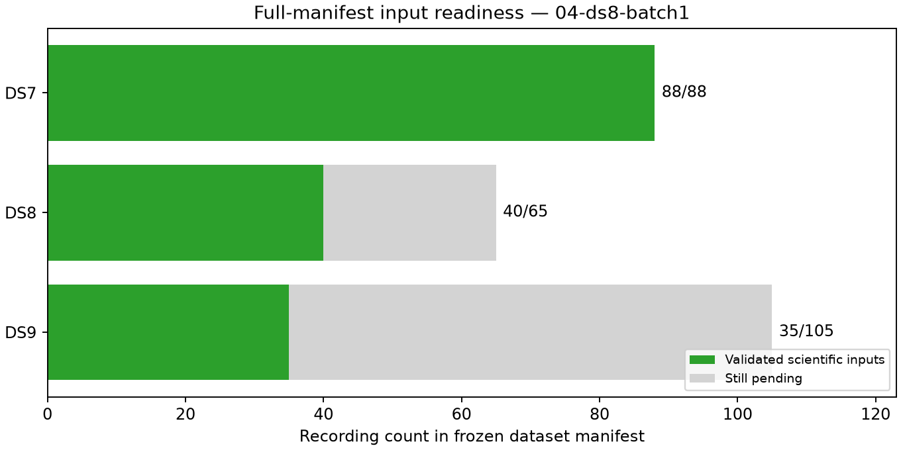

# Checkpoint 04: second missing DS8 batch complete

All five recordings in fixed DS8 missing-input batch 1 pass observation export,
candidate-bank export and loader validation. Coverage is now **DS7 88/88,
DS8 40/65 and DS9 35/105**. This checkpoint measures input readiness, not a new
localization result. Complete DS7 already has a separately published
[526.902 m nominal result](../../../2026_09_28_ds7_full_shared/README.md).
Full DS8 and DS9 fits remain pending complete input readiness.

| Dataset | Validated / requested | Eligible tracks | Training observations | Held observations | Pending recordings |
|---|---:|---:|---:|---:|---:|
| DS7 | 88/88 | 5,131 | 143,207 | 95,894 | 0 |
| DS8 | 40/65 | 2,377 | 65,559 | 43,493 | 25 |
| DS9 | 35/105 | 2,115 | 58,866 | 39,963 | 70 |

This batch contains chronological DS8 manifest ordinals 18, 20, 22, 23 and 24.
The frozen missing-input list determines these ordinals; none was substituted
or selected using an outcome. They add 298 eligible tracks, 8,470 training
observations and 5,634 held observations. No new track exclusions occur.
Existing exclusions remain explicit: 11 DS7, three DS8 and two DS9 tracks.

All 15 new stages exit zero, bringing the cumulative count to 193 successful
stages. New summed job time is 777.81 seconds; cumulative time is 1,840.98 seconds,
longest stage 143.65 seconds and maximum RSS 891,816 KiB. There are no failed
stages, timeouts, scientific retries or headroom stops. This batch used the
unchanged serial launcher. Its worker is terminal before this audit.

The audit verifies 1,961 bindings before adding this text, the plots and the
new parallel-mode artifacts. [ledger.json](ledger.json) accounts for all 258
recordings, including 95 not yet started. [panel-inputs.json](panel-inputs.json)
exposes a complete group only for DS7. [resource-summary.json](resource-summary.json)
retains every stage measurement. [evidence-sha256.json](evidence-sha256.json)
binds checkpoint evidence; `publication-sha256.json` binds the complete report
snapshot and external dependencies, excluding itself. Prior checkpoints remain
unchanged.

## Prepared execution improvement

The additive [parallel protocol](../../PARALLEL_PROTOCOL.md) and
[launcher](../../launch_parallel.py) permit future execution of one DS8 batch
and one DS9 batch together. Shared global and exclusive dataset locks prevent
serial overlap and duplicate dataset workers. Two focused OS-lock tests pass
in [parallel-tests.log](../../parallel-tests.log); the three new Python files
pass Ruff lint and formatting checks. **No scientific export has yet run using
the parallel launcher.** These tests verify locking behavior, not an observed
speedup. A modeling worker must not overlap this two-input mode.

The amendment preserves batch membership, exporter, partition, scientific
settings, timeouts, address-space cap and no-retry policy. It adds 1 GiB to each
stage's available-memory threshold. Available memory is checked before each
stage; this is not a reservation against independent production workloads.
No production services were changed, and no waveform reads, new RF collection,
provider fetch or QNAP writes occurred.

Next prepare fixed DS8 batch 2 and DS9 batch 1, using the documented parallel
mode if capacity permits. Continue until all manifest recordings validate,
then apply the unchanged full-dataset fitting and numerical checks separately
to DS8 and DS9. All geographic errors use the exposed unsurveyed reference;
input completion alone cannot establish surveyed or blind sub-kilometre accuracy.
