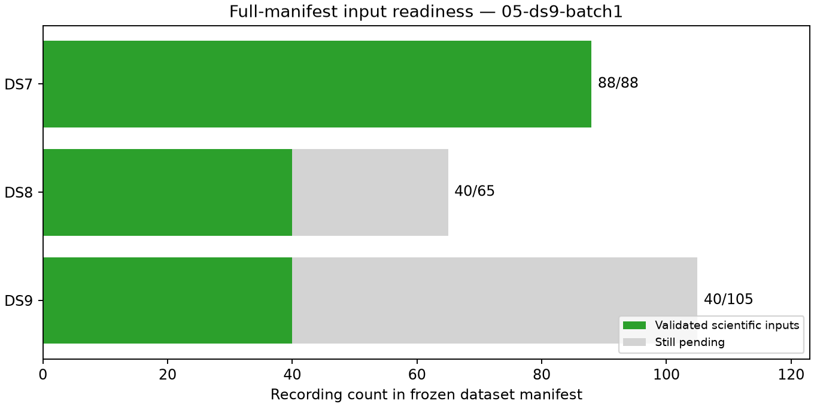

# Checkpoint 05: second missing DS9 batch complete

All five recordings in fixed DS9 missing-input batch 1 pass observation export,
candidate-bank export, loader validation and minted GLRT evidence checks.
Coverage is now **DS7 88/88, DS8 40/65 and DS9 40/105**. This is an input-readiness
checkpoint, not a new localization result. Full DS8 and DS9 modeling remains
pending; complete DS7 has a separately published
[526.902 m nominal result](../../../2026_09_28_ds7_full_shared/README.md).

| Dataset | Validated / requested | Eligible tracks | Training observations | Held observations | Pending recordings |
|---|---:|---:|---:|---:|---:|
| DS7 | 88/88 | 5,131 | 143,207 | 95,894 | 0 |
| DS8 | 40/65 | 2,377 | 65,559 | 43,493 | 25 |
| DS9 | 40/105 | 2,415 | 66,131 | 45,023 | 65 |

The frozen batch contains chronological DS9 manifest ordinals 17–21. It adds
300 eligible tracks, 7,265 training observations and 5,060 held observations.
One track in DS9-F018 has seven training observations and no held observation;
the unchanged eligibility rule excludes it. Its identity and reason remain in
the ledger. No recording is removed or replaced. Cumulative track exclusions
are 11 for DS7, three for DS8 and three for DS9.

All 15 new stages exit zero, for **208 successful stages cumulatively**. This
batch uses 661.03 summed job seconds; cumulative time is 2,502.01 seconds,
longest stage 143.65 seconds and maximum RSS 891,816 KiB. There are no stage
failures, timeouts, scientific retries or headroom stops.

The batch used the unchanged serial launcher because initial available memory
was approximately 3.3 GiB. Memory later recovered naturally; no production
services were modified. The serial worker is terminal before this audit.
No waveform reads, new RF collection, provider fetch or QNAP writes occurred.

The scientific audit verifies 2,067 bindings before adding this text and plots.
[ledger.json](ledger.json) accounts for all 258 recordings, including 90 not yet
started. Only DS7 receives a complete ready group in
[panel-inputs.json](panel-inputs.json). [resource-summary.json](resource-summary.json)
retains stage measurements, [evidence-sha256.json](evidence-sha256.json) binds
checkpoint evidence, and `publication-sha256.json` binds the full report snapshot
and external dependencies, excluding itself. Previous checkpoints and frozen
scientific scripts are unchanged. No new scientific implementation or test
change is introduced by this batch.

Next run fixed DS8 batch 2 and DS9 batch 2 under the tested
[parallel protocol](../../PARALLEL_PROTOCOL.md) if headroom permits. The parallel
launcher has not yet performed scientific exports at this checkpoint. Complete
both manifests before independent full-dataset fits using the established
shared-track-scale model, three generic starts, training-only selection and
held/numerical audits. Errors remain relative to an exposed unsurveyed reference;
this checkpoint makes no new geographic-accuracy claim.
