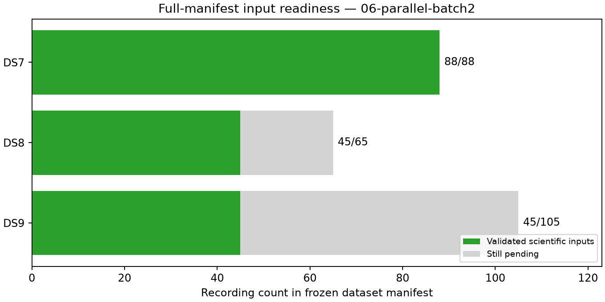

# Checkpoint 06: first parallel DS8/DS9 exports complete

The first scientific use of the tested parallel launcher completes fixed
missing-input batch 2 for both datasets: **all ten recordings and all 30 stages
pass**. Validated coverage is now **DS7 88/88, DS8 45/65 and DS9 45/105**.
This is input readiness, not a new localization result. Full DS8/DS9 fitting
still requires their remaining 20/60 recordings.

| Dataset | Validated / requested | Eligible tracks | Training observations | Held observations | Pending recordings |
|---|---:|---:|---:|---:|---:|
| DS7 | 88/88 | 5,131 | 143,207 | 95,894 | 0 |
| DS8 | 45/65 | 2,659 | 73,337 | 48,640 | 20 |
| DS9 | 45/105 | 2,725 | 73,567 | 50,195 | 60 |

DS8 manifest ordinals 25, 27, 28, 31 and 32 add 282 eligible tracks, 7,778
training observations and 5,147 held observations. DS9 ordinals 22, 24, 25,
26 and 27 add 310 tracks, 7,436 training observations and 5,172 held observations.
Every DS9 minted GLRT evidence check passes.

The unchanged eligibility rule excludes one track in DS8-F032 with six training
and zero held observations, and one in DS9-F024 with seven training and zero
held observations. Identities and reasons remain in the ledger. No recording
is removed, substituted or retried. Cumulative excluded-track counts are 11
for DS7 and four each for DS8 and DS9.

## Parallel execution evidence

One worker per dataset runs under the published
[parallel protocol](../../PARALLEL_PROTOCOL.md), with no simultaneous model
worker. Both are terminal before this audit. Their launch receipts bind the
new launcher, lock helper, tests and amendment along with the unchanged
scientific runner and input authorities. Existing serial receipts are unchanged.

| New batch | Successful stages | Summed job seconds | Longest stage (s) | Maximum RSS (KiB) |
|---|---:|---:|---:|---:|
| DS8 batch 2 | 15 | 394.72 | 64.70 | 869,984 |
| DS9 batch 2 | 15 | 405.16 | 52.90 | 861,632 |

Summed job time is 799.88 seconds across the pair; this adds durations of
overlapping processes and is not elapsed pair time or a controlled speedup
measurement. Cumulatively, all **238 stages exit zero**, with 3,301.89 summed
job seconds, longest stage 143.65 seconds and peak RSS 891,816 KiB. There are
no failed stages, timeouts, scientific retries or headroom stops. The prior
two lock tests and three-file Ruff checks are archived in checkpoint 04;
no implementation changes were needed for this execution.

No production services were changed. These exports use the existing corpus:
no waveform reads, new RF collection, provider fetch or QNAP writes occur.

## Audit and next step

The scientific audit verifies 2,278 bindings before this text and plots.
[ledger.json](ledger.json) accounts for all 258 manifest recordings, including
80 not yet started. [panel-inputs.json](panel-inputs.json) exposes a complete
ready group only for DS7. [resource-summary.json](resource-summary.json)
retains every stage measurement; [evidence-sha256.json](evidence-sha256.json)
binds checkpoint evidence. `publication-sha256.json` binds the full report
snapshot and dependencies, excluding itself. Earlier checkpoints remain intact.

Continue fixed DS8 batch 3 and DS9 batch 3 with the same capacity guards. Once
each full dataset is ready, evaluate the unchanged shared-track-scale model
with three generic starts, training-only selection and held/numerical checks.
The [complete DS7 result](../../../2026_09_28_ds7_full_shared/README.md) remains
526.902 m nominal error against an exposed unsurveyed reference. These new
input counts establish neither full DS8/DS9 model performance nor surveyed
sub-kilometre accuracy.
