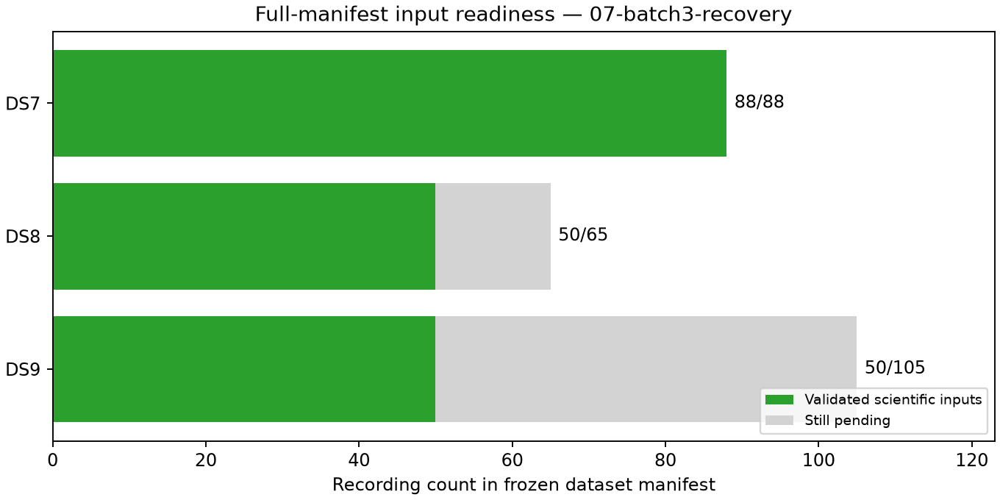

# Checkpoint 07: batch 3 complete after one explicit timeout recovery

All ten fixed batch-3 recordings are now validated. Coverage is **DS7 88/88,
DS8 50/65 and DS9 50/105**. One DS9 observation process timed out; a separately
documented recovery reproduced its scientific content and passed all checks.
The original failure remains in the evidence and resource totals.

| Dataset | Validated / requested | Eligible tracks | Training observations | Held observations | Pending recordings |
|---|---:|---:|---:|---:|---:|
| DS7 | 88/88 | 5,131 | 143,207 | 95,894 | 0 |
| DS8 | 50/65 | 2,957 | 80,973 | 53,580 | 15 |
| DS9 | 50/105 | 3,028 | 82,597 | 56,199 | 55 |

DS8 manifest ordinals 34, 35, 36, 39 and 40 add 298 eligible tracks, 7,636
training observations and 4,940 held observations. DS9 ordinals 28, 29, 31,
33 and 34 add 303 tracks, 9,030 training observations and 6,004 held observations.
All five DS9 minted GLRT checks pass. No recording is removed or substituted.

Two DS8 tracks, one each in F035 and F039, have only one training observation
and six held observations. The unchanged minimum-training-count rule excludes
them; their identities remain in the ledger. No new DS9 track exclusions occur.
Cumulative exclusions are 11 DS7, six DS8 and four DS9 tracks.

## Timeout and verified recovery

DS9-F028's original observation process exited **124 at 60.17 seconds**, despite
writing a 61-track JSON file and printing its track count. Its peak RSS was
407,828 KiB; user/system CPU time was 48.73/0.53 seconds. The cause of its late
exit is not established. It was retained as a failed execution, not accepted
as successful readiness.

After both batch workers stopped, the explicit
[recovery protocol](../../RECOVERY_PROTOCOL.md) allowed one isolated attempt
with a 120-second observation cap and unchanged scientific settings. Separate
paths preserve the original output, receipt and seal. The recovery observation
stage finished in 34.94 seconds and exactly reproduced the original JSON after
removing only `elapsed_seconds`. Bank export finished in 59.78 seconds and
validation in 0.80 seconds; all three processes exited zero. The loader and
DS9 minted-analysis binding passed. The increased cap did not itself explain
the timing difference between attempts.

[recovery-verification.json](recovery-verification.json) records the two hashes,
content-equivalence check, original failure and recovery resources. The
successor [audit_recovery.py](../../audit_recovery.py) preserves
`prior_failed_stages` in this recording's ledger row and counts its original
failed process alongside the three recovery processes. Only the new validated
artifact paths are exposed for future fitting. Use this audit for later
checkpoints; the original audit and earlier checkpoints remain unchanged.

This tranche has **30 successful processes and one timed-out process**.
Cumulatively there are **268 successful processes and one timeout**, totaling
4,272.71 summed job seconds. The new tranche adds 970.82 seconds, including the
failed attempt and recovery. Maximum stage time remains 143.65 seconds and
peak RSS 891,816 KiB. There are no other failures, retries or headroom stops.

## Prepared four-worker mode

Input preparation remains the bottleneck. The additive
[pool protocol](../../POOL_PROTOCOL.md) permits up to four disjoint fixed
batches, including different batches of the same dataset. Global, dataset,
batch and slot locks exclude older launchers, duplicate batches and a fifth
worker. Six focused tests pass in [pool-tests.log](../../pool-tests.log),
including a child-process conflict/release check. All six new Python files
pass Ruff lint and formatting checks.

Each stage checks higher memory thresholds: 4/4.5/5 GiB for validation,
observations/banks. Future observation stages have a 120-second cap; bank and
validation caps remain 240/30 seconds. The launcher verifies all successful
recovery receipts and hashes before permitting pool execution. This mode has
**not yet run scientific exports at this checkpoint**. No speedup is claimed
from its lock tests. No modeling worker may overlap it.

The scientific audit verifies 2,496 bindings before checkpoint text, figures,
recovery verification and pool artifacts are added. [ledger.json](ledger.json)
accounts for all 258 recordings, including 70 not yet started.
[panel-inputs.json](panel-inputs.json) exposes a complete group only for DS7.
[resource-summary.json](resource-summary.json) retains all 269 process records.
[evidence-sha256.json](evidence-sha256.json) binds checkpoint evidence;
`publication-sha256.json` binds the complete report snapshot and dependencies.

Next prepare DS8 batches 4 and 5 and DS9 batches 4 and 5 under the pool guards.
No new RF collection, waveform reads, provider fetch, QNAP writes or production
service changes occur. Full DS8/DS9 modeling remains pending readiness; the
existing [complete DS7 result](../../../2026_09_28_ds7_full_shared/README.md) is
526.902 m against an exposed unsurveyed reference. This checkpoint makes no
new geographic-accuracy claim.
