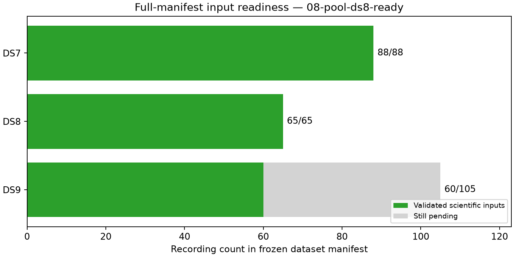

# Checkpoint 08: complete DS8 inputs ready

All **65 DS8 manifest recordings are validated** and ready for a complete-dataset
fit. DS9 reaches 60/105. This tranche completes 25 recordings and all 75 new
stages without a failure. Coverage is now **DS7 88/88, DS8 65/65, DS9 60/105**.
This report establishes input readiness, not a new geographic result.

| Dataset | Validated / requested | Eligible tracks | Training observations | Held observations | Pending recordings |
|---|---:|---:|---:|---:|---:|
| DS7 | 88/88 | 5,131 | 143,207 | 95,894 | 0 |
| DS8 | 65/65 | 3,840 | 104,216 | 68,923 | 0 |
| DS9 | 60/105 | 3,629 | 99,920 | 67,668 | 45 |

DS8 missing-input batches 4–6 add 883 eligible tracks, 23,243 training
observations and 15,343 held observations. Their manifest ordinals are
42, 43, 45, 48, 49; 50, 51, 53, 54, 57; and 58, 59, 61, 62, 63.
DS9 batches 4–5 add 601 tracks, 17,323 training observations and 11,469 held
observations from ordinals 35, 36, 38, 39, 40; and 41, 42, 44, 45, 47.
Every new DS9 minted GLRT binding check passes.

No new eligibility exclusions occur in these 25 recordings. Cumulative track
exclusions remain 11 DS7, six DS8 and four DS9. All manifest recording identities
are retained, with no substitutions or outcome-based filtering. DS8's validated
order exactly matches its frozen 65-record manifest.

## Execution and retained failure history

This is the first scientific use of the published
[four-worker pool](../../POOL_PROTOCOL.md). DS8 batches 4 and 5 and DS9 batches
4 and 5 started together. After DS8 batch 4 finished, its released slot was
used for DS8's final batch 6. No more than four input workers ran concurrently,
and no modeling worker overlapped them. Every input worker was terminal before
this checkpoint audit. The frozen scientific runner and model inputs are
unchanged; the execution guards and 120-second observation cap are bound in
each new stage receipt.

All **75 new stages exit zero**, with 3,592.52 summed job seconds. Cumulative
accounting contains **343 successful processes and one preserved timeout**
across 344 process records, totaling 7,865.23 summed job seconds. The longest
stage is 185.47 seconds and peak RSS 903,408 KiB. There are no new timeouts,
retries or headroom stops. Summed durations include concurrent jobs and do not
measure elapsed batch time or establish a controlled speedup.

The previous DS9-F028 observation timeout and its separately validated recovery
remain intact in the ledger, receipts and resource totals. See
[checkpoint 07](../07-batch3-recovery/README.md). The successor
[audit_recovery.py](../../audit_recovery.py) continues to retain that history
while exposing only the successful recovery inputs for that recording.
No scientific implementation changes or new tests were needed for this tranche;
the six pool-lock tests and script checks were published with checkpoint 07.

## Evidence and next evaluation

The audit verifies 3,015 scientific bindings before this text and plots.
[ledger.json](ledger.json) accounts for all 258 recordings, including the 45
remaining DS9 exports. [panel-inputs.json](panel-inputs.json) now exposes complete
ready groups for DS7 and DS8. [resource-summary.json](resource-summary.json)
retains all process measurements. [evidence-sha256.json](evidence-sha256.json)
binds checkpoint artifacts; `publication-sha256.json` binds the complete report
snapshot and dependencies, excluding itself.

New sealed banks are archived in additive commits of at most 780 MB before the
complete report publication. The `bank-publication-*.json` descriptors record
their exact paths, hashes and sizes. Earlier reports, seals and protocols remain
unchanged. No waveform reads, RF collection, provider fetch, production-service
changes or QNAP writes occur.

Next evaluate complete DS8 with the unchanged shared-track-scale likelihood,
three generic starts, training-only selection and held/numerical audits. Keep
the input pool stopped during modeling. DS9 still needs fixed missing-input
batches 6–14 before complete-dataset fitting. The existing complete-DS7 result
is 526.902 m nominal error against an exposed unsurveyed reference; input
completion alone does not establish DS8/DS9 accuracy or surveyed resolution.
