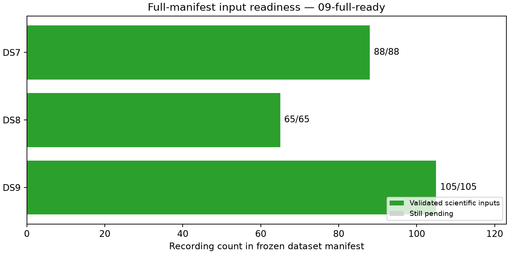

# Checkpoint 09: all DS7, DS8 and DS9 inputs ready

All **258 manifest recordings are validated**: DS7 88/88, DS8 65/65 and
DS9 105/105. The remaining 45 DS9 recordings and all 135 new preparation
stages completed successfully. This is input readiness, not a geographic result.

| Dataset | Validated / requested | Eligible tracks | Training observations | Held observations | Excluded tracks |
|---|---:|---:|---:|---:|---:|
| DS7 | 88/88 | 5,131 | 143,207 | 95,894 | 11 |
| DS8 | 65/65 | 3,840 | 104,216 | 68,923 | 6 |
| DS9 | 105/105 | 6,287 | 175,352 | 118,127 | 8 |

Fixed DS9 missing-input batches 6–14 add 2,658 eligible tracks, 75,432
training observations and 50,459 held observations, with four new track
eligibility exclusions. All recording identities remain present in their
frozen chronological manifest order, without substitutions or outcome-based
filtering. Every DS9 mint-time GLRT binding check passes.

At most four bounded input workers ran concurrently under the published
[pool protocol](../../POOL_PROTOCOL.md). Each invocation covered one fixed
five-record batch. All workers were terminal before the audit or subsequent
modeling. No new failure, retry or headroom stop occurred in these nine batches.

The 135 new successful stages consumed 6,265.19 summed job seconds. Cumulative
accounting contains 479 process records: 478 successes and the original
DS9-F028 observation timeout. Its separately validated recovery remains
explicit, with both original and recovery evidence preserved. Total summed
job wall time is 14,130.42 seconds; longest stage 185.47 seconds; peak RSS
903,408 KiB. Summed concurrent job times are not elapsed campaign duration.

The audit verifies 3,969 bindings before this text and plots. The
[ledger](ledger.json) accounts for all recordings, including failure history;
[panel-inputs.json](panel-inputs.json) exposes three complete ready groups;
[resource summary](resource-summary.json) preserves process measurements.
[evidence-sha256.json](evidence-sha256.json) binds scientific and checkpoint
artifacts; publication-sha256.json binds the published report snapshot and
dependencies. Bank-publication descriptors enumerate additive archive commits
of at most 780 MB each. Existing seals, protocols and checkpoints are unchanged.

No numerical implementation changed. Previously published pool-lock tests and
script checks apply; no new test run is claimed. No RF collection, waveform
read, provider fetch, production-service change or QNAP write occurred.

These inputs support the complete DS9 shared-scale fit and the requested
consecutive four/eight-scan panels. Geographic errors must be scored only
after fitting and validation; complete inputs alone do not establish accuracy.
