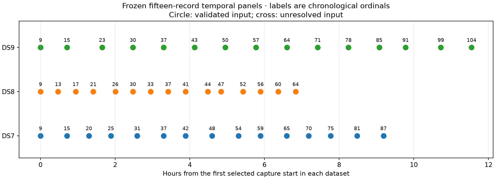

# Inputs for validation outside the successful DS7/DS8/DS9 union

All **45 recordings are validated and ready**, with no failures or recording
substitutions. They contain 2,665 eligible tracks, 74,950 training observations
and 50,022 held observations. This report prepares inputs; it does not claim a
geographic result on these recordings.

This archive prepares the 45 recordings frozen in the
[published outside-union proposal](../2026_09_28_union_panels/outside-union-proposal.json).
There are 15 per dataset, with no overlap with the successful union panel.
Membership was selected from remaining recordings by capture timestamps alone,
after the union results and before these model fits. Prior research exposure
is not ruled out; these are not certified blind data.

| Dataset | Chronological recording ordinals |
|---|---|
| DS7 | 9, 15, 20, 25, 31, 37, 42, 48, 54, 59, 65, 70, 75, 81, 87 |
| DS8 | 9, 13, 17, 21, 26, 30, 33, 37, 41, 44, 47, 52, 56, 60, 64 |
| DS9 | 9, 15, 23, 30, 37, 43, 50, 57, 64, 71, 78, 85, 91, 99, 104 |

| Dataset | Validated records | Eligible tracks | Training observations | Held observations | Capture-start span (h) |
|---|---:|---:|---:|---:|---:|
| DS7 | 15 | 877 | 26,350 | 17,737 | 9.188 |
| DS8 | 15 | 871 | 22,570 | 14,775 | 6.835 |
| DS9 | 15 | 917 | 26,030 | 17,510 | 11.548 |

The spans are differences between first and last selected capture starts, not
active dwells. Sample-rate counts at 2.5/5/7.5/10 MS/s are 0/8/4/3 for DS7,
6/3/2/4 for DS8 and 3/1/4/7 for DS9. Timestamp selection does not balance sample
rate; in particular, this DS7 panel contains no 2.5 MS/s recordings. Changes
from the union cannot be attributed solely to temporal coverage.

## Preparation and verification

All 15 DS7 records reuse native observations and candidate banks from the
previous full88 request. Exact hashes are checked before reuse, and previously
unpublished banks are copied from the local cache into this report. The other
30 recordings use the unchanged exporter through public, read-only corpus and
TLE input ports. Only cached frequency analyses are read. No new waveform/IQ
reads, RF collection, provider fetch or recording substitution is authorized
or performed by this workflow.

The unchanged corrected-DS6 model uses causal latest archived elements,
newest provider elements per object, labelled debris excluded, a centre and
four ±12 km anchors, 41 timing nodes over ±5 seconds, and a training-only top8
union. Full-catalogue normalization is retained. Observations keep whole-visit
partition seed2026092711. The existing baseline loader checks artifact hashes,
bank dimensions/timing grid, sample rate and eligibility. Provider snapshots
must precede capture start minus505 seconds. DS9 exports additionally match the
minted GLRT metrics-manifest binding.

All 15 DS9 exports match their minted GLRT bindings. Five tracks fail the
unchanged eligibility rule; every recording remains included:

| Unit | Recording ordinal | Training / held observations | Exclusion reason |
|---|---:|---:|---|
| DS7-V09 | 54 | 0 / 6 | Fewer than two training observations |
| DS8-V12 | 52 | 0 / 6 | Fewer than two training observations |
| DS8-V15 | 64 | 6 / 0 | No held observation |
| DS9-V02 | 15 | 6 / 0 | No held observation |
| DS9-V10 | 71 | 1 / 5 | Fewer than two training observations |

Exact track IDs and exclusion reasons are retained in the validated requests.
There are no outcome-based track removals or changes to the visit partition.

[PROTOCOL.md](PROTOCOL.md) fixes per-stage limits of 60 s for observation export,
240 s for bank generation and 30 s for validation. Workers have 4 GiB address
space, BLAS1 and nice19. At most two workers execute at once; each handles a
predetermined five-record batch with an1800 s deadline. There are nine batches.
Failures and unstarted stages remain in the ledger, with no automatic retry
or substitution. Geographic models must wait for complete 15-record panels.

All 105 scientific stages exited zero: 30 observation exports, 30 bank exports
and 45 validations. Maximum stage duration was 128.73 s, maximum RSS 891,688 KiB,
and summed stage wall time 3,079.14 s (not elapsed campaign time). No retry,
deadline exhaustion or timeout occurred. The existing visit-partition test
passed in [tests.log](tests.log), and all four scripts pass Ruff checks.

The final audit verifies 672 execution bindings, reconciles every requested
record with its terminal stages and validates every observation/bank hash.
[panel-inputs.json](panel-inputs.json) reports all three panels ready and provides
their exact downstream requests. [audit-summary.json](audit-summary.json)
contains per-record counts, exclusions and resource receipts.

## Evidence

[plan.json](plan.json) binds membership, dataset authorities and reused inputs.
[input-archive-map.json](input-archive-map.json) records copied cache paths and
hashes. Per-stage directories preserve commands, terminal output, resource
receipts, exit codes and seals. Validated requests preserve observations, bank
bindings, counts, eligibility exclusions and provider evidence.
[environment.json](environment.json) and runtime-sources archive interpreter,
library and installed public-reader provenance. The exporter implementation is
unchanged. [prepare.py](prepare.py), [run_stage.py](run_stage.py),
[launch.py](launch.py) and [audit_plot.py](audit_plot.py) retain execution and
reconciliation logic. Geographic outcomes belong to a separate model report.

The archive contains 45 bank files totalling 2,809,457,129 bytes; the largest is
75,446,809 bytes. Completed banks are published in bounded archive batches,
with bank-archive-batch ledgers binding their hashes to successful validations.
The complete report and remaining evidence follow those bank-only commits.
[evidence-sha256.json](evidence-sha256.json) binds the final archive and its
dependencies, excluding itself. Both fixed models will be evaluated on these
complete panels with generic starts; their geographic results are separate
from this preparation audit.
