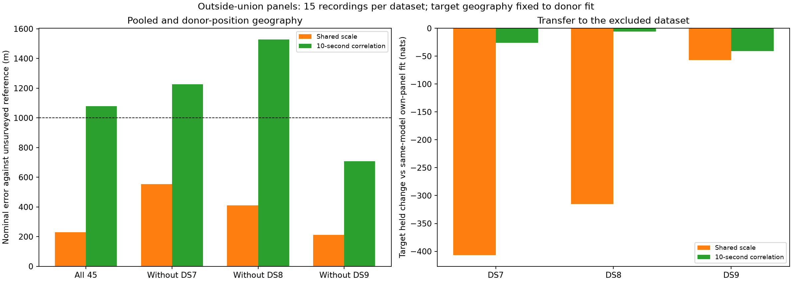
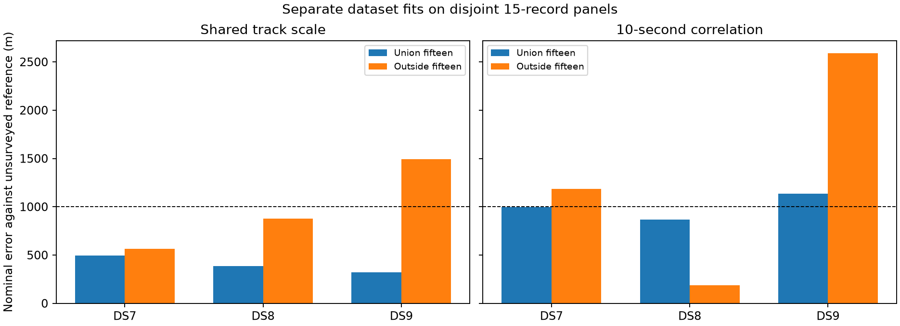

# Fixed-model validation on recordings outside the successful union

Shared track scale replicates a sub-kilometre **pooled** result on the disjoint
panel: **230 m**, with **212–554 m** across all dataset exclusions. All twelve
pooled/exclusion source starts are below 572 m. This supports continued work
on a shared-site estimate across datasets.

The separate-panel success does not fully replicate: shared-scale DS9 is
**1,493 m**, and all its starts exceed 1 km. The correlated model gives
**1,080 m pooled**, fails two dataset exclusions, and fails DS7 and DS9 separately.
The goal of consistently sub-kilometre localization across the evaluated
dataset-level fits remains unmet. Distances use an exposed, unsurveyed reference.

This experiment evaluates the unchanged shared-track-scale and 10-second
correlated models on three disjoint 15-record panels. Membership was frozen in
the [union report](../2026_09_28_union_panels/README.md) after that experiment's
results, before these fits. The new panels have no recordings in common with
the union. Prior research exposure is not ruled out, and the geographic
reference is still exposed and unsurveyed.

## Geographic results

| Fit | Shared track scale error (m) | Correlated error (m) |
|---|---:|---:|
| DS7 separately, 15 recordings | **564.109** | 1,183.633 |
| DS8 separately, 15 recordings | **875.002** | **187.218** |
| DS9 separately, 15 recordings | 1,492.941 | 2,588.129 |
| All three datasets, 45 recordings | **229.722** | 1,079.592 |
| Exclude DS7, use DS8 + DS9 | **553.667** | 1,225.390 |
| Exclude DS8, use DS7 + DS9 | **410.371** | 1,527.223 |
| Exclude DS9, use DS7 + DS8 | **212.094** | **708.606** |

Each pooled or donor fit estimates one common site. It does not produce three
independent location estimates. The selected shared-scale DS8 point is worse
than the inherited origin's 809 m error even though it falls below 1 km.

On the previous union, shared-scale separate errors were 497/386/319 m; they
are now 564/875/1,493 m. Its pooled error changes from 180 to 230 m and worst
exclusion from 339 to 554 m. Correlated separate errors change from 996/868/1,135 m
to 1,184/187/2,588 m; pooled error changes from 310 to 1,080 m and worst exclusion
from 803 to 1,527 m. Both panels have 15 recordings per dataset, but sample-rate
mix, time distribution and initialization differ. This is not a membership-only
causal ablation or certified research-blind validation.

## Held prediction

Held log-score changes are in nats against the **same-model separate 15-record
target fit**. Every target comparison reconciles exactly the same track set,
recordings and held observation counts. Positive values favour transfer.

| Excluded target | Shared-scale held change | Positive records /15 | Correlated held change | Positive records /15 |
|---|---:|---:|---:|---:|
| DS7 | -406.541 | 5 | -26.165 | 4 |
| DS8 | -315.295 | 6 | -6.016 | 4 |
| DS9 | -56.826 | 7 | -40.743 | 5 |

Pooling all 45 loses 395.964 held nats for shared scale and 36.849 for correlation
relative to three separate locations. Training costs are 226.589 and 106.622 nats
respectively. These are descriptive comparisons, not calibrated significance
tests. The shared-scale geography is better under pooling while its held
prediction worsens. Correlation more nearly preserves prediction but fails
several geographic checks. Neither criterion substitutes for the other.

## Local solutions and rejected target starts

All 42 source starts qualified. Shared-scale starts reach distinct local
solutions for every source unit. Their maximum separations are 425/149/388 m
for the separate DS7/DS8/DS9 fits, 157 m pooled, and 146/198/197 m for the DS7/DS8/DS9
exclusions. All source alternatives and their geographic errors are archived.

The shared-scale pooled training winner is the southeast start at 229.722 m.
The northwest start is closer to the reference at 163.586 m but has 410.111 fewer
training nats; it is not selected. The origin start has 543.323 fewer training
nats. Across all pooled/exclusion shared-scale starts the worst error is 571.341 m.
For separate DS9, all three shared-scale starts fail:1,493/1,499/1,114 m, with
the closest point having 122.870 fewer training nats than the selected fit.
The DS9 failure cannot be removed by choosing another tested start.

Most correlated source starts agree within centimetres. Exceptions are separate
DS9 (25.738 m separation) and the DS7 exclusion (28.539 m). Their geographic
failures persist across starts. Multiple starts do not certify global optimality.

Sixteen of 18 target nuisance starts qualify. Both DS9 +2 s starts return optimizer
success at a timing bound but fail the preregistered interior/gradient gates:

| Model | Raw gradient infinity norm | Training gap from selected target fit (nats) |
|---|---:|---:|
| Shared scale | 31.882 | -1,220.883 |
| Correlated | 7.068 | -174.156 |

Both are retained, with no retry or relaxed gate. Each has two qualified target
alternatives, selected by training score. Process exit status, optimizer success
and scientific qualification are distinct and are preserved separately.

## Design

Use the complete [validated inputs](../2026_09_28_outside_union_inputs/README.md),
with no recording substitutions or outcome-based exclusions. Each model fits
DS7, DS8 and DS9 separately; all 45 recordings together; and each 30-record pool
excluding one dataset. The excluded dataset can adapt its own record timings
and frequency offsets at the fixed donor geography. Its observations cannot
choose a source fit or move the donor position.

| Dataset | Eligible tracks | Training observations | Held observations | Capture-start span (h) |
|---|---:|---:|---:|---:|
| DS7 | 877 | 26,350 | 17,737 | 9.188 |
| DS8 | 871 | 22,570 | 14,775 | 6.835 |
| DS9 | 917 | 26,030 | 17,510 | 11.548 |

Totals are 2,665 tracks, 74,950 training and 50,022 held observations. All 45 records
remain included. The input report documents five eligibility exclusions and
the exact manifests. Start spans are not active dwells. Sample-rate counts at
2.5/5/7.5/10 MS/s are 0/8/4/3 for DS7, 6/3/2/4 for DS8 and 3/1/4/7 for DS9.
The DS7 panel's absence of 2.5 MS/s captures is an outcome of timestamp selection,
not a filtering decision made from model performance.

Every source unit starts at E/N (0,0), (3,-3) and (-3,3) km, with zero record
timings. These generic starts avoid seeding from the previous union or an
excluded dataset. They differ from the successful union experiment's starts,
so membership is not the only changed condition. The inherited geographic
origin remains previously exposed and is itself 809 m from the reference.

Both models use multivariate Student-t4 residuals at 100 Hz scale. One has a
diagonal scale matrix and shared latent track scale; the other has scale
matrix `100² × (0.8 exp(-|dt|/10 s) + 0.2 I)`. Neither changes the original
weak offset prior, visibility, catalogue normalization or whole-visit split.
There is no independent Student-t fit in this experiment.

[PROTOCOL.md](PROTOCOL.md) fixes optimization and qualification before fitting:
L-BFGS-B maxiter 140/maxfun 200, ftol 1e-14, gtol 1e-8, maxls 30; bounds ±12 km and
timings ±5 s. Selection maximizes training score among optimizer-successful,
interior fits with gradient infinity norm ≤0.01. Target timing starts are
0, -2, +2 seconds. No retry or relaxed gate is allowed. Held-score comparisons
use the exact same target tracks against each same-model separate 15-record
fit. Geographic scoring follows sealed execution and numerical checks.

The request retains baseline bank/config metadata. The runner selects the
covariance likelihood described here; PROTOCOL.md controls the actual budgets.

## Verification and resources

All 80 scientific processes exit zero:42 source fits, 14 source audits, 18 target
fits and six target held evaluations. All 42 source fits and 16 target fits
qualify. Every selected source point passes east/north full-objective gradient
checks at 1 m and 0.5 m. Across 56 checks, the largest discrepancy is 2.030e-5, below
the 0.002 tolerance. All selected training scores replay within 1e-7, target
geography matches its donor exactly, track/count/score sums reconcile, and
independent spherical-vector calculations verify the geographic distances.

The scorer verifies 573 execution bindings and 48 dataset/pose reference bindings,
and reconstructs generic starts, source membership and selection decisions.
Six existing scientific tests pass in [tests.log](tests.log); all four report
scripts pass Ruff lint/format checks. No component implementation changed.

Each worker is capped at 180 s/4 GiB, with BLAS1/nice 19 and at most two concurrent
workers. Maximum job duration is 66.64 s, maximum RSS3,186,148 KiB, and summed job
wall time 1,851.42 s (not elapsed campaign time). There are no process failures,
timeouts or retries. [resource-summary.json](resource-summary.json) retains all
receipts. The two rejected target optimizer outcomes remain explicit above.

## Evidence

[plan.json](plan.json) records complete input bindings, membership and starts.
[scores.json](scores.json) preserves source alternatives, selections, errors,
source/target held and training comparisons, reference bindings and gradient
checks. Each model/pool directory retains commands, logs, resource receipts,
exit codes, results and seals. [prepare.py](prepare.py), [run.py](run.py),
[launch.py](launch.py) and [score_plot.py](score_plot.py) preserve execution.
Runtime provenance is archived in the input report. No RF collection, IQ reads,
new propagation or provider fetch occurs in this modeling stage.

[evidence-sha256.json](evidence-sha256.json) binds the complete report and its
dependencies, excluding itself. The full input archive is already published
with its own execution audit and bank bindings.

## Decision and next bounded experiment

Retain shared track scale with a common position as the leading pooled
geographic approach. It passes all pooled and dataset-exclusion checks on two
disjoint 45-record panels, although the earlier broad-eight panel still had a
1,011 m exclusion failure. Do not promote it as a reliable separate-dataset
solution: outside-union DS9 remains 1,493 m. The fixed 10 s correlation model does
not replicate its pooled success.

Before exporting more data or changing residual physics, audit the large
training-score gaps among qualified starts on these existing banks. At a fixed
position, record timing contributions separate. Replaying each qualified
start's timings at the selected position can test whether different records
prefer different timing solutions. A training-only combination of those record
timings, followed by unchanged joint refinement, is a bounded way to test for
missed nuisance solutions. Apply it to every unit and both models, retain the
current results, and repeat held/numerical checks. This is a proposed next
optimization audit, not an established explanation or promised accuracy gain.
