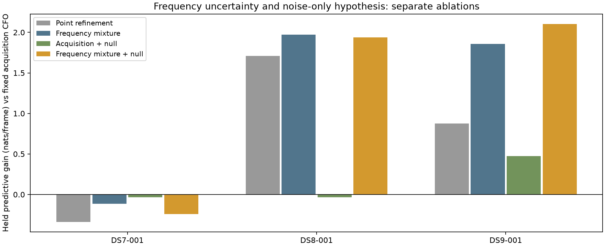

# Pilot frequency mixtures and a noise-only component

**Integrating over frequency improves held waveform prediction relative to a
single refined frequency on DS7, DS8 and DS9. It does not beat the fixed
acquisition frequency on DS7, so it fails the frozen cross-dataset gate.** The
noise-only component adds value on DS9 and slightly hurts DS7/DS8. Keep the
geographic solver unchanged; no position result or sub-kilometre improvement is
claimed here.

This experiment reuses all **168 archived frames** from the first-record pilot
split experiment: four receiver/windows and 56 frames per dataset. It performs
no new IQ reads, RF collection or geographic-reference access. The earlier
outcomes were already exposed; this is an exploratory follow-up, not independent
confirmation. Inputs and membership are unchanged, including weak frames.

## Paired ablations

Scores below are held **predictive log-density changes in nats per frame**,
averaged equally over four windows per dataset. Larger is better. Every arm
predicts the same unused symbols with amplitudes, scales and weights learned
only from training symbols. This score differs from the earlier profiled
coherence score, which re-estimated tone amplitudes on held symbols.

| Arm | Frequency treatment | Noise-only possibility | DS7 gain vs acquisition | DS8 gain vs acquisition | DS9 gain vs acquisition |
|---|---|---|---:|---:|---:|
| Fixed acquisition | Residual zero | No | 0 | 0 | 0 |
| Ordinary point | One training profile maximum | No | −0.337416 | +1.711049 | +0.874192 |
| Frequency mixture | Integrate 401 grid values | No | −0.114340 | +1.973057 | +1.858567 |
| Acquisition + null | Residual zero | Yes | −0.032940 | −0.034490 | +0.475996 |
| Frequency mixture + null | Integrate 401 grid values | Yes | −0.241881 | +1.938145 | +2.103881 |

| Isolated increment | DS7 | DS8 | DS9 |
|---|---:|---:|---:|
| Frequency mixture minus ordinary point | +0.223076 | +0.262008 | +0.984375 |
| Add null to frequency mixture | −0.127541 | −0.034911 | +0.245314 |

The mixture/null arm improves 1/4 DS7 windows, 2/4 DS8 windows and 3/4 DS9
windows. DS8's aggregate gain is concentrated in visit 0/RX0; neither RX1 window
improves. These small, correlated samples do not establish population gains.

## The conditional model

The frozen [protocol](PROTOCOL.md) sets every modeling choice before execution.
On each frame, even-Qin symbol indices 0 modulo 4 train the model and indices
2 modulo 4 evaluate it. Each split contains 75 symbols and eight tones. For
tone j at residual frequency f:

`y_j = a(f) g_j + epsilon_j`, where `a(f)_n = exp(2 pi i f t_n)`.

The noise is circular complex Gaussian with variance `s_j²`; the complex gain
has prior variance `s_j²` (gain/noise ratio kappa=1). Set `s_j²` to the training
mean squared magnitude of that tone. This includes signal power and is a simple
empirical-Bayes scale, **not calibrated noise power**. Conditional on this fixed
training-derived scale, gain integration gives normalized Gaussian densities.
No held symbol estimates or changes the scale.

The signal frequency prior is uniform on −2000 to +2000 Hz in 10 Hz steps,
including both endpoints. The null is zero-mean independent complex Gaussian
noise at those same scales. Signal/null prior odds are 1:1. The signal model
shares one frequency across eight independently integrated gains.

For n training symbols and `S_j(f) = sum conj(a(f)) y_j`, the log likelihood
ratio against noise is:

`log BF(f) = -8 log(1+n) + sum_j |S_j(f)|² / ((1+n) s_j²)`.

Normalize across the grid to get conditional frequency weights; average the
Bayes factors over the uniform grid to update signal/null odds. The gain
posterior mean is `S_j(f)/(1+n)`, with variance `s_j²/(1+n)`. Predict held
symbols using the resulting Gaussian covariance and integrate frequency/model
uncertainty. No held amplitude profiling or frequency optimization occurs.
The fixed-zero and point arms use the identical gain prior and scale treatment.

These are normalized **conditional research predictions**. Training-derived
scales and acquisition conditioning prevent interpreting the weights as
calibrated physical signal probabilities. The acquisition candidate was chosen
using the original probe, including symbols later held out here. This split
therefore tests refinement conditional on acquisition, not wholly independent
acquisition validation. Model misspecification, interference and correlations
between tones/symbols remain possible.

## Window results and controls

The following table is for frequency mixture + null. “Signal weight” is the
training model's mean posterior weight, not independently verified presence.

| Dataset | Visit | RX | Gain vs acquisition (nats/frame) | Gain vs noise (nats/frame) | Scrambled gain vs noise | Mean signal weight |
|---|---:|---:|---:|---:|---:|---:|
| DS7 | 9 | 0 | −0.287457 | 42.931548 | −14.199801 | 0.996591 |
| DS7 | 9 | 1 | −0.689886 | 35.910485 | −13.744625 | 0.875278 |
| DS7 | 12 | 0 | −0.057978 | 48.070163 | −12.386669 | 0.936434 |
| DS7 | 12 | 1 | +0.067795 | 90.608516 | −51.941925 | 1.000000 |
| DS8 | 0 | 0 | +7.840094 | 46.933279 | −20.877798 | 0.999998 |
| DS8 | 0 | 1 | −0.475495 | 63.871008 | −34.275987 | 1.000000 |
| DS8 | 8 | 0 | +0.660160 | 38.746472 | −11.254747 | 0.923031 |
| DS8 | 8 | 1 | −0.272179 | 61.890013 | −37.183746 | 1.000000 |
| DS9 | 3 | 0 | +1.064047 | 118.551102 | −65.759116 | 0.714286 |
| DS9 | 3 | 1 | +1.464088 | <0.000001 | <0.000001 | <0.000001 |
| DS9 | 6 | 0 | −0.835397 | 0.000305 | −0.000000194 | 0.000000194 |
| DS9 | 6 | 1 | +6.722786 | 125.142068 | −71.672602 | 0.857143 |

The model gives negligible signal weight to all 28 frames in DS9 visit 3/RX1
and visit 6/RX0. They were **not removed** from evaluation. Another six DS9
frames receive signal weight below .01. The noise fallback nearly equals
noise-only prediction for those two windows; it does not somehow recover a
precise frequency from them. DS9 visit 6/RX0 actually loses relative to the fixed
acquisition arm despite that fallback.

The same deterministic symbol-wise QPSK controls from the previous experiment
are scored at unchanged training posteriors. They do not tune the model.
Dataset mean gains relative to noise-only are:

| Dataset | Real (nats/frame) | Scrambled (nats/frame) |
|---|---:|---:|
| DS7 | +54.380178 | −23.068255 |
| DS8 | +52.860193 | −25.898069 |
| DS9 | +60.923369 | −34.357930 |

The positive real scores show the model does not obtain its aggregate gains
merely by always predicting noise. One scramble per frame does not calibrate
false positives or prove emitter identity.

## Frequency-shift checks and gate

Known ±250 Hz ramps are applied to the already-demodulated matrices. Two cases
are kept distinct:

1. **Translated prior support:** move the entire frequency grid by the known
   shift. All 336 paired checks preserve conditional frequency weights, model
   evidence and held density within 1.82e−12. This is a coordinate-invariance
   check, not evidence of improved frequency accuracy.
2. **Fixed prior support:** leave the acquisition interval at ±2 kHz. Retain
   every posterior-mean shift error, including weak and boundary-sensitive
   cases. The posterior mean is a diagnostic, not a promoted measurement.

The protocol defines a “reliable pair” using training information only: both
signal weights above .99 and at least .99 of the original conditional frequency
mass remaining in the translated fixed interval. This name refers to the
model's criterion, not calibrated physical reliability.

| Dataset | Frames with signal weight >.99 | Frames with weight <.01 | Reliable shift pairs / all pairs | Maximum reliable shift error (Hz) | Maximum all-pair error (Hz) | Gate |
|---|---:|---:|---:|---:|---:|---|
| DS7 | 50/56 | 0/56 | 100/112 | <0.000001 | 0.000002 | Fail: held loss vs acquisition |
| DS8 | 52/56 | 0/56 | 104/112 | <0.000001 | <0.000001 | Pass on this dataset |
| DS9 | 22/56 | 34/56 | 44/112 | <0.000001 | 952.554288 | Pass on this dataset |

Thus 248/336 shift pairs meet the reliability definition; the other 88 remain
visible. The weak DS9 cases still have large conditional-mean shifts. The model
addresses those cases by assigning little signal weight, not by stabilizing
every point estimate. The frozen necessary gate also requires a positive held
gain versus fixed acquisition and versus noise-only on every dataset, plus
reliable shift errors ≤5 Hz. DS7 fails, so the cross-dataset gate fails. Passing
on DS8/DS9 alone is not a geographic promotion.

## Validation and resources

Three component tests pass: dense complex-Gaussian training/prediction agreement;
synthetic frequency recovery with posterior normalization and translated-domain
invariance; and noise-null behavior with zero-power rejection. See
[tests.log](tests.log) and [tests](../../tests/research/test_ds789_frequency_mixture.py).
Ruff lint and formatting checks pass for the six new Python files.

An independent numerical audit selects the **first frame of every frozen
window**, regardless of quality. It builds dense covariance matrices and
computes joint/train marginal likelihood ratios, avoiding the production
posterior-prediction formula. All 120 real/control/arm comparisons agree within
1e−8; all 12 complete frequency-weight comparisons agree within 1e−10:
[audit](independent-audit.json). The main scorer checks source/input hashes and
all 168 posterior normalizations. The audit is a 12-frame dense check, not a
claim that every likelihood was independently recomputed.

| Dataset | Frames | Wall seconds | Peak RSS (KiB) | Exit |
|---|---:|---:|---:|---:|
| DS7 | 56 | 0.40 | 44,196 | 0 |
| DS8 | 56 | 0.50 | 44,320 | 0 |
| DS9 | 56 | 0.40 | 44,448 | 0 |

Jobs ran sequentially in the workspace Python environment, each capped at
60 seconds and 2 GiB, one numerical thread, nice19. No retries, extensions,
new waveform reads, catalogue propagation or geographic fits were performed.
The pilot matrices remain in the previously published source report and are
hash-bound rather than duplicated.

Evidence and replay:

- [Core model](../../tools/ds789_frequency_mixture.py), [runner](run.py), [launcher](launch.py), [scorer](score.py), [dense audit/plotter](audit_plot.py).
- Each dataset directory contains launch hashes, terminal/resources/exit receipts,
  every frame's predictions and injections in `result.json`, and complete
  conditional frequency weights, log weights, training variances and gain means
  in `posterior.npz`.
- [Scores](scores.json), [evidence hash inventory](evidence-sha256.json), [SVG](ablation.svg).
- [Source waveform report](../2026_09_28_pilot_split_transfer/README.md) supplies
  original candidate/source bindings and exact pilot matrices. Its results remain
  unchanged.

Run the launcher only in a separate checkout/output copy: outputs are exclusive
to protect the published record. Numerical replay requires NumPy and the bound
source/matrix files, not access to the original IQ store.

## Next decision toward sub-kilometre positioning

Preserve frequency uncertainty and explicit weak-signal handling as promising
components, but do not replace acquisition measurements globally. A next
exploratory comparison should retain the acquisition estimate itself as an
explicit model alternative, rather than forcing a broad frequency prior on
every strong window. Its prior and selection rule must be frozen before scoring,
and any promising result needs additional recordings plus a matched-input
geographic ablation. Merely improving waveform prediction, or assigning high
model confidence, cannot establish sub-kilometre location accuracy.
