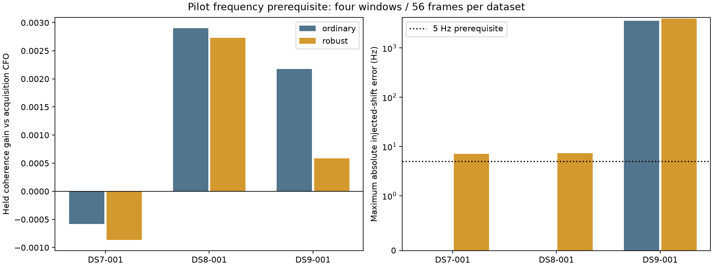

# Pilot frequency refinement across DS7, DS8 and DS9

**Neither ordinary nor robust pilot profiling passes the frozen prerequisites
across all three datasets. Do not substitute these frequency estimates into
the geographic solver yet.** Ordinary profiling loses held-symbol coherence
on DS7 and has large injected-shift failures on DS9. Robust profiling fails the
shift-recovery threshold on all three and reaches its search boundary on DS9.
This experiment changes the next modeling priority toward representing weak or
ambiguous frequency evidence, rather than treating a refined point estimate as
a more accurate measurement.

This is a bounded waveform experiment on the **first chronological recording
of each dataset**, not a geographic evaluation or a whole-dataset accuracy
claim. All 12 selected receiver/windows returned, with 14 complete frames each:
168 frames in total. No RF was collected. All inputs come from the existing
on-disk corpus through public read-only ports.

| Dataset | Method | Mean held coherence change | Positive windows | Original boundary frames | In-bounds injections failing 5 Hz | Maximum shift error (Hz) | Prerequisite passes |
|---|---|---:|---:|---:|---:|---:|---|
| DS7 | Ordinary | −0.000583 | 0/4 | 0/56 | 0/112 | <0.000001 | No |
| DS7 | Robust | −0.000865 | 0/4 | 0/56 | 4/112 | 7.071 | No |
| DS8 | Ordinary | +0.002902 | 2/4 | 0/56 | 0/112 | <0.000001 | Yes, on this dataset only |
| DS8 | Robust | +0.002732 | 2/4 | 0/56 | 3/112 | 7.286 | No |
| DS9 | Ordinary | +0.002173 | 3/4 | 0/56 | 4/111 | 3,591.448 | No |
| DS9 | Robust | +0.000585 | 1/4 | 3/56 | 16/105 | 3,938.266 | No |

Each dataset/method has 112 injected cases (two shifts × 56 frames). The DS9
ordinary and robust denominators exclude respectively one and seven cases
whose original estimate plus injection would leave the fixed search interval;
those cases remain in the raw results. Three in-bounds injections reach a
boundary for each DS9 method. The chart uses a symmetric logarithmic scale
above 1 Hz in its right panel. Dataset means weight windows equally. Frames
within a window are correlated and are not independent population replicates.

## Frozen comparison

The [protocol](PROTOCOL.md) was written before execution. Membership is:

| Dataset | Session | Visits | Channel at each visit | Sample rate |
|---|---|---|---|---:|
| DS7 | scan-fw-5f7bf896e4552887 | 9, 12 | 1, 1 | 7.5 MS/s |
| DS8 | scan-fw-aadcd44b66085469 | 0, 8 | 3, 3 | 7.5 MS/s |
| DS9 | scan-fw-98cb28475c2059b9 | 3, 6 | 1, 4 | 7.5 MS/s |

Select the earliest all-training and earliest all-held common visits in the
existing baseline export; for each receiver choose the first acquisition
candidate ID in lexical order. These visit labels come from the established
geographic training split, but the waveform test uses the same **within-frame**
symbol split in every window. There is no fitted temporal line and no transfer
of frequency across RF channels. Receiver candidates need not represent the
same emitter. These are all upper-edge windows. No window was substituted
because of its outcome.

Each spec binds raw/analysis manifests, candidate identity, acquisition CFO,
integer/fractional epoch, source interval, receiver and probe. The existing
demodulator rounds the acquisition epoch to a sample, as in the earlier pilot
experiment; this does not test an improved fractional-timing method. Absolute
probe offsets are converted using the cumulative **recorded visit lengths**,
not a constant dwell assumption. All current selected recordings are 7.5 MS/s;
this experiment does not compare sample rates or dwell settings.

For each frame, wipe the known even-Qin pilots. Fit CFO on original symbol
indices 0 modulo 4 and evaluate on indices 2 modulo 4. Ordinary profiling removes
one complex gain per tone; robust profiling adds the existing bounded iterative
symbol/tone weights. Both use ±2 kHz residual bounds, 100 Hz coarse and 5 Hz fine
steps; robust fitting has at most four iterations. Acquisition CFO corresponds
to residual zero. Each held score profiles its tone amplitudes, but **held symbols
never select the frequency**. Thus this is held-symbol prediction conditional on
an acquisition chosen using the same original probe; it is not wholly independent
acquisition validation.

The gate requires a positive equal-window mean held gain on each dataset, no
original estimator boundaries and no in-bounds injected-shift error above 5 Hz
(injected boundary failures are also retained). Only the DS8 ordinary arm meets
the per-dataset gate. No cross-dataset estimator is admitted for promotion.

## Receiver/window evidence and controls

Coherence is a normalized power ratio, not a frequency error or probability.
The scramble applies an independently seeded QPSK phase to each held symbol,
shared across tones. Training frequencies stay fixed. It is one control per
frame, not a calibrated false-positive study.

| Dataset | Visit | RX | Acquisition | Ordinary | Robust | Ordinary scramble | Robust scramble |
|---|---:|---:|---:|---:|---:|---:|---:|
| DS7 | 9 | 0 | 0.091256 | 0.090138 | 0.089976 | 0.013360 | 0.013384 |
| DS7 | 9 | 1 | 0.080410 | 0.079679 | 0.079052 | 0.013652 | 0.013783 |
| DS7 | 12 | 0 | 0.098215 | 0.097862 | 0.097932 | 0.011680 | 0.011760 |
| DS7 | 12 | 1 | 0.168106 | 0.167975 | 0.167566 | 0.014620 | 0.014864 |
| DS8 | 0 | 0 | 0.084513 | 0.096482 | 0.096162 | 0.014244 | 0.014197 |
| DS8 | 0 | 1 | 0.124929 | 0.123910 | 0.123811 | 0.013882 | 0.013959 |
| DS8 | 8 | 0 | 0.084970 | 0.086357 | 0.086390 | 0.013437 | 0.013291 |
| DS8 | 8 | 1 | 0.121209 | 0.120477 | 0.120185 | 0.014762 | 0.014853 |
| DS9 | 3 | 0 | 0.208638 | 0.208974 | 0.207850 | 0.012874 | 0.012216 |
| DS9 | 3 | 1 | 0.018742 | 0.015653 | 0.015263 | 0.014315 | 0.013505 |
| DS9 | 6 | 0 | 0.022567 | 0.023962 | 0.019498 | 0.013991 | 0.014853 |
| DS9 | 6 | 1 | 0.216875 | 0.226927 | 0.226554 | 0.017550 | 0.018209 |

DS9 contains two much weaker windows, including visit 3/RX1 where the real and
scrambled means are close. This motivates a frequency-evidence model with an
explicit weak-signal possibility. It does not establish that those observations
are false detections or identify their physical emitters.

## What injection failures mean

The experiment applies known ±250 Hz phase ramps **after demodulation**, to the
training pilot matrices. Correct recovery would translate the estimated
frequency by the injected amount. This is a consistency diagnostic, not an
absolute RF frequency standard, an IQ acquisition test or a geographic truth.
An estimator with a fixed bias can pass perfectly.

For example, DS9 window 2/frame 10 ordinary profiling estimates +1341.448 Hz
before injection; adding +250 Hz changes the estimate to the −2000 Hz boundary.
Its shift error is −3591.448 Hz although the expected translated estimate is
inside the allowed interval. DS9 window 1/frame 0 robust profiling changes from
−1688.266 Hz to +2000 Hz after a −250 Hz injection, an error of +3938.266 Hz.
These are retained failures, not clipped or silently discarded observations.

The bounded search interval remains fixed when a ramp is injected, so the set
of accessible competing peaks changes. Such jumps do not alone prove a coding
bug; low information, competing peaks and finite iterative optimization can
all matter. DS7/DS8 robust errors of roughly 5–7 Hz also exceed the declared
gate, despite being much smaller than the DS9 failures. Their causes are not
isolated by this experiment. No result is presented as calibrated uncertainty.

## Resources, evidence and replay

| Dataset | Metadata wall (s) | Waveform wall (s) | Returned IQ bytes | Unique chunk uncompressed bytes | Peak RSS (KiB), metadata / waveform |
|---|---:|---:|---:|---:|---:|
| DS7 | 27.30 | 12.13 | 14,400,000 | 14,400,000 | 343,864 / 325,124 |
| DS8 | 34.11 | 10.13 | 14,400,000 | 14,400,000 | 364,152 / 330,196 |
| DS9 | 29.60 | 8.92 | 14,400,000 | 14,400,000 | 346,608 / 325,860 |

All six jobs exited zero. Jobs ran sequentially, one numerical thread, nice19,
4-GiB address-space cap, 90 seconds per metadata job and 120 seconds per waveform
job. Each waveform job had 64 MiB returned-visit and 256 MiB underlying chunk
limits checked before reading. Total returned IQ was 43.2 MB. No retries or
deadline extensions were used. Full commands, launch hashes, terminal logs and
GNU time receipts accompany each dataset directory.

Six tests passed, including synthetic known-frequency recovery, invariance of
training fits under held-data changes and existing estimator tests:
[tests.log](tests.log). Ruff checks pass for the new experiment code. All
168 archived frames replay under the workspace estimator within 1e−8 absolute /
1e−9 relative tolerance. A separate least-squares projection implementation
verifies all **1,008** real/scrambled held-coherence values within 1e−12:
[independent audit](independent-audit.json).

The public-reader run uses installed release
`17484895464c225ebba977487aa36d3d81658bd8`. Exact runtime module hashes are in each
spec, with five relevant installed source files copied under `runtime-source/`
and indexed by [runtime-source-map.json](runtime-source-map.json). The numerical
frame-CFO module matches the workspace version byte for byte. Storage modules
are historical source evidence, not new runtime dependencies. The archived
pilot matrices support numerical replay without access to private IQ storage.

- [Runner](run.py), [bounded launcher](launch.py), [scorer](score.py), [independent audit/plotter](audit_plot.py).
- [DS7 spec](DS7/spec.json), [DS8 spec](DS8/spec.json), [DS9 spec](DS9/spec.json).
- Dataset `result.json` files retain every frame, fit, boundary and injection.
- Dataset `matrices.npz` files retain exact even-Qin matrices and times.
- [Scores](scores.json), [hash inventory](evidence-sha256.json), [SVG figure](pilot-split.svg).

To replay the numerical results, copy the report to an isolated checkout/output
location, remove only the copied score outputs, then run the scorer with
`PYTHONPATH=src OPENBLAS_NUM_THREADS=1 .venv/bin/python` followed by its path.
Outputs use exclusive creation to preserve original evidence. Reading IQ again
requires the bound installed release and original public storage ports.

## Next model decision

Keep the current acquisition measurements as the geographic baseline. Before a
large downstream ablation, test a normalized frequency likelihood that preserves
multiple peaks and a weak-signal component, with training-only reliability rules
and the same held-symbol controls. Validate its shifted search-domain behavior
explicitly. Avoid selecting or discarding weak windows using held outcomes or
geographic error. A future matched-input geographic comparison must retain the
same recording coverage and report DS7, DS8 and DS9 separately.

This report supersedes no earlier result: the earlier DS7 Wave2 temporal
coherence experiment and the pooled receiver-slope geographic experiment remain
distinct. Reliable sub-kilometre performance across DS7/DS8/DS9 is still unproven.
