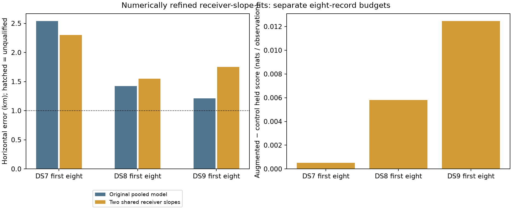
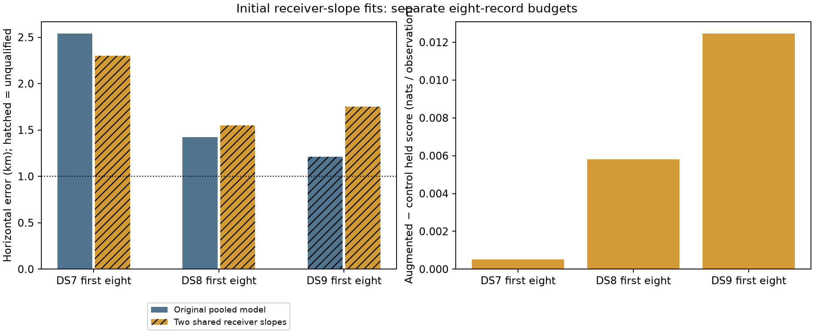

# Shared receiver slopes across DS7, DS8 and DS9

Two receiver-specific residual frequency slopes shared across eight recordings
improve the pooled DS7 position by 240 m, but worsen DS8 by 127 m and DS9 by
537 m. Held observation scores improve on all three panels. **Do not promote
this correction for geographic accuracy.** None of these pooled fits reaches
1 km. Positive local curvature does not explain away the geographic regressions.

Each row below uses the first eight chronological records of its dataset,
separately. These are 24 recordings, not all 258 records in the three datasets,
and not a combined 24-record position fit. Membership is frozen in [plan.json](plan.json).

| Dataset | Tracks | Held observations | Control error (m) | Two receiver slopes (m) | Error change (m) | Held score change (nats) | Records with held gain |
|---|---:|---:|---:|---:|---:|---:|---:|
| DS7 | 486 | 8,622 | 2,541.480 | 2,301.593 | −239.887 | +4.463 | 4/8 |
| DS8 | 485 | 8,959 | 1,423.707 | 1,550.734 | +127.027 | +52.068 | 5/8 |
| DS9 | 491 | 8,484 | 1,212.978 | 1,750.420 | +537.441 | +105.789 | 5/8 |

These are the **numerically polished** fits. All six qualify; the original
bounded trial and its qualification failures are preserved below. Negative
error change is favorable; positive held score change is favorable.

The right panel divides the total held score gain by the total held observation
count. Equal-record averages differ: DS7 0.000905, DS8 0.009123 and DS9 0.012493
nats/observation. Full per-record values, original results and polished results
are in [scores.json](scores.json). SVG versions accompany both figures.

## Model and ablation

| Arm | Position | Recording timing | Residual frequency slope | Other likelihood terms |
|---|---|---|---|---|
| Control | One shared horizontal position | Eight free offsets | Fixed zero | Frozen baseline |
| Receiver slope | One shared horizontal position | Eight free offsets | Two free slopes, one per software receiver, shared across all eight recordings and channels | Identical to control |

Slopes are in native Hz/s, converted to canonical frequency with 11.2 GHz / RF.
Time is relative to each recording's start; existing track/candidate stationary
offsets absorb intercept differences. The Student-t likelihood (4 degrees of
freedom, 100 Hz scale), full candidate mixture, causal catalogue normalization,
visibility, training/held masks and offset penalty are unchanged. No spatial
prior or measured clock prior is added. Software receiver labels are consistent
within exported trajectories; their physical antenna mapping remains provisional.

| Dataset | RX0 fitted slope (Hz/s) | RX1 fitted slope (Hz/s) |
|---|---:|---:|
| DS7 | +1.108550 | +0.563063 |
| DS8 | +2.848204 | +2.782285 |
| DS9 | −1.873543 | −4.041941 |

These phenomenological terms are not calibrated oscillator drift or a test of
the nominal 20-degree receiver tilt. There is no one-global-slope intermediate
ablation here, so this comparison cannot attribute a gain specifically to the
difference between receivers. Relative to earlier per-record slope experiments,
both the pooling budget and parameter sharing differ.

The paired local search starts from the historical joint solution and common
timing perturbations of 0, −0.25 and +0.25 s. Bounds are ±12 km for position,
±5 s for each timing, and ±20 Hz/s for slopes. Highest training score among
successful starts selects the estimate; neither held nor geographic score
selects it. Historical zero-slope training scores replay within absolute 1e−7.
See the frozen [protocol](PROTOCOL.md), [runner](run.py), and
[model implementation](../../tools/ds7_pooled_receiver_slope.py).

## Original trial and separate numerical polishing

Every original arm returned within its 300-second cap. All 18 starts reported
optimizer success, but only 4/18 met the stricter gradient criterion. Four of
the six selected fits failed that criterion. Optimizer relative-loss convergence
alone was insufficient. Qualification requires success, an interior solution
and maximum absolute coordinate score gradient ≤0.01.

| Dataset / arm | Original error (m) | Selected qualified | Maximum gradient | Qualified starts | Largest start separation (m) | Wall seconds |
|---|---:|---|---:|---:|---:|---:|
| DS7 control | 2,541.480 | Yes | 0.001247 | 2/3 | 0.010 | 102.69 |
| DS7 receiver slope | 2,301.653 | No | 0.019526 | 0/3 | 0.701 | 253.59 |
| DS8 control | 1,423.707 | Yes | 0.000403 | 1/3 | 0.068 | 112.80 |
| DS8 receiver slope | 1,550.718 | No | 0.011339 | 0/3 | 0.545 | 235.52 |
| DS9 control | 1,212.979 | No | 0.010267 | 1/3 | 0.104 | 128.20 |
| DS9 receiver slope | 1,750.373 | No | 0.056680 | 0/3 | 0.556 | 299.44 |

After observing the DS7 gradient failure, and before geographic scoring, a
separate [polishing protocol](POLISHING-PROTOCOL.md) was declared. It applies to
all six completed, successful, interior selected fits, including the already
qualified controls. Original outputs remain intact. This is additional compute,
not success within the original optimization budget.

Each fit gets one start at its original estimate, unchanged data/model/bounds,
L-BFGS-B maxiter 40, maxfun 60, ftol 1e−13, gtol 1e−6, maxls 30, and a separate
90-second cap. No retries. All six returned and qualified, with training score
not decreasing beyond the allowed 1e−7 tolerance. Maximum geographic movement
was 0.157 m, far below the hundreds-of-metres model differences.

| Dataset | Control / slope polish wall (s) | Control / slope movement (m) | Control / slope final max gradient |
|---|---|---|---|
| DS7 | 13.03 / 32.97 | 0.00018 / 0.06746 | 0.000494 / 0.001224 |
| DS8 | 36.79 / 27.41 | 0.00001 / 0.05441 | 0.000365 / 0.002281 |
| DS9 | 18.95 / 52.08 | 0.00750 / 0.15667 | 0.001948 / 0.003842 |

Small separation among these nearby starts is not evidence of global uniqueness.

## Local identifiability

Observed full-mixture Hessians were evaluated at the polished augmented points
using central gradient differences, first at 0.02 km for position and 0.002 for
timings/slopes, then at half those steps. All three had stable visibility,
positive nuisance and profiled position information, and raw asymmetry and
step sensitivity below the declared 3% threshold.

| Dataset | Weakest / strongest retained position information | Curvature wall (s) |
|---|---|---:|
| DS7 | 80.23% / 99.89% | 143.89 |
| DS8 | 74.02% / 100.00% | 133.24 |
| DS9 | 75.54% / 98.14% | 134.86 |

Retention compares slopes free versus fixed **at the same augmented point**,
with timing offsets profiled in both cases. It does not compare inverse-error
ratios between the two fitted arms. An independent Cholesky/Schur and generalized
eigenvalue replay agreed within 1e−8 in all six step/dataset cases:
[audit](curvature-independent-audit.json). Matrices and diagnostics are under
[curvature](curvature/). These are local conditional checks, not calibrated
confidence intervals, physical clock calibration or accuracy guarantees.

## DS8 completion

The original DS8-008 bank export timed out at 120 seconds and remains a failure
in the historical [baseline panel report](../2026_09_28_ds89_baseline_panel/README.md).
This separate follow-up reused the exact observations and unchanged exporter,
with a declared 240-second preparation cap. It completed in 151.42 seconds,
producing 56 eligible tracks and a 69,999,678-byte bank. No new RF or IQ was
collected, and no observation export was replaced. Snapshot and causal-cutoff
checks and source hashes are retained in [preparation](preparation/).

The unchanged individual baseline completed in 19.74 seconds (120-second cap),
with 1,388.828 m error. The first-eight joint bootstrap completed in 171.45
seconds (300-second cap), with 1,423.707 m error. Both converged in the interior.
See [preparation protocol](DS8-PREPARATION.md),
[bootstrap protocol](BOOTSTRAP-PROTOCOL.md) and [evaluation](bootstrap-evaluation.json).

DS8 now has **8/8 returned and qualified individual fits, 1/8 below 1 km, and
3,366.103 m median individual error**. The old seven-returned median of
3,575.663 m remains historical. Individual accuracy and the eight-record pooled
accuracy are different observation budgets and must not be substituted for one
another. No record was removed on the basis of outcome.

## Reference, validation and reproducibility

All three panels use the same previously exposed, operator-entered, unsurveyed
site reference: 37.849056280893684, −122.48575489722863. Site altitude and reference
uncertainty are unknown. The inherited coordinate origin itself is only
**809.029 m** from that reference, closer than any fit in this experiment. It
defines coordinates and candidate anchors, not a spatial penalty; treating it
as an estimator would not establish generalization. These results cannot support
new-site or reliably sub-kilometre accuracy claims.

The score audit verifies 208 launch/output bindings, 20 geographic distances
with an independent 3D formula, 18 initial starts, six polishing results, all
24 pose companions and three dataset manifests. It also checks chronological
membership, held-score sums, mixture posteriors and training nondecrease.
Seven relevant component tests passed, covering pooled analytic gradients,
training/held isolation, the zero-slope baseline identity, synthetic parameter
recovery and existing slope contracts; see [tests.log](tests.log). Ruff lint and
format checks pass for the 13 new report/model/test Python files.

Every scientific job used one numerical thread, nice 19, a 4-GiB address-space
limit, and at most two simultaneous numerical jobs. All 18 preparation,
bootstrap, fit, polish and curvature commands exited zero; per-stage measured
resources are in [resource-summary.json](resource-summary.json). Bootstrap
scoring resources are separately recorded in bootstrap-evaluation-resources.txt.
The public-reader environment is the installed release's Python 3.14.4,
NumPy 2.4.6 and SciPy 1.18.1; workspace tests/plotting use the local environment.

[evidence-sha256.json](evidence-sha256.json) binds the report, evidence, source,
dataset manifests, pose companions and reused inputs. Existing DS7 bank paths
under `.leo` have byte-identical published counterparts listed in
[input-archive-map.json](input-archive-map.json); restore these mappings before
replaying requests on a fresh checkout. Existing DS8/DS9 inputs are referenced
from their published reports. The newly completed DS8-008 bank is included here.
Launch scripts retain exact commands and limits; output creation is exclusive,
so replay into a separate output directory rather than overwriting this evidence.

## Next decision

Keep the zero-slope pooled baseline as the comparison model. Further free drift
parameters are not justified by these geographic outcomes. Prioritize a bounded
known-pilot/CFO frequency-accuracy experiment with a matched downstream position
ablation across DS7, DS8 and DS9. Existing coherence evidence alone does not
establish unbiased frequency measurements or geographic improvement. Independent
clock, orbit and antenna-pose evidence remains needed before interpreting fitted
nuisance parameters physically. Reliable sub-kilometre accuracy remains unresolved.
