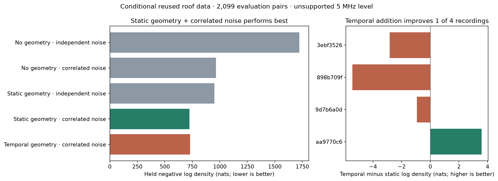

# Does temporal receiver geometry add tracking evidence?

**The tested temporal extension did not improve held reception prediction.** Static candidate geometry with correlated noise performed best. Adding the rate of change of receiver contrast worsened total held log density by **5.625 nats**, improving only **one of four recordings**. This does not justify increasing satellite-association confidence or changing the DS7 localization model.

SOL implemented the model and evaluator and performed independent review; Terra audited the source join, receiver-pair deduplication and preprocessing exposure. The coordinator froze the comparison, executed it and checked the results. The corrected run completed in **15.02 seconds**, using one numerical thread and **162,664 KiB peak RSS**. All five fits converged at interior parameter values.

## What was tested

The provisional RX0-west/RX1-east mapping and nominal opposing 10-degree tilts define candidate-specific receiver contrast at each observation time. The temporal extension adds its derivative, evaluated using actual irregular timestamps. A continuous-time Ornstein–Uhlenbeck (OU) noise model accounts for correlated receiver ratios. All arms use the same training-only nuisance adjustment for channel, edge, sample rate and anchor strength, the same candidate banks, and the same rows.

This is a **conditional paired-receiver log-margin-ratio diagnostic on ten reused roof recordings from earlier DS6 work**, not a full DS7 evaluation. The current model tests whether a derivative term adds to time-varying rowwise geometry. It does **not** fit first-detection order, beam entry/exit, or a calibrated crossing-time model. The old directional reception approach already used direction at each timestamp. The new candidate-specific static comparator does not reproduce the legacy posterior-mean implementation exactly.

## Ablation results

Lower negative log density is better. Scores sum normalized whole-track mixture densities over the same **2,099 evaluation pairs in 159 tracks**, with one shared candidate identity marginalized per track. They are reception scores, not geographic errors or satellite-identification accuracy.

| Model | Held negative log density, nats | What the comparison shows |
|---|---:|---|
| No geometry, independent noise | 1,723.484 | Baseline after shared nuisance adjustment |
| No geometry, correlated noise | 964.692 | Noise correlation alone contributes substantially |
| Static rowwise geometry, independent noise | 950.491 | Geometry contributes without a temporal derivative |
| **Static rowwise geometry, correlated noise** | **725.017** | Best tested model |
| Temporal geometry, correlated noise | 730.642 | Derivative addition makes held prediction worse |

Adding static geometry to the correlated-noise baseline improves log density by **239.675 nats**. Adding correlated noise to static geometry improves it by **225.474 nats**. Adding the temporal derivative to that matched baseline loses **5.625 nats**. These are conditional descriptive differences; neither data reuse nor the unsupported sample-rate category permits a clean validation claim.

| Evaluation recording | Paired rows | Static OU NLL | Temporal OU NLL | Temporal log-density gain |
|---|---:|---:|---:|---:|
| `scan-fw-3ebf3526172258af` | 482 | 72.226 | 75.067 | −2.842 |
| `scan-fw-aa9770c66396e928` | 604 | 328.439 | 324.847 | +3.592 |
| `scan-fw-9d7b6a0db558703a` | 457 | 186.429 | 187.366 | −0.937 |
| `scan-fw-898b709fcf3dd978` | 556 | 137.924 | 143.362 | −5.439 |
| **Total** | **2,099** | **725.017** | **730.642** | **−5.625** |

The temporal model improved its penalized training objective by 4.850 nats but did not transfer that gain to evaluation. We did not tune or search further after this result.

The two unsupported 5 MHz recordings (`3ebf…` and `898b…`) account for −8.280 nats of temporal change. The two supported 2.5 MHz recordings sum to +2.655 nats, with only one of those two improving. This descriptive breakdown does not replace the frozen aggregate criterion, but it prevents interpreting the aggregate loss as evidence that temporal information is generally unhelpful.

## Controls and interpretation

Controls use the original fitted coefficients and identical row denominators. Receiver swap changes geometry while retaining measured ratios; trajectory reversal recomputes derivatives on actual observation times; time shuffle permutes nuisance-adjusted residuals within track.

| Evaluation configuration | Static OU NLL | Temporal OU NLL |
|---|---:|---:|
| Original | 725.017 | 730.642 |
| Swapped receiver geometry | 3,950.245 | 4,301.881 |
| Reversed candidate trajectory | 1,634.220 | 1,651.930 |
| Shuffled residual order | 1,950.001 | 1,959.899 |

Both models beat these controls, so the static model already captures much of the ordered geometric structure. These comparisons do not establish added value from the derivative. Shuffling also destroys correlated noise, and swapping tests the frozen nominal map rather than independently calibrating the hardware. Three-candidate frequency associations are not decoded satellite truth.

## Cohort accounting and limitations

- 10,369 detected-anchor rows were available; 4,084 without a compatible matched counterpart were excluded from the ratio endpoint. Their absence is not a target-level non-detection.
- 6,285 matched rows contained 242 reciprocal duplicates. Deduplication retained 6,043 physical pairs in 485 tracks. Excluding 71 tracks with fewer than three rows removed another 104 pairs, leaving **5,939 pairs in 414 tracks** across all ten recordings.
- The frozen hash assignment produced 3,840 training pairs in 255 tracks and 2,099 evaluation pairs in 159 tracks. Derivative rank was positive beyond intercept/time/static contrast in 242 training and 152 evaluation tracks; the other 20 tracks remained in the common descriptive cohort.
- At least one candidate predicts a nominal contrast-zero event within the observed window for 152 training and 87 evaluation tracks. All three candidates do so for only 16 and 10 tracks respectively. These are predicted equal-boresight events, not observed beam crossings.
- **5 MHz occurs only in evaluation.** Its nuisance category has no fitted training effect and uses the reference-category encoding. This independently fails the declared support gate; the four-record result must remain descriptive. No unsupported rows were silently removed.
- Two evaluation recordings contributed to the older pairing-bias calibration. Track construction, research exposure and known-roof-position candidate geometry also predate the new split. This is not an untouched pipeline test.
- Nuisance offsets are estimated once and held fixed across arms, rather than jointly optimized with geometry. Receiver mapping and beam response remain provisional. The all-cohort rank policy permits no track-specific temporal-direction claim.
- No held-frequency likelihood is available in the compact endpoint. No frequency-association, position, or sub-kilometer improvement was measured. Whole-track scoring is not a future-forecasting test.

## Decision and next priority

Keep static geometry with correlated noise as the baseline for this reception diagnostic. **Do not promote this derivative extension**: it fails aggregate improvement and the predeclared three-of-four recording criterion, in addition to the unsupported-rate gate.

The first-before-second idea remains a distinct, untested hypothesis. The next useful preparation is an opportunity-complete, candidate-keyed sequence from existing cached evidence: both receivers at every valid observation window, explicit missing opportunities, and detection/non-detection outcomes attached without selecting tracks from the same detection boundaries being evaluated. A matched detection lag could then distinguish candidate motion along the receiver-separation axis, conditional on correct mapping, beam response, and shared target identity. It would not alone recover a full sky-motion vector.

Before another evaluation, fix receiver mapping and beam/gain calibration, cover every evaluated sample-rate category in training, rebuild compatibility/candidate inputs under the new split, and materialize held-frequency likelihoods. Compare a calibrated lag or crossing-time model against this static OU baseline and require improvement in held frequency prediction before claiming increased tracking confidence. No new RF collection is required or authorized by this report.

## Reproduction and evidence

- [Pre-fit protocol](PROTOCOL.md), [input contract](input-audit/CONDITIONAL-INPUT-CONTRACT.json), [join/exposure audit](input-audit/ASSOCIATION-JOIN-ADDENDUM.md).
- [Corrected launch and hashes](corrected/launch.json), [complete result](corrected/result.json), [resource receipt](corrected/resources.txt), [exit status](corrected/exit-code.txt).
- [CSV ablations](ablations.csv), [SVG figure](ablations.svg), [figure renderer](render_results.py).
- [Model core](../../tools/ds7_beam_crossing.py), [evaluator](../../tools/ds7_beam_crossing_eval.py), [core tests](../../tests/research/test_ds7_beam_crossing.py), [evaluator tests](../../tests/research/test_ds7_beam_crossing_eval.py).

The original invocation failed before its first likelihood evaluation because of an optimizer callback argument-order bug. Its [launch](launch.json), [traceback](terminal.log), and checkpoint remain intact. The [explicit launch amendment](LAUNCH-AMENDMENT.md) records the engineering correction; models, partition and numerical budget were unchanged. Synthetic optimizer integration tests now cover all five arms. **26 focused tests passed; Ruff passed.** The corrected process exited 0. No further scientific fit or expanded search was run.
