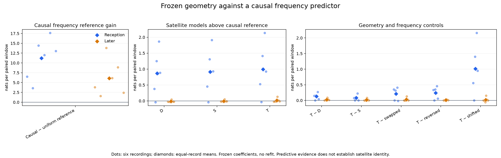
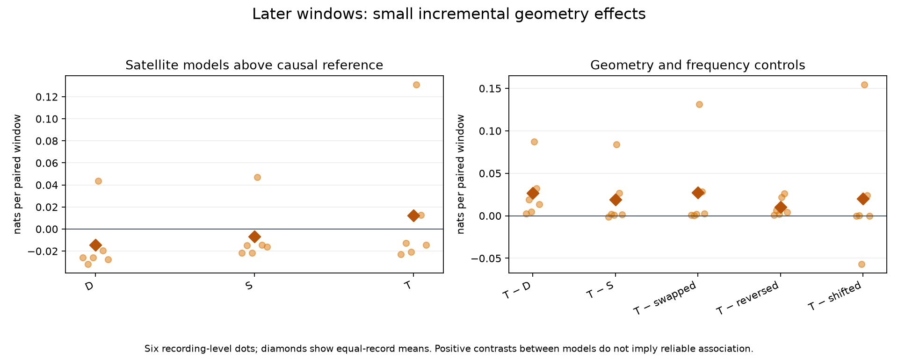

# Receiver geometry against a causal frequency reference

This experiment asks whether the saved satellite forecasts and receiver geometry
add predictive evidence beyond a generic predictor of candidate frequencies.
The earlier uniform-frequency reference did not represent the smooth, competing
frequency sequences visible in the residual plots.

**Causal frequency continuity supplies a much stronger reference. A small tilt
advantage survives the geometry controls, but general association support remains
weak in later windows.** No model is promoted to satellite confidence.

The new reference uses only the last two nonempty candidate windows from each
receiver. It keeps every candidate-pair continuation, assigns a fixed velocity
prior, extrapolates on the alias circle, and mixes in a uniform component for new
signals. It scores each window before adding that window to its history. It has
no satellite identity, orbit, tilt, or access to future observations.

This is a deliberately small causal baseline, not a persistent tracker or an
orbit-nomination system. It forgets stale history after ten seconds, does not
connect physical identities across windows, and does not transfer tracks between
receivers. Its defaults were frozen before execution, not chosen by these results.

## Comparison

The six omitted-record fits from the earlier cross-validation remain fixed. For
each recording, use its other-five-record joint count model, scaler, D/S/T
coefficients, occupancy and persistence. Only the observational frequency reference
changes. Reception and held roles share one causal history without a boundary reset.

The joint count distribution and candidate-set factorial terms are unchanged.
The new reference adds the log density of each observed candidate. Satellite
likelihoods use the satellite-to-causal-density ratio for each candidate, preserving
the existing proper signal-plus-background likelihood. Geometry controls share
exactly the same causal reference.

Report reception and later scores with equal recording weight. Compare the causal
reference to the uniform reference, then D/S/T to the causal reference, T to D/S
and its controls, and full causal model scores to their uniform counterparts.
Uniform D/S/T scoring must replay the completed temporal-transfer result.

## Interpretation limits

This is transfer of frozen coefficients to a new reference. It is not a comparison
of separately optimized model families. Poor transfer does not prove a refitted
geometry model cannot help. Conversely a higher latent presence estimate does not
establish identity or direction. The causal reference describes observations and
can follow real signals; it is not physically labeled clutter.

The same six recordings have informed earlier diagnostics. These results are
development evidence and cannot serve as independent confirmation of choices
motivated by those diagnostics.

All compared models factor candidate-frequency marks conditionally within a window
and score saved duplicates. Exact duplicates are removed only from the predictor's
history mixture. Predictive score gains therefore do not count independent physical
signals or establish the truth of that conditional-factorization assumption.

## Results

Scores are equal-record mean nats per paired window. Both roles contain all six
recordings: 1,356 reception windows and 1,363 later windows.

| Comparison | Reception | Later | Positive later recordings |
|---|---:|---:|---:|
| Causal reference − uniform reference | +11.207535 | +6.109846 | 6/6 |
| D − causal reference | +0.863196 | −0.014489 | 1/6 |
| S − causal reference | +0.910406 | −0.006983 | 1/6 |
| T − causal reference | +0.992193 | +0.012083 | 2/6 |
| T − D | +0.128997 | +0.026572 | 6/6 |
| T − S | +0.081787 | +0.019066 | 5/6 |
| T − swapped geometry | +0.212190 | +0.027525 | 6/6 |
| T − reversed geometry | +0.238261 | +0.010142 | 6/6 |
| T − shifted frequencies | +1.013938 | +0.020272 | 4/6 |

Here D includes receiver and sample-rate terms, S adds sky geometry, and T adds
the nominal tilt interaction. Every row uses the same frozen fits and nomination
priors as its corresponding earlier temporal-transfer run.

The improvement from adopting the causal reference is much larger than the
increment from adding geometry. The later full T model improves by +5.997396
nats/window over its uniform-reference counterpart, in all six recordings; this
is chiefly a reference-model improvement and must not be credited to tilt.

| Recording suffix | Causal reference gain over uniform | Later D − causal reference | Later T − causal reference |
|---|---:|---:|---:|
| 39ac2b14d1bb5f0f | +3.831042 | −0.025828 | −0.023111 |
| 3ebf3526172258af | +1.573579 | −0.031751 | −0.012786 |
| 4c56320fb5ca6994 | +13.802292 | −0.025807 | −0.020797 |
| 851486cc2a1acd99 | +6.142836 | +0.043666 | +0.131011 |
| 9d7b6a0db558703a | +8.902448 | −0.019507 | +0.012603 |
| c559f436d578c9bd | +2.406880 | −0.027707 | −0.014422 |

T beats D and both geometry controls on every later recording, so its incremental
effect is not erased by adding causal frequency continuity. But four recordings
still prefer the causal reference to T, and the large positive effect is concentrated
in `851486cc2a1acd99`. An advantage over another model that also loses to the
reference is insufficient evidence for a reliable satellite association.

## Evidence

The [protocol](PROTOCOL.md) fixes the parameters, likelihood and comparisons.
`launch.json` binds source code, tests and input lineage. `results.json` preserves
per-record/per-window comparisons and the causal prediction receipts. The
[independent review](REVIEW.md) checks causality, normalization and score arithmetic.

Seventeen focused tests passed, including density normalization, duplicate-history
invariance, stale-history recovery, extreme pair-weight normalization, causality,
reference/signal arithmetic and the existing temporal-scoring behavior. Ruff passed.
The run exited successfully in 28.48 seconds, peak RSS 219,688 KiB, within its
120-second/4-GiB bound. All uniform-model/control exports replayed the previous
temporal-transfer results exactly; causal references and history diagnostics agreed
across every geometry arm and control.
The independent audit reconstructed all 8,235 candidate-density values from past
history without importing the predictor, and verified uniform replay, reference
increments and aggregate arithmetic. It passed across all 12 lanes and six folds.

## Next step

Keep the causal frequency reference and refit D/S/T under that same likelihood,
using only the other-five-record reception windows for each omitted recording.
This removes the present frozen-parameter transfer mismatch without tuning on
later outcomes. Score each omitted recording's later windows causally and retain
the same receiver-swap, reversal and shifted-frequency controls. Do not select
tracking defaults using these later scores.

If geometry still gives an incremental benefit, test it with causal nomination
updates and previously unused recordings before claiming association confidence.
The two-window reference supplies competing frequency predictions; it does not yet
identify or renew satellite hypotheses when the saved nominees lose support.
