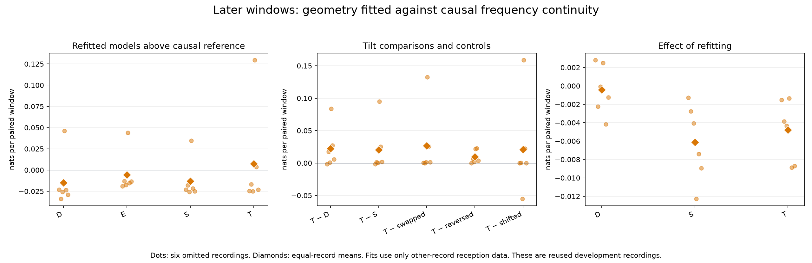
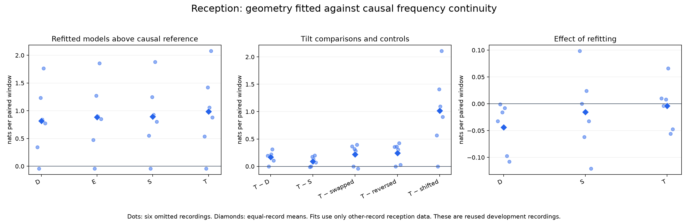

# Receiver geometry refitted against causal frequency continuity

This experiment removes the training/scoring mismatch from the preceding
[frozen causal-reference comparison](../2026_09_28_rx_causal_geometry/README.md).
It refits geometry and presence parameters using the same causal frequency
reference that is used for scoring.

**Refitting does not improve later predictive performance.** Tilt retains small
advantages over geometry controls, but T still beats the causal reference in only
two of six later recordings, and every recording scores slightly worse than its
frozen-T counterpart. No model promotion follows from this experiment.

## Results

All six folds completed. Scores below are equal-record mean nats per paired window,
with 1,356 omitted-record reception windows and 1,363 later windows in total.

| Refitted comparison | Reception | Later | Positive later recordings |
|---|---:|---:|---:|
| D − causal reference | +0.819405 | −0.014897 | 1/6 |
| E − causal reference | +0.885416 | −0.005701 | 1/6 |
| S − causal reference | +0.894958 | −0.013104 | 1/6 |
| T − causal reference | +0.988414 | +0.007308 | 2/6 |
| T − D | +0.169009 | +0.022205 | 5/6 |
| T − S | +0.093456 | +0.020412 | 5/6 |
| T − swapped geometry | +0.219427 | +0.026844 | 6/6 |
| T − reversed geometry | +0.244978 | +0.009429 | 6/6 |
| T − shifted frequencies | +1.014460 | +0.020948 | 4/6 |
| Refitted T − frozen T, full score | −0.003779 | −0.004775 | 0/6 |

The reference itself is identical to the preceding experiment. Thus the last row
isolates the change in fitted model parameters, not a change in frequency-history
prediction or observation population. Refitting also lowers later S performance
in all six recordings (mean −0.006121); D changes by −0.000409 on average and
improves in two recordings.

| Recording suffix | Later refitted T − reference | Later refitted T − frozen T |
|---|---:|---:|
| 39ac2b14d1bb5f0f | −0.024629 | −0.001518 |
| 3ebf3526172258af | −0.016642 | −0.003856 |
| 4c56320fb5ca6994 | −0.025124 | −0.004327 |
| 851486cc2a1acd99 | +0.129664 | −0.001347 |
| 9d7b6a0db558703a | +0.003720 | −0.008882 |
| c559f436d578c9bd | −0.023143 | −0.008721 |

The positive mean remains concentrated in `851486cc2a1acd99`. The swapped/reversed
contrasts suggest a limited geometry-specific effect under this model, but they
do not convert four reference-favoring recordings into reliable associations.
The results do not support the hypothesis that merely refitting against the
stronger reference would resolve later performance.

## Method

Each of six folds fits on the other five calibration recordings' reception windows
only. Omitted-record observations, all held-frequency observations and original
evaluation recordings are removed before training features or causal histories
are constructed. Exact training-window IDs are exported for independent checking.

The fold's previously fitted joint count model and feature scaler remain fixed,
as do the 500 Hz satellite width, causal frequency-predictor defaults, nomination
priors, coefficient priors and optimizer settings. D/E/S/T form the same nested
ladder: receiver/sample-rate terms, elevation, full sky geometry, and nominal tilt.
Only coefficients, occupancy and persistence are refitted. The neutral D seed
does not use any omitted-record or held-period fit.

The omitted recording is scored sequentially through reception and later windows.
Within-geometry centering uses reception forecasts and carries that offset forward.
All controls share the same causal reference while filtering their own emissions.
Swapped/reversed geometry and quarter-period-shifted frequencies test whether a
model improvement depends on the intended geometry and frequency forecasts.

This is reused development data, not an untouched confirmation set. Scores measure
incremental prediction under the stated models, not verified satellite identity,
travel direction or position accuracy.

## Evidence and confirmation readiness

The [protocol](PROTOCOL.md) and `launch.json` bind the experiment; each completed
fold has an exclusive checkpoint containing its source/input fingerprints, seal,
training membership and content hash. `results.json` contains all fit receipts,
window scores and comparisons with the preceding frozen models. The
[independent review](REVIEW.md) checks the fit and scoring boundaries.

Twenty focused tests and Ruff passed before execution. All 48 optimizer starts
converged, no exact-null selection occurred among 24 fitted arms, and 22 of those
arms reached the existing 10-second persistence upper bound. This bound is reported
as a limitation, not widened after inspecting outcomes. The run completed in
135.84 seconds, peak RSS 263,184 KiB, within its 300-second/4-GiB bound. All six
folds were checkpointed; no resume was needed.
Both independent audit receipts passed. They verify exact training membership,
selected training likelihoods, checkpoint payloads, per-window-to-role score sums,
all 54 aggregate contrasts, frozen-model comparisons and all 24 selected MAP
penalties. Sources and inputs still match the launch seal.

The [metadata-only cohort proposal](CONFIRMATION-PROPOSAL.md) identifies four
same-pose recordings disjoint from the current 14-record study, but all have prior
research exposure. They are a reuse panel, not blind confirmation. A subsequent
[DS8 readiness check](DS8-READINESS.md) verified existing public `TrackingInput`
products for the earliest post-DS7 capture at each of 2.5, 5, 7.5 and 10 Msps,
with matching sealed input hashes and the same pose revision. Cache packaging and
integrity validation are still required; new GLRT processing is not required.
Earlier metadata/rate-validation exposure is disclosed, so these are not claimed
historically untouched. No new RF collection is part of this work.

## Next step

Prepare the metadata-selected DS8 four-rate panel through the public contracts,
keeping its membership fixed before association outcomes are inspected. Freeze
full-calibration versions of both the uniform-trained/frozen-transfer and
causal-refitted model families, and carry the reference, D/E/S/T and negative
controls into that assessment. Reporting both families avoids choosing a winner
from these repeatedly inspected later windows.

If saved nominees again lose frequency support, prioritize causal nomination
updates and receiver-specific track continuity rather than another unconstrained
coefficient or persistence search. The current experiments establish a small
conditional geometry effect, not a generally reliable association improvement.
