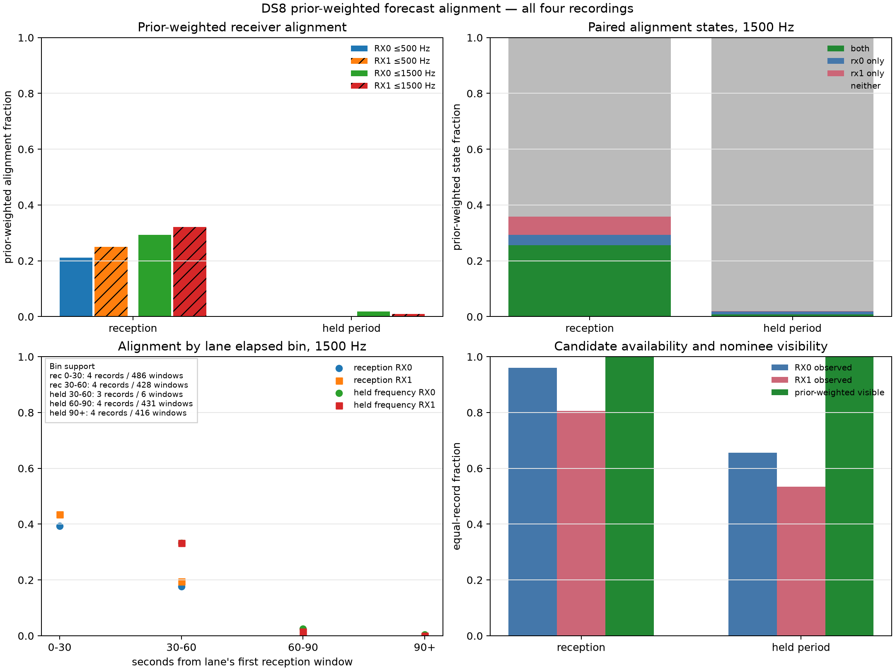

# DS8 forecast alignment and receiver-order support

The later-period geometry failure coincides with loss of frequency agreement with
the frozen satellite nominees on **both receivers**. Candidate detections remain
common, and all prior-weighted nominees remain forecast-visible. This makes
forecast validity and same-target association a higher priority than further
tuning of static tilt coefficients. It does not identify the physical cause of
the frequency disagreement.

This is descriptive analysis of the already-explored four-record DS8 panel, not
another confirmation. It preserves all eight lanes, 1,767 windows and 36
track-candidate nominees. No model, CFO or nomination prior was fitted or changed.

## Frequency alignment

Values below are percentages, averaging windows within each recording and then
weighting the four recordings equally. Alignment is weighted by the original
normalized nominee priors; empty candidate sets and invisible nominees contribute
zero. “Both” means both receivers have a candidate compatible with the same
nominee, not that the satellite identity has been established.

| Diagnostic | Reception, 914 windows | Later period, 853 windows |
|---|---:|---:|
| RX0 has any candidate | 96.04% | 65.57% |
| RX1 has any candidate | 80.63% | 53.49% |
| Forecast visibility | 100.00% | 100.00% |
| RX0 within 500 Hz | 21.11% | 0.2901% |
| RX1 within 500 Hz | 24.99% | 0.1082% |
| Both within 500 Hz | 16.39% | 0.0076% |
| Neither within 500 Hz | 70.29% | 99.61% |
| RX0 within 1,500 Hz | 29.28% | 1.83% |
| RX1 within 1,500 Hz | 32.20% | 0.98% |
| Both within 1,500 Hz | 25.61% | 0.74% |

The decline appears in every recording for both receivers. The table does not
measure a matched sequence dropping out first on one receiver and then the other.
Nearest-candidate identity can change between windows; a residual sequence is not
a verified physical track. Frequency alias wrapping and the frozen receiver-bias
correction remain unchanged.

| Recording suffix | Msps | RX0 500 Hz reception → later | RX1 500 Hz reception → later |
|---|---:|---:|---:|
| 226485b45dd0d0cf | 2.5 | 18.46% → 0.9050% | 19.50% → <0.0001% |
| ac05824a99b22ffd | 5 | 6.19% → <0.0001% | 5.09% → <0.0001% |
| aadcd44b66085469 | 7.5 | 38.62% → 0.2556% | 41.23% → 0.4326% |
| 9c5f3143152db63d | 10 | 21.15% → <0.0001% | 34.14% → <0.0001% |

These are four different recordings, not a controlled sample-rate comparison.

## Timing and interpretation

Within the reception period, 500 Hz agreement already falls from 29.60%/36.21%
(RX0/RX1, first 30 seconds) to 11.45%/12.58% (30–60 seconds). Later observations
at 60–90 seconds show 0.0140%/0.1984%. Thus the role boundary alone does not explain
the deterioration. Elapsed time is measured from each lane's first reception
window, not from original capture start. A separate later-role 30–60 second bin
contains only six windows from three records; it is not representative of a full
time block. Missing bins remain absent, with explicit record/window denominators.

The strong candidate-frequency continuity score in the preceding experiment can
coexist with poor agreement to prefix-nominated satellite forecasts. Neither
continuity nor generic candidate availability establishes that observations on
the two receivers belong to the same satellite. Do not gate a new direction
evaluation on good held-period alignment; that would select on its outcome.

## Next model and supporting artifacts

The forecast-only support audit completed on both the original ten-record pilot
and DS8. It reads scheduled geometry and priors, without detector outcomes.

| Scheduled nominal-order support | Original pilot | DS8 |
|---|---:|---:|
| Lanes | 19 | 8 |
| Track-candidate nominees | 90 | 36 |
| Available full nominal orders | 25 | 2 |
| Available orders predicting RX0 before RX1 | 25 | 2 |
| Available orders predicting RX1 before RX0 | 0 | 0 |
| No unique equal-plane crossing | 36 | 28 |
| Boundary scheduled maximum (primary exclusion reason) | 29 | 6 |
| Lanes with opposite full-order prior mass | **0** | **0** |

The pilot comprises 12 calibration lanes/54 nominees (16 available orders) and
seven evaluation lanes/36 nominees (nine available orders). DS8's two available
orders belong to one 5 Msps lane with only 1.87e-8 total conditional prior mass.
The opposite-order pair mass is zero across all 27 lanes. A full-crossing **order
sign alone cannot distinguish competing nominees in this bank**. This does not
rule out crossing-time differences, partial-arc geometry, or a broader bank.

The separate `direction-summary.json` retains partial-arc contrast slopes. In DS8
recording `226485b45dd0d0cf`, channel 3, opposite secant signs each have 0.5 prior
mass. The two dominant hypotheses belong to **different prefix tracks** (catalog
100154 and 68738); neither crosses the equal-boresight plane in the scored
schedule. This is a possible development case for partial-arc association, not
observed receiver order or a reason to select a favorable confirmation subset.
The largest corresponding partial-sign pair mass in the original pilot is only
4.39e-12. Its current priors offer very little competing-sign support for training
an association-specific direction test.

Consequently, defer the proposed full-order fit. The next concrete prerequisite
is a bounded audit of training-prefix candidate support and forecast aging,
including whether multiple simultaneous prefix tracks are being treated as
mutually exclusive lane identities. Preserve the frozen bank for comparisons;
do not flatten its priors or widen the matching gate just to manufacture support.
Any revised candidate bank or partial-arc model needs calibration-only development
and a newly frozen, disjoint evaluation.

[DIRECTION-PLAN.md](DIRECTION-PLAN.md) specifies a proposed candidate-specific
receiver-order experiment. It separates presence from identity and signed
receiver order, adds a candidate-trajectory permutation control, and keeps
frequency-free receiver marks as a distinct endpoint. The hardware/software
receiver mapping and beam response remain provisional.

Before implementing that fit, the forecast-only support audit checks whether
competing nominees have different identifiable nominal orders in the scheduled
observations. Its [protocol](DIRECTION-SUPPORT-PROTOCOL.md) retains boundary/tied
peaks as unavailable and reports continuous prior-weighted disagreement without
inventing missing crossings.

`direction-pilot.json` and `direction-ds8.json` contain every nominee, prior,
crossing/peak visibility and censoring reason. Their exclusive launch receipts
bind `tools/rx_direction_support.py` and its 11 passing component tests. Both
bounded runs completed successfully. Integer source peak timestamps are retained;
interpolated crossing times are approximate scheduled-geometry estimates.

The alignment implementation is `tools/rx_ds8_alignment.py`; its four component
tests plus seven existing residual-helper tests passed (11 total), with Ruff
clean. `results.json` exports every nearest residual, candidate count, nominee
weight, paired state and aggregate denominator. `launch.json` binds its source,
tests, protocol and sealed input. No RF collection, IQ reprocessing or QNAP writes
were performed.

The independent `audit-results.json` recomputed all 1,767 windows and every
record/role/bin mean and denominator. The largest paired-state normalization error
was 2.22e-16. The plotted aggregate values were checked against the sealed dataset.

`audit_direction_final.json` independently reconstructed crossing events, peaks,
visibility censoring, order labels and weighted summaries for all 126 nominees,
including the separate partial-secant summary. The earlier
`audit_direction.json` is retained as a preliminary structural audit. All checks
passed. Alignment ran in 1.12 seconds; the pilot and DS8 direction audits ran in
0.40 and 0.30 seconds. `evidence-sha256.json` binds the final artifacts and sources.
