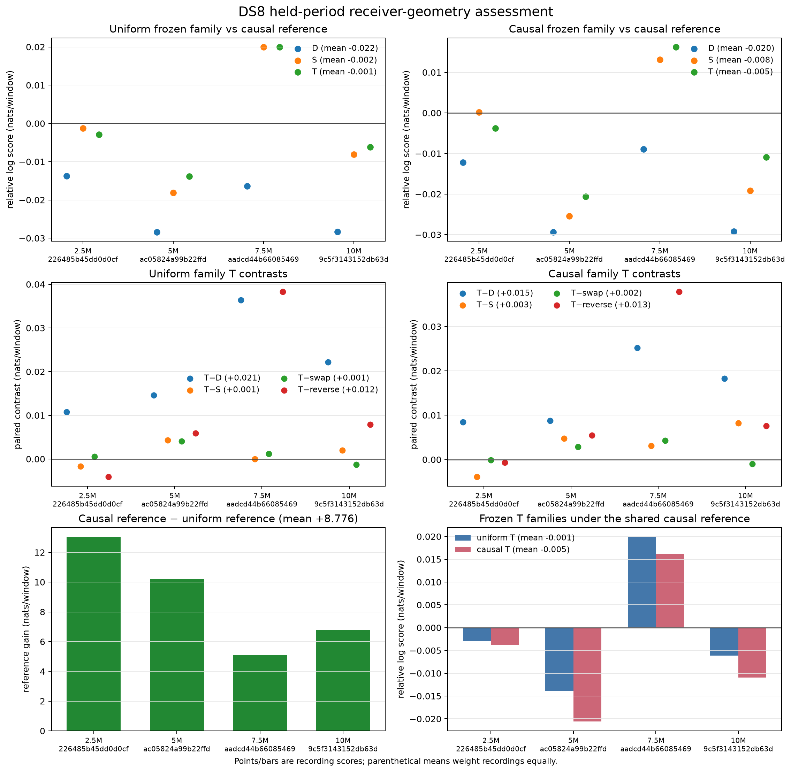

# DS8 confirmation of receiver geometry

The fixed four-record DS8 panel does **not** justify promoting the 20-degree
receiver-tilt model as reliable satellite identity or travel-direction evidence.
Geometry improves on the detector-only arm, but neither frozen tilt family beats
the causal frequency reference on average in the later evaluation period. Only
one of four recordings improves over that reference. Receiver-swap controls are
inconsistent, and no position errors or sub-km accuracy were measured here.

All four preselected recordings remained eligible: eight exact RF lanes, 914
reception windows and 853 later windows (1,767 total). Membership was frozen by
earliest DS8 recording at each sample rate, with no outcome-based replacements.
These recordings are disjoint from the preceding 14-record geometry study, but
earlier metadata/rate-validation exposure is disclosed in the readiness receipt;
this is not claimed to be historically untouched data.

The partition contains 3,551 reception/later opportunities in total. The remaining
1,784 are outside the selected geometry RF lanes; the independent audit found no
missing opportunity within a selected lane. Per-lane rejection counts repeat
other-lane forecasts and must not be summed as unique excluded windows.

## Primary later-period ablations

Values are equal-record mean log-score differences in **nats per window**;
positive means the left-hand model predicts the observations better. Parentheses
give positive recordings out of four. These are predictive scores, not calibrated
satellite-confidence probabilities or location errors.

Both families were frozen on the original six calibration recordings' reception
windows. “Uniform-trained” and “causal-trained” describe their fitting reference;
**both are evaluated against the same causal reference on DS8**. D includes
intercept, receiver and sample-rate terms; E adds elevation; S adds shared spatial
geometry; T adds receiver-specific tilt interactions. Geometry features use the
existing within-lane centering convention.

| Ablation | Uniform-trained | Causal-trained |
|---|---:|---:|
| D − causal reference | −0.021708 (0/4) | −0.019931 (0/4) |
| E − causal reference | −0.002012 (2/4) | −0.000858 (2/4) |
| S − causal reference | −0.001892 (1/4) | −0.007827 (2/4) |
| T − causal reference | **−0.000737 (1/4)** | **−0.004776 (1/4)** |
| T − D | +0.020971 (4/4) | +0.015155 (4/4) |
| T − S: incremental tilt | +0.001155 (3/4) | +0.003050 (3/4) |
| T − receiver-swap control | +0.001112 (3/4) | +0.001507 (2/4) |
| T − geometry-reversal control | +0.011986 (3/4) | +0.012549 (3/4) |
| T − quarter-period frequency shift | +0.009743 (4/4) | +0.010780 (4/4) |

The causal frequency reference itself beats the uniform phase reference by
**+8.776343 nats/window, positive on all four recordings**. That large gain comes
from frequency continuity, and cannot be attributed to receiver geometry or
satellite identity. The tilt gain over shared geometry is much smaller.
The frequency-shift contrast is technically positive on all four, but is below
0.000001 nats/window for the 5 Msps recording in both families.

Causal-trained T scores below uniform-trained T on all four later periods
(mean difference −0.004040). Both families remain reported; the DS8 results do
not select or retune a winner.

## Per-record coverage and transfer

| Recording | Msps | Reception windows | Later windows | Uniform-trained T − reference | Causal-trained T − reference |
|---|---:|---:|---:|---:|---:|
| scan-fw-226485b45dd0d0cf | 2.5 | 241 | 221 | −0.002924 | −0.003765 |
| scan-fw-ac05824a99b22ffd | 5 | 226 | 208 | −0.013835 | −0.020612 |
| scan-fw-aadcd44b66085469 | 7.5 | 220 | 222 | +0.019965 | +0.016226 |
| scan-fw-9c5f3143152db63d | 10 | 227 | 202 | −0.006153 | −0.010954 |

One recording per rate cannot establish a sample-rate effect: rate is confounded
with recording time, satellite geometry and scene. Do not rank sample rates from
this table.

The earlier reception period looks stronger: T beats the causal reference on all
four recordings, with equal-record gains +0.679781 (uniform-trained) and +0.685634
(causal-trained). That improvement does not persist into the primary later period.
Per-record nomination and CFO/receiver mapping use only each training prefix;
the causal reference uses past observations and carries state across the
reception/later boundary. Model coefficients are never fitted on DS8.

## Interpretation and next experiment

The tested tilt interaction contains useful relative predictive information, but
its incremental gain and receiver-label sensitivity are too weak to establish the
proposed “RX0 before RX1 implies travel direction” inference. The reversal control
is a model sensitivity check, not a labeled test of physical travel direction.
Candidate presence and satellite identity remain separate questions.

The next priority is a bounded diagnosis of forecast validity on this now-explored
panel: measure when prefix-nominated satellite frequency predictions lose agreement,
separately by receiver, while keeping all nominees and empty opportunities. Then
develop an association-specific direction test using receiver-order evidence and
explicit competing satellite trajectories. Freeze any resulting method on existing
development data before testing a new, disjoint panel. Further tuning of the same
static tilt coefficients is lower priority given the repeated later-period failure.

## Reproduction and evidence

- [Fixed protocol](PROTOCOL.md), [pipeline](PIPELINE.md), [validation notes](VALIDATION.md).
- [Cache and partition audit](CACHE.md), [independent review](REVIEW.md).
- `models.json`: frozen full-calibration fits, scaler and background.
- `prepared/`: verified derived caches, inventory and pose-bearing manifest.
- `snapshot-authority.json`, `candidate-bank.json`, `alias-mapping.json`:
  causal orbit provenance and training-prefix conditioning.
- `partitions.json`, `opportunities/`, `dataset.json`: opportunity accounting and
  exact-lane evaluation inputs, including per-lane exclusion counts.
- `results.json`: both families, every control, per-window scores, per-record
  denominators and equal-record aggregations.
- `ds8-confirmation.svg`: vector figure; `plot_results.py`: reproducible plots.
- Stage launch/resource/exit receipts and independent audit scripts/JSON retain
  provenance and numerical checks. `evidence-sha256.json` indexes final evidence.

Every numerical stage completed within its frozen limit (the longest was mapping,
115.82 seconds). Scoring took 40.75 seconds. This work used existing derived data;
it performed no RF collection, IQ detector campaign or QNAP mutation.
