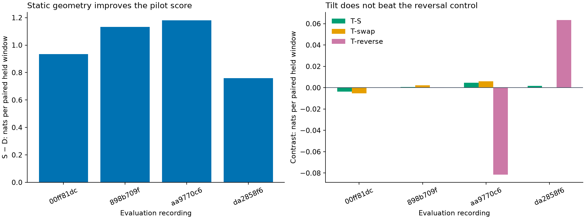

# Receiver geometry in satellite-association prediction

**Static geometry improves the pilot's held predictive score; the additional nominal 20° receiver-tilt terms do not pass the directional control test.** All three models are now implemented and fitted. The original Doppler catalogue bank remains unchanged; the experiment exports geometry-conditioned association weights separately.

This is an exploratory ten-record roof pilot with six calibration and four evaluation recordings. It is not full DS7 confirmation, a decoded satellite-identification test, or a position-error benchmark. A higher predictive density is not a percentage increase in satellite confidence.

## Frozen model comparison

| Arm | Reception-probability features |
|---|---|
| D | Intercept, receiver contrast and sample rate; frozen Doppler frequency forecasts |
| S | D plus shared line-of-sight up, north and east components |
| T | S plus nominal receiver-signed horizontal boresight projection and its elevation interaction |
| Swapped T | Frozen T coefficients, receiver boresights swapped |
| Reversed T | Frozen T coefficients, geometric trajectory order reversed within each role |

Every arm scores the same raw candidate sets, including empty sets, without a frequency gate or nearest-candidate selection. A shared receiver random intercept is integrated with five-point Gaussian quadrature. This first pilot uses rho=0; it does not fit temporal noise correlation. The likelihood accounts for clutter and missed detections and treats detector marks as common ancillary information.

The fitted nuisance model selected a **500 Hz canonical signal width**, with RX0/RX1 clutter intensities **1.7424 / 1.1382** candidates per probe. Width, clutter and model coefficients use only calibration reception windows. All six optimizer runs converged before evaluation scoring. No held residual chose the signal width.

## Held predictive results

Values are changes in natural-log predictive density per unique paired window; higher is better. The overall value gives each evaluation recording equal weight.

| Evaluation recording | Held windows | Static S − D | Tilt T − S | T − swapped T | T − reversed T |
|---|---:|---:|---:|---:|---:|
| `00ff81dc09fc738a` | 108 | +0.933415 | −0.003750 | −0.005241 | 0.000000 |
| `898b709fcf3dd978` | 231 | +1.132195 | +0.000624 | +0.002276 | −0.000102 |
| `aa9770c66396e928` | 242 | +1.180370 | +0.004661 | +0.006058 | −0.081471 |
| `da2858f6cd2521b7` | 215 | +0.758244 | +0.001686 | −0.000153 | +0.063466 |
| **Equal-record mean** | **796 total** | **+1.001056** | **+0.000805** | **+0.000735** | **−0.004527** |

Full recording IDs have the `scan-fw-` prefix. Static geometry beats D in all four records. T improves slightly over S on average, but loses to reversed geometry overall. Consequently the predeclared requirement that T outperform both controls is **not met**. Do not promote nominal tilt as demonstrated directional evidence.

## Does geometry improve frequencies or just counts?

A post-fit diagnostic decomposes each held-window score using the **same full-history association posterior**, without refitting any model. The full score equals count score plus conditional frequency score. This is an explanatory diagnostic, not a new primary endpoint.

| Equal-record contrast | Full set score | Count contribution | Frequency contribution given counts |
|---|---:|---:|---:|
| Static S − D | +1.001056 | −0.017948 | **+1.019004** |
| Tilt T − S | +0.000805 | −0.006158 | +0.006963 |
| T − swapped T | +0.000735 | −0.008798 | +0.009533 |
| T − reversed T | −0.004527 | +0.000488 | −0.005015 |

Static geometry's conditional-frequency gain is positive in **all four** evaluation records: +0.751314, +0.653189, +1.454266 and +1.217247 nats/window, respectively. Its aggregate count score is slightly worse. Thus its primary gain is not merely an improvement in count prediction. The static association/reception model predicts the observed frequencies better under this pilot's likelihood assumptions. This still does not establish correct satellite labels or prove the nominal receiver tilt is responsible.

## Association output and interpretation

The dataset contains **4,282 unique paired windows across 19 exact lanes**: 1,356 calibration reception, 1,363 calibration held, 767 evaluation reception and 796 evaluation held. Calibration held windows are unused by parameter fitting and the primary score. Each raw paired window contributes once, even when several frozen tracks explain it.

The lane prior mixes frozen track/candidate hypotheses and an explicit omitted-catalogue clutter branch. Its training log likelihoods stay in log space, preserving alternatives that rounded to zero in probability exports. Evaluation reception updates that mixture; each held observation is scored before it updates the mixture. Per-lane component identities and prior, reception and final log weights are exported in [results.json](results.json). These are model-conditioned association choices, not independently verified satellite labels.

For example, geometry changes the reception-leading candidate from 56541 to 66542 in recording `898b709fcf3dd978`, channel 2 upper, and from 55367 to 68344 in `da2858f6cd2521b7`, channel 2 lower. Without identity truth, changing a choice is not proof that it became correct. The predictive score and controls remain the acceptance evidence.

D and S differ in their reception-leading hypothesis in **3 of 7 evaluation lanes**. S and T choose the same leading hypothesis in all seven; their mean reception posterior total-variation distance is only about 0.00418. Adding static geometry is therefore a meaningful research candidate for association, whereas the extra tilt terms have not earned a directional claim.

The existing first-hit result alone remains insufficient for physical direction inference. The nominal mount signs are provisional; this experiment models reception probability, not RF phase-centre timing or a surveyed antenna pattern. Clutter, beam response, changing transmission activity and incomplete candidate support remain potential sources of model mismatch.

## Next work toward verified incorporation

Retain the frozen static S coefficients and likelihood as the candidate enhancement. Next test its predictions on an additional reserved recording panel, with the same exact-lane/raw-set scoring and Doppler-only comparison, before enabling it as an association default. In parallel, an explicitly frozen temporal-correlation experiment can test whether sequence structure makes receiver tilt useful; it must beat the same orientation controls. Neither extra fitting on these four evaluation records nor the positive static result can turn the failed tilt control into a pass.

## Evidence and reproducibility

- [Frozen executable protocol](PROTOCOL.md), [independent review](REVIEW.md).
- [Dataset](dataset.json), [dataset audit](dataset-audit.json), [dataset launch](dataset-launch.json).
- [Fit output](results.json), [fit launch](fit-launch.json), [fit terminal](fit-terminal.log), [fit resources](fit-resources.txt).
- [Fit audit](fit-audit.json), [decomposition definition](DECOMPOSITION.md), [decomposition results](decomposition.json), [decomposition launch](decomposition-launch.json).
- [Dataset builder](../../tools/rx_geometry_dataset.py), [numerical likelihood](../../tools/rx_geometry_likelihood.py), [fit/evaluation runner](../../tools/rx_geometry_fit.py).
- [Dataset tests](../../tests/research/test_rx_geometry_dataset.py), [likelihood tests](../../tests/research/test_rx_geometry_likelihood.py), [fit tests](../../tests/research/test_rx_geometry_fit.py).
- [Score decomposition](../../tools/rx_geometry_score_decomposition.py), [decomposition tests](../../tests/research/test_rx_geometry_score_decomposition.py), [evidence hashes](evidence-sha256.json).

The original seventeen installed-runtime tests and three new decomposition tests pass; Ruff passes. Dataset preparation took **2.21 seconds**, peak RSS **644,540 KiB**; fitting/evaluation took **2.91 seconds**, peak RSS **134,468 KiB**. Both exited 0 within their 300-second, one-thread, 4 GiB limits. An extra dataset regression test was added after dataset preparation; runtime source hashes remained unchanged and the fit launch binds the expanded test suite. No RF collection, raw-IQ processing or QNAP modification occurred.
