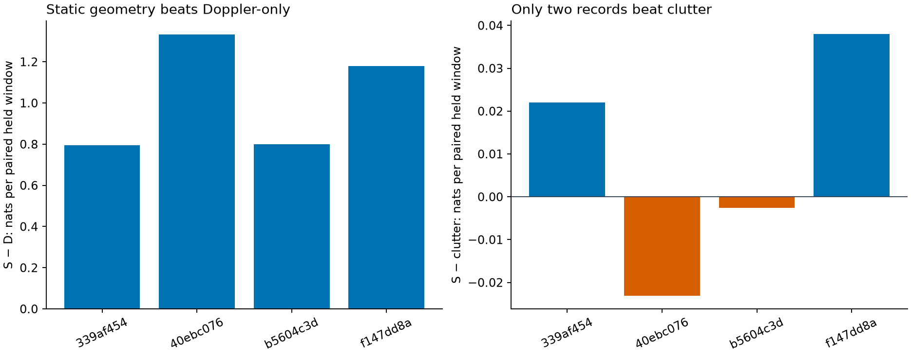

# Frozen geometry model on a disjoint recording panel

**Do not enable geometry as the default association model yet.** Static geometry again beats the Doppler baseline, but its advantage over an unchanged clutter-only reference is small and inconsistent. The extra nominal receiver-tilt terms are worse than static geometry on this panel.

This run applied the existing model without fitting coefficients, nuisance widths, clutter intensities or feature scaling. It rebuilt each recording's own initial-prefix satellite hypotheses under the original recipe. The four recordings share no sessions with the ten-record pilot. They were used in older roof research and predate DS7; this is disjoint-record historical confirmation, not blind DS7 validation.

## Why the baseline matters

The preceding pilot reported an S−D gain of +1.001056 nats per paired held window. A subsequent [analytical audit](REVIEW.md) found that pure clutter beat S in all four pilot evaluation records: mean S−clutter **−0.016388**. S reduced average visible-hypothesis signal probability from about 0.467 under D to 0.021. Thus the large improvement over D mostly removes harm from its target predictions; it does not by itself demonstrate useful association. The [original report now carries this correction](../2026_09_28_rx_geometry_association/README.md).

The confirmation froze clutter-only as an explicit comparator before scoring. It uses the same pilot-fitted RX0/RX1 Poisson intensities and uniform frequency-circle density, with no target component and no confirmation fitting. It is not an optimally refitted null; failure against even this fixed reference is enough to prevent promotion.

## Confirmation scores

Changes are natural-log predictive density per unique paired held window. Higher is better. Overall means give each recording equal weight.

| Recording suffix | Sample rate | Held windows | Static S − Doppler D | Static S − clutter | Tilt T − static S |
|---|---:|---:|---:|---:|---:|
| `339af454a2aab2f4` | 10 Msps | 230 | +0.795724 | +0.022056 | −0.026127 |
| `40ebc07665464c7d` | 2.5 Msps | 230 | +1.332654 | −0.023110 | +0.011919 |
| `b5604c3d838fa7ed` | 7.5 Msps | 226 | +0.799737 | −0.002589 | +0.000699 |
| `f147dd8a5bc99346` | 5 Msps | 92 | +1.179556 | +0.038032 | −0.007498 |
| **Equal-record mean** | | **778** | **+1.026918** | **+0.008597** | **−0.005252** |

IDs have prefix `scan-fw-`. Static beats clutter in two of four records. The descriptive equal-record average over all eight pilot-plus-confirmation evaluation records is approximately **−0.003896 nats/window versus clutter**, with only two of eight positive. This pooled number is not a newly registered endpoint. The evidence does not support a generally better association default.

On confirmation, T−swapped T is +0.001700 and T−reversed T is +0.015633 on average. Those controls do not rescue T because it loses to S. No physical direction, satellite identity or geographic accuracy improvement is established.

## What is now implemented

- A frozen model application tool that loads saved coefficients and scaling, rejects pilot overlap by default, and reports all model and clutter comparisons.
- An explicit external-evaluation partition path preserving the original temporal grouping and embargo. Existing pilot partition behaviour remains the default.
- Twelve prefix-derived tracks, 31,905 future predictions and training-only receiver mappings on this panel.
- A common observation dataset with 1,551 unique paired windows across seven lanes: 773 reception and 778 held windows.
- Exact regression replay of all five original model/control scores and association posterior exports, explicitly labelled as overlapping replay rather than confirmation.

The full opportunity export contains 8,865 paired windows. Grouping assigns 5,317 to initial training, 1,772 to reception, 1,773 to held frequency, and three to boundary embargo. Exact-lane eligibility reduces future windows to the scored dataset; excluded lanes are not false nondetections.

The first inventory adapter omitted `ready`, so the exporter skipped all four records. The partition stage correctly rejected the empty output. The [amendment](EXPORT-AMENDMENT.md), initial outputs and failed receipt are preserved. The corrected inventory/export retain the same selected recordings and caches.

## Next step toward useful geometry association

Separate target presence from satellite identity and omitted-catalogue mass. A complete shortlist does not imply any listed track continues through later windows. A persistent target-absent state must remain possible even when retained catalogue mass rounds to one. Compare that model against a calibration-fitted clutter reference before attributing a gain to geometry.

The next bounded experiment should add target-presence persistence, then test geometry as a feature of transitions/reception with elevation-only and target-nomination controls. Counts, ambiguity and empty sets must remain in the likelihood. Reused-panel results stay exploratory; do not refit on this panel to turn a failed comparison into confirmation.

## Evidence

- [Protocol](PROTOCOL.md), [metadata-only selection](INVENTORY.md), [independent review](REVIEW.md).
- [Corrected inventory](selected-inventory-corrected.json), [snapshot authority](snapshot-authority.json), [grouped partitions](partitions.json).
- [Training candidate bank](candidate-bank.json), [alias/RX mapping](alias-mapping.json), [scored dataset](dataset.json).
- [Frozen model results](results.json), [score launch](score-launch.json), [original-panel replay](replay-results.json).
- [Pilot null audit](null-audit.json), [null audit source](null_audit.py), [confirmation audit](audit.json).
- [Frozen scoring tool](../../tools/rx_geometry_frozen_score.py), [tests](../../tests/research/test_rx_geometry_frozen_score.py), [partition tests](../../tests/research/test_rx_grouped_partitions.py).
- [Stage launcher](launch_corrected.py), [evidence hashes](evidence-sha256.json).

All corrected stages exited 0 within their per-stage limits of 300 seconds, one numerical thread and 4 GiB address space. The catalogue reconstruction took 61.51 seconds, peak RSS 457,332 KiB. Fifteen focused scoring/partition/inventory/null tests passed. No new RF, raw IQ or QNAP writes were involved.
