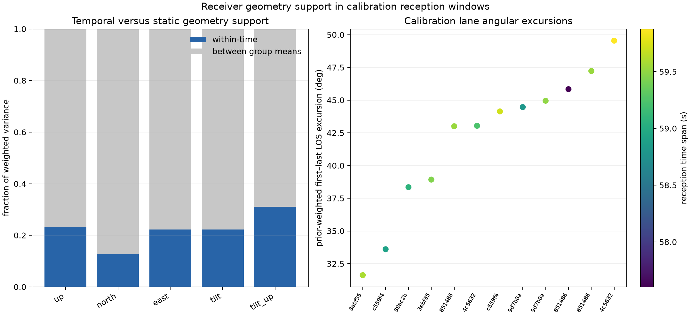

# What geometry information is available?

The calibration geometry is not static, and its differential-tilt features are not globally redundant with the receiver indicator. The previous failed transfer therefore cannot be explained simply by an absence of forecast motion. Most feature variation is nevertheless between lane/nominee/receiver groups, giving a global reception model considerable opportunity to learn group differences rather than within-sequence movement.

This is a descriptive, post-outcome audit using only the original six calibration recordings' reception windows. It fits no outcome model and changes no shortlist, prior or held score. The [protocol](PROTOCOL.md) specifies equal-record weights and the within-time/between-group decomposition.

## Feature support

There are 12 exact lanes and 1,356 paired reception windows. Each lane spans approximately 57.6–59.9 seconds. Prior-weighted first-to-last forecast LOS displacement ranges from 31.6 to 49.5 degrees. These are nominated-satellite forecast trajectories, not observed or independently identified satellite motion.

| Standardized feature | Temporal variance fraction | Between-group fraction |
|---|---:|---:|
| Up / elevation | 23.20% | 76.80% |
| North | 12.77% | 87.23% |
| East | 22.27% | 77.73% |
| Differential east tilt | 22.26% | 77.74% |
| Differential east tilt × up | 31.00% | 69.00% |

Groups are exact lane × nominee × receiver. The variance identity is total = within-time + between-group means. These percentages describe feature variation, not explained reception variance or satellite-association accuracy.

The differential tilt features' global correlations with the RX indicator are 0.0182 and 0.00183. Their signs therefore do not simply reproduce RX0 versus RX1 across this calibration population. The within-time covariance eigenvalues are approximately 0.4530, 0.2878, 0.1320, 0.0561 and 0.00380. The weakest direction is much less supported than the strongest, but there is no exact rank collapse. This is not a guarantee of statistical identification from sparse receiver observations.

## Nomination support

After grouping duplicate track hypotheses by catalogue number, **7 of 12 calibration lanes have only one satellite with conditional prior mass at least 1e-6**. Five lanes retain two or three such satellite alternatives. Consequently, a three-track mixture is not automatically a three-satellite association problem: two of the apparent multi-track alternatives collapse to a single material satellite after grouping.

This concentration limits where receiver geometry can usefully change satellite association, but does not explain every failed geometry comparison. The remaining lanes retain alternatives, and even a concentrated nominal identity can still yield a testable reception prediction. See the separate [nomination audit](NOMINATIONS.md); no priors were flattened or candidates removed.

The nominal eastward LOS-change sign is even less ambiguous: ten lanes put essentially all catalogue prior mass on positive east change, one on negative change, and only one splits its mass equally between both signs. Distinct satellite names or differing three-dimensional trajectories therefore do not necessarily provide opposing east/west hypotheses for the 20-degree receiver arrangement to distinguish. This finding concerns retained forecast support, not observed receiver arrival order.

## Physical pose

The [pose provenance audit](POSE.md) finds no hard coordinate-sign mismatch. All 14 pilot/confirmation captures use the same recorded pose revision and start after its validity boundary. The model's signed-east features match that nominal RX0-west/RX1-east convention.

The connector mapping remains provisional, geographic north is assumed, and world tilt, receiver elevations and gain patterns are unmeasured. The 20-degree separation is nominal fixture geometry. The failed tilt comparison does not establish reversed cables or a physically misaligned fixture.

## Consequence for the next model

A global geometry coefficient can mix between-record reception differences with within-record motion. A useful next controlled comparison should distinguish those effects—for example, using calibration-defined within-lane geometry and shared persistent receiver-gain nuisance terms—while retaining identical Doppler, reference and direction controls. Such a comparison must be specified before evaluation. This audit does not establish that centering or nuisance modelling will improve association.

Nomination diversity must also be counted by satellite identity, rather than treating multiple track hypotheses for the same satellite as independent directional alternatives. Keep exact training log priors in scientific inference; descriptive probability underflow in this audit is not a reason to prune or flatten them.

## Evidence

- [Frozen protocol](PROTOCOL.md), [launch receipt](launch.json), [numerical results](results.json)
- [Physical pose evidence](POSE.md)
- `audit.json`: independent decomposition, weights and digest checks

Eight component tests passed, including static/changing synthetic trajectories, exact variance decomposition, tiny/zero prior weights, and exclusion of malformed held/evaluation geometry. No new RF, raw-IQ processing or QNAP changes were made. Geometry-assisted association and travel-direction claims remain unverified.

The independent audit passed with variance-decomposition error below 5.6e-16 and all frozen source/input digests matching. The main audit completed in 0.50 seconds at peak RSS 135,036 KiB.
