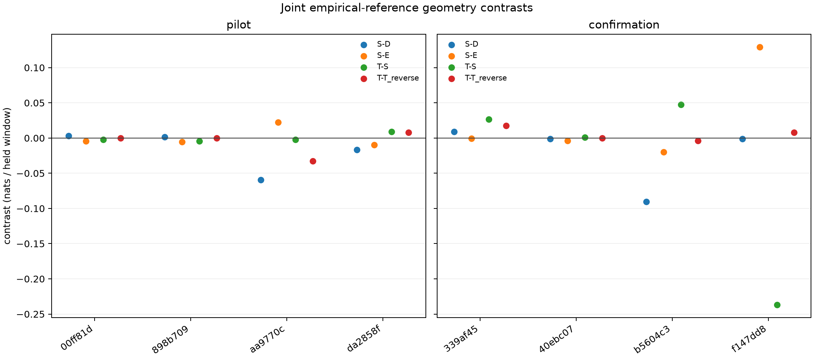

# Joint target presence and receiver geometry

**Decision: do not promote common geometry or differential tilt.** After refitting against the stronger empirical reference, S still loses to D on both evaluation panels. T loses to S and the receiver-swap control overall. The earlier geometry advantage does not reappear when the reception coefficients are refitted.

This experiment tests receiver geometry against the [joint-count observational reference](../2026_09_28_rx_empirical_background/README.md), refitting reception and target-presence parameters together. It follows the earlier finding that geometry did not beat Doppler-only when target absence was allowed with the old emission coefficients frozen.

Four nested models share the same forecasts, shortlist, feature scaling, sigma, reference distribution and presence process:

| Arm | Reception features | Question |
|---|---|---|
| D | Intercept, receiver, sample rate | Baseline with target presence |
| E | D plus elevation/up | Does general elevation explain reception? |
| S | E plus horizontal line of sight | Does common viewing geometry add information? |
| T | S plus differential 20-degree receiver tilt | Does receiver orientation add directional information? |

Each arm jointly fits reception coefficients, stationary occupancy and persistence time on six calibration recordings' reception windows. A separate exact reference-only model competes with every fit. All four fits finish before evaluation. The [protocol](PROTOCOL.md) specifies parameter priors, bounds, deterministic starts, optimization limits and controls.

Evaluation uses the four pilot and four disjoint confirmation recordings already used in research. These are exploratory reused panels. Every paired held window is scored before updating the model; reception posteriors carry into held windows. Comparisons include an unchanged-reference baseline, fixed quarter-period frequency shifts, swapped receiver geometry and reversed geometry trajectories.

## Results

All eight optimizer starts converged, and every arm selected a nonnull fit. Each arm's two starts reached effectively the same penalized objective. All four persistence times hit the predeclared 10-second upper bound; occupancy estimates range from 0.488 to 0.537. These are fitted process parameters, not measurements of physical pass duration or target duty cycle. The bound was not widened after seeing outcomes.

Scores are equal-record mean nats per paired held window. Pilot has four records/796 windows; confirmation has four records/778 windows. Combined averages the eight recording means equally.

| Comparison | Pilot | Confirmation | Combined | Positive records |
|---|---:|---:|---:|---:|
| D − reference | +0.019968 | +0.089631 | +0.054800 | 5/8 |
| E − reference | +0.001431 | +0.042448 | +0.021940 | 5/8 |
| S − reference | +0.002051 | +0.068572 | +0.035312 | 4/8 |
| T − reference | +0.002088 | +0.028133 | +0.015111 | 4/8 |
| E − D | −0.018537 | −0.047182 | −0.032860 | 4/8 |
| S − D | −0.017917 | −0.021059 | −0.019488 | 3/8 |
| S − E | +0.000620 | +0.026123 | +0.013372 | 2/8 |
| T − S | +0.000037 | −0.040439 | −0.020201 | 4/8 |
| T − swapped geometry | −0.000850 | −0.026416 | −0.013633 | 5/8 |
| T − reversed geometry | −0.006230 | +0.005443 | −0.000393 | 5/8 |
| D − shifted frequencies | +0.029852 | +0.038378 | +0.034115 | 4/8 |
| E − shifted frequencies | +0.010149 | +0.016977 | +0.013563 | 4/8 |
| S − shifted frequencies | +0.005845 | +0.045736 | +0.025791 | 4/8 |
| T − shifted frequencies | +0.022568 | +0.000834 | +0.011701 | 5/8 |

The positive S−E mean occurs in only two recordings and does not make S better than D. T's sign counts against swap/reversal are positive in five records, but its equal-record mean loses both controls; sign counts alone cannot override the predeclared score criterion. The confirmation tilt-versus-frequency-shift contrast is nearly zero.

| Recording (scan-fw suffix) | Panel | Windows | D − reference | E − reference | S − reference | T − reference |
|---|---|---:|---:|---:|---:|---:|
| 00ff81dc09fc738a | Pilot | 108 | −0.027348 | −0.019562 | −0.024099 | −0.026483 |
| 898b709fcf3dd978 | Pilot | 231 | −0.021693 | −0.014936 | −0.020461 | −0.024793 |
| aa9770c66396e928 | Pilot | 242 | +0.096757 | +0.014688 | +0.037061 | +0.035029 |
| da2858f6cd2521b7 | Pilot | 215 | +0.032157 | +0.025536 | +0.015704 | +0.024600 |
| 339af454a2aab2f4 | Confirmation | 230 | +0.062329 | +0.071997 | +0.071094 | +0.097804 |
| 40ebc07665464c7d | Confirmation | 230 | −0.022397 | −0.019589 | −0.023603 | −0.022665 |
| b5604c3d838fa7ed | Confirmation | 226 | +0.087614 | +0.016835 | −0.003010 | +0.044474 |
| f147dd8a5bc99346 | Confirmation | 92 | +0.230977 | +0.100552 | +0.229807 | −0.007083 |

The last confirmation record contributes a substantial negative T−S contrast. It remains in every aggregate. Examining such failures can guide a new predeclared model or identify missing evidence; removing them or changing the model on these held outcomes would not validate a tilt benefit.

## Calibration fits

| Arm | Relative calibration evidence | MAP penalty | Penalized gain | Occupancy | Tau, seconds |
|---|---:|---:|---:|---:|---:|
| D | 5054.602703 | 1.887787 | 5052.714916 | 0.502775 | 10 |
| E | 5100.553879 | 9.033255 | 5091.520624 | 0.536881 | 10 |
| S | 5141.018219 | 12.643001 | 5128.375218 | 0.519678 | 10 |
| T | 5354.541108 | 30.561010 | 5323.980098 | 0.487526 | 10 |

Increasing model complexity improves calibration fit but does not transfer to these panels. Better training likelihood is insufficient evidence that the 20-degree tilt is tracking travel direction.

## Interpretation limits

The reference is learned from mixed observations, not verified physical clutter. Improvements measure predictive density for candidate sets; they do not establish satellite identity, direction of travel or geolocation accuracy. Presence probabilities and nomination probabilities conditional on presence are separate model outputs. Calibration fits are local MAP optima under declared priors and bounds, not proofs of a globally best model.

The generic fitting kernel supports exact zero-time transitions. Production inputs separately require strictly increasing timestamps and unique source windows through the dataset adapter. The batched forward calculation is checked against the scalar log-domain filter, including ragged lanes and extremely small nomination priors.

## Evidence

- [Protocol](PROTOCOL.md) and [independent review](REVIEW.md)
- [Pre-execution source and input hashes](launch.json)
- `results.json`: both starts for each fit, selected parameters, per-window/posterior exports and all contrasts
- `audit.json`: independent fit-selection, denominator, reference-density and arithmetic checks

All 22 focused tests passed before execution, including normalized empirical signal likelihoods, Poisson equivalence, batched filter equivalence, optimizer selection, exact-null scoring and calibration isolation. Ruff passed. The experiment is capped at 300 seconds, one numerical thread, nice19 and 4 GiB. It reads derived JSON only and makes no RF, raw-IQ or QNAP changes.

The actual run completed in 30.63 seconds at peak RSS 159,364 KiB. The independent audit passed: frozen inputs, all optimizer/null decisions, raw joint-reference densities, exported score sums, exact panel denominators and every combined contrast reconcile.

## Next priority

Audit why geometry effects fail to transfer between recordings before adding further flexibility. The existing evidence supports inspecting calibration-versus-evaluation geometry coverage, candidate alignment, and the per-receiver observations responsible for the largest tilt losses. Keep all records and controls in the comparison. Any new geometry specification must be frozen on calibration data and tested on reserved evidence; these reused panels cannot provide a fresh promotion test. Validated direction-assisted satellite association remains open.
