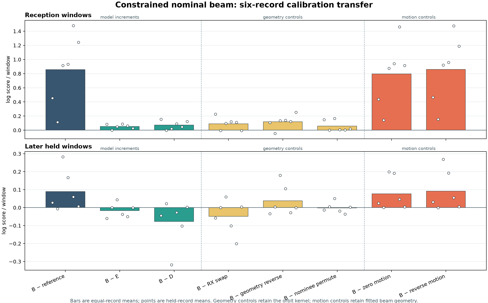

# Nominal receiver tilt: reception benefit does not transfer to later windows

The constrained ±10-degree receiver model improves prediction over a matched
co-pointed elevation model on reception windows in all six omitted recordings.
That benefit reverses in the later windows: tilt loses to elevation alone, to
the model without geometry, and to swapped receivers on average. **Do not promote
this model as evidence of reliable satellite identity or travel direction.**

This is development cross-validation on six previously explored calibration
recordings. Each fold fits only the other five recordings' reception windows.
The original four evaluation recordings and DS8 are not scored in this experiment.
No new RF collection, IQ processing or propagation was performed.

## Models and interpretation

All three models use the same causal frequency reference and short-horizon
orbital-increment signal predictor from the
[previous experiment](../2026_09_28_rx_orbit_increment/README.md).

- **D:** receiver/rate nuisance terms, without geometry.
- **E:** D plus one nonnegative coefficient on centered LOS up (co-pointed response).
- **B:** D plus one nonnegative coefficient on the nominal receiver boresight
  projection, combining up and east with opposite ±10-degree tilts.

E and B have equal parameter counts, priors, bounds and optimizer starts.
They are alternative one-feature geometry models, not nested models; B−E
measures the benefit of replacing elevation with the nominal tilted projection.
Raw up/east are centered on each lane/nominee's scheduled reception geometry.
A single scale is estimated from the five training recordings' centered up;
the same scale applies to E and B. This models within-lane response variation,
not calibrated absolute antenna gain. The software-to-physical RX mapping and
world orientation remain provisional. See the frozen [protocol](PROTOCOL.md).

## Ablations

Values are natural-log predictive score differences per window, averaged equally
over recordings after normalizing within each recording. Positive favors the
left-hand model. Counts show recordings with a strictly positive difference;
they are descriptive, not independent significance tests.

| Comparison | Reception | Positive | Later held | Positive |
|---|---:|---:|---:|---:|
| D − causal reference | +0.784121 | 6/6 | +0.167242 | 5/6 |
| E − causal reference | +0.804164 | 6/6 | +0.106914 | 5/6 |
| B − causal reference | +0.856524 | 6/6 | +0.089646 | 5/6 |
| **B − E: nominal projection vs elevation** | **+0.052360** | **6/6** | **−0.017268** | **2/6** |
| B − D: all beam geometry | +0.072403 | 5/6 | −0.077596 | 2/6 |
| B − receiver swap | +0.090581 | 4/6 | −0.049279 | 2/6 |
| B − reversed geometry | +0.118755 | 5/6 | +0.037549 | 3/6 |
| B − permuted nominee geometry | +0.057557 | 6/6 | −0.001801 | 3/6 |
| B − zero orbital motion | +0.795449 | 6/6 | +0.077427 | 5/6 |
| B − reversed orbital motion | +0.861218 | 6/6 | +0.092046 | 5/6 |

Geometry controls preserve frequency signals, reference scores, visibility and
nominee priors. Motion controls preserve the full beam feature arrays. These
invariants are checked during every fold. Controls use the fitted B parameters
without refitting. A swapped control winning does not establish that the physical
mapping is reversed; choosing it after these outcomes would require new validation.

The motion ablations support short-horizon frequency prediction. They do not
establish that the receiver geometry distinguishes competing satellites, and the
scores are neither location-error metrics nor calibrated identity confidence.

## Record-level transfer

Each row is scored by a model trained on the other five records. Both periods
are excluded from parameter/background/scaler fitting for that record.

| Omitted recording | Reception / later windows | Reception B−E | Later B−E | Later B−D | Later B−swap |
|---|---:|---:|---:|---:|---:|
| scan-fw-39ac2b14d1bb5f0f | 118 / 117 | +0.086113 | −0.060501 | −0.043832 | −0.057700 |
| scan-fw-3ebf3526172258af | 227 / 235 | +0.002136 | +0.000750 | +0.022543 | −0.000042 |
| scan-fw-4c56320fb5ca6994 | 217 / 218 | +0.049444 | +0.044038 | −0.318179 | +0.060056 |
| scan-fw-851486cc2a1acd99 | 340 / 331 | +0.089180 | −0.036762 | −0.026916 | −0.100952 |
| scan-fw-9d7b6a0db558703a | 225 / 243 | +0.061530 | −0.049893 | −0.101995 | −0.200975 |
| scan-fw-c559f436d578c9bd | 229 / 219 | +0.025757 | −0.001240 | +0.002805 | +0.003941 |

The six scored records cover 1,356 reception and 1,363 later windows. Each
window includes both receivers; counts are not doubled for RX0/RX1.

## Fitting and execution

All 36 optimizer receipts report convergence. D's two starts are deliberately
identical, so these are not 36 independent optimization basins. No exact-null
model was selected. E/B slopes remain inside [0,12], but eight of the 18 selected
models reach the 10-second persistence bound; convergence does not remove this
model limitation.

| Omitted record suffix | Training windows | Shared scale | E slope | B slope | D / E / B persistence (s) |
|---|---:|---:|---:|---:|---|
| 39ac2b14d1bb5f0f | 1238 | 0.064567 | 1.627038 | 1.824066 | 10.000 / 10.000 / 10.000 |
| 3ebf3526172258af | 1129 | 0.060157 | 1.915995 | 2.143178 | 9.897 / 10.000 / 9.725 |
| 4c56320fb5ca6994 | 1139 | 0.066013 | 1.873221 | 2.105155 | 8.154 / 9.861 / 9.353 |
| 851486cc2a1acd99 | 1016 | 0.067777 | 1.353857 | 2.042459 | 8.827 / 9.107 / 10.000 |
| 9d7b6a0db558703a | 1131 | 0.067512 | 2.214844 | 2.243235 | 8.431 / 10.000 / 9.664 |
| c559f436d578c9bd | 1127 | 0.062877 | 1.856156 | 2.192551 | 9.056 / 10.000 / 10.000 |

The first attempt failed before fitting because a full-calibration helper required
six records instead of the fold's five. Its original launch, terminal and exit
receipts are retained. The correction uses a fold-local five-record preparation
path, with a regression exercising the real record-count validator; the shared
six-record default is unchanged. `launch_corrected.py` binds the corrected
sources and both launchers, retaining the original failure without overwriting it.

All six corrected folds exit 0, taking 10.71–16.31 seconds each, with peak RSS
174,596–181,152 KiB. Each is bounded to 120 seconds, one numerical thread and
4 GiB. The focused beam/driver/orbit test suite passes all 17 tests; Ruff passes.
The [independent review](REVIEW.md) records the numerical audit and its scope.
It passed: all 36 training objectives were replayed with the shared likelihood,
penalties were recomputed independently, fold backgrounds/scalers were
reconstructed, and all 96 arm-by-period totals were checked against exported
per-window scores. This is an arithmetic and isolation audit, not a second
independent likelihood implementation.

## Decision and next priorities

Keep the orbit-increment model as a frequency-prediction baseline, and defer
deployment or confirmation of this beam model. The reception/later reversal
suggests that a response learned near the reception geometry is not transferring
across the later arc; it does not by itself identify a physical cause.

1. Test receiver-relative evidence directly on existing paired observations:
   count/mark asymmetry and partial-arc changes against predicted east/up motion,
   with frequency-independent scoring and explicit missing/ambiguous observations.
   Establish usable paired support before introducing a more complex likelihood.
2. Resolve physical receiver mapping and world tilt from available station records.
   If those records cannot establish it, retain that uncertainty explicitly;
   do not infer a definitive pose from the winning evaluation control.
3. Assess whether the candidate bank contains distinguishable partial arcs or
   crossing times before claiming direction-based identity discrimination. The
   [direction-support audit](../2026_09_28_rx_ds8_alignment/DIRECTION-PLAN.md)
   found no opposing full-order signs in the current bank.
4. Freeze a new model and controls only after these checks, then choose a genuinely
   new existing-data confirmation panel. These six calibration records and the
   already explored original evaluation/DS8 panels are development evidence.

## Reproducible artifacts

- [Protocol](PROTOCOL.md), [review](REVIEW.md), [equal-record results](results-summary.json).
- `fold-0.json` through `fold-5.json`: full per-window scores, fit receipts,
  training membership, background/scalers, and diagnostic hashes.
- `corrected-fold-N-launch.json`, terminal, resource and exit-code receipts.
- [Summary generator](summarize_results.py), [plot generator](plot_results.py),
  [vector figure](nominal_beam_cv.svg).
- `evidence-sha256.json`: final source and artifact integrity index. The original
  failed launch intentionally records superseded source hashes.
