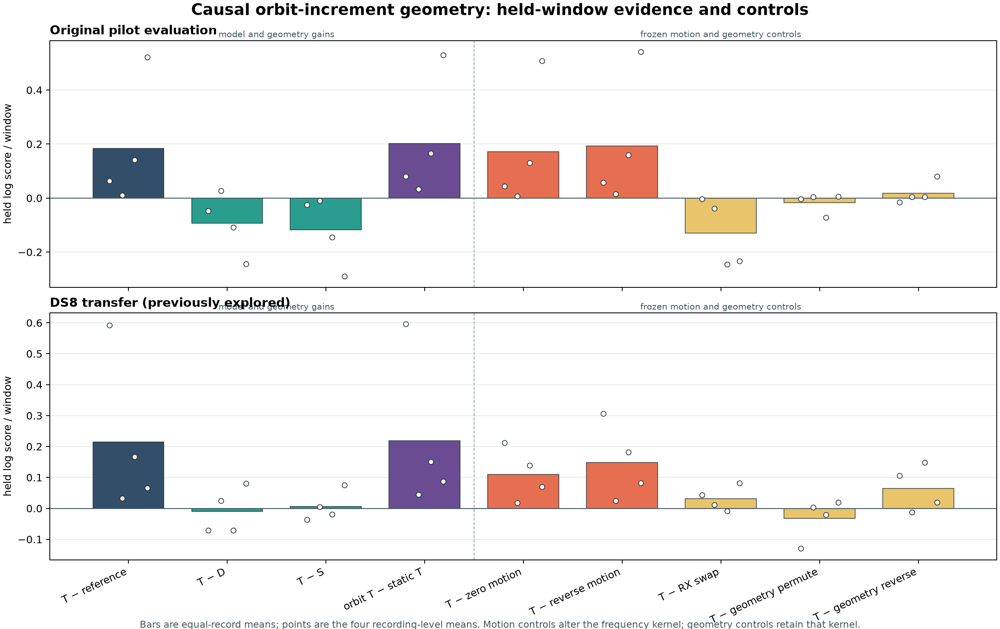

# Short-horizon orbital prediction improves; receiver tilt remains unproven

The new causal orbit-increment model improves later predictive density on both
explored evaluation panels. Its T arm beats the causal reference, zero-motion
control and reversed-motion control on **all eight recordings**. This is useful
short-horizon frequency-prediction evidence.

It does **not** establish a receiver-tilt association improvement. T loses to
shared geometry S on all four original evaluation recordings and gains only
inconsistently on DS8. Permuting candidate-specific geometry improves the mean
score on both panels. Keep the frequency mechanism as a development baseline;
do not promote the learned tilt coefficients or claim satellite identity,
travel-direction confidence or sub-km location accuracy.

## What changed

For each receiver, the target predictor advances the last nonempty observed
frequency set by each nominee's predicted Doppler change. History must precede
the scored window and be no more than ten seconds old. The wrapped Gaussian
mixture uses the frozen 500 Hz measurement scale, horizon-dependent uncertainty
and a 20% uniform component. With no recent history it falls back to the frozen
absolute forecast. Current observations enter history only after scoring.

The causal frequency reference, count model, candidate sets, nominee priors,
geometry features and optimizer settings remain fixed. One new D/E/S/T family
was fitted on the original six calibration recordings' 1,356 reception windows.
All eight starts converged. Held windows and evaluation recordings were excluded
from fitting. Both evaluation panels were already explored; these are development
transfer results, not a new blind confirmation.

The comparison to the previous static-forecast family changes recent anchoring,
target birth mixture and target width together. The zero/reversed-increment
controls isolate the contribution of orbital motion under the new mechanism.
Absolute fitted CFO cancels from recent frequency increments; improvement does
not mean that the original long-horizon CFO forecast has been repaired.

## Primary later-period ablations

Numbers are equal-record mean log-score differences in **nats per window**.
Parentheses count positive recordings out of four. D contains detector/receiver/
rate terms; E adds elevation; S adds shared spatial geometry; T adds the existing
receiver-specific tilt interactions. Positive means the left-hand model predicts
the observations better under the stated likelihood.

| Comparison | Original evaluation: 4 records, 796 windows | DS8: 4 records, 853 windows |
|---|---:|---:|
| Orbit D − causal reference | +0.277571 (3/4) | +0.223763 (3/4) |
| Orbit E − causal reference | +0.294949 (4/4) | +0.259550 (4/4) |
| Orbit S − causal reference | +0.301242 (4/4) | +0.208139 (3/4) |
| Orbit T − causal reference | **+0.184294 (4/4)** | **+0.214494 (4/4)** |
| Orbit T − previous static T | +0.202054 (4/4) | +0.219270 (4/4) |
| Orbit T − zero-motion T | **+0.172402 (4/4)** | **+0.109660 (4/4)** |
| Orbit T − reversed-motion T | **+0.193445 (4/4)** | **+0.148429 (4/4)** |
| Orbit T − quarter-period-shifted T | +0.209575 (4/4) | +0.235806 (4/4) |
| S − D: shared geometry | +0.023671 (3/4) | −0.015623 (2/4) |
| T − D | −0.093277 (1/4) | −0.009269 (2/4) |
| T − S: incremental tilt | **−0.116949 (0/4)** | **+0.006355 (2/4)** |
| T − receiver-swap control | −0.129924 (0/4) | +0.031818 (3/4) |
| T − geometry-reversal control | +0.018192 (3/4) | +0.065085 (3/4) |
| T − candidate-geometry permutation | **−0.016492 (2/4)** | **−0.032229 (2/4)** |

The original evaluation panel has seven exact RF lanes; DS8 has eight. Every lane
contains paired receiver observations. No recording was replaced or excluded.
S−D is derived from the exported per-record S and D scores; all other listed
contrasts are exported directly. Neither panel is used to choose a new winning
family or flip the physical receiver mapping after seeing the control results.

## Per-record later results

| Recording suffix | Panel | Windows | T − reference | T − S | T − zero motion |
|---|---|---:|---:|---:|---:|
| 00ff81dc09fc738a | Original | 108 | +0.063386 | −0.024197 | +0.043629 |
| 898b709fcf3dd978 | Original | 231 | +0.010079 | −0.009343 | +0.007154 |
| aa9770c66396e928 | Original | 242 | +0.141808 | −0.145014 | +0.130589 |
| da2858f6cd2521b7 | Original | 215 | +0.521901 | −0.289241 | +0.508236 |
| 226485b45dd0d0cf | DS8 | 221 | +0.591893 | −0.035938 | +0.211504 |
| 9c5f3143152db63d | DS8 | 202 | +0.033124 | +0.004983 | +0.018271 |
| aadcd44b66085469 | DS8 | 222 | +0.166706 | −0.019157 | +0.138810 |
| ac05824a99b22ffd | DS8 | 208 | +0.066253 | +0.075530 | +0.070054 |

For context, earlier reception-period T−reference means are +0.885835 on the
original evaluation panel and +1.098607 on DS8, each positive on four recordings.
Those earlier scores do not replace the later endpoint above.

## What this does and does not support

Recent observation anchoring makes the existing orbital change useful for local
prediction despite poor absolute long-horizon alignment. History is not verified
same-satellite evidence: it can include clutter, aliases and other emitters.
Nominees with similar Doppler increments can make similar predictions. The
single-present-state and retained-shortlist assumptions also remain in place.

The descriptive `history-summary.json` quantifies this limitation in later
windows. Recent history is available in 1,364/1,592 receiver-windows in the
original evaluation panel and 1,522/1,706 in DS8. Median recent horizons are
0.541 and 0.682 seconds. Median prior-weighted circular RMS separation of nominee
increments, divided by the target standard deviation, is only 3.52e-7 and
2.03e-4 respectively. These pooled receiver-window summaries include empty
current windows and are not evaluation weights. Concentrated priors and similar
increments both reduce this measure: the predictive gain does not show that the
model can distinguish plausible satellite identities.

The geometry-only controls leave the entire target-frequency signal and causal
reference unchanged, so their contrasts isolate the reception features within
this model. The inconsistent tilt and negative mean permutation contrast fail
the candidate-specific geometry gate. Better local frequency prediction must not
be relabeled as better satellite identity or receiver-order confidence.

Next, constrain the reception response to a shared nominal beam shape instead of
the flexible tilt interactions, and check it with calibration-only leave-record-
out evaluation before choosing any fresh transfer panel. Retain the short-horizon
frequency controls and investigate cross-receiver duplicate track hypotheses.
The provisional hardware/software mapping and unmeasured beam response remain
important limits; a receiver-swap win on one panel does not resolve them.

## Validation and reproduction

- [Frozen protocol](PROTOCOL.md) and [independent review](REVIEW.md).
- `tools/rx_orbit_increment.py`: causal target kernel and detailed history receipts.
- `tools/rx_orbit_increment_eval.py`: calibration-only fit and frozen transfer score.
- `model.json`, `pilot.json`, `ds8.json`: all fits, observations' scores, controls,
  per-record aggregates and causal histories.
- `launch.py` and per-stage receipts bind sources, tests, protocol and inputs.
- `audit-results.json` replays all eight optimizer objectives, verifies membership,
  per-window totals and aggregate contrasts, checks history causality and samples
  100 density-normalization cases per panel. The DS8 static family exactly replays
  the preceding sealed result.
- `plot_results.py`, PNG and SVG figures; `evidence-sha256.json` indexes final evidence.

All 22 focused tests and Ruff passed. Fit took 30.72 seconds; original evaluation
16.13 seconds; DS8 26.72 seconds, all exiting zero within the frozen 180-second
limit. No RF collection, IQ reprocessing, new orbit propagation or QNAP mutation.
