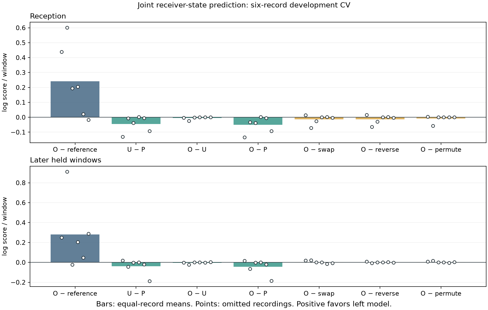

# Four-state receiver model: signed geometry fails the development gate

The new frequency-free receiver-state model is implemented, tested and evaluated
on all six leave-one-record-out calibration folds. Adding signed nominal receiver
geometry does **not** improve the later predictive score over unsigned geometry:
O−U is −0.003632 nats/window on the equal-record mean. The simpler receiver/rate/
time model P performs better than either geometry model on average. Do not promote
this model or spend a new confirmation panel on it.

This result concerns prediction of thresholded receiver detections. It neither
proves that physical receiver geometry is uninformative nor validates satellite
identity, arrival order, geographic direction or sub-kilometer location accuracy.
The broader receiver-geometry association objective remains open.

## What was tested

The outcome has four categories: neither receiver detects a candidate, RX0 only,
RX1 only, or both. Candidate frequencies, margins and ranks do not enter this
model. Duplicate entries in a nonempty receiver candidate array cannot change the
outcome. All 1,356 reception and 1,363 later windows in the original six calibration
recordings remain included; empty windows are observations, not exclusions.

Each fold physically removes the omitted record and every later window before
training. It fits on the other five reception sets, then scores both periods of
the omitted record sequentially. Original evaluation and DS8 panels are untouched.
These calibration records have been used for earlier development: this is not
blind confirmation.

P models common reception and RX imbalance using intercept, log sample rate and
elapsed time, plus a shared paired-reception coupling. U adds centered up and
squared nominal boresight contrast to common reception. O adds signed contrast to
RX imbalance with a nonnegative slope. U nests P; O nests U at zero odd slope.
The four categories are normalized jointly, allowing dependence between receivers.

An explicit reset HMM retains absent, all original track/catalog hypotheses and
the omitted-catalog state. Absent, omitted and invisible states emit a smoothed
training-only four-category background. Original nominee prior mass is preserved;
the omitted branch is not renormalized away. The state called “present” is a
statistical mixture state, not independently verified satellite presence.

See the frozen [protocol](PROTOCOL.md) for coefficients, priors, scales, bounds,
controls, selection rule and causal scoring. Per-lane reception forecast means
are carried into later windows; no later observation fits those offsets.

## Ablation table

Each value is a natural-log predictive score difference per window, normalized
within the omitted recording and then averaged equally across six recordings.
Positive favors the left model. Signs are descriptive recording counts.

| Comparison | Reception | Strictly positive | Later | Strictly positive |
|---|---:|---:|---:|---:|
| P − training background | +0.290511 | 6/6 | +0.322856 | 5/6 |
| U − training background | +0.245617 | 5/6 | +0.283882 | 5/6 |
| O − training background | +0.240793 | 5/6 | +0.280251 | 5/6 |
| U − P: unsigned geometry | −0.044894 | 1/6 | −0.038973 | 2/6 |
| **O − U: signed geometry** | **−0.004824** | **2/6** | **−0.003632** | **3/6*** |
| O − P: all geometry | −0.049718 | 1/6 | −0.042605 | 2/6 |
| O − receiver-sign swap | −0.013813 | 2/6 | +0.003364 | 2/6 |
| O − signed-trajectory reversal | −0.012898 | 2/6 | +0.000741 | 3/6 |
| O − signed-candidate permutation | −0.009054 | 3/6 | +0.004274 | 4/6 |

*One later O−U positive difference is only +4.59e−9, with the odd slope exactly
zero. It is a numerical near-tie from independently optimized nuisance parameters,
not a third meaningful direction win. That fold's signed-control differences are
exactly zero. Counts do not imply statistical significance.

The small positive mean control differences in later windows do not rescue the
failed O−U endpoint. The signed feature must add value over its nested comparator,
not merely beat selected corrupted versions of itself. The positive O−background
score largely reflects response/state modeling already captured better by P.

Controls change only the signed feature, preserving unsigned geometry, times,
observations, prior weights, visibility and background. They are signed-feature
ablations, not full physically consistent replacements of satellite trajectories.

## Record-level later scores and fits

| Omitted recording | Later windows | O−U | O−P | O−swap | Fitted odd slope |
|---|---:|---:|---:|---:|---:|
| scan-fw-39ac2b14d1bb5f0f | 117 | −0.002347 | +0.017623 | +0.019556 | 0.200061 |
| scan-fw-3ebf3526172258af | 235 | −0.021823 | −0.065136 | +0.021040 | 0.674019 |
| scan-fw-4c56320fb5ca6994 | 218 | +0.000193 | −0.002513 | −0.000038 | 0.451543 |
| scan-fw-851486cc2a1acd99 | 331 | +4.59e−9 | +0.000038 | 0 | 0 |
| scan-fw-9d7b6a0db558703a | 243 | −0.001347 | −0.020943 | −0.014335 | 0.383668 |
| scan-fw-c559f436d578c9bd | 219 | +0.003534 | −0.184700 | −0.006037 | 0.328180 |

All 36 optimizer starts converged. P's two starts are identical; they are not
independent optimization basins. No exact background-only null was selected.
Every selected P/U/O persistence reaches the 10-second upper bound (18/18).
This is a limitation of the current model and fitting domain, not evidence of a
measured ten-second satellite lifetime. Odd slopes are below their upper bound,
with one at zero. Full parameters and both start receipts are retained per fold.

The unsigned geometry coefficients and nuisance parameters can extrapolate from
reception to later arcs, and the background is pooled rather than lane-specific.
Thus this negative result is specific to the stated response model, nominal pose,
candidate bank and fitting regime. It does not distinguish pose error, response
miscalibration, clutter dynamics or inadequate candidate specificity as the cause.

## Execution and numerical verification

Each fold completed with exit 0 in 7.31–11.43 seconds, below its 120-second limit.
Peak RSS was 133,356–134,804 KiB, below 4 GiB; numerical threads were limited to one.
No new RF, IQ reprocessing, propagation or QNAP mutation was performed.

Nine focused tests pass and Ruff passes. Tests cover normalized four-state
emissions, exact nesting, signed swap, score-before-update, explicit omitted mass,
exact null behavior, training isolation, frequency/margin independence, duplicate
candidate invariance, reception centering and control preservation.

The fitting objective uses a batched probability-domain reset recurrence for
speed. The [audit](audit-results.json) replays all 36 training objectives through
the existing scalar log-domain HMM, independently recomputes MAP penalties and
selection, and replays 16,314 window scores (2,719 windows × six arms/controls).
It checks normalized state posteriors, exact training membership, smoothed
background counts, frozen source/input hashes and all role totals/denominators.
The audit passes. It shares emission and preprocessing code with the model;
it is an independent recurrence/arithmetic check, not an independent scientific
implementation or an external reviewer endorsement.

Delegated agents stopped at their usage limit during implementation. The root
agent completed the driver, tests, optimization acceleration, runs and audit
locally. No independent-agent review is claimed for this experiment.

## Next decision

Do not combine this response model with the frequency predictor as if a direction
benefit had been established. Retain the no-geometry P response as a diagnostic
baseline. First examine why the response state consistently prefers persistence
beyond the fitted bound and whether training-only receiver/lane calibration can
absorb stable sensitivity differences without mistaking them for orbital geometry.
Any changed persistence regime or calibration model is a new declared development
experiment, not a replacement of these results.

The eventual association bridge remains required: geometry must improve predictive
support for the correct candidate trajectory, with a frequency-only baseline and
candidate-permutation control. [NEXT-GATE.md](NEXT-GATE.md) specifies the necessary
separation to avoid counting detection evidence twice. A response gain alone
would not satisfy the satellite-association objective.

## Artifacts

- [Protocol](PROTOCOL.md), [machine-readable summary](results-summary.json),
  [vector figure](paired_state_cv.svg), [audit](audit-results.json).
- `fold-0.json` through `fold-5.json`: fit receipts, training IDs, scales,
  backgrounds, per-window scores and posterior probabilities.
- Per-fold launch hashes, terminal logs, resource limits and exit receipts.
- [Summary generator](summarize_results.py), [plot generator](plot_results.py),
  [scalar replay audit](audit_results.py).
- `evidence-sha256.json`: final artifact and source integrity index.
