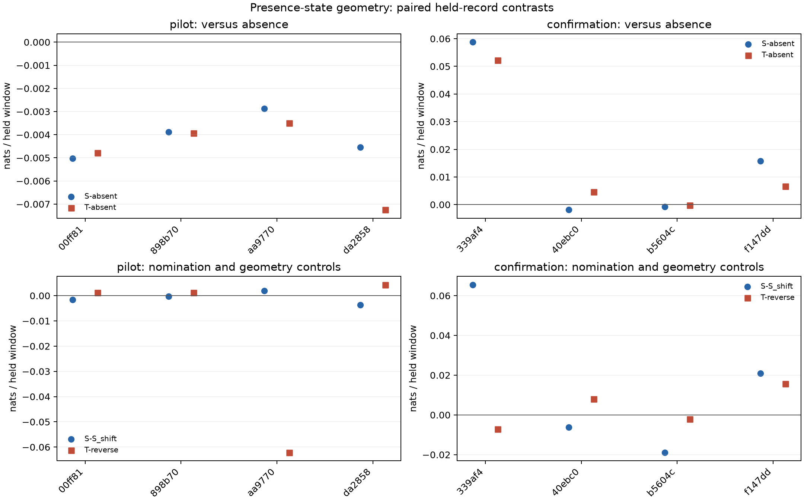

# Receiver geometry with explicit target absence

**Decision: do not promote receiver geometry or the 20-degree tilt model.** Once explicit target absence and state changes are allowed, the Doppler-only arm outperforms both geometry arms. The original geometry-versus-Doppler improvement was sensitive to the assumption that one nominated target persists throughout the observation block.

This experiment separates whether a nominated target is present from which nominated satellite it could be. The previous static geometry model improved on Doppler-only scoring, but did not reliably beat its own target-free reference. A concentrated satellite shortlist must not force the model to claim target presence.

The frozen [protocol](PROTOCOL.md) adds an absent state and permits state changes over actual timestamp gaps. D uses receiver/sample-rate terms; S adds common line-of-sight geometry; T adds differential receiver-tilt terms representing the 20-degree separation. Emissions, Doppler predictions, noise parameters, candidate priors and scaling remain frozen. Only occupancy and persistence time are selected, separately for each arm, from the same ten-point grid using six calibration recordings' reception windows.

Evaluation uses four pilot and four disjoint confirmation recordings, all reused exploratory evidence. Each held window is scored before updating the filter. Controls swap receiver geometry, reverse the geometry trajectory, or shift nominated frequencies by a fixed quarter alias period. Empty receiver observations are retained.

## Results

All three arms selected occupancy 0.5 and persistence time 10 seconds using 1,356 calibration reception windows. These are the upper edges of the frozen grid; no expansion or held-data tuning was performed. They are model parameters, not measured target duty cycle or pass duration.

Scores below are equal-record means in nats per unique paired held window; positive means better predictive density. Pilot and confirmation each contain four records, with 796 and 778 held windows respectively. The combined column weights all eight recordings equally.

| Comparison | Pilot | Confirmation | Combined |
|---|---:|---:|---:|
| D − absent reference | +0.027823 | +0.119037 | +0.073430 |
| S − absent reference | −0.004082 | +0.017973 | +0.006946 |
| T − absent reference | −0.004867 | +0.015793 | +0.005463 |
| S − D | −0.031904 | −0.101063 | −0.066484 |
| T − S | −0.000785 | −0.002180 | −0.001483 |
| T − receiver-axis swap | +0.000199 | +0.003694 | +0.001947 |
| T − reversed geometry | −0.013872 | +0.003639 | −0.005117 |
| D − shifted nominations | +0.022366 | +0.070911 | +0.046639 |
| S − shifted nominations | −0.000940 | +0.015356 | +0.007208 |
| T − shifted nominations | +0.000636 | +0.016420 | +0.008528 |

D beats the absent reference in 5/8 recordings; S in 2/8 and T in 3/8. S loses to absence in every pilot recording. T improves on receiver-axis swap but loses to reversed geometry overall and to S in both panels. None of these results establishes satellite identity, travel direction, or location accuracy.

| Recording (scan-fw suffix) | Panel | Held windows | D − absent | S − absent | T − absent |
|---|---|---:|---:|---:|---:|
| 00ff81dc09fc738a | Pilot | 108 | −0.026570 | −0.005031 | −0.004783 |
| 898b709fcf3dd978 | Pilot | 231 | −0.020545 | −0.003891 | −0.003929 |
| aa9770c66396e928 | Pilot | 242 | +0.122352 | −0.002866 | −0.003505 |
| da2858f6cd2521b7 | Pilot | 215 | +0.036054 | −0.004539 | −0.007250 |
| 339af454a2aab2f4 | Confirmation | 230 | +0.094264 | +0.058771 | +0.052215 |
| 40ebc07665464c7d | Confirmation | 230 | −0.007100 | −0.001917 | +0.004582 |
| b5604c3d838fa7ed | Confirmation | 226 | +0.090961 | −0.000714 | −0.000294 |
| f147dd8a5bc99346 | Confirmation | 92 | +0.298022 | +0.015753 | +0.006670 |

This isolates a change in state assumptions around the old fitted emissions. It does not compare newly optimized full D/S/T models. Geometry coefficients previously fitted without an explicit presence process may suppress emissions too strongly under the new process. That is a reason to test a properly calibrated joint model later, not to dismiss the present negative ablation.

## Background limitation

The [background audit](BACKGROUND.md) found no calibration windows where every nominated satellite was predicted invisible. There is therefore no verified negative population. The mixed observations have excess empty receiver views and count overdispersion relative to a constant-rate Poisson model. The absent state uses the old assumed reference density; its posterior is a model probability, not verified physical absence. Any improvement must survive a better observational reference before promotion.

## Evidence

- [Protocol](PROTOCOL.md) and [independent review](REVIEW.md)
- [Background diagnostics](BACKGROUND.md)
- `launch.json`: source, input and protocol hashes frozen before execution
- `results.json`: full calibration grid, per-record scores, per-window presence and conditional identity posteriors
- `audit.json`: independent arithmetic, denominator and receipt checks

No raw IQ, new RF collection or QNAP writes are required.

## Validation and next step

The run completed in 11.41 seconds, one numerical thread, peak RSS 147,940 KiB, below the 300-second/4-GiB limits. All 29 focused tests passed. Component tests cover log-domain transitions, brute-force likelihood agreement, exact absence, tiny-prior recovery, candidate permutation, saved scaling, malformed input rejection and calibration isolation. Source/input hashes were frozen before the run. The independent audit passed, reconstructing absent scores from raw counts, summing exported held scores and checking all denominators, controls and combined means. Ruff checks passed.

The next priority is a calibration-only empirical observational reference that accommodates empty views, count dispersion and receiver/lane variation. Check it by holding out entire calibration recordings before fitting a joint presence/geometry model. Preserve separate target-presence and conditional-identity outputs, retain direction controls, and reserve independent recordings before any scientific promotion. Existing paired observations remain suitable for development; the original goal of validated geometry-assisted association and sub-kilometre positioning remains open.
