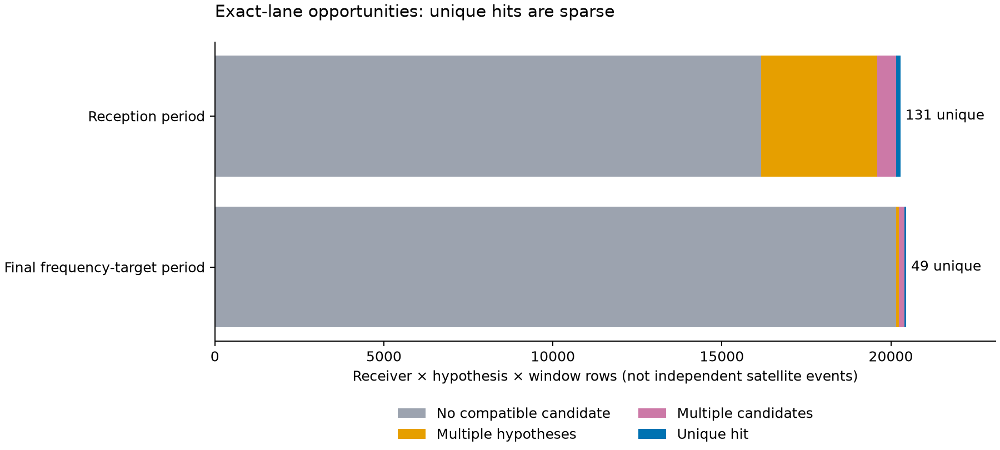

# Receiver detection-order feasibility

This pilot tests whether recorded receiver detections can be connected conservatively to the frozen training-only satellite forecasts. It uses ten reused roof recordings, 30 frozen tracks and three satellite hypotheses per track. It is not a full DS7 evaluation or a localization result.

**The mapping succeeded, but usable order evidence is sparse: one reception-period sequence has an uncensored recorded lag, and none does in the final frequency-target period. This does not demonstrate a satellite-confidence or accuracy improvement.**

## Completed results

| Training-only mapping | Result |
|---|---:|
| Frozen tracks reproduced | 30 / 30 |
| Exact graph observations and raw candidate links | 903 |
| Qualified receiver calibration lanes | 40 / 40 |
| Accepted training-window calibration votes | 5,458 |
| Selected tracks with qualified receiver transfer | 30 / 30 |

The independent coordinate check reproduced every normalized dealiased frequency within 1e-6 Hz. Every mapped point and calibration vote belongs to a frozen training window.

| Receiver × hypothesis × window status | Reception period | Final frequency-target period |
|---|---:|---:|
| Different channel/edge lane: excluded | 59,460 | 59,346 |
| No compatible raw candidate | 16,167 | 20,153 |
| Raw candidate fits multiple hypotheses | 3,433 | 93 |
| Multiple raw candidates fit one hypothesis | 549 | 153 |
| Unique candidate-consistent hit | 131 | 49 |
| **Total accounted rows** | **79,740** | **79,794** |

These are hypothesis-level rows, not independent satellite events. The 180 unique hits correspond to 180 distinct raw receiver observations. All 118,806 exclusions are exact-lane mismatches; no missing receiver or failed calibration was converted to a non-detection.

| Sequence endpoint | Reception period | Final frequency-target period |
|---|---:|---:|
| Frozen hypothesis sequences | 90 | 90 |
| A unique hit observed on both receivers | 12 | 5 |
| Same-window first-hit ties | 1 | 1 |
| Uncensored, non-tied recorded lag | **1** | **0** |

Across 360 receiver endpoints, 298 have no unique hit, 38 have earlier ambiguity, and 24 have an observed first unique hit without earlier ambiguity. The protocol labels no-unique-hit endpoints right-censored; this does not establish absence of the satellite. Earlier ambiguous detections remain in the evidence.

The sole uncensored pair is in calibration recording `scan-fw-3ebf3526172258af`, reception period, candidate catalogue number **69338**: **RX0 then RX1, 9.3431466 seconds apart**. Its frozen conditional top-three weight was already 1.0 to displayed precision. This is one sampled proxy lag in a reused calibration recording; it supplies neither a new confidence gain nor an evaluation-record confirmation. No east/west direction agreement is scored here.

## What is fixed before future matching

The first 60% of each recording supplies track reconstruction, satellite selection, CFO fitting, alias provenance and receiver calibration. The next 20% and final 20% supply separate reception and frequency-target sequences. All source windows follow the previously audited grouped partitions.

The public graph join reproduces the bank's observation identities while preserving distinct raw candidate IDs. Native CFO, alias index and RF scaling must reconstruct the normalized track frequency. Receiver transfer is calibrated only within the exact recording/channel/edge/RF lane. A lane needs at least ten training-window votes and native-frequency MAD no greater than 2.5 kHz.

Future matching uses a fixed 2.5 kHz canonical-frequency gate modulo the known alias spacing. It leaves the integer alias unresolved. The forecast already contains the fitted CFO. Every compatible raw candidate is retained; multiple raw candidates or multiple compatible frozen hypotheses produce ambiguity. No satellite is reranked and no confidence weight is updated.

The reported endpoint is the first recorded candidate-consistent hit. First-window hits, missing evidence and earlier ambiguity are censored; simultaneous first hits are tied. Even a usable lag would describe these sampled proxy detections, not a measured physical beam-entry time.

## Interpretation and next experiment

The nominal receiver tilt does not itself establish direction. Direction evidence requires a stable link between each receiver's observations and the same moving satellite, plus an adequate reception model. Training epoch-compatible receiver pairs are proxies, not decoded same-target identity.

Frequency residuals selected by the matching gate cannot serve as independent held-frequency validation. A subsequent model must freeze its reception likelihood and use an ungated frequency endpoint, with Doppler-only, static geometry, receiver-swap and trajectory-reversal comparisons. Shared model coefficients must respect the existing six-record calibration/four-record evaluation assignment. These reused recordings remain exploratory evidence.

| Priority | Next step | Decision it supports |
|---|---|---|
| 1 | Inspect the one retained lag and the discarded ambiguous sequences against recorded support times and detector scores | Establish whether a continuous pass can be tracked across receivers |
| 2 | Specify a joint sequence likelihood that retains alternative detections and an explicit clutter/missed-detection component | Test whether probabilistic sequences contain information lost by strict unique-hit gating |
| 3 | Freeze Doppler-only, static geometry and tilt-aware sequence models with receiver-swap/reversal controls and an ungated future-frequency score | Measure added predictive information without scoring gated matches |
| 4 | Expand to a fresh or reserved DS7 panel only after that scoring contract and feasibility gate pass | Obtain an independent confirmation before claiming a localization benefit |

The current bottleneck is usable same-target sequence evidence, not availability of a receiver-offset calibration. The single retained lag does not justify relaxing ambiguity gates after seeing these results.

## Evidence and reproduction

- [Protocol](PROTOCOL.md), [independent design review](SEQUENCE-DESIGN-AUDIT.md).
- [Mapping provenance correction](MAPPING-LAUNCH-AMENDMENT.md), preserved [failed launch](mapping-launch.json) and [traceback](mapping-terminal.log).
- [Bounded launcher](launch_stage.py), [independent audit](audit_results.py), [test receipt](validation.json).
- [Training mapper](../../tools/rx_training_alias_mapping.py), [receiver sequence matcher](../../tools/rx_receiver_order_sequences.py).
- [Mapping tests](../../tests/research/test_rx_training_alias_mapping.py), [sequence tests](../../tests/research/test_rx_receiver_order_sequences.py).
- [Frozen mapping](alias-mapping.json), [corrected mapping launch](mapping-corrected-launch.json), [mapping resources](mapping-corrected-resources.txt).
- [Sequence summary](sequences.json), [full matched opportunity rows](matched-opportunities.jsonl), [sequence launch](sequences-launch.json), [sequence resources](sequences-resources.txt).
- [Independent numerical audit](audit.json), [evidence hashes](evidence-sha256.json).

The corrected mapping completed in **74.38 seconds**, peak RSS **605,260 KiB**. Sequence matching completed in **3.30 seconds**, peak RSS **1,404,568 KiB**. Both exited 0. The installed-API test suite passed **26 tests**, and Ruff passed for both new tools and their tests. The independent audit accounts for all 159,534 receiver-hypothesis-window rows and verifies unique raw-hit ownership.

Each real stage has one numerical thread, nice 19, a 4 GiB address-space limit and a 300-second timeout. No new RF collection, raw IQ processing or QNAP mutation is involved. The first mapping invocation failed after 10.51 seconds on candidate-versus-observation identity; the corrected invocation has its own frozen receipt. No future matches were used to choose that interface correction.
