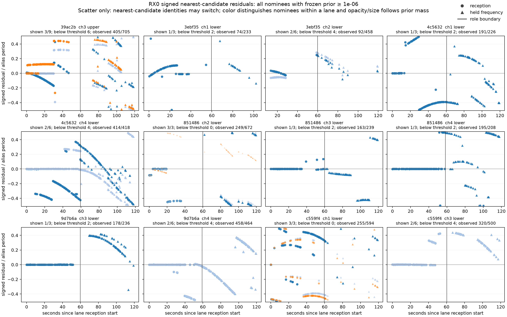
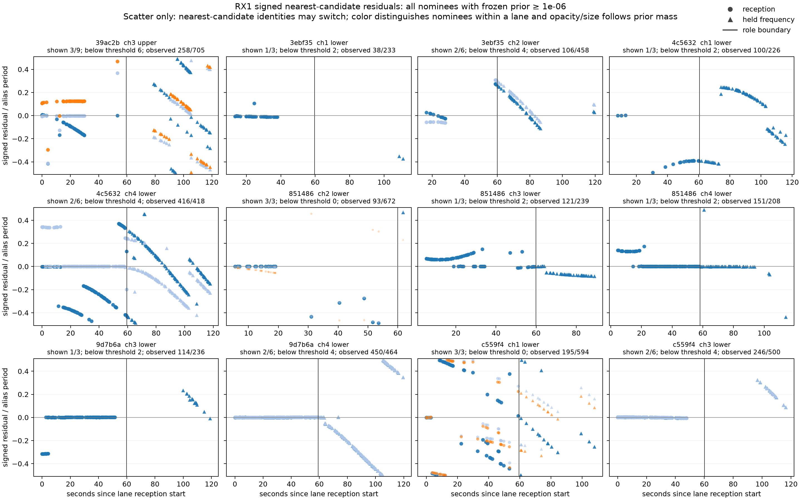

# Frozen frequency residual trajectories

This follow-up tests the structure of the frequency-support loss reported in the
[temporal alignment diagnostic](../2026_09_28_rx_temporal_alignment/README.md).
It retains every saved satellite nominee and inspects signed nearest-candidate
residuals for each receiver across both temporal roles. No forecast, alias mapping,
receiver bias, nomination prior or model coefficient is refitted.

**The loss is heterogeneous and sometimes differs sharply between receivers.**
There is no single boundary behavior that justifies a universal CFO correction.
Some lanes already have large residuals during reception, others lose candidates,
and some retain aligned candidates on one receiver after the other departs.

## Results and implications for geometry

The export covers all 2,719 calibration windows in 12 lanes, 54 retained nominees,
and 108 nominee/receiver series. Both receivers have substantial missing support
at the exact role boundary: observations exist on both sides in only 5/12 RX0
lanes and 3/12 RX1 lanes. Do not fill these gaps with inferred continuity.

The following two cases were selected after inspecting the results to illustrate
different behaviors. They are not additional independent validation, and their
catalog numbers label saved hypotheses rather than verified satellites.

**Receiver-specific loss: `851486cc2a1acd99`, channel 4 lower, nominee 66463.**
This nominee already has essentially all of the lane's frozen prior mass. Across
the 1.222-second last-reception/first-held gap:

| Quantity | RX0 | RX1 |
|---|---:|---:|
| Last reception residual | +467 Hz | +176 Hz |
| First held residual | +109,990 Hz | −81 Hz |
| Nearest observed circular frequency change | +105,374 Hz | −4,406 Hz |
| Saved forecast circular frequency change | −4,149 Hz | −4,149 Hz |
| Later windows within 500 Hz | 3/95 (3.16%) | 45/95 (47.37%) |
| Later windows with any candidate | 82/95 | 49/95 |

RX1's later conditional median absolute residual is only 81 Hz, compared with
98,505 Hz on RX0. A shared forecast-frequency error does not describe this
receiver contrast. It remains possible that receivers select different physical
signals; the nearest-candidate diagnostic does not resolve their identities.

**Staggered departure: `9d7b6a0db558703a`, channel 4 lower.** For the highest-prior
saved component (nominee 66532, track
`sha256:8a29a4f6662a7428c5df69b66e5b4e634aaddea30fcee878ae01843b850e139e`;
about half the frozen lane prior), selected snapshots
show RX0 departing from the old forecast while RX1 still aligns:

| Seconds since lane reception start | RX0 signed residual | RX1 signed residual |
|---|---:|---:|
| 55.23 | −445 Hz | +428 Hz |
| 59.92 | −5,351 Hz | +483 Hz |
| 64.39 | −11,871 Hz | −12,031 Hz |

This lane contains a second track component for the same catalog number with
another CFO fit and about half the prior. The table refers only to the identified
track/catalog pair; both components remain in the export and plots.

Later both receivers have similar large residuals at some times. This is consistent
with observing different candidate-frequency sequences during a transition, but
does not establish a handoff or identify the direction of satellite travel. No
onset time or physical lag has been fitted from these illustrative snapshots.

Plots show nominees with frozen prior mass at least 1e-6, with omitted counts
printed per lane. Every nominee remains in the numerical export. Points are not
connected; color denotes a nominee within its lane. Vertical markers identify the
role boundary, not an inferred physical event. The displayed observed/possible
counts count nominee/window pairs, so they repeat a window across shown nominees.

## What the residuals mean

Each residual is observed frequency minus saved forecast frequency, wrapped into
the lane's half-open alias interval. A nearest candidate is chosen independently
within each window, with ties resolved by saved candidate order. Missing receiver
observations remain missing. This is not a recovered physical track: the nearest
candidate can change between windows, and candidate IDs themselves are bound to
individual windows rather than persistent transmitters.

Every retained nominee is exported, including negligible prior mass. Role summaries
include observed-window fractions, visible alignment fractions within 500 and
1500 Hz, and residual medians conditional on observations. Empty and invisible
windows count as zero for alignment. Median signed residuals are descriptions on
the chosen circular branch, not fitted corrections. Adjacent circular frequency
increments preserve gaps and do not establish a Doppler slope.

## Coordinate provenance

The [provenance review](PROVENANCE.md) found no explicit role-dependent transform.
Reception and held observations use the same fixed lane scale, alias period,
training-only receiver bias and fractional-margin gate. Both roles' forecasts use
one common midpoint-time vector and the same training-profiled constant CFO.

Candidate support centers differ slightly from the saved forecast midpoint. The
provenance join measured offsets of approximately -0.516 to +0.524 milliseconds,
with similar distributions in both roles. This diagnostic preserves the original
midpoint forecasts; it does not repropagate at each candidate's support center.
The small timing difference remains a limitation, not an identified boundary fault.

Detector outputs do change under the fixed gate. The earlier analysis found both
lower candidate counts and lower median fractional margins in the later role.
Consequently a residual pattern cannot by itself identify handoff, signal absence,
detector failure or an incorrect orbit nomination.

## Evidence

The [protocol](PROTOCOL.md) fixes the population and diagnostics. `launch.json`
binds the implementation, tests, dataset and previous evidence. `results.json`
contains all nominees, per-window candidate metadata, adjacent increments and
exact last-reception/first-held boundary pairs.

Seven component tests passed, including circular wrapping, deterministic ties,
missing observations, zero alignment for invisible nominees, boundary extraction,
input immutability and JSON-safe null priors. Ruff passed. The independent audit
reconstructed all windows, series, boundary records and role summaries from the
original dataset; it passed without importing the diagnostic implementation.
The bounded execution completed in 0.80 seconds, peak RSS 123,900 KiB, with no
RF collection or model fitting.

## Next model priority

The next experiment should track frequency support separately on RX0 and RX1 while
allowing a new candidate trajectory to emerge. Use only past candidate observations
to nominate or update a track, score future windows before updating, and compare
the same causal candidate set with and without nominal tilt geometry. Include the
existing swapped/reversed geometry and shifted-frequency controls.

The immediate implementation target is a bounded causal candidate-continuity
baseline over these saved observations, with explicit missed detections and new
track hypotheses. It should preserve competing candidates rather than choosing
the nearest frequency to an old nominee at every window. Geometry can then predict
receiver-specific support changes conditional on a supported trajectory. Neither
an increased latent presence probability nor these retrospective examples should
be promoted to satellite confidence. Subsequent model choices need confirmation
on recordings not used to design the transition behavior.
