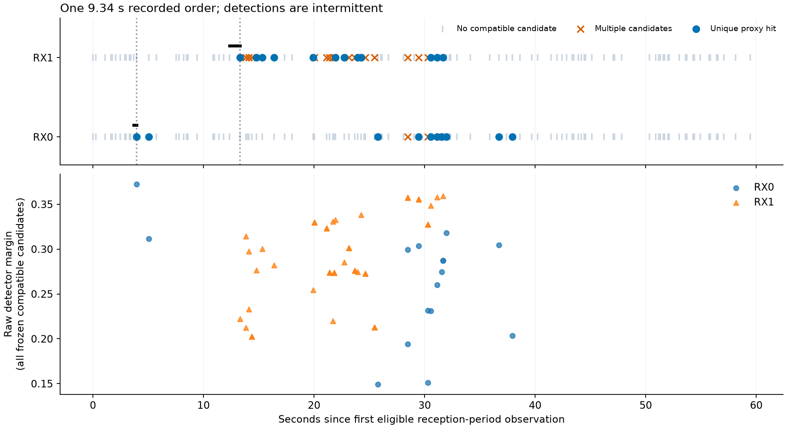

# Receiver-sequence follow-up

This follow-up inspects the recorded receiver-order evidence before fitting a tilt model. It preserves the frozen 30-track bank, original ambiguity rules and grouped temporal partitions. These are reused exploratory recordings, not new DS7 confirmation data.

**The 9.34-second recorded order survives the detailed audit, but its detections are intermittent. The next experiment needs an explicit model of missed detections and clutter, and must preserve alternatives in log space. No tilt-model improvement has been demonstrated.**

## Detailed sequence audit

All **17** sequences with a unique hit somewhere on both receivers were audited, including ambiguous sequences. Seven windows across these cases have a unique compatible hit on both receivers; all seven pass the existing 2.2 μs epoch-phase compatibility proxy. This is supporting timing consistency, not proof of a shared satellite.

For the sole uncensored ordering case, recording `scan-fw-3ebf3526172258af`, candidate 69338:

| Reception-period observation | RX0 | RX1 |
|---|---:|---:|
| Exact-lane eligible windows | 112 | 112 |
| Unique compatible hits | 10 | 12 |
| Ambiguous candidate windows | 3 | 15 |
| No compatible candidate | 99 | 85 |
| Longest run of unique hits at successive eligible observations | 3 | 3 |
| Interval from preceding nonmatch to first unique hit | 0.281 s | 0.942 s |

Eligible midpoint spacings range from **0.120 to 2.505 seconds**, with median **0.421 seconds**. A run of three is a run across successive sampled opportunities, not continuous reception. Two windows have a dual-receiver unique hit; their exported support-center epoch-phase differences are **1 ns and 13 ns**. Those values describe rounded public timing estimates, not independently established nanosecond hardware precision.

The first recorded RX1 hit follows RX0 by **9.3431466 seconds**. Subtracting the two last-nonmatch/first-hit brackets gives transition-separation bounds of approximately **8.401–9.624 seconds**, conditional on treating those observed nonmatches as transition boundaries. These are neither a statistical confidence interval nor physical beam-entry bounds: a target may be present during a nondetection. The old observation-order result is preserved, with stronger limits on its interpretation.

The intermittent hits and retained ambiguities do not establish a continuous shared pass. The result supports investigating a joint probabilistic observation model; it does not support deriving satellite travel direction directly from the first-hit difference.

## Candidate support limits

The frozen training probabilities are already highly concentrated. That concentration belongs to the assumed Doppler model; it does not establish satellite identity.

| Candidate support diagnostic | Calibration | Evaluation | All |
|---|---:|---:|---:|
| Frozen tracks | 18 | 12 | 30 |
| Top conditional weight ≥ 0.999999 | 16 | 11 | 27 |
| Top weight stored as exactly 1.0 | 11 | 8 | 19 |
| Only one candidate has a positive stored weight | 2 | 3 | 5 |
| At least one candidate has a zero stored weight | 7 | 4 | 11 |
| Maximum catalogue mass omitted by the top-three shortlist | 13.38% | < 0.000000001% | 13.38% |

Exact top weight 1.0 does not necessarily mean every alternative is zero: rounding can produce a stored 1.0 alongside tiny positive alternatives. Five tracks have only one positive stored weight; direct multiplicative updates cannot revive their zero-weight alternatives. The stored training log-likelihoods remain finite for all retained candidates. A future implementation should combine those original log-likelihoods with reception evidence in log space, preserving the frozen model and avoiding an arbitrary probability floor. Candidates outside the retained shortlist remain unsupported.

The sole uncensored lag belongs to a track with a top-versus-runner-up training log-likelihood gap of approximately **1,977.54 nats**. A normal-sized reception likelihood contribution cannot meaningfully reverse that ranking under the existing model. The evaluation tracks' median gap is **272.67 nats**. These are diagnostics of the existing model's concentration, not independently verified odds of correct identity.

## Next comparison

The next implementation compares **Doppler-only**, **static geometry**, and **nominal tilt with temporal reception**, using the same complete candidate sets and one score per paired window. Receiver-swap and trajectory-reversal controls test whether any apparent gain is specific to the orientation/time relation. The design retains missed detections and clutter and requires log-domain hypothesis updates. It is a proposed comparison, not a fitted model or a completed benchmark; its exact numerical configuration must be frozen before the bounded fit.

## Reproduction

- [Pre-execution diagnostic protocol](PROTOCOL.md).
- [Candidate support artifact](candidate-leverage.json), [launch](leverage-launch.json), [resources](leverage-resources.txt).
- [Candidate diagnostic implementation](../../tools/rx_candidate_leverage.py), [component tests](../../tests/research/test_rx_candidate_leverage.py).
- [All 17 detailed cases](cases.json), [case launch](cases-launch.json), [case resources](cases-resources.txt).
- [Case audit implementation](../../tools/rx_sequence_case_audit.py), [component tests](../../tests/research/test_rx_sequence_case_audit.py), [figure script](plot_case.py).
- [Proposed model comparison](MODEL-DESIGN.md).
- [Independent output audit](audit.json), [audit script](audit_outputs.py), [evidence hashes](evidence-sha256.json).

The candidate diagnostic reads only the frozen bank and partition assignments. It does not consume receiver detection outcomes, modify model weights or select a new catalogue.

Both descriptive runs exited 0. Candidate support export took **0.60 seconds**, peak RSS **280,296 KiB**; case audit took **4.31 seconds**, peak RSS **1,401,176 KiB**. Four new component tests and Ruff passed. No prior report, forecast or matched result was overwritten.
