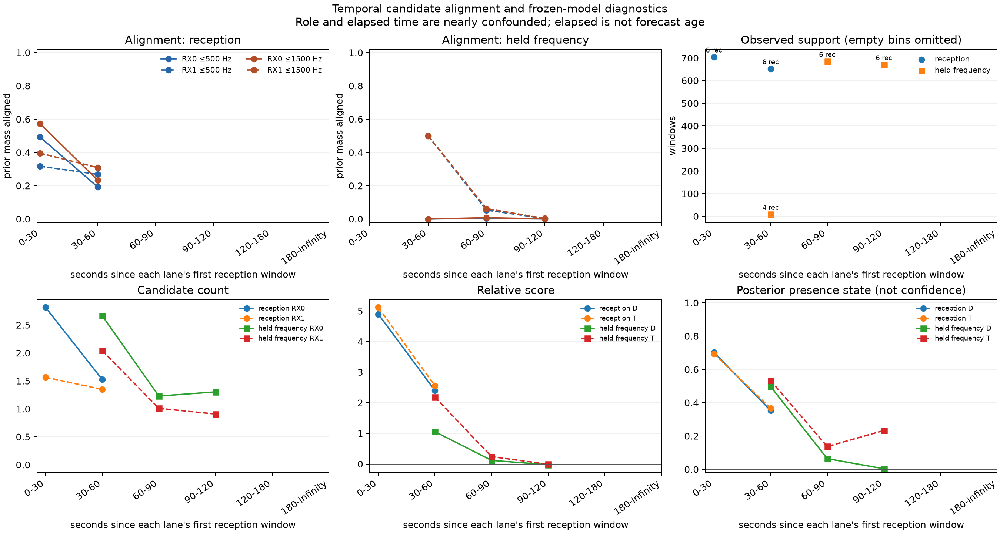

# Candidate-frequency alignment across temporal roles

This diagnostic examines why the frozen receiver-geometry models lose predictive
evidence in later observations. It compares observed candidate frequencies with
unchanged satellite forecasts in the six calibration recordings used by the
[temporal-transfer experiment](../2026_09_28_rx_temporal_transfer/README.md).

**The later windows lose almost all frequency alignment with the saved nominees,
despite unchanged forecast visibility.** This narrows the next investigation to
nomination/forecast support and observation changes before further geometry tuning.

## Results

All six recordings contribute to both role totals: 1,356 reception windows and
1,363 later held-frequency windows across 12 lanes.

| Equal-record mean | Reception | Later held-frequency |
|---|---:|---:|
| RX0 visible prior mass aligned within 500 Hz | 34.82% | 0.19% |
| RX1 visible prior mass aligned within 500 Hz | 29.37% | 3.04% |
| RX0 visible prior mass aligned within 1500 Hz | 41.16% | 0.42% |
| RX1 visible prior mass aligned within 1500 Hz | 35.54% | 3.48% |
| Forecast-visible prior mass | 100.00% | 100.00% |
| RX0 candidates per window | 2.221 | 1.275 |
| RX1 candidates per window | 1.478 | 0.972 |
| D posterior presence | 54.18% | 3.59% |
| T posterior presence | 54.41% | 18.48% |
| D predictive score minus reference (nats/window) | +3.738066 | +0.050684 |
| T predictive score minus reference (nats/window) | +3.932945 | +0.124533 |

The 500 Hz alignment fraction decreases on both receivers in all six recordings.
Candidate count reductions alone do not describe every case: recording
`4c56320fb5ca6994` has more RX1 candidates later (1.889 to 2.748 per window), while
its RX1 500 Hz alignment falls from 23.96% to 0.23%. This is descriptive evidence
of changed frequency support, not proof of a particular failure mechanism.

T retains substantially more posterior presence than D in the later windows.
That must not be presented as increased satellite-tracking confidence: T still
loses to the reference in four of six later recordings. For example,
`3ebf3526172258af` has 36.71% mean later T presence despite negligible 500 Hz
alignment on either receiver and a negative T-reference predictive score.

| Role / seconds since lane's first reception | Records | Windows | RX0 aligned ≤500 Hz | RX1 aligned ≤500 Hz |
|---|---:|---:|---:|---:|
| Reception / 0–30 | 6 | 704 | 49.26% | 31.70% |
| Reception / 30–60 | 6 | 652 | 19.21% | 26.80% |
| Later / 30–60 | 4 | 8 | 0.00% | 50.00% |
| Later / 60–90 | 6 | 685 | 0.38% | 5.31% |
| Later / 90–120 | 6 | 670 | <0.01% | 0.30% |

The eight-window boundary bin has very little support and should not be compared
as if it were a full block. No windows support elapsed bins at or above 120 seconds.
All other empty role/bin combinations are explicitly recorded in `results.json`.

## Method

For each window and receiver, the alignment fraction is the retained nomination
prior mass whose visible forecast lies within 500 Hz or 1500 Hz of an observed
candidate, using periodic distance on the lane's alias circle. The retained prior
is normalized once, excluding the previous `other` component. Invisible forecasts
and empty candidate sets contribute zero; visible nominations do not receive
redistributed prior mass.

Both receivers already use the dataset's common canonical RX0 frequency frame.
The diagnostic does not refit CFO, reassign candidates, or update forecasts.
Saved duplicate candidates remain in count summaries, as in the scored dataset;
the nearest-frequency alignment statistic is unchanged by duplicates.

Scores and posterior presence are joined from the frozen within-centered D and T
models. D uses receiver/sample-rate terms; T additionally uses sky geometry and
the nominal receiver-tilt terms. Predictive scores precede each observation update;
the plotted posterior presence includes that observation. Presence is a model
estimate, not a verified physical detection or satellite identity.

All reported means weight recordings equally after averaging their windows. Fixed
time bins measure seconds since each lane's first reception observation, not time
since the original nomination fit. Unsupported bins remain missing, not zero.

## Interpretation limits

Alignment is a descriptive fraction, not a calibrated association probability or
a chance-corrected test. More observed candidates create more opportunities for
chance alignment. Sample rate and alias period can also affect that opportunity.
The same recordings occur in both role totals, but their windows and forecasts
differ. Temporal role and elapsed time are nearly confounded in this dataset.

A reduction in alignment can explain reduced support for the saved nominees;
it cannot establish whether the cause is a satellite handoff, detector behavior,
forecast error, signal absence, or another mechanism. This stage does not establish
physical direction, satellite identity, or improved geolocation accuracy.

## Evidence

The [protocol](PROTOCOL.md) freezes the metrics, thresholds, bins and population.
`launch.json` binds sources and inputs after checking the completed temporal-transfer
evidence. `results.json` retains every diagnostic window and all contributing
record-level aggregates. The [independent review](REVIEW.md) records validation.

Six component tests passed, covering circular distances, invisible nominees, empty
receivers, joins, input immutability, lane-relative time origins, and unequal-window
equal-record aggregation. Ruff passed. The bounded run exited successfully in
6.58 seconds with peak RSS 190,964 KiB; it performed no model fitting or RF collection.
The independent audit passed: all 2,719 windows, periodic alignment metrics,
frozen D/T joins, time origins, coverage counts and equal-record aggregates were
reconstructed. Launch-bound source and input hashes remained unchanged.

## Next experiment

Prioritize a frozen residual-trajectory diagnostic over another tilt-model fit:
inspect signed periodic residuals and candidate continuity through the role boundary,
separately for each receiver and nominee. Distinguish a smooth frequency offset or
slope mismatch from disappearance or replacement of the observed track. Preserve
original forecasts and priors; any oracle best-nominee comparison must be labeled
diagnostic. Only after that diagnosis should a bounded causal rolling-nomination
experiment be specified, with updates using past observations and evaluation on
subsequent windows. Reused later outcomes cannot serve as a fresh confirmation set.
