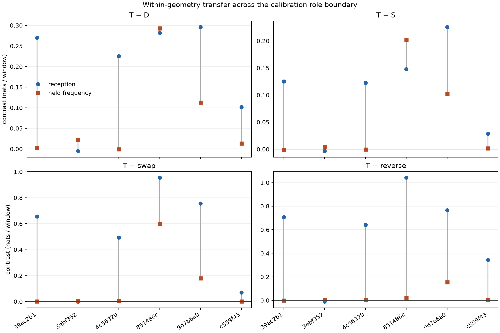

# Frozen geometry models: reception to later observations

**Predictive evidence declines sharply between the two temporal roles within the same omitted recordings.** Within-sequence T retains positive contrasts against Doppler, swapped receiver geometry and reversed geometry, but beats the empirical reference in only two of six later blocks. This is evidence of a limited model effect, not a generally reliable association or physical direction claim.

This diagnostic applies each completed five-record cross-validation fit to both temporal roles of its omitted calibration recording. It holds the recording, coefficients, reference distribution, scaler and presence parameters fixed, filters reception observations, and carries the posterior into the later held-frequency period.

Both absolute and within-sequence feature families are scored. Within geometry uses only the reception forecast mean and carries that same offset into the later block. No coefficients, background parameters, sigma, centering choices or persistence bounds are refitted. Original evaluation and confirmation recordings do not enter.

The [protocol](PROTOCOL.md) also freezes receiver-swap, reversed-geometry and quarter-period frequency-shift controls. Every control consumes its own reception history with the same fitted parameters. Reception scores must replay the previous cross-validation result before the new temporal comparison is accepted.

## Results

All six recordings contribute 1,356 reception and 1,363 held-frequency paired windows. Scores are equal-record mean nats per window relative to each fold's same frozen reference. The model, reference, recording and scaler are held fixed across roles; the observations and forecast times differ.

| Within-sequence family comparison | Reception | Later held-frequency | Positive later records |
|---|---:|---:|---:|
| D − reference | +3.738066 | +0.050684 | 2/6 |
| E − reference | +3.798629 | +0.078051 | 2/6 |
| S − reference | +3.825213 | +0.072996 | 2/6 |
| T − reference | +3.932945 | +0.124533 | 2/6 |
| T − D | +0.194879 | +0.073850 | 5/6 |
| T − S | +0.107732 | +0.051537 | 4/6 |
| T − swapped receiver geometry | +0.487931 | +0.131707 | 6/6 |
| T − reversed geometry | +0.581706 | +0.031781 | 6/6 |
| D − shifted frequencies | +3.696671 | +0.054697 | 3/6 |
| T − shifted frequencies | +3.892733 | +0.132916 | 2/6 |

The absolute-geometry family also loses predictive evidence with time. Its T-reference score falls from +3.951240 to +0.102418; later T−D is +0.051734 and T−S is +0.053865, but T−reversed geometry is negative (−0.015430). Within centering therefore passes a later reversal contrast that the absolute family fails in this diagnostic. This observation was not used to refit or select parameters.

The within T effect clears both geometry controls on all six later records, which is more specific evidence than merely beating D. Nevertheless, four records still favor the reference over T, and only two favor T over shifted frequencies. Small improvements over other failing models are not sufficient grounds to emit confident satellite identities.

| Recording (scan-fw suffix) | Later windows | Later D − reference | Later within T − reference |
|---|---:|---:|---:|
| 39ac2b14d1bb5f0f | 117 | −0.025828 | −0.023111 |
| 3ebf3526172258af | 235 | −0.031647 | −0.009952 |
| 4c56320fb5ca6994 | 218 | −0.015140 | −0.015418 |
| 851486cc2a1acd99 | 331 | +0.353484 | +0.646268 |
| 9d7b6a0db558703a | 243 | +0.050938 | +0.163836 |
| c559f436d578c9bd | 219 | −0.027707 | −0.014423 |

## Consequence

The earlier contrast between calibration-reception and later evaluation gains was not only a difference in which recordings were evaluated: a large reduction is now demonstrated within these same six omitted recordings. That narrows the failure mechanism but does not identify it. The next useful check is whether later candidate frequencies still align with the retained nomination trajectories, together with changes in receiver counts, visibility and posterior presence. Such a diagnostic should distinguish loss of nomination support from geometry-model failure without adjusting forecasts on the held observations.

## Interpretation

This paired comparison can identify a change in predictive performance between roles within the same omitted recordings. It cannot uniquely attribute a change to forecast age: observation populations, temporal role construction, intermittency and nomination validity can also differ. The joint-count reference is fitted to mixed observations, not verified physical clutter. The receiver pose remains nominal and provisional. A predictive score advantage alone does not establish identity, direction or position accuracy.

## Evidence

- [Protocol](PROTOCOL.md), [independent review](REVIEW.md), [launch bindings](launch.json)
- `results.json`: per-window scores, reference densities, IDs/timestamps, posteriors and every role/control contrast
- `audit.json`: independent score/reference reconstruction, role coverage and reception replay

Twelve focused tests passed before execution, including reception-only centering, controlled centering, state carry, held-outcome isolation, input immutability and scalar-filter behavior. Ruff passed. The launcher verifies the preceding CV source/input seal and its completed result digest before freezing the new run. This diagnostic performs no model fitting, RF collection, raw-IQ processing or QNAP writes.

Execution completed in 11.03 seconds, peak RSS 152,380 KiB, within the 120-second/4-GiB bound. All reception relative/reference/full-score replays passed within 1e-8 total nats, with exact D and shifted-D agreement between feature families.

The independent audit passed, including raw reference reconstruction, exact role membership, score sums, reception replay, all contrasts and posterior normalization (maximum normalization error below 9.5e-16). Aggregate comparisons allow 1e-12 absolute numerical tolerance for different floating-point summation orders; model results were not modified.
