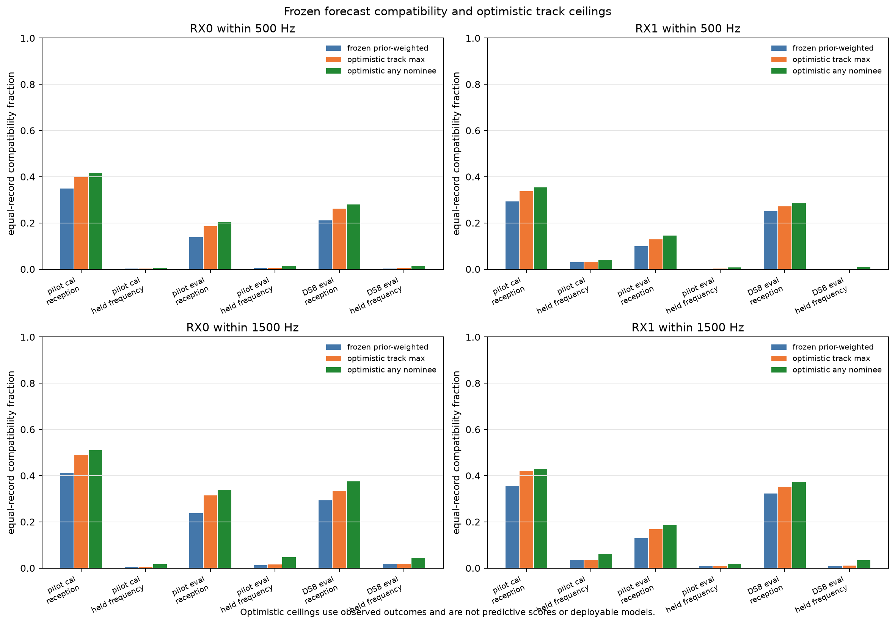

# Track competition does not explain the later forecast failure

The current receiver-geometry model makes same-lane track candidates mutually
exclusive. The upstream representation does not require that assumption. However,
removing prior competition in an optimistic diagnostic recovers very little later
frequency agreement. **Forecast validity remains the immediate bottleneck; a
multi-track state extension alone is not supported as the fix.**

This audit uses the frozen ten-record pilot and four-record DS8 artifacts. It fits
no model and changes no nomination, frequency gate, geometry coefficient or
receiver calibration. All counts and empty candidate sets are retained. These
previously explored recordings do not constitute a new confirmation.

## Later-period support ceilings

Each cell is RX0 / RX1, in percent of windows. Means weight recordings equally
within each split. Compatibility requires visibility and a wrapped nearest
residual within 500 Hz. The original support conditions on retained nominee mass.

| Panel | Records / windows | Frozen prior-weighted support | Optimistic best track | Any stored nominee |
|---|---:|---:|---:|---:|
| Pilot calibration | 6 / 1,363 | 0.189 / 3.038 | 0.228 / 3.179 | 0.572 / 4.049 |
| Pilot evaluation | 4 / 796 | 0.369 / 0.158 | 0.424 / 0.212 | 1.446 / 0.775 |
| DS8 evaluation | 4 / 853 | **0.290 / 0.108** | **0.346 / 0.108** | **1.275 / 0.837** |

“Best track” normalizes the frozen nomination weights within each prefix track,
then selects the largest compatibility support after seeing that window's
observations. “Any stored nominee” also ignores the within-track prior, allowing
even zero-weight alternatives to match. Both are optimistic, outcome-selected
diagnostics, **not predictive scores or deployable association methods**. They do
not include satellites omitted from the stored shortlist, and are not universal
upper bounds on a revised candidate bank or frequency model.

At the wider existing 1,500 Hz threshold, DS8 later support is:

| Receiver | Frozen weighted | Best track | Any stored nominee |
|---|---:|---:|---:|
| RX0 | 1.829% | 1.829% | 4.434% |
| RX1 | 0.979% | 1.040% | 3.329% |

In contrast, DS8 reception-period 500 Hz support is 21.106% / 24.989% under the
frozen prior, 26.207% / 27.192% under best-track selection, and 28.038% / 28.438%
under any-nominee matching. Thus removing track competition does not restore the
early-period support in the later period.

## What the track representation actually says

[SEMANTICS.md](SEMANTICS.md) traces the dataset prior, hidden states and emissions.
The present-state model chooses one `(track_id, catalog_number)` state at a time;
it cannot represent simultaneous active tracks. It also conditions on the retained
nominees after removing the dataset's omitted-catalogue component.

Multiple tracks occur in 9/19 pilot lanes and 4/8 DS8 lanes. There are 13/4
same-lane track pairs, respectively, but only **four pilot pairs and one DS8 pair
are anchored on the same receiver**. Those same-receiver pairs have 88 and nine
shared source-window instances with distinct public observation identities.
Different-receiver track pairs may be two views of the same emitter. Even distinct
same-receiver candidates may reflect clutter, aliases or fragmentation. Neither
overlap count establishes a physical satellite count.

These distinctions matter for a future model: treating every track independently
could double-count one physical source, while treating every track as exclusive
can hide genuine multiplicity. Resolve the track relationship explicitly rather
than interpreting current occupancy probabilities as physical target counts.

## Forecast age

The table summarizes **track-window** ages since the last mapped prefix support,
in seconds. These medians pool track-window entries and are descriptive; they are
not the equal-record score aggregation used above. A window with two tracks
contributes two ages.

| Panel / split | Reception age min / median / max | Later age min / median / max |
|---|---:|---:|
| Pilot calibration | 0.28 / 30.63 / 77.13 | 60.09 / 91.40 / 137.02 |
| Pilot evaluation | 0.12 / 30.92 / 61.47 | 60.10 / 90.80 / 121.59 |
| DS8 evaluation | 0.12 / 28.73 / 60.95 | 60.38 / 91.01 / 121.70 |

All mapped prefix support precedes the scored windows. Age grows with time in
these fixed-prefix forecasts; this is not an independent causal estimate that age
alone causes the disagreement. The artifacts do not determine whether the cause
is wrong nomination, incorrect frequency dynamics, emitter changes, or another
observation-model mismatch.

## Next implementation priority

Test a **causal short-horizon association model** with explicitly bounded frequency
uncertainty, updating only from past observations and scoring each next window
before its update. Compare it to the existing fixed-prefix forecast and causal
frequency reference on identical complete candidate sets. Fit nuisance dynamics
only on calibration reception data, and retain receiver-swap and candidate-geometry
permutation controls before attributing any gain to tilt or direction.

In parallel, characterize cross-receiver duplicate track hypotheses and
same-receiver multiplicity. A future multi-track likelihood must prevent one
detection being assigned twice and distinguish shared satellite identity from
distinct track fragments. The current diagnostic does not implement that model
or demonstrate an improvement in physical association or location accuracy.

## Evidence

- [Frozen protocol](PROTOCOL.md), `launch.py`, per-panel source/input hash receipts,
  resource logs and zero exit codes.
- `pilot.json`, `ds8.json`: all windows, track-conditional weights, support ceilings,
  prefix overlaps and per-track forecast ages; split-specific equal-record means.
- `tools/rx_track_competition.py` and its four passing component tests; Ruff passed.
- Existing datasets, mappings and earlier scientific artifacts remain unchanged.

The independent `audit-results.json` passed all 4,282 pilot and 1,767 DS8 windows,
split/role means, within-track weights, prefix overlaps and forecast ages. Both
real runs exited zero, taking 0.50 seconds (pilot) and 0.30 seconds (DS8).
`evidence-sha256.json` indexes the final source, inputs and report artifacts.

No RF collection, IQ reprocessing, new propagation or QNAP mutation was performed.
