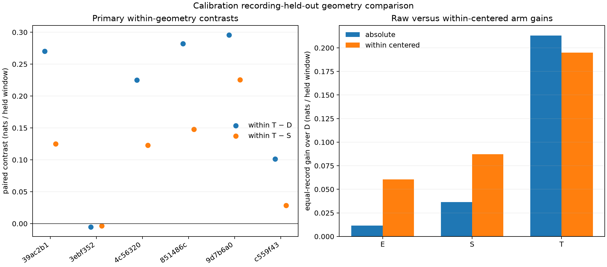

# Does within-sequence geometry transfer between recordings?

**Geometry transfers within this calibration-reception population, but within-sequence centering does not improve the tilt model.** Both absolute and centered tilt models beat D on five of six omitted recordings. Centering improves E/S on average but slightly reduces T's predictive score. This does not overturn the failed later evaluation or establish satellite identity.

This experiment compares absolute geometry features with the same features centered within each exact lane, nominated satellite and receiver. It tests whether removing geometry levels that vary between sequences helps the reception model transfer to a different recording. It does not yet add persistent receiver-gain random effects.

Only the six original calibration recordings' reception windows enter this experiment. Each fold fits five complete recordings and predicts the sixth. The joint-count reference and feature scaler are refitted inside the fold. The previously selected sigma=500Hz is fixed, so these are development results conditional on that earlier choice.

Centering subtracts the complete reception forecast mean from standardized up/north/east and differential-tilt features. It leaves intercept, receiver and sample-rate features unchanged. Consequently the D arm must have exactly identical fits and scores in both families. E adds up, S adds horizontal geometry and T adds differential tilt. Every arm retains an exact absent-reference competitor.

The held recording's mean uses its predicted geometry only, including the complete reception forecast schedule. This assumes forecast covariates are available in advance; it never uses detections, candidate counts or frequencies to center features. Held candidate sets are scored before filter updates. The [protocol](PROTOCOL.md) freezes the feature convention and fitting rules.

## Results

All six folds completed. Their 118, 227, 217, 340, 225 and 229 windows partition all 1,356 calibration reception observations exactly once. Scores are equal-record mean nats per paired reception window; higher is better. These are omitted-record **reception** scores, not the later held-frequency scores in earlier reports.

| Model | Absolute geometry vs reference | Within geometry vs reference | Within − absolute | Positive paired records |
|---|---:|---:|---:|---:|
| D | +3.738066 | +3.738066 | 0, exact identity | — |
| E | +3.749531 | +3.798629 | +0.049098 | 4/6 |
| S | +3.774671 | +3.825213 | +0.050542 | 4/6 |
| T | +3.951240 | +3.932945 | −0.018295 | 3/6 |

| Contrast | Equal-record mean | Positive records |
|---|---:|---:|
| Absolute E − D | +0.011465 | 3/6 |
| Absolute S − D | +0.036605 | 5/6 |
| Absolute T − D | +0.213174 | 5/6 |
| Within E − D | +0.060562 | 5/6 |
| Within S − D | +0.087147 | 5/6 |
| **Within T − D (primary)** | **+0.194879** | **5/6** |
| **Within T − S (primary)** | **+0.107732** | **5/6** |

The D fit receipts and held scores match exactly between families in every fold. This confirms that the comparison changed geometry treatment while preserving the Doppler-only baseline.

| Omitted recording (scan-fw suffix) | Windows | Absolute T − reference | Within T − reference | D − reference |
|---|---:|---:|---:|---:|
| 39ac2b14d1bb5f0f | 118 | +3.351027 | +3.459763 | +3.189608 |
| 3ebf3526172258af | 227 | −0.039630 | −0.000167 | +0.004928 |
| 4c56320fb5ca6994 | 217 | +3.882544 | +3.972357 | +3.747189 |
| 851486cc2a1acd99 | 340 | +4.426265 | +4.302543 | +4.020636 |
| 9d7b6a0db558703a | 225 | +7.992795 | +7.915404 | +7.619731 |
| c559f436d578c9bd | 229 | +4.094440 | +3.947770 | +3.846306 |

## What this changes

It is too strong to say that nominal tilt never transfers between recordings: this entire-record cross-validation finds a positive incremental predictive effect in five folds. Conversely, centering is not supported as the explanation or remedy for the earlier tilt failure. This stage has no geometry-swap or reversal controls, so it does not yet establish direction-specific information.

The large D-reference gain here (+3.738 nats/window) contrasts with the earlier eight-record, later-held-period mean (+0.0548). The recording population and time horizon both differ, as do fold-specific nuisance fits. That discrepancy is a diagnostic lead, not proof of forecast decay or data leakage. A useful next test is to apply these already-frozen five-record fits to each omitted recording's later held-frequency period, carrying its reception posterior forward. A separate protocol must freeze that temporal transfer test before inspecting its results, retaining all records and direction controls.

## Scope and evidence

This is calibration-only, post-outcome model diagnosis. It does not inspect the original held-frequency windows or eight evaluation recordings. It does not provide a fresh satellite-identification test, and it does not include swap/reversal controls in this stage. Positive tilt results would require those controls and independent evidence before promotion.

- [Protocol](PROTOCOL.md) and [review](REVIEW.md)
- [Launch hashes and experiment seal](launch.json)
- `folds/`: immutable completed fold checkpoints
- `results.json`: complete six-fold fits, reference distributions, scalers and contrasts
- `audit.json`: independent reconstruction of fold membership and arithmetic

Eight tests passed before execution, including outcome isolation, centering, D-feature identity and checkpoint validation. The run has one numerical thread, nice19, a 4 GiB memory limit and a 300-second initial execution bound. No RF collection, raw-IQ processing or QNAP writes are involved.

Execution completed in 259.00 seconds, peak RSS 132,288 KiB, within the declared bound. All six checkpoints were saved without a resume or source change. All 96 optimizer starts converged; none of the 48 arm selections chose the exact null. All 48 persistence estimates hit the 10-second upper bound, limiting their physical interpretation. The bound was not expanded.

The independent audit passed, reconstructing fold background models and scalers, verifying source-window membership, D identity, optimizer selections, score additivity and all aggregate means/signs.
