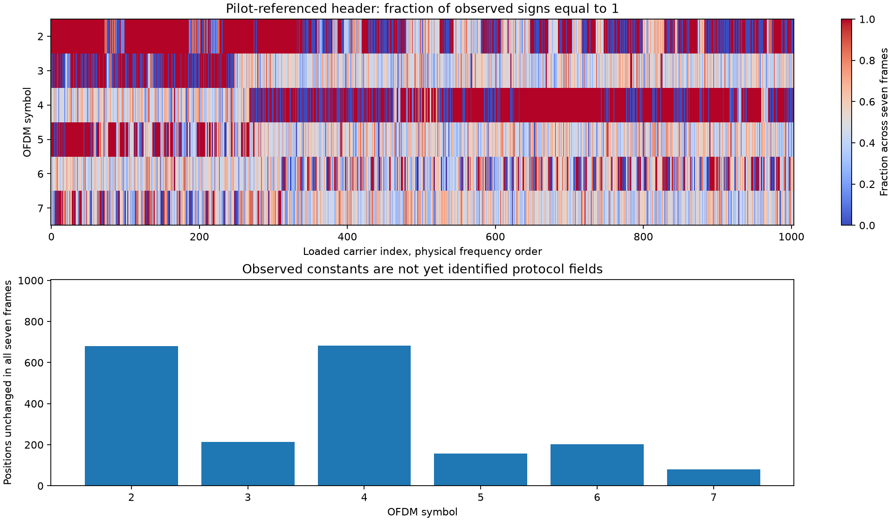

# Pilot-referenced decoding of the additional regions

This published follow-up records the offline working analysis. Named follow-up
scripts and ignored data products refer to the research workspace; this
publication adds the report and illustration, not those datasets or the full
experimental code archive. See the [main report](README.md) for the established
60-state generator and the original publication's code scope.

Frame convention: labels 250–256 below come from the raw excerpt's one-based
metadata. They correspond to zero-based published-reference array indices
249–255. The larger-reference tests explicitly use array indices.

This offline follow-up uses the same seven complete UT frames, 250–256. It
resolves the former per-symbol sign ambiguity with published edge pilots and
maps which header signs remain fixed or change. No FEC, CRC, packet-field,
satellite-ID, time or orbit interpretation has yet been validated.

## Polarity recovery

We replay the cached acquisition epochs and frequency estimates against the
original raw IQ, regenerate the SSS-equalized FFT symbols, and reuse the saved
blind timing-slope corrections. Reconstructed amplitudes agree with the prior
soft-symbol cache to 2.7e-15 maximum absolute difference. We estimate phase
separately from each eight-carrier edge-pilot group, using published pilot
values rather than header signs. All seven headers then lie near −45 degrees.
A single fixed +45-degree rotation gives a consistent sign convention across
symbols and frames. It does not establish which sign the protocol calls bit 1.

Both independently calibrated edges agree on **all 42,168 sign decisions** in
OFDM symbols 2–7 (7 × 6 × 1,004). After requiring both normalized real components
to have magnitude above 0.9, **41,816** remain qualified. The minimum real second
moment over these symbol/edge fits is 0.9079. Edge phase estimates are separate,
but the data samples, SSS equalization and blind slope are shared: this is not
independent-receiver confirmation or a measured bit-error rate.

The five previously recovered short tail symbols also reproduce using either
pilot edge. Their states remain 52 (frame 250, symbol 301), 31 (frame 254,
symbols 300–301), and 35 (frame 255, symbols 300–301). **Every one now matches
the generator with positive polarity.** The negative polarities previously
reported for frames 254/255 arose from blind axis alignment, not a demonstrated
transmitter inversion flag. Their phase-state identities were unaffected.

## Header structure

| OFDM symbol | Qualified positions identical across all seven frames |
| --- | ---: |
| 2 | 680 |
| 3 | 214 |
| 4 | 682 |
| 5 | 156 |
| 6 | 203 |
| 7 | 79 |

There are 1,004 candidate positions per symbol. These are observed constants
in a seven-frame excerpt, not established reserved bits. Selecting positions
unanimous in frames 250–252 yields 3,114 positions. They predict 10,299 of
12,361 qualified decisions in frames 253–256 (83.32%). This uses actual
pilot-referenced signs; the earlier 82.23% result used adjacent-carrier products.
Their different sample counts and representations prevent a direct BER comparison.

To look for repetition of the changing component, we XOR separate frame pairs,
then correlate those changes at carrier lags. Each symbol chooses its strongest
absolute correlation among lags 1–500 using frames 250/251 only. Two other
frame pairs provide evaluation. Only jointly qualified positions contribute;
constant sequences and fewer than 50 pairs score zero. Carrier indices follow
compact physical frequency order. This is an exploratory structure test, not
a decoded interleaver or error-correcting code.

| Symbol | Selected lag | Discovery 250/251 | Evaluation 252/253 | Evaluation 254/255 |
| --- | ---: | ---: | ---: | ---: |
| 2 | 2 | 0.452 | 0.349 | 0.366 |
| 3 | 1 | 0.212 | 0.218 | 0.158 |
| 4 | 1 | 0.395 | 0.438 | 0.414 |
| 5 | 3 | 0.160 | 0.064 | 0.047 |
| 6 | 60 | 0.269 | 0.223 | 0.166 |
| 7 | 195 | 0.141 | −0.052 | 0.011 |

The lag-60 effect in symbol 6 merits a partial-band tessellation test. It does
not establish that the entire symbol is another 60-state word: the earlier
whole-band code test did not recover one there. The short-lag effects in
symbols 2–4 could reflect repeated coding, clustered changing fields, or
allocation boundaries. Distinguishing those explanations requires additional
tests; no field boundary has been assigned. Symbol 7's selected long lag does
not reproduce.

## Reproduction and next discriminating tests

`pilot_polarity.py` replays the raw input and records input hashes;
`header_structure.py` exports the qualified signs and masks and builds this
map. Run both from the existing workspace using NumPy, SciPy and Matplotlib.
All arrays and JSON results are under ignored `local/`, including
`pilot_referenced_header_bits.npz` with explicit bins, frame IDs and symbols.
Synthetic tests verify sign recovery across full phase wraps, expose opposite
pilot-edge polarity rather than hiding it, and check lag masking/constant
handling. The nine focused sequence-semantics tests pass.

## Subsequent control: changing bits versus a repeatable fixed layout

The lag-60 observation above does **not** survive a stronger, more relevant
test as a reproducible changing-bit relation. We select positions that actually
change in discovery frames 250–252, with all three decisions qualified. For
symbol 6, 558 positions qualify. We then compare frame pairs 253/254 and
255/256, neither of which overlaps discovery. Both ends of every lagged pair
must belong to the discovery-selected changing positions and remain qualified.

| Evaluation frames | Usable lag-60 pairs | Correlation | Two-sided conditional-shuffle p |
| --- | ---: | ---: | ---: |
| 253/254 | 370 | 0.1062 | 0.051 |
| 255/256 | 385 | −0.0185 | 0.721 |

The 999 shuffled controls permute only qualified changing positions; p values
are exploratory and unadjusted. This result does not exclude all periodic
structure, but it removes the basis for interpreting the original correlation
as a reliable repetition of changing information. A repeatable pattern of fixed
and changing positions can itself correlate at lag 60. Earlier frame-pair
evaluations also differed from this new, discovery-disjoint split.

We additionally tested 1,092 fixed local windows: seven frames × twelve early
symbols (2–13) × thirteen carrier starts spaced by 60. Each window has 240
physical-order carriers. Its two nonoverlapping 120-carrier halves independently
fit unrestricted 60-sign words, with exact word agreement and correlation >0.9
required on both. **None passes.** The codebook does not participate in fitting.
This does not rule out shorter regions, other alignments, or different coding;
it fails to support a straightforward local repetition of the known tail word.

`partial_header.py` writes these checks and their input hash to ignored
`local/partial_header.json`. Two additional tests verify discovery-only position
selection and genuine independent-half word recovery/rejection. All eleven
focused tests pass. The next useful evidence is a larger header sample and
tests of coding/layout relationships, rather than treating the lag-60 peak as
a decoded field. Actual protocol semantics remain unresolved.

## Larger-reference check: literal frame-counter bits

The cached published reference supplies eight carriers (100–103 and 200–203)
over 1,009 frames. Its longest continuous arrival-time segment comprises dataset
indices 0–465: 466 observations spanning 2,600 nominal 750 Hz frame ticks.
Missing frames are retained as tick gaps. The test examines OFDM 2–7, or 48
symbol/carrier positions, with real template-relative hard signs only.

`header_timing.py` tests each binary counter bit 0–9 with every nonredundant
starting offset and fitted polarity: 1,023 candidate square waves. Frames are
split chronologically 60%/20%/20%. Discovery fixes polarity; validation selects
the counter model at each position and the strongest position overall. Models
that are nearly constant in discovery or validation are excluded. Final test
bits do not participate in selection.

The validation-selected candidate is symbol 6, carrier 200, bit 9, offset 425.
Its discovery accuracy is only 50%; validation rises to 75.61%, but final test
accuracy falls to **31/87 = 35.63%**, below the constant-majority baseline's
**60/87 = 68.97%**. Across all 48 position-specific selected models, test accuracy
is 48.61% over 4,345 usable decisions, versus 65.87% for their discovery-majority
baselines. No selected model reaches 90% in both discovery and validation.

Thus the tested positions provide no verified directly readable binary frame
counter. This does not exclude encoded counters, other carrier positions,
longer counter periods, or other time representations. The aggregate decisions
are dependent and are not independent trials. Synthetic tests recover a known
counter with skipped ticks and reject a test-only polarity change, verifying
the intended split and gap handling. All thirteen focused tests pass.

Results and input hashes remain in ignored `local/header_timing.json`; no new
RF or external data collection was used for this test.

## Coding check enabled by resolved polarity

Earlier code probes excluded odd-weight parity relations because arbitrary
per-symbol polarity could flip their outcomes. Pilot-referenced signs permit
that previously unavailable test. `odd_parity_probe.py` examines odd-weight
checks on two output streams with seven taps each, under 360 direct/blocked,
carrier-order, direction, phase and lane-grouping layouts. Each stream must
contribute to the check. It uses OFDM 3, 5, 6 and 7 and XORs separate frame
pairs to remove any fixed carrier mask. All fourteen input decisions must be
qualified in both frames; the mask and layout are selected only on 250/251.

The strongest discovery candidate is a weight-three relation, mask 2066,
direct FFT order, no lane reordering, phase zero, streams 1/2. Its signed parity
correlation is 0.2088 on 1,188 discovery windows, but falls to 0.0566 on 1,060
evaluation windows (252/253) and 0.0523 on 1,129 final windows (254/255).
A perfect fixed relation would have absolute correlation one. These results
do not establish an error-correcting code or support using the candidate to
correct bits. This extends the former even-weight search; it does not test
arbitrary interleavers or identify general LDPC codes.

A synthetic independent-row test recovers an imposed three-bit parity exactly,
verifies it on separate rows and detects an inverted parity. Fourteen focused
tests now pass. The data and complete exploratory trial table remain ignored
in `local/odd_parity_probe.json`.

## Cross-pipeline reference agreement and frame indexing

`reference_agreement.py` compares our pilot-calibrated raw-IQ signs with the
published hard-symbol reference at carriers 100–103 and 200–203. The raw excerpt
uses one-based frame labels; the reference arrays are indexed from zero.
Testing offsets −2 through +2 on the first three raw frames selects −1 with
144/144 matching header signs. The remaining four frames verify that mapping
with **192/192 matches**. Together, all **336** examined header signs match
without additional inversions or rotations. All **40** examined tail signs
also match, across the five short tail symbols.

The mapped raw frames 250–256 (array indices 249–255) still have no accepted
observations in the older 32-symbol-window results or original 907-observation
catalogue. Thus the three short-tail frame recoveries remain additional; the
indexing distinction changes their reference lookup, not that count.

This validates the sign convention against a separate processing pipeline on
the same RF data and template. It is not independent RF evidence, a CRC check,
or a field interpretation. The comparison checks only the eight cached carriers;
it does not claim full-band bit-perfect recovery. The offset trials, tail checks
and input hashes are in ignored `local/reference_agreement.json`. A focused test
ensures nonbinary and missing reference samples are excluded. Fifteen focused
tests pass.

## Exact recurrence in the data-invariant phase plane

The [SpaceX downlink patent](https://patents.google.com/patent/US12074683B1/en)
specifies a rotational-scrambler polynomial `1 + D^14 + D^15`. This is a
hypothesis source, not proof that every patented implementation detail applies.

For a BPSK header, changing the data sign rotates a sample by 180 degrees.
Therefore the low bit of its quadrant index is unaffected by the data. We
restore the empirical template rotation to the pilot-referenced observations,
quantize the resulting received quadrants, and examine that low bit. This uses
the raw-IQ-derived observations, not just the saved template's bit plane.

In increasing physical-frequency order, excluding the known pilot/gutter bins,
the recurrence `p[n] = p[n-14] XOR p[n-15]` predicts the central region exactly.
For each of six early symbols and seven raw frames, compact carrier indices
32–46 provide the fifteen starting bits. Extrapolation through indices 47–987
produces **39,522 predicted phase bits with zero mismatches**. Outside that
interval, failures concentrate near the two edges. The interval was chosen
after seeing that pattern; this is exploratory, not a prospectively held-out
frequency selection. Frames reuse the same underlying scrambler structure,
so the bit count is not a count of independent trials.

This is a concrete model of one observable scrambler output. It does **not** yet
give the other quadrant bit, which is mixed with header data, or a complete
descrambler. The next discriminating work is to determine the edge ordering,
initialization and second-output relation before returning to FEC decoding.
`phase_lfsr.py` records seeds, residual locations and hashes in ignored
`local/phase_lfsr.json`. Sixteen focused tests pass.

## Two-plane rotational descrambler model

**Qualification:** this is an exact template representation, not yet a verified
transmitter descrambler. The subsequent diagram-based check below finds a
different second-plane relation; exported signs retain that model ambiguity.

The edge failures in the template are explained by sequence indexing: consume
the pilot locations but omit the four gutter carriers. Increasing physical
frequency then contains 1,020 sequence positions per OFDM symbol, of which
1,004 are data positions. One fifteen-bit seed from raw frame 250, symbol 2,
predicts all 301,200 template low-plane bits across symbols 2–301 exactly.
Successive symbol seeds advance by 1,020 in a sequence of period 32,767.

For the second quadrant bit, XORing the empirical template with the previously
derived fixed 60-bit seed pattern and a constant one reveals the same recurrence.
Its sequence phase is 16,383 positions ahead of the first plane. This model
matches **289,152/289,152** post-header template high bits (symbols 14–301).
The symbol stride, second-plane phase and inversion were inferred from the
corpus: this is an exact representation of the template, not independent proof
of the transmitter's specific wiring or a prospective blind validation.

Applying the two-plane model to raw-IQ-derived header observations produces
23 low-plane mismatches out of 42,168 decisions. This is distinct from the
earlier zero-error central-carrier test and the exact full-template fit. Thus
full-band raw recovery is not bit-perfect. The newly descrambled header signs
and soft values are saved, with real-axis quality masks, in ignored
`local/rotational_header_bits.npz`. Values are in a stated sign convention,
not interpreted bytes or FEC-decoded fields.

`rotational_descramble.py` records the seed, index rules, mismatch locations and
input hashes. A synthetic test checks symbol advance and both plane recurrences.
Seventeen focused tests pass. This supplies a concrete descrambling model for
the next header-code investigation; header semantics remain unresolved.

## Patent-diagram check and direct coding tests

We inspected Figure 9 on PDF page 13 of the
[patent PDF](https://patentimages.storage.googleapis.com/65/87/f2/f296fffdc84c81/US12074683.pdf).
It forms outputs from register positions 7 and 15 and maps them to quadrant
rotations. Under the two tap-advance directions tested, the resulting high-plane
phase relative to the observed low-plane sequence is 32,655 or 32,647. Neither
equals the 16,383 phase inferred by decomposing our empirical template. Thus
the template's exact factorization alone is insufficient to identify the actual
transmitter scrambler: a fixed binary sequence can be absorbed into the unknown
data/reference component. We do not promote any of these alternatives to a
verified implementation.

`scrambler_candidates.py` compares all three phases using direct descrambled
signs, including both even- and odd-weight two-stream, seven-tap parity checks
over 360 layouts. Raw frame 250 selects each candidate's mask/layout; frames
251–256 evaluate it. The strongest absolute discovery correlations are only
0.1172, 0.1172 and 0.1151 respectively. All corresponding evaluation correlations
have magnitude below 0.05. No candidate supplies a usable parity relation or
an error-corrected header. These tests use direct signs; the earlier frame-XOR
tests were invariant to any common fixed descrambler and therefore cannot
distinguish these phase alternatives.

The complete selected-model scores and input hashes are retained in ignored
`local/scrambler_candidates.json`. A synthetic test verifies each diagram-derived
tap relation across the full 32,767-bit period, not merely a matching initial
state. Eighteen focused tests pass. Recovering packet fields still requires a
validated scrambler/coding/layout combination; we have not reached that point.

## Eight-symbol search in local DS7/DS8 recordings

To test whether local recordings hide short regions like the UT tails, we
examined the nine existing paired-receiver caches in fixed, nonoverlapping
eight-symbol windows covering OFDM 14–301. There are 14,580 attempted windows,
1,620 per visit. Each receiver fits an unrestricted 60-sign word independently.
All positions must be covered, all signs must agree, and both normalized
correlations must exceed 0.25. The known alphabet is checked afterward; no
nearest-word correction is applied.

Twenty-four windows pass this initial gate: eight from S22 and sixteen from
S23. Twenty-one match the known generator exactly. Twenty pass a stricter gate
of both correlations >0.5, held-pilot coherence >0.5 and a 999-shuffle score test
with empirical p≤0.001. **Three of those twenty still disagree with the
generator by one bit.** These are S23 frame 52/symbols 142–149 (nearest state
57, bit 0), frame 57/symbols 150–157 (state 59, bit 22), and frame 76/symbols
222–229 (state 31, bit 59). The discrepant bits have only two or three contributing
samples per receiver. They also disagree with the original longer-window word
for their respective frames. We preserve them as discrepancies, not proven
errors or new alphabet members.

No strict, exact-generator recovery adds a frame absent from both the original
catalogue and the 32-symbol-window audit. Reversed carrier-to-slot mapping
controls pass no candidate, but those controls run only on initially accepted
windows and are not a calibrated corpus-wide false-alarm rate. Shuffled tests
are likewise unadjusted and windows share underlying data.

The result demonstrates a practical limit: shorter windows reduce bit support,
and even exact two-receiver agreement plus strong pilot/coherence gates can
produce a word inconsistent with the established model. This scan therefore
does not justify increasing the qualified decode count or interpreting the
three discrepancies as extra information. `short_local.py` retains all accepted
words, comparisons, controls and input hashes in ignored `local/short_local.json`.
Nineteen focused tests pass, including independent-word and coverage checks.

## Additional full-band reference frames and model transfer

We extracted published-reference array indices 0–12, all 301 stored symbols and
all 1,024 carriers per frame. The HDF5 chunks for this group occupy a nearby byte
range, allowing a bounded coalesced download rather than the complete 5.4 GB
archive. Including metadata, the extraction fetched 5,587,220 bytes in 9.56
seconds. Decompressed data agree exactly with all 31,304 overlapping symbols
from the earlier eight-carrier caches. These are published hard constellation
decisions, not newly collected RF or FEC-decoded bits.

Without refitting the seed, symbol stride or frequency interval, we applied
the existing low-phase prediction to early symbols 2–7 in those thirteen
frames. All 78,312 samples qualify as QPSK independently of the predicted bit.
Forty phase-bit mismatches occur, confined to FFT bins 511, 512, 513, 515, 516,
517 and 521. In the **previously fixed compact-carrier interval 47–987**, all
**73,398 predictions match exactly**. This supports transfer of the observable
low-plane recurrence to different frames. It does not resolve the second-plane
ambiguity or identify header fields. Eight carrier slices of these frames were
previously inspected; this is their first full-band examination, and they remain
from the same public recording.

`fetch_full_reference.py` enforces chunk/filter/length checks, an extraction
range cap and the existing HTTP byte/time limits. Its full-band source arrays
remain under ignored `local/full-reference-0-12.npz`, with URL, ETag and SHA-256
provenance. `full_reference_validation.py` records the frozen-model check in
ignored `local/full_reference_validation.json`. Twenty focused tests pass,
including decompressed chunk-layout and length validation. The larger full-band
sample is now available for testing header layouts without reusing only the
original seven raw-excerpt frames.

## Cross-position bit-copy test on the expanded sample

We selected candidate equal or inverted bit positions using only the original
seven frames. Both bit values must occur at least twice, avoiding nearly fixed
positions. Each discovery-pattern group uses its first position as a fixed
representative, with no evaluation-based representative selection. Positions
must remain qualified in all thirteen additional frames. This leaves 3,103
candidate relationships.

Only one relationship matches all thirteen evaluation frames: OFDM symbol 2,
FFT carriers 19 and 77, with no inversion. Its reference bit is one in eight of
the thirteen frames. Under 1,999 controls that permute the evaluation-frame
order on one side, the expected exact-match count is 0.342 and the empirical
probability of at least one match is 0.2915. This is not persuasive evidence of
a repeated field. We retain the candidate without assigning a semantic meaning.

These controls preserve marginal bit counts and dependence within each side,
but require frame exchangeability; they are exploratory. Failure of this direct
copy/complement test does not exclude general interleaving or error-correcting
codes. `header_copies.py` saves discovery rules, results and hashes to ignored
`local/header_copies.json`. Twenty-one focused tests pass, including discovery
selection, inversion handling and exclusion of constant or unqualified bits.
