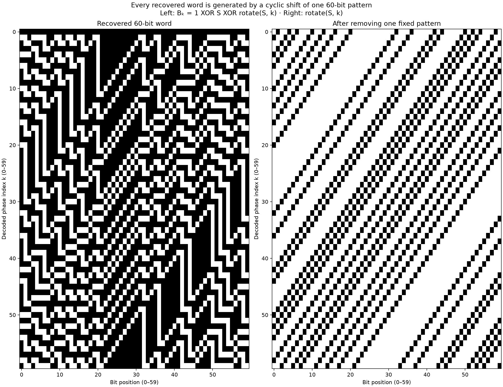
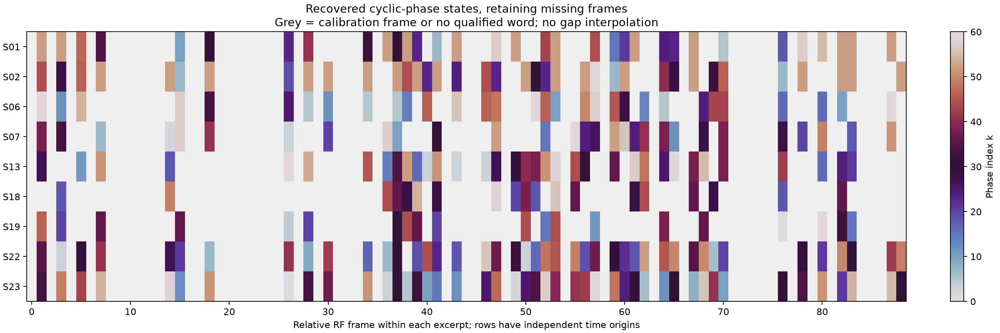
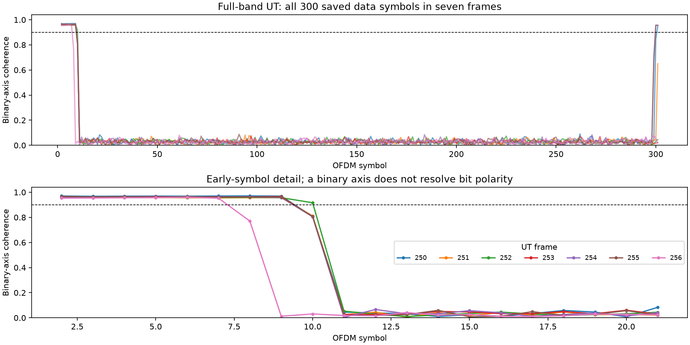

# Interpreting the extra bits: a cyclic-phase representation

[Follow-up: pilot-referenced headers, expanded reference checks, and scrambler
ambiguity](PILOT_HEADER_FOLLOWUP.md). The header's field meanings remain unresolved.

2026-09-28. **Progress: an exact generator has been identified for our recovered
60-bit vocabulary. The protocol meaning of its phase choice remains unresolved.**
No satellite ID, absolute time, position, orbit message or user payload is claimed.

## Abstract and scope

This report follows the [DS7/DS8 signal-structure study](../2026-09-28-ds7-ds8-signal-structure.md).
DS7 and DS8 are local narrow-band recordings; UT denotes published University
of Texas reference symbols and a separate full-band raw-IQ excerpt. We find an
exact cyclic generator for the previously recovered words, test temporal and
identity hypotheses, and examine all 300 saved data symbols in seven full-band
UT frames. The latter reveals three additional frame-level phase recoveries in
short end-of-frame regions. Header relative signs also repeat, but neither
header semantics nor user payload is decoded. All analyses are offline.

## Main finding

Every one of the 60 distinct previously recovered words can be generated by
one fixed pattern and a cyclic shift:

```
B_k[i] = 1 XOR S[i] XOR S[(i + k) mod 60]

S = 010010100010010010001000000000001000100000101000001010100010
i = 0 … 59; k = 0 … 59
```

Here `B_k` is the received word in our existing positive-deviation-means-1
convention. `S` contains 15 ones. Complementing every bit of `S` gives the same
word set, so we fix `S[0]=0`. Cyclic-shift direction and zero are explicit
representation conventions, not recovered packet-field definitions.

**All 907 earlier qualified observations match exactly:** 560 from DS7/DS8 and
347 from the published UT symbol reference. All 60 states occur in the combined
sample. UT has every state except 17; DS7/DS8 has every state except 0. The
generator predicts the state-17 word seen four times locally even though that
word is absent from the accepted UT pool.

The model is determined by the UT words at dataset frame indices 89 and 117.
They differ by a one-position circular rotation. Interpreting them as the
opposite unit shifts fixes the seed through the recurrence
`S[i+1] = S[i] XOR B_1[i] XOR 1`. The other word types then test the resulting
generator. We inspected the broader catalogue before noticing this structure,
so this is an **exploratory algebraic discovery**, not a prospectively blind
holdout or a claim of novelty relative to all external literature.



## What this explains

- The 60 bits are not 60 independent information bits. In the observed vocabulary
  they select among 60 states: at most `log2(60) ≈ 5.91` bits of choice per word.
  This does not prove that the transmitter contains a literal six-bit field.
- Every word has even parity because XORing a pattern with a permutation of
  itself produces even weight. The parity observation no longer needs an
  independent parity-bit hypothesis.
- State zero generates the all-ones word. This occurs in UT but is absent from
  our accepted DS7/DS8 sample.
- `B_(60-k)` is a rotation of `B_k`. Thus our rotation-normalized clustering
  merges `k` and `60-k`, leaving exactly 31 classes: 0, 30, and 29 pairs.
  Those family labels discarded phase direction; they were not satellite classes.
- The generated words have minimum pairwise Hamming distance 14. We do not
  silently correct observations against this alphabet, because its applicability
  outside the observed signal class has not been established.

In sign notation, with `U[i]=(-1)^S[i]`, the template-relative signal is
`D_k[i]=U[i] U[i+k]`. Absorbing the first fixed factor into the reference
template leaves only a cyclically shifted periodic sequence. This is the
physical waveform interpretation supported by the algebra. Whether the phase
is set by a scrambler, encoder state, allocation machinery or another mechanism
has not been established.

For context, Qin et al. characterize the tessellation structure and discuss an
empty-allocation coding/scrambling explanation as a conjecture; their paper
does not provide a verified semantic header decoder. Our cyclic generator is
an analysis of the saved observations, not confirmation of that transmitter
implementation. [Paper](https://www.nature.com/articles/s44459-026-00075-6).

## Does the selected part of the frame change the word?

We reran nine local paired-receiver excerpts using their native rates and the
existing pilot/SSS calibration, retaining calibrated symbols in ignored caches.
We examined fixed, nonoverlapping windows beginning at OFDM symbols 14, 46,
78, …, 270. Most windows contain 32 symbols; the last stops before symbol 301.
The fit on one receiver/frequency slice must agree exactly on all 60 positions
with the other, with correlations above 0.25 locally or 0.9 for UT hard symbols.
This exploratory short-window assay does not use the older shuffled-code gate
and does not replace previously qualified observation counts.

- **UT:** 1,747 accepted windows in 401 frames. All match the cyclic generator.
  All 338 frames with multiple accepted windows have identical words across
  those windows, without rotation or inversion.
- **Local:** 1,033 accepted windows. 1,032 match the generator. The exception
  is S02, frame 64, symbols 78–109: a one-bit discrepancy relative to the nearest
  generated word. Other accepted windows in that frame agree on the corresponding
  exact generator word. Even the stricter pilot gate passes this discrepant
  window, illustrating why pilot quality is not a guarantee of every data bit.

The windows reuse and overlap prior evidence; they are not 2,780 independent
trials. Their agreement supports a frame-consistent phase choice rather than
word variation caused by the decoder's original best-window selection.

## Does the phase index behave like a counter or repeat across visits?

All tests preserve missing frames and independent visit time origins. The
chronological split reserves relative frame indices 44 onward for evaluation.
Previously inspected recordings are reused, so the tests remain exploratory.

| Model | Held-out result | Interpretation |
| --- | --- | --- |
| `k = a × relative_frame + visit_offset (mod 60)` | 22/336 correct; selected `a=0`, identical to per-visit mode baseline | No evidence for this affine frame-counter model |
| `next_k = a × k + b (mod 60)` on truly consecutive frames | Selected `a=5, b=56`; 1/135 correct versus 6/135 for persistence | No useful simple recurrence prediction |
| Repeat-visit sequence alignment, lag selected on early frames | Likely-same-ID pairs: 2/59 exact matches; different-ID pairs: 1/145 | Too few matches to identify a repeatable satellite sequence |

For the affine frame model, frames <22 fit visit offsets; frames 22–43 choose
the shared slope from 0–59; all frames <44 then refit offsets before evaluation.
For the recurrence, only consecutive accepted frame pairs wholly inside each
partition are used. Twenty within-visit states have multiple observed next
states, excluding an exact state-only deterministic transition under these bits.

The alignment test examines lags −15…15, requiring at least five aligned
discovery and five evaluation observations. There are five likely-same-ID and
13 different-ID qualifying visit pairs. Shuffling target evaluation states
gives approximately 1.68% and 1.59% matches respectively, compared with 3.39%
and 0.69% observed. Pairs reuse visits; these small descriptive differences are
not independent evidence of satellite identity. No relative lag is a UTC estimate.



The plotted labels identify recording visits, not waveform classes or satellite
IDs. S01/S02 are DS7 upper-edge 5 MS/s visits; S06/S07 and S13 are DS8 upper-edge
10 MS/s visits; S18/S19 are DS7 lower-edge 10 MS/s visits; S22/S23 are DS7
upper-edge 10 MS/s visits. Prior geometry/orbit matching conditionally associates
S06/S07 and S18/S19 with STARLINK-31567 (NORAD 59199), S13 with STARLINK-31407
(59250), and S22/S23 with STARLINK-30257 (57526). These are candidate associations,
not identities read from the words. The sequence comparison also includes S17,
another visit associated with 59199. Missing frame observations remain gaps.

## Early-header test

We tested whether removing the recovered post-header phase modulation exposes
stable early-header signs, using OFDM symbols 2–13 and discovery-selected stable
positions. A position requires at least eight usable discovery frames and at
least 90% agreement with one sign (absolute signed mean ≥0.8).

The local narrow-band receiver-agreeing samples are insufficient for a strong
test: only six positions across all nine excerpts meet the minimum support,
and none meets the stability criterion before or after correction. This is
primarily a coverage/quality limitation, not evidence of an empty header.

The UT hard-symbol slices provide a more informative check at eight carriers.
Among the 401 frames with recovered phase, the first 466 dataset indices contain
153 discovery frames and the remainder contain 248 evaluation frames. Eight
raw-header positions pass discovery stability and predict 1,862 of 1,984
evaluation signs (93.85%). Removing the post-header phase leaves **no** stable
discovery positions. This does not support applying that phase as a universal
header descrambler. The stable raw signs may reflect fixed or frequently unused
structure, but no field meaning has been assigned.

We also tested whether each of these 96 early-symbol positions directly contains
a binary phase-index bit or an affine XOR combination of its six binary digits.
Discovery selected a nonconstant model at 61 positions. Their aggregate
evaluation accuracy was 54.65%, below the discovery-majority baseline of 55.73%.
This does not establish a readable phase field. The examined range may include
post-header symbols in frames with shorter headers; no fixed header boundary
is assumed by this exploratory test.

## Further decoding: short regions missed by long windows

We examined the existing raw-IQ-derived soft symbols for UT frames 250–256:
seven complete frames, 300 data symbols each, and 1,004 loaded carriers per
symbol. Frame 257 is incomplete and excluded. SSS equalization, blind slope
correction, and reference-template removal precede the assay. Each symbol is
rotated onto its fitted binary axis, leaving an independent sign ambiguity.
Binary-axis coherence is `abs(mean((z/abs(z))**2))`; the gate is 0.9.



The strong binary regions are the early symbols and five isolated tail symbols.
The full-frame average does not detect every possible partial-band allocation;
a low value is not proof that a symbol contains no recoverable structure.
For each gated symbol, we fit an unrestricted 60-sign word separately to each
502-carrier physical frequency half. Each half contains repetitions of all 60
positions. Mapping uses compact physical carrier order and slot
`(carrier_index - 16 × OFDM_symbol) mod 60`. The codebook is used only after
both halves independently recover their words, allowing either global polarity.

| UT frame | OFDM symbols | Independently matching state | Fitted polarity relative to generator | Band-fit correlation range |
| --- | --- | --- | --- | --- |
| 250 | 301 | 52 | +1 | 0.9744–0.9747 |
| 254 | 300, 301 | 31 | −1 | 0.9717–0.9824 |
| 255 | 300, 301 | 35 | −1 | 0.9726–0.9819 |

All five tail symbols agree **exactly on all 60 signs between frequency halves**
and match the generator up to the retained polarity. Both symbols in each
two-symbol tail select the same state. These are three additional frame-level
recoveries from the seven-frame raw excerpt, which yielded no accepted words
in the previous 32-symbol-window assay. We keep them separate from the original
907 observations: their acceptance method differs, and frequency halves share
the same recording, reference template and calibration. This is not a new
independent receiver experiment or a new semantic message type.

No gated early-header symbol produces an exact split-band generator match.
Thus the observed header is not simply another instance of the tail word under
this test. The long-window decoder misses short allocations; full bandwidth
allows a single symbol to contain enough repetitions to recover its word.
Our narrow-band receivers generally need repetition over multiple symbols.
The next useful local decoder extension is a variable-duration search with
receiver-held-out and incorrect-mapping controls, rather than assuming every
recoverable region lasts 32–64 symbols.

### Polarity-independent header decisions

For the common early range, OFDM 2–7, we multiply the signs of adjacent physical
carriers. This cancels each symbol's unknown polarity. Gaps between loaded
carriers are excluded; both samples must have `abs(real(z/abs(z))) > 0.9` and
the symbol must pass the binary-axis gate. We export 41,743 qualified relative
sign decisions locally. Adjacent pairs overlap and are not independent bits of
information; these are neither absolute payload bits nor FEC/CRC-verified bytes.

Of the positions unanimous in discovery frames 250–252, 3,082 qualify. In frames
253–256, they predict 10,100/12,282 usable decisions (**82.23%**). Shifting the
evaluation positions by 7, 19, 43 or 101 carriers gives 54.57–57.87% agreement.
This supports repeatable frequency-position-dependent structure in the header.
Seven previously inspected frames, shared calibration, and overlapping decisions
do not establish a field interpretation or independent statistical significance.
It does provide a concrete bit representation for future header-layout tests
without silently choosing an absolute polarity.

## Reproducibility, validation and remaining objective

This publication includes the report, three figures, [generator code](phase_model.py),
the standalone [full-frame assay](rest_signal.py), and its [tests](test_rest_signal.py).
Raw IQ, soft-symbol arrays, recovered observation tables, and generated datasets
are excluded from Git. The full working analysis additionally retains local
window, chronology, header and visit-alignment scripts and provenance records;
the report is readable without those private/local artifacts. The generator
module's corpus-audit entry point requires those excluded local observation
files; its `derive_seed` and `codebook` functions have no corpus dependency.

The public source is the [UT supplementary archive](https://rnl-data.ae.utexas.edu/datastore/supplementaryMaterial/qin-starlink-pilots/),
specifically `raw-iq-data/exemplar250-257.zip` and its reference template.
Raw interleaved-int16 IQ SHA-256:
`c69e82022d45173cdcaf1a5fdc8a2b864e2d61e85ae819af54b16002044adae3`.
The cached soft-symbol input to the new assay has SHA-256:
`cb05524ae78c8d80d76df6992180a05cc9cab04ae1da89a5219dbc1914bb4d57`.
Producing that cache uses the earlier [research equalization pipeline](../2026_09_27_ut_header/analyze.py)
with `--carrier-limit 0.5 --channel-smooth 9`;
the assay itself accepts its explicit path and does not download or collect RF:

```sh
uv run --no-project --with numpy --with matplotlib python rest_signal.py \
  /path/to/soft_deviations.npz --out local
uv run --no-project --with numpy --with matplotlib --with pytest \
  python -m pytest -q -o addopts='' test_rest_signal.py
```

The working analysis suite passes 36 tests, covering the original decoder and
clustering checks, seed/complement invariance, chronological split and gap
preservation, header prediction, and three new tests for relative-sign polarity
invariance, discovery-only selection, and split-band recovery with a random
negative control. The publication's three tests also run independently.
No new radio capture was performed.

The semantic goal is **not complete**: we now have an explicit waveform state
representation, but still need independent evidence for why the transmitter
chooses each state and for the actual header fields. A numerical phase index
is useful progress; it is not yet a satellite, timing or orbit message.
