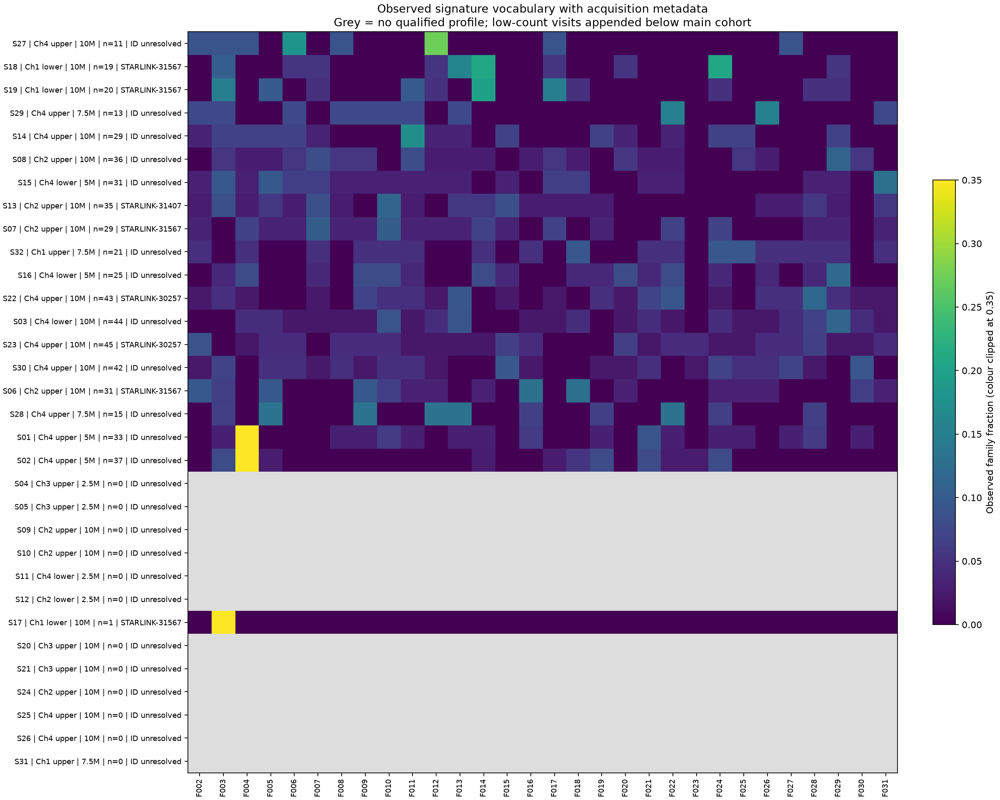
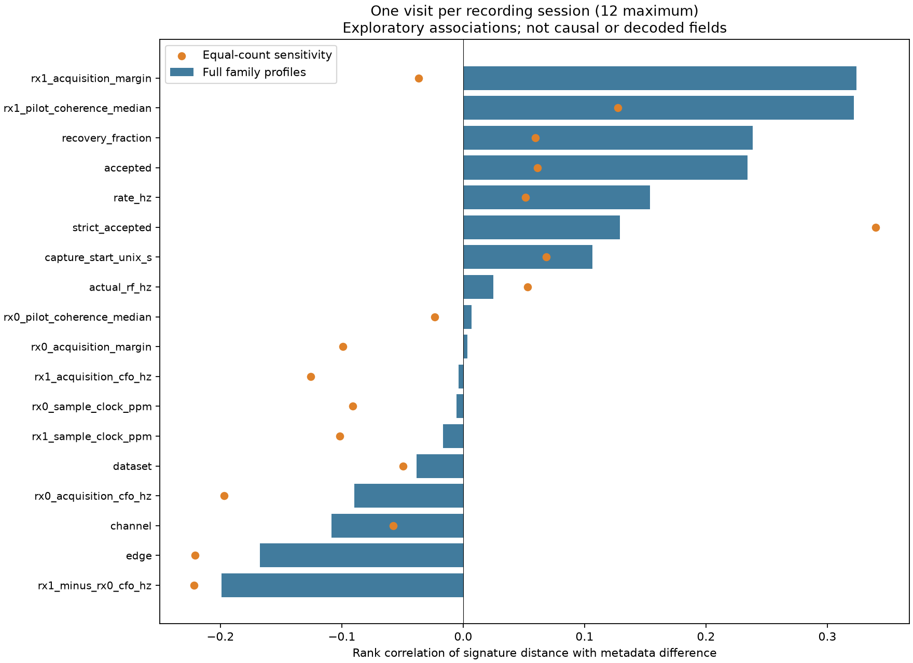

# Signal metadata and its relationship to recovered signatures

2026-09-28. [Open the searchable metadata report](local/metadata_report.html).
It covers all 32 local visits and 57 receiver excerpts in the decoding study.
The original UT reference entries are described separately because they do not
share our acquisition metadata. No new RF was collected or payload decoded.

## What is available

| Category | Fields presented | Interpretation |
| --- | --- | --- |
| Acquisition | Dataset, session, visit, receiver, channel, upper/lower edge, sample rate, bandwidth, RF tuning, IF LO, configured IF offset, excerpt and valid dwell duration | Saved recording/visit metadata; RF tuning is the sampled edge frequency, not necessarily the full channel centre |
| Frequency and timing recovery | Separate RX0/RX1 acquisition CFO, their difference, acquisition epoch, score/margin, sample-clock estimate in ppm, median pilot coherence, carrier bins | Decoder estimates, with hardware/algorithm contributions; not decoded message fields |
| Time | Capture-start UTC and bracket width; source sample counters; associated track-observation UTC where available | Capture start is not visit start. No fabricated exact UTC is assigned to an excerpt from capture start alone |
| Receiver geography | Latitude, longitude, pose revision, provisional west/east RX mapping | Operator-supplied roof position; height, antenna elevation and surveyed RF baseline remain unknown |
| Satellite association | Prior conditional Starlink name/NORAD, receiver-specific track IDs, status, validation RMS, fit offset, midpoint azimuth/elevation | Inferred from geometry and tracking, not recovered from transmitted bits |
| Orbit/track information | DS7 candidate-model Doppler, azimuth/elevation/range at the associated observation; measured normalized track CFO and slope | Conditional on the archived orbit candidate; all matched track candidates remain explicit |
| Signature | Accepted and strict word counts, recovery fraction, unique words/families, empirical entropy and full family profile | Describes the detected sample; not an independent information-bit count |

[metadata_signals.csv](local/metadata_signals.csv) is the visit-level lookup.
[metadata_receivers.csv](local/metadata_receivers.csv) preserves the separate
receiver values. [metadata_tracks.csv](local/metadata_tracks.csv) contains 34
DS7 track links and candidate orbit values. DS8 saved label evidence is retained
in [metadata_details.json](local/metadata_details.json), including unresolved
and tentative alternatives. The full JSON also includes original acquisition
metadata, capture entries and pose evidence. File hashes are recorded in
[metadata_sources.json](local/metadata_sources.json).

## Frequency shift is not the same as Doppler

The acquisition CFO is the frequency correction used for this decoder solution.
It can contain geometric Doppler, receiver/transmitter frequency errors and
acquisition ambiguity. The two receivers differ by roughly 0.66–0.69 MHz in
these paired excerpts. This difference must not be interpreted as the Doppler
difference of two satellites or proof of a physical oscillator offset alone.

The exported track pipeline expresses frequency at a canonical **11.2 GHz**.
We retain this separately from acquisition CFO and physical RF tuning. The
candidate model computes `Doppler = −(frequency / c) × range_rate` at the known
site. Positive model Doppler means approaching. The track fit additionally has
a constant offset; that offset is not geometric Doppler. Where archived DS7
states exist, the table provides both canonical-frequency model Doppler and its
properly scaled value at the tuned RF.

For example, the prior-linked STARLINK-31567 DS7 observations give canonical
model Doppler of approximately +94.9 kHz (S17), +66.5 kHz (S18) and −4.9 kHz
(S19). These are candidate-model values at associated track observations, not
decoded timing/orbit fields or corrected acquisition CFO. The DS8 visit-model
values are left blank where those archived states were not available in this
join; saved track-fit offsets and midpoint angles remain available.

## Satellite labels and newly exposed candidate tracks

The original clustering table carried only the labels in the joint decoding
study. The metadata join exposes more prior track annotations, including:

| Visits | Additional candidate association | Binding limitation |
| --- | --- | --- |
| S01/S02 | STARLINK-32885; RX1 likely, RX0 tentative | Visit/RX/RF membership only |
| S03 | STARLINK-31225; both RX likely | Visit/RX/RF membership only |
| S04/S05 | STARLINK-36048; both RX likely | No qualified full words |
| S20/S21 | STARLINK-36042; RX1 likely | Single-receiver provisional decoding |
| S27 | STARLINK-5530; RX1 likely | No corresponding qualified RX0 track link |
| S31/S32 | STARLINK-35802 candidate; S32 also has a competing RX0 track | Ambiguous visit membership is retained |

“Likely” is the prior annotation's conditional diagnostic status. Merely sharing
a visit, receiver and RF does not prove that the exported decoder candidate is
the same trajectory solution: S17 and S32 demonstrate that multiple tracks can
occur in one visit. These newly exposed candidates are **not promoted to the
identity labels used in correlations**. Previous labels are carried forward
with their original confidence limits; no new identity decision is based on
signature similarity. Receiver-specific links are never silently copied to a
missing peer receiver.

## Correlation screen

The signature is the observed distribution of rotation/inversion families of
60-bit words. The comparison uses base-2 Jensen–Shannon distance. Numeric
attributes use absolute differences; categorical attributes use same/different;
azimuth differences wrap through north. A positive association means visits
with more different metadata tend to have more different signatures.

There are 19 visits with at least 10 accepted observations, representing only
12 sessions. The primary screen chooses the most-supported visit per session,
with signal-ID tie breaking, before testing attributes. This avoids counting
same-session revisits as independent replicates, but does not guarantee that
different sessions represent independent satellites or passes.

Each test permutes whole session labels 4,999 times and uses a two-sided rank
association statistic. Pair entries are never permuted independently. The
18 testable primary attributes share a Benjamini–Hochberg correction. This is an
exploratory screen with exchangeability assumptions, not a causal analysis or
a calibrated claim about the Starlink protocol.

| Attribute | Primary rank association | Unadjusted permutation p | Equal-count sensitivity |
| --- | ---: | ---: | ---: |
| Channel | −0.109 | 0.623 | See full table |
| Upper/lower edge | −0.167 | 0.421 | −0.221 |
| RF tuning | +0.025 | 0.909 | See full table |
| Sample rate | +0.154 | 0.458 | +0.051 |
| RX0 acquisition CFO | −0.090 | 0.682 | See full table |
| RX1 acquisition CFO | −0.004 | 0.987 | See full table |
| RX1 pilot coherence | +0.322 | 0.090 | +0.127 |
| RX1 acquisition margin | +0.324 | 0.117 | −0.037 |
| Recovered word count | +0.234 | 0.100 | +0.061 |

**None of the 18 testable attributes survives correction at q < 0.05.** The
smallest q is approximately 0.525. The strongest exploratory hints involve
recovery quality and sample count, and weaken in the existing equal-count
subsampling sensitivity. This is compatible with detection/sampling effects;
it does not establish them as the sole cause of signature variation.

The exact-word analysis and descriptive all-visit correlations are included
in [metadata_correlations.csv](local/metadata_correlations.csv). They do not
receive separate significance claims. Keeping rotations/polarity makes some
values change but does not supply decoded field semantics.

Only three selected sessions carry the earlier conditional identities, and
only two have prior-linked model-Doppler/range values. We therefore do not
assign inferential p-values to identity, orbit geometry or Doppler. Their
all-visit correlations are descriptive and especially vulnerable to repeated
passes and small sample size. A high azimuth/range correlation in that tiny
subset should not be mistaken for a discovery.





## What this tells us

The available evidence does not yet identify channel, RF shift, band edge or
satellite identity as the meaning of these words. This negative small-sample
screen does not rule out such a relationship. Channel, edge, tuning, receiver
quality, capture time and orbit geometry are confounded, and our excerpts were
selected for prior decoding investigations rather than sampled randomly.

A useful next offline step is to verify the additional candidate bindings and
extend comparable orbit-model annotations before testing identity or Doppler.
For the signature itself, ordered word transitions with explicit missing-frame
gaps may be more informative than an unordered histogram. Neither step requires
assuming that a family is a satellite identifier.

## Reproduction

Run after the original clustering and clustering-review scripts:

```bash
OPENBLAS_NUM_THREADS=1 uv run --no-project --with numpy --with scipy python reports/2026_09_28_signal_clustering/signal_metadata.py
OPENBLAS_NUM_THREADS=1 uv run --no-project --with numpy --with scipy --with matplotlib python reports/2026_09_28_signal_clustering/correlate_metadata.py
OPENBLAS_NUM_THREADS=1 uv run --no-project --with numpy --with scipy --with matplotlib --with pytest python -m pytest -q -o addopts='' reports/2026_09_28_signal_clustering reports/2026_09_28_ds7_ds8_correspondence/test_native_rates.py
```

All generated datasets, HTML and figures remain in ignored `local/`. No data
was committed or pushed. Sources are read-only; original decoding evidence is
unchanged.
