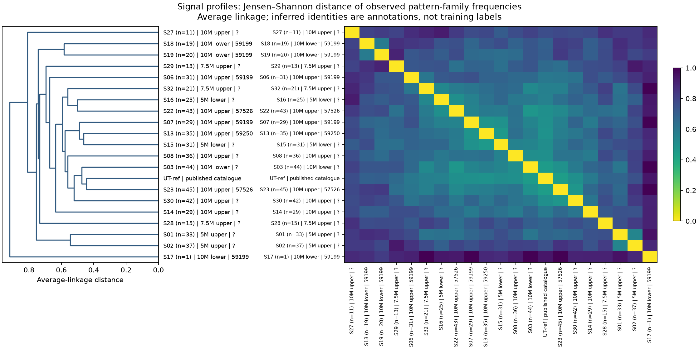
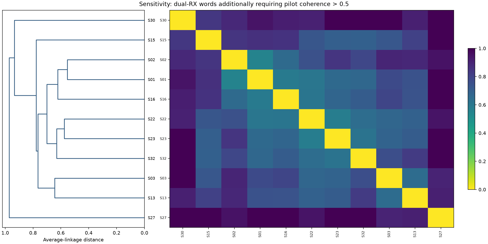

# DS7/DS8 signal decoding and hierarchical comparison

2026-09-28. This offline study reanalyzes the locally exported IQ excerpts used
in our previous DS7/DS8 decoding investigations. It recovers repeated 60-bit
T-code patterns, catalogs their occurrences, and compares all visit pairs.
It does **not** recover satellite identifiers, position, time, orbit fields,
or user payloads. Satellite annotations remain conditional Doppler associations.

**Clustering update:** the tree/heatmap row-order bug has been fixed and all
figures regenerated. See [the clustering review](CLUSTERING_REVIEW.md) and
[alternative-method report](local/alternatives.html) for the recommended
19-visit cohort, equal-count sensitivity, and five method comparisons.
The broad inventory analysis below is retained as context.

**Metadata update:** [signal information and correlation findings](METADATA_FINDINGS.md)
and the [searchable metadata report](local/metadata_report.html) join channel,
frequency offsets, receiver quality, geometry and conditional satellite evidence
to the decoded signatures.

**Phase-state finding:** [the sequence follow-up](../2026_09_28_sequence_semantics/README.md)
identifies an exact cyclic generator for all 60 recovered words. Rotation-based
families merge opposite phase indices; the phase choice's protocol meaning
remains unresolved.

## Findings

- 32 distinct local visits: 25 paired-receiver visits and seven single-receiver
  visits. Duplicate exports are collapsed, retaining the longest excerpt per
  receiver and visit/start/edge. This is coverage of exported decoding excerpts,
  not every recording or track in the full DS7/DS8 archive.
- 560 qualifying 60-bit observations across 20 visits: 385 at 10 MS/s,
  49 at 7.5 MS/s and 126 at 5 MS/s. None qualified at 2.5 MS/s.
  These are observations, not 33,600 independent information bits.
- 222 observations in 11 visits additionally pass the stricter pilot-coherence
  gate. The two tiers are available separately; quality thresholds materially
  affect coverage.
- The local observations contain 59 exact words and 30 rotation/inversion
  families. All 560 have even parity. Every local family occurs in the UT
  reference. Four observations (S22 and S30) have an exact word absent from the
  reference sample, but belong to an existing reference family.
- Together with 347 previously qualified UT reference observations, the lookup
  contains 60 exact words and 31 families. The UT pool itself contains 59 exact
  words and 31 families. Matching this finite sample is corroborating evidence,
  not an exhaustive definition of the transmitted alphabet.
- Same-identity visits do not form exclusive clusters. Restricting to annotated
  visits with at least 10 qualifying observations, mean family-distribution
  distance is 0.680 for seven likely-same-identity pairs and 0.667 for 14
  likely-different-identity pairs. These are descriptive, dependent pair counts,
  not a significance test. S07 (likely NORAD 59199) and S13 (likely 59250)
  have distance 0.484, while S22/S23 (likely 57526) have distance 0.531.
- S17 has only one qualifying observation; its isolated position is insufficient
  evidence of a distinct signal type. Sample counts are shown on the plot.
- The conservative early-header stability test yielded no shared stable
  positions between distinct visits. Header-distance entries therefore remain
  missing. This does not establish that the headers contain no information.

The expanded evidence supports a shared pattern vocabulary across visits and
likely satellites. It does not support reading the words directly as unique
satellite IDs. Changes in frequency of words could reflect scheduling or other
state, but no field meaning has been established.

## Deliverables

Open [the standalone searchable report](local/all_vs_all.html) for the signal
inventory, all ordered signal comparisons, bit/hex lookup and embedded figures.

| File | Contents |
| --- | --- |
| [signals.csv](local/signals.csv) | 32 local visits plus UT reference and raw-IQ reference entries |
| [signal_pairs.csv](local/signal_pairs.csv) | All 34 × 34 = 1,156 ordered pairs, including diagonals and missing comparisons |
| [word_lookup.csv](local/word_lookup.csv) | 60-bit strings, hex, family IDs, counts, visit membership and UT matches |
| [observations.csv](local/observations.csv) | Frame-level candidates, qualification and strict-pilot flags |
| [signal matrix](local/signal_family_js_distance.csv) | Family-frequency distance; blank means insufficient evidence |
| [strict matrix](local/strict_signal_family_js_distance.csv) | Additional pilot-coherence filter |
| [word matrix](local/word_hamming_bits.csv) | All exact-word Hamming distances |
| [family matrix](local/family_hamming_bits.csv) | All rotation/inversion-minimized distances |
| [summary.json](local/summary.json) | Counts, input hashes and linkage matrices |





## Methods and interpretation

The native-rate decoder uses the original sample rate, known synchronization
and pilot structure, and up to 90 complete frames of each available excerpt.
Typical paired 120 ms excerpts provide 89 frames, split into calibration and
45 evaluation frames. Short single-receiver excerpts provide seven evaluation
frames. Calibration/evaluation splitting is seeded and reproducible.
Single-receiver words remain provisional and do not enter clustering.

For each evaluation frame, RX0 selects a 64-symbol window with an internal
selection split. Each receiver independently estimates the 60-position word.
The primary exploratory qualification follows the historical T-code criteria:
all 60 positions observed and exactly agreeing between receivers, selection
and receiver-held-out correlation above 0.25, and held-out correlation exceeding
the maximum of 1,000 shuffled same-weight word controls. The strict tier also
requires pilot coherence above 0.5 in both receivers. These controls are not
a calibrated experiment-wide false-discovery rate; the receivers observe the
same transmission and are not independent transmitted messages.

Previously saved shorter-run successes are not pooled with this new run.
Different calibration splits and the extended pilot fit mean the 560 observations
are not necessarily a superset of all earlier accepted frame observations.
Historical results remain preserved in the earlier report folders.

UT-ref reuses the existing two-frequency-slice held-out analysis of published
hard symbols (347 qualified frames out of 1,009). It is not a fresh raw-IQ decode
of the whole UT recording. UT-IQ records the earlier seven-frame raw-IQ check:
demodulation was verified, but no long qualified T-code block was available.
Consequently UT-IQ remains in the inventory with missing word comparisons.

Three separate distances avoid conflating different questions:

1. **Exact words:** Hamming distance from 0 to 60 differing bits.
2. **Families:** minimum Hamming distance over 60 cyclic rotations and global
   inversion. This intentionally removes alignment/polarity distinctions; it
   could also remove meaningful distinctions and is not a decoded field model.
3. **Visits:** base-2 Jensen–Shannon distance between observed family-frequency
   distributions, from 0 (same distribution) to 1 (disjoint support).

All trees use average linkage and optimal leaf ordering. No arbitrary cut is
presented as a discovered number of satellite classes. Only 20 local visits and
UT-ref have sufficient words for the main tree; zero recovery is never converted
into a zero-distance match. Trees are descriptive and have no bootstrap support
or adjustment for unequal detection probability, excerpt duration, edge or SNR.
The strict subset illustrates quality sensitivity but changes which visits are
available, so it cannot validate all branches of the main tree.

Early-header analysis separately tests symbols 2–9, requiring stable real-part
signs across split frame sets in both receivers with adequate pilot coherence.
It compares only overlapping native carrier positions on the same edge, requiring
at least 16 shared stable positions. No distinct-visit pair met that condition.

## Reproduction and data handling

Run from the repository root with the existing ignored local IQ exports present:

```bash
OPENBLAS_NUM_THREADS=1 uv run --no-project --with numpy --with scipy python reports/2026_09_28_signal_clustering/decode_excerpts.py
OPENBLAS_NUM_THREADS=1 uv run --no-project --with numpy --with scipy --with matplotlib python reports/2026_09_28_signal_clustering/cluster_signals.py
OPENBLAS_NUM_THREADS=1 uv run --no-project --with numpy --with scipy --with pytest python -m pytest -q -o addopts='' reports/2026_09_28_signal_clustering/test_cluster_signals.py reports/2026_09_28_ds7_ds8_correspondence/test_native_rates.py
```

Decoder checkpoints reuse matching inventory hashes. If changing the decoding
algorithm, use a fresh output directory or explicitly remove only these generated
checkpoints before rerunning. Original IQ hashes are checked during recovery.
Eleven focused tests pass, covering native-rate handling and comparison/acceptance
invariants. No new RF collection was performed. Generated data and figures are
under ignored `local/`; nothing was committed or pushed for this study.

The next useful semantic test is a prospectively specified relationship between
word transitions and independently timestamped transmitter state, evaluated on
new held-out passes. Clustering alone cannot establish that relationship.
