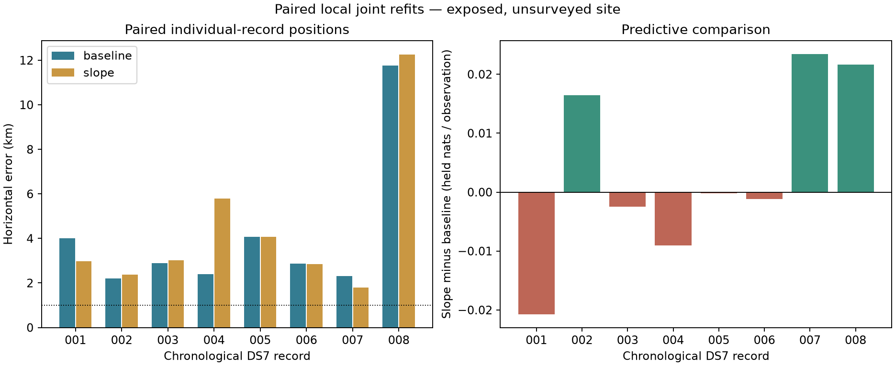

# Paired joint position/timing/slope fits: geographic result

**Do not promote the unconstrained shared-slope model to the DS7 baseline.**
Across the eight predeclared records, median horizontal error worsens from
**2,872.870 m to 3,001.152 m**. Three records improve and five worsen; neither
arm produces a sub-kilometer result. All 16 selected fits qualify. A positive
pooled held-score gain therefore does not establish a location improvement.

## Paired results

| Record | Baseline error, m | Slope error, m | Error change, m | Held gain, nats | Fitted native slope, Hz/s |
| --- | ---: | ---: | ---: | ---: | ---: |
| 001 | 4,004.258 | 2,983.949 | −1,020.309 | −19.065457 | +3.469571 |
| 002 | 2,205.179 | 2,373.898 | +168.719 | +16.860493 | +2.788912 |
| 003 | 2,886.622 | 3,018.356 | +131.734 | −2.720637 | −0.416970 |
| 004 | 2,407.336 | 5,788.232 | +3,380.896 | −10.434054 | +8.139591 |
| 005 | 4,065.120 | 4,078.033 | +12.913 | −0.303045 | −0.053066 |
| 006 | 2,859.119 | 2,849.249 | −9.869 | −1.408687 | −0.674490 |
| 007 | 2,316.450 | 1,800.258 | −516.193 | +22.925677 | +5.295073 |
| 008 | 11,769.673 | 12,260.405 | +490.732 | +19.578309 | +4.038017 |

Positive error change is worse; positive held gain is better. The difference
between the two median errors is **+128.282 m**; the median of paired error
changes is **+72.324 m**. These are distinct statistics. All-returned and
paired-qualified aggregates coincide because all eight pairs qualify.

The slope arm gains **+25.4326 pooled held nats**, but only **3/8 records** have
a positive held gain. The equal-record mean is +0.00347318 nats per held
observation. Training scores improve on all eight records, as expected for an
extra fitted parameter. Twelve of 486 training MAP nominees change; this does
not establish correct satellite identity.

## Why the earlier shadow gain was insufficient

The [conditional transfer test](../2026_09_28_subkm_slope_transfer/README.md)
held the pooled full88 position and timing fixed. This comparison lets each
record's position, timing and slope move jointly. They answer different questions.
Record 001's conditional slope benefit becomes a held-score loss when fitted
jointly. Record 008, the largest conditional transfer gain, remains more than
12 km from the reference despite its positive joint held gain. Record 004's
new freedom moves its position substantially farther from the reference.

The [earlier identifiability study](../2026_09_28_subkm_slope_identifiability/README.md)
correctly exposed an information cost, but positive local curvature never
guaranteed geographic accuracy. This experiment supplies the missing geographic
comparison. It does not rule out independently constrained oscillator models
or every possible slope formulation; it rejects promotion of this tested variant.

## Frozen fitting and qualification

The [protocol](PROTOCOL.md) fixed all first eight chronological DS7 records,
with no selection by prior gain. Both arms start from the same sealed independent
position/timing estimate with timing perturbations 0, −0.25 and +0.25 s. Slope
starts at zero. Both use the same original Student-t full-candidate mixture,
stationary per-nominee offsets, observation masks, ±12 km position bounds and
±5 s timing bounds. The augmented arm adds one per-record shared slope bounded
to ±20 native Hz/s. No spatial penalty or new clock prior is introduced.

This is a paired local warm-start comparison, not a global optimization search.
Each arm selects the largest training score among successful starts; neither
held data nor reference error selects a start or setting. Qualification additionally
requires an interior selected estimate and maximum absolute fitted-coordinate
gradient <=0.01. Geographic distance is evaluated only by the separate
[coordinator](score.py), after [fit outputs were sealed](fit-seal.json).
The historical baseline training and held scores replay within 1e-8 before
refitting; paired baseline geographic errors differ from historical errors by
less than 1 cm.

**47/48 starts report optimizer success; 45/48 meet the stricter qualification.**
All 16 selected fits qualify, and none reaches a position, timing or slope bound.
The unsuccessful start is record 004 baseline at zero timing perturbation
(`ABNORMAL` termination near the historical stationary solution). Two successful
but nonselected slope starts fail the gradient threshold: record 004 at +0.25 s
and record 006 at −0.25 s. All receipts are retained. No failed start was retried,
and qualification did not substitute a lower-scoring selected solution.
The largest slope-arm position separation across starts is about 1.278 m.

## Curvature at the selected fitted points

The [supplementary protocol](CURVATURE-PROTOCOL.md) reevaluates all selected
slope fits before geographic scoring. All eight curvature checks pass, all
observed Hessians remain positive, and no tested perturbation crosses a timing
knot or changes visibility. Worst-direction position information retention,
with timing free in both comparisons, is:

| Record | Retention after freeing slope at the fitted point |
| --- | ---: |
| 001 | 41.54% |
| 002 | 75.78% |
| 003 | 42.62% |
| 004 | 38.21% |
| 005 | 86.21% |
| 006 | 97.99% |
| 007 | 75.64% |
| 008 | 99.77% |

Main/half-step Hessians agree to relative Frobenius difference <=0.0000569.
These remain local curvature diagnostics, not calibrated location uncertainties.
Good numerical conditioning does not correct biased observables or incorrect
candidate associations, and it does not rescue the geographic result.

## Evidence and limits

Eight paired runs exited zero in **250.04 seconds total**, with maximum
46.98 seconds per record and peak resident memory 173,024 KiB. The separate
curvature batch took **43.38 seconds**, peaking at 306,664 KiB. Frozen limits
were 180 seconds per fit record and 180 seconds for the curvature batch, 4 GiB,
one numerical thread and nice19. No new RF, IQ processing, orbit propagation
or source-store mutation occurred.

Two new component tests verify known-optimum nested fits, identical initial
position/timing states, and preservation of boundary failures. They pass with
Ruff. The preceding gradient/held-independence tests remain bound to the launch.
The [independent export audit](audit_results.py) verifies **134 bindings**,
all **48 start receipts**, selection/qualification rules and **16 geographic
distances** using a distinct three-dimensional great-circle calculation.
It is not an independent optimizer. The PNG/SVG were visually inspected.

The reference is operator supplied and unsurveyed, at a site exposed throughout
development. Both models inherit the same DS6 coordinate origin and frozen
candidate construction. The first eight records are a development panel, not
a representative claim about all DS7 or new sites. Every attempted record is
retained. DS8 and DS9 were not fitted in this experiment.

See [scores and aggregates](scores.json), [fit outputs](results/),
[execution receipts](receipts/), [curvature outputs](curvature/),
[audit summary](audit-summary.json), [SVG](joint_slope.svg), and
[complete evidence index](evidence-sha256.json).

## Next priority

Keep the original baseline and stop expanding this free-slope variant on the
basis of conditional predictive gains. Establish unchanged, manifest-bound
geographic baselines on bounded chronological DS8 and DS9 panels next, retaining
individual and pooled budgets separately. That supplies a transfer benchmark
for subsequent measurement-quality and track/candidate-contamination work.
Review earlier null/robust-model experiments before adding another such variant.
A clock-constrained slope model would require independent calibration evidence;
its constraint should not be tuned to these roof errors. Consistent sub-kilometer
performance for DS7/DS8/DS9 remains unachieved.
