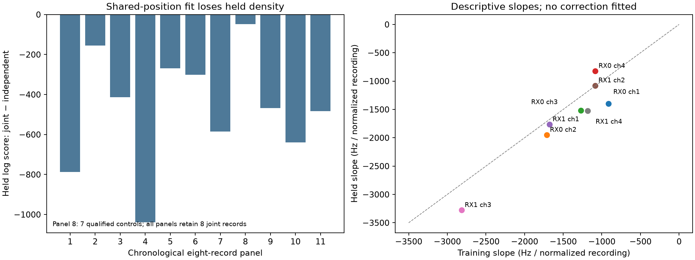

# Toward sub-kilometer DS7/DS8/DS9 localization: full88 residual transfer

The missing full88 diagnostic is now complete. The frozen shared-position DS7
model loses held predictive density to qualified independent-position fits in
**every one of eleven chronological panels**, totaling **−5,188.377 nats across
87 paired recordings**. All 88 recordings retain joint diagnostics; the original
boundary-limited independent estimate remains explicitly unqualified.

This is new model-diagnostic evidence, not a new location estimate. It favors
testing constrained frequency-time nuisance and contamination models before
adding more receiver-tilt terms. It does not establish physical oscillator drift.

## Where the sub-kilometer objective stands

| Dataset | Frozen recordings | Localization evidence available here | Remaining gap |
|---|---:|---|---|
| DS7 | 88 | Full pool 677.323 m; individual median 2,571.168 m; 13/88 below 1 km | Consistent individual and short-panel performance; prior contribution |
| DS8 | 65 | Membership/pose verifier passes; receiver diagnostics exist for an explored subset | Bind baseline observation/bank exports and evaluate exact population |
| DS9 | 105 | Membership, analysis and evaluation-unit verifier passes | Bind matching model inputs and run frozen transfer evaluation |

DS7 numbers are the existing [sealed benchmark](../2026_09_27_ds7_full88/REPORT.md),
not results produced by this audit. Its inherited DS6 coordinate already has
809.029 m error; the 677 m pooled estimate does not isolate measurement information
from prior site knowledge. The common reference is operator supplied and
unsurveyed, and this is one exposed site. Neither held frequency likelihood nor
a pooled coordinate establishes surveyed accuracy or sub-kilometer spatial
resolution for individual recordings.

Pending clarification of the desired observation budget, prioritize individual
recordings, report chronological groups of eight as a secondary budget, and retain
full-pool results separately. Report every attempted recording, qualification,
median/tail errors and below-1-km fractions rather than only the best coordinate.
This working benchmark choice is not evidence that any target has been met.

## Fixed-prediction audit

The [new protocol](PROTOCOL.md) preserves the old failed full88 attempt. The new
implementation streams one recording bank at a time and treats an unqualified
independent control as unavailable, rather than aborting the whole experiment.
It verifies 264 input artifact hashes and sealed response/request bindings.
Position, timing, candidate banks, train/held masks and scientific model settings
are unchanged. Per-track offsets and candidate weights use training observations
only, as in the original residual audit.

| Quantity | Result |
|---|---:|
| Joint recordings retained | 88/88 |
| Qualified independent comparisons | 87/88 |
| Eligible tracks | 5,131 |
| Training observations | 143,207 |
| Held observations | 95,894 |
| Joint training conditional-MAP RMS | 625.227 Hz |
| Joint held conditional-MAP RMS | 655.803 Hz |
| Paired joint−independent held predictive score | −5,188.377 nats |
| Recordings with positive paired difference | 13/87 |

`single-062` has joint diagnostics and its original independent boundary flag;
its independent comparison is null. The 87-record paired statistic is not an
all88 independent score. Conditional-MAP RMS is a descriptive selected-candidate
quantity; held predictive scores retain the candidate mixture with weights fixed
by training. The mixture bank is incomplete and concentration is not identity truth.

| Chronological records | Qualified pairs | Joint−independent held nats |
|---|---:|---:|
| 001–008 | 8 | −786.791 |
| 009–016 | 8 | −154.722 |
| 017–024 | 8 | −413.833 |
| 025–032 | 8 | −1,038.913 |
| 033–040 | 8 | −269.469 |
| 041–048 | 8 | −300.534 |
| 049–056 | 8 | −584.881 |
| 057–064 | 7 | −47.225 |
| 065–072 | 8 | −468.612 |
| 073–080 | 8 | −639.486 |
| 081–088 | 8 | −483.910 |

These panels partition the frozen full88 prediction for diagnosis. They are not
eleven newly fitted group-position models, and their totals are not per-observation
normalized. Independent-position fits have more spatial freedom and can absorb
model error into incorrect locations. Their better held density therefore does
not mean their geographic estimates are better.

All eight receiver/channel aggregate slopes are negative in training and held
partitions. Training slopes range from −914 to −2,816 Hz per normalized recording;
held slopes range from −823 to −3,278. Time and residuals are centered separately
within each track/partition before pooling. These are descriptive slopes, not
training-fitted corrections evaluated on held data. They are in canonical
11.2-GHz-normalized exported frequency units, not directly hardware Hz/s.
Their aggregate agreement can conceal recording variation and does not separate
receiver drift, transmitter drift, time warp, association errors or estimator bias.

## Ranked modeling directions

| Priority | Approach | Reason from current evidence | Gate before geographic promotion |
|---|---|---|---|
| 1 | Shared-position model with a constrained per-capture frequency-time nuisance | All chronological panels expose mismatch; train/held aggregate slopes share sign | Training-only shadow fits; chronological transfer; exact zero replay; mixture-gradient and position/nuisance identifiability checks |
| 2 | Explicit track contamination/null component and robust track influence accounting | Heavy residual tails remain despite Student-t observations; conditional candidate concentration is often one | Retain all observations; freeze null prior; improve held mixture density and synthetic wrong-track discrimination |
| 3 | Timing/sample-time-warp sensitivity jointly with frequency nuisance | Existing recording timing freedom does not remove mismatch; timing and slope can mimic position | Separate identifiable effects with injections and profile curvature; preserve hardware uncertainty |
| 4 | Known-pilot frequency measurement refinement on continuous lanes | Existing waveform evidence is limited; better frequency input could reduce bias | Repeated held-waveform improvement, alias/unit parity and continuity controls before replacing baseline inputs |
| 5 | Receiver geometry as candidate evidence | Nominal-beam and four-state signed geometry failed their held development gates | Pass unsigned/swap/reversal/candidate-specific controls and an independent frequency bridge |

Priority 1 is a **statistical nuisance experiment**, not a calibrated clock model.
Do not share drift across captures/receivers as hardware truth without verified
topology and independent bounds. Begin with a predeclared training-only shadow
comparison on existing DS7 banks; do not use held slopes above as fitted corrections.
If the nuisance absorbs position information or only improves training fit,
reject it even if a resulting coordinate happens to lie nearer the known roof.

## DS8/DS9 transfer plan

Freeze candidate eligibility, frequency normalization, temporal masks, prior,
nuisance form and controls using DS7 development evidence before looking at new
geographic scores. DS8 is partly explored and must be labeled accordingly. DS9
analysis completion does not imply an exhaustive candidate bank: its production
tracking has a four-group limit and preserves deferred groups.

Build read-only observation/candidate export bindings from each immutable dataset
manifest through the existing public ports. Audit complete recording denominators,
causal orbit authority, frequency units and source hashes. Establish the unchanged
baseline on matched inputs first, then compare the frozen successor on the same
recordings and masks. No new collection or multi-hour radio campaign is required.
The [readiness receipt](dataset-readiness.json) records that the existing full88
input request covers DS7 only; it does not claim no DS8/DS9 artifacts exist elsewhere.

## Validation and artifacts

Five focused component/original-audit tests pass; Ruff passes. The boundary
regression proves 88 joint records and 87 comparisons survive with one bank loaded
per call. The arithmetic audit verifies exported per-track/aggregate RMS, score
totals, counts and launch bindings. It is not a second independent orbit model.

The run exited 0 in **85.75 seconds**, with **227,300 KiB peak RSS**, under the
300-second/4-GiB limits. Both DS8 and DS9 offline verifiers passed. No geographic
refit, new RF, IQ processing, propagation or QNAP mutation occurred.

- [Protocol](PROTOCOL.md), [diagnostics](diagnostics.json), [audit](audit-results.json).
- [Full record summary](results/summary.json); `results/single-NNN.json` retain
  original masks, residuals, candidate summaries and source qualification.
- [Streaming runner](../../tools/ds7_streaming_residual_audit.py),
  [tests](../../tests/research/test_ds7_streaming_residual_audit.py),
  [summary code](summarize.py), [plot code](plot.py), [vector figure](residual_transfer.svg).
- Launch/terminal/resource receipts and `evidence-sha256.json` bind the result.

The objective remains open: no new below-1-km model has been established for
DS8/DS9 or consistently for individual DS7 recordings.
