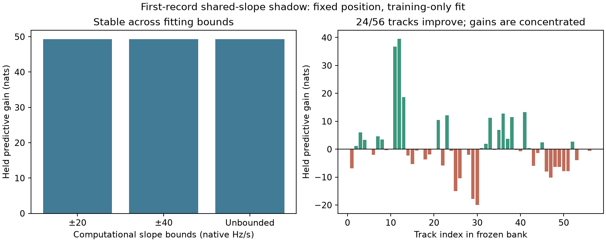

# First-record frequency-slope shadow: predictive gain, concentrated support

A training-only shared slope improves held frequency prediction on DS7's first
chronological recording at the unchanged full88 position. The primary gain is
**+49.335 nats on 918 held observations** (+0.053742 nats/observation). Widening or
removing the computational bound barely changes the result. This passes the
single-record numerical and fixed-position prediction checks, but **does not
establish better location accuracy or a physical clock correction**.

The support is concentrated: only **24 of 56 tracks** improve. The top two track
gains total +76.301 nats, while the remaining 54 total −26.966. These are post-fit
influence diagnostics, not grounds to select or drop tracks. All tracks remain
in the primary score. No generalization claim or model promotion follows.

## Design and population

The [protocol](PROTOCOL.md) froze `single-001`, session
`scan-fw-5f7bf896e4552887`, before the slope fit. Its 56 tracks contain 1,473
training and 918 held observations. Position and timing come from the sealed
full88 joint model; all bank nominees, visibility, masks and catalogue accounting
are unchanged. This is an already explored development recording, not a blind
confirmation record.

One scalar frequency-time nuisance is shared across both software receivers and
all tracks. Its column uses a common capture-time origin and converts native Hz/s
to the canonical exported frequency convention with `11.2 GHz / actual RF`.
Existing stationary track/nominee offsets are profiled on training observations.
The full mixture, including training-updated candidate weights, scores held data.
No held observation chooses parameters, starts, bounds, offsets or candidates.

There is no slope prior. Three starts (0, −2, +2 Hz/s) are optimized under each
predeclared regime. The best converged **training** score selects within a regime;
±20 is the primary regime and the others are sensitivity checks. The bounds are
computational and have no independent hardware-calibration authority.

## Results

| Slope regime | Fitted native Hz/s | Training gain (nats) | Held gain (nats) | Candidate leaders changed |
|---|---:|---:|---:|---:|
| Zero replay | 0 | 0 | 0 | 0 |
| Primary ±20 | +9.104658834 | +237.020465 | +49.335042 | 5/56 |
| Wider ±40 | +9.104658968 | +237.020465 | +49.335040 | 5/56 |
| Unbounded | +9.104658969 | +237.020465 | +49.335040 | 5/56 |

All nine starts converge. The fitted slope is interior under both finite bounds;
the maximum change across regimes is about 1.35e−7 Hz/s. Mean candidate-weight
total variation is 0.062052, and median effective candidate count remains one.
These weights are conditional on an incomplete bank and do not verify identity.

Zero replay matches the prior frozen-position audit within 1e−8 nats:
training −10,456.789480 and held −6,238.232486. The primary fit's training score is
−10,219.769015; held score is −6,188.897445. Both use exactly the same observations.

The analytic full-mixture slope gradient agrees with central finite differences
at −0.5, 0, +0.5 and the fitted slope, within the frozen tolerance. Fixed-position
profile curvature is 7.218685, yielding a local conditional curvature scale of
0.372195 Hz/s. This is not a robust uncertainty interval, a hardware drift error
bar, or evidence of joint position/slope identifiability. Position is fixed here.

The positive fitted slope on this recording also shows why the negative pooled
receiver/channel slopes in the [full88 diagnostic](../2026_09_28_subkm_residual_transfer/README.md)
cannot be used as a common correction. Those were aggregate descriptive slopes;
this is a capture-specific, robust mixture fit with changing candidate weights.

## Decision and next gates toward DS7/DS8/DS9

Continue study of the nuisance, but do not introduce it into the scored geographic
estimator yet. The next checks are:

1. Freeze a chronological multi-record shadow panel with identical starts,
   likelihood, units and zero replay. Report record-level held gains and influence
   without selecting favorable tracks or captures. The first record stays labeled
   development exposure.
2. Test joint position/timing/slope recoverability and profile curvature, including
   constraint removal and candidate alternatives. A nuisance that predicts frequency
   better by absorbing spatial information is not automatically useful for geolocation.
3. Compare a contamination/null-track model on the same masks, since the net gain
   is driven by a minority of tracks. Preserve complete recording denominators.
4. Only after a model passes these gates, freeze it and bind matched DS8/DS9
   observation/bank exports for location scoring. Their 65/105-record membership
   verification is complete; no new DS8/DS9 geographic result is produced here.

Hardware topology and independent drift bounds remain unresolved. The slope could
absorb transmitter effects, time warp, association error or estimator bias; it is
a statistical nuisance, not a calibrated oscillator state.

## Validation and evidence

The bounded run exited 0 in **20.03 seconds**, peak RSS **149,340 KiB**, under its
300-second/4-GiB limits. Two component tests pass: full-mixture gradient/held
independence and known-slope recovery with an unbounded fit. Ruff passes. A separate
export arithmetic audit verifies track gains, weight normalization, total variation,
optimizer convergence and launch source hashes; it is not an independent fitter.

No new geographic score, IQ processing, RF collection, propagation or QNAP write
occurred. The original position's inherited DS6 prior and single unsurveyed site
limitations remain in force.

- [Complete results](results.json), [audit summary](audit-summary.json), [protocol](PROTOCOL.md).
- [Model](../../tools/ds7_shared_slope_shadow.py),
  [component tests](../../tests/research/test_ds7_shared_slope_shadow.py),
  [runner](run.py), [summary and plot](summarize.py), [vector figure](shared_slope.svg).
- Launch, terminal, resource and exit receipts; `evidence-sha256.json` seals artifacts.

The sub-kilometer DS7/DS8/DS9 objective remains open. This experiment changes the
evidence for the next model test, not the established position-error benchmark.
