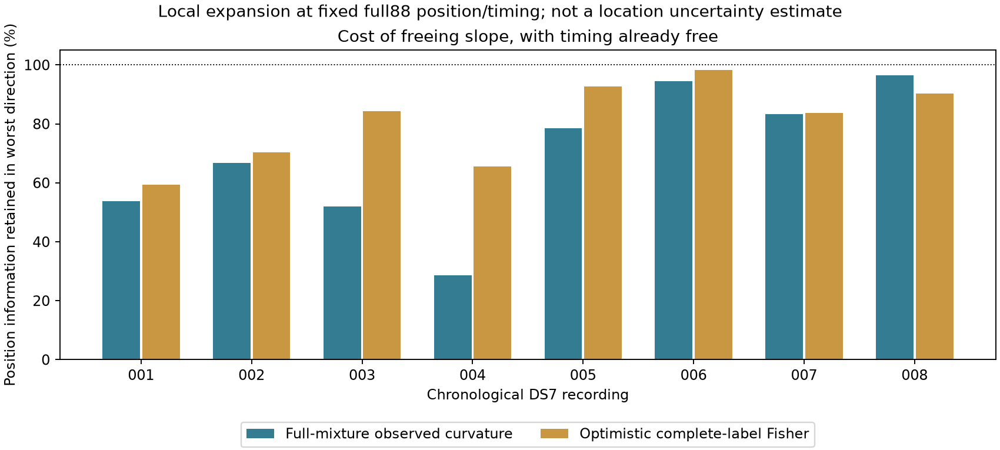

# Does a shared frequency slope hide position information?

**The added slope is locally distinguishable from position and timing in all
eight checked DS7 records, but it weakens position information unevenly.**
In the most affected horizontal direction, the full-mixture observed-curvature
calculation retains **28.6–96.6%** of the position information present when the
slope is fixed. This clears a limited local-degeneracy check, not a geographic
accuracy gate. The next experiment should fit position, timing and slope jointly.

## Comparison and scope

The [protocol](PROTOCOL.md) includes all first eight chronological DS7 records
already used by the slope shadows; no record is selected by its predictive gain.
Each expansion point uses the sealed full88 position and its recording timing,
plus that recording's training-selected ±20 Hz/s slope. These are **not
per-record joint optima**: position and timing gradients remain nonzero.

The [numerical module](../../tools/ds7_slope_identifiability.py) evaluates the
actual Student-t(4, scale 100 Hz) training likelihood with all candidate nominees,
training responsibilities and reprofiled constant offsets. It differentiates
position-dependent Doppler and recording timing, then takes central differences
of the four-coordinate envelope gradient to obtain the observed negative Hessian.
It does not freeze mixture weights while computing that Hessian.

Both comparisons allow timing to vary. The first profiles timing while holding
slope fixed; the second profiles timing and slope. The two resulting horizontal
information matrices are compared by generalized eigenvalues. Adding one scalar
nuisance removes information in at most one horizontal direction locally, so
the other retention eigenvalue is one, as the exported results confirm.

No spatial penalty was added. In this evaluation code the inherited DS6 geographic
center supplies the coordinate origin; its presence in the config is not a
Bayesian spatial-prior term in the evaluated likelihood. The existing weak
constant-frequency-offset penalty remains unchanged.

## Results

| Record | Observed information retained, worst direction | Local inverse-curvature SE ratio | Complete-label Fisher retention |
| --- | ---: | ---: | ---: |
| 001 | 53.71% | 1.365× | 59.39% |
| 002 | 66.67% | 1.225× | 70.35% |
| 003 | 52.01% | 1.387× | 84.35% |
| 004 | 28.56% | 1.871× | 65.50% |
| 005 | 78.42% | 1.129× | 92.63% |
| 006 | 94.39% | 1.029× | 98.22% |
| 007 | 83.33% | 1.095× | 83.75% |
| 008 | 96.56% | 1.018× | 90.26% |

The SE ratio is `1/sqrt(minimum retention eigenvalue)`. It summarizes local
inverse-curvature geometry; it is **not a calibrated position standard error**.
The expansion points are not joint optima, candidate banks are finite, and the
receiver/reference location and signal model have systematic uncertainties.
Positive local matrices do not prove global uniqueness or a correct satellite.

The last column is an optimistic complete-label expected Fisher diagnostic.
It uses the Student-t location coefficient `5/(7*10000)`, training candidate
responsibilities and constant-offset profiling, but omits missing-label
information. It is not the full marginal-likelihood Fisher information. Its
retention ratio need not bound the realized observed-curvature ratio; these
are different matrix constructions. In record 004 it substantially understates
the loss seen by the full-mixture observed calculation.

Record 008 supplied 73.5% of the seven-record conditional predictive gain in
the [transfer study](../2026_09_28_subkm_slope_transfer/README.md), yet retains
96.6% of observed local position information here. Record 004 retains much less.
This supports testing the joint model on every record, with controls, rather
than treating either the largest gain or the most confounded record as decisive.

## Numerical verification

All eight observed four-coordinate Hessians and the profiled position blocks
are positive at their expansion points. All eight numerical check groups pass:

- Training-score replay matches the corresponding sealed shadow within 1e-8.
- All 32 score-gradient checks pass their declared tolerance.
- Candidate visibility stays unchanged across Hessian perturbations, and timing
  steps do not cross a bank interpolation knot.
- Maximum relative Hessian change on halving steps is 0.00000647; maximum
  relative asymmetry is 0.000000235, both below the declared 1% warning level.

Norm comparisons use the declared coordinate units (km, km, seconds, Hz/s);
they are not invariant under arbitrary coordinate rescaling. Raw matrices,
steps, gradients and eigenvalues remain available for inspection.

The [export auditor](summarize.py) verifies **104 launch-source bindings** and
recomputes the Schur complements. It checks retention eigenvalues using a
distinct Cholesky whitening, rather than the fitter's eigendecomposition-based
whitening. This independently checks matrix arithmetic, not the likelihood
implementation. Two component tests cover full-mixture derivatives, directional
curvature, held-data independence, known confounding and independent coordinates.
Both tests and Ruff checks pass. The rendered PNG/SVG were visually inspected.

All eight runs exited zero, with **89.74 seconds total wall time**, maximum
14.96 seconds per record, and peak resident memory 173,156 KiB. Each was capped
at 120 seconds and 4 GiB, with one numerical thread and nice19. No retries,
orbit propagation, IQ processing, RF collection or source-store changes occurred.

See [per-record outputs](results/), [receipts](receipts/),
[audit summary](audit-summary.json), [SVG](identifiability.svg), and
[source/evidence hashes](evidence-sha256.json).

## Next geographic gate

Run a bounded, paired baseline-versus-slope joint-fit comparison on the same
eight records. Freeze starts, limits and training-only selection before fitting;
retain all convergence failures and boundaries. Compare held predictive scores,
candidate changes, and geographic errors only after fitting, without choosing
settings from roof-distance errors. Recheck curvature at fitted optima, including
step/bound sensitivity for the most confounded records.

Only after this gate should an unchanged model be transferred through manifest-bound
DS8/DS9 exports. Their inclusion is authorized, but they were not numerically
evaluated here. Individual-record accuracy remains separate from eight-record
and full-pool performance. This report produces no new geographic estimate and
does not establish the sub-kilometer objective.
