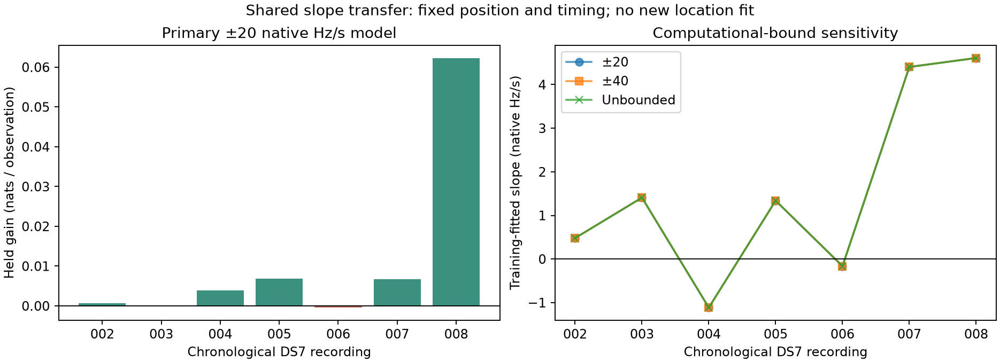

# Shared-slope transfer across seven chronological DS7 records

**Five of seven records improve held predictive score, but the gain is uneven.**
The predeclared equal-record mean is **+0.0113934 nats per held observation**;
the pooled gain is **+76.7175 nats across 7,704 held observations**. Record 008
supplies 73.5% of the pooled gain. This supports keeping the per-record slope
as a model candidate, but does not establish improved location accuracy.

## Frozen comparison

The [protocol](PROTOCOL.md) selected records 002–008 from the original DS7 full88
request before these fits. The unchanged [shared-slope model](../../tools/ds7_shared_slope_shadow.py)
adds one native-frequency slope shared by all tracks and receivers within each
recording. Each recording has its own slope; there is no common clock assumption.
The model uses the original capture-time origin and native-to-canonical RF scaling.

Position and recording timing remain fixed at the sealed full88 joint solution.
Stationary candidate offsets, mixture weights and the slope are fitted using
training observations only. Held scores use the complete candidate mixture,
not the training MAP nominee alone. All three starts (0, −2, +2 Hz/s), all
eligible tracks and all three computational bound regimes are retained.
The ±20 Hz/s regime is primary; ±40 and unbounded are sensitivity checks.
No choice is made using held score or distance from the known roof position.

All DS7 has prior development exposure. These seven records extend the
first-record shadow; they are not a blind site or dataset confirmation.

## Per-record primary results

| Record | Held observations | Native slope, Hz/s | Held gain, nats | Gain / held observation | Improving tracks | MAP changes |
| --- | ---: | ---: | ---: | ---: | ---: | ---: |
| 002 | 1,027 | +0.480933 | +0.686359 | +0.000668 | 28/59 | 0 |
| 003 | 1,105 | +1.408227 | −0.192461 | −0.000174 | 31/61 | 0 |
| 004 | 1,150 | −1.113596 | +4.409508 | +0.003834 | 36/63 | 0 |
| 005 | 1,372 | +1.338784 | +9.348657 | +0.006814 | 33/60 | 0 |
| 006 | 1,168 | −0.162977 | −0.500311 | −0.000428 | 28/61 | 0 |
| 007 | 977 | +4.404291 | +6.580901 | +0.006736 | 35/64 | 1 |
| 008 | 905 | +4.610116 | +56.384815 | +0.062304 | 34/62 | 1 |

Overall, 225/430 tracks improve and only 2/430 change training MAP nominee.
Candidate-weight changes are small: per-record mean total variation ranges
from 0.000180 to 0.018245. Neither MAP stability nor mixture concentration is
evidence of true satellite identity with this finite candidate bank.

## Influence and stability

| Record | Two largest track gains, nats | All other tracks, nats |
| --- | ---: | ---: |
| 002 | +2.878942 | −2.192583 |
| 003 | +6.663828 | −6.856289 |
| 004 | +4.688295 | −0.278787 |
| 005 | +7.820023 | +1.528633 |
| 006 | +0.557373 | −1.057683 |
| 007 | +22.439189 | −15.858288 |
| 008 | +27.647707 | +28.737108 |

These post-fit influence summaries do not remove or refit any tracks. Record
008 retains a positive gain beyond its two strongest tracks; several other
records do not. Excluding record 008 descriptively leaves +20.3327 pooled nats
and an equal-record mean of +0.0029083; this is not a replacement primary endpoint.

All **63/63 starts converged**, and all selected finite-bound fits were interior.
Across the three bounds, the largest selected-slope difference is
**0.00000120 Hz/s**. All 28 analytic-gradient finite-difference checks passed.
Fixed-position profile curvatures are positive, with conditional curvature
standard errors of 0.287–0.466 Hz/s. These are local likelihood diagnostics,
not calibrated physical-clock uncertainties or joint position uncertainties.

The previously exposed first record had +49.3350 held nats. Combining it with
these seven yields a descriptive +126.0525 nats, six positive records out of
eight, and +0.0166869 for the equal-record normalized mean. The original first
record was not rerun or counted as a new confirmation.

## Verification and execution

Each zero-slope replay matches its sealed streaming residual audit's training
and held scores within absolute 1e-8. The runner verifies observation and bank
artifact hashes and uses the correct recording-specific timing coordinate.
The [summary auditor](summarize.py) checks record identities, 77 launch-source
bindings, zero replay, mixture-weight normalization, exported track-score
arithmetic, training-only start selection and all gradient receipts. It is an
export auditor, not an independent numerical fitting implementation.

All seven executions exited zero: **233.93 seconds total**, with the slowest
record at 47.16 seconds and maximum resident memory 173,288 KiB. Each had a
120-second wall limit, 4-GiB address-space limit, one numerical thread and
nice19. There were no retries, omitted records, new orbit propagation, IQ
processing, RF collection or QNAP mutations. Two existing model tests and
Ruff checks passed. The PNG/SVG were visually checked.

Detailed [results](results/), [launch and resource receipts](receipts/),
[machine-readable summary](summary.json), [SVG](slope_transfer.svg) and
[integrity index](evidence-sha256.json) accompany this report.

## Decision toward sub-kilometer evaluation

Retain the scalar nuisance as a candidate, without promoting it into the
location baseline yet. The next gate is a training-only joint position,
timing and slope identifiability check: measure whether slope absorbs the
geographic signal or materially weakens position constraints. A favorable
conditional held score alone cannot answer that question.

If that gate is credible, compare frozen baseline and augmented fits on
individual recordings, reporting every failure, boundary, prior sensitivity
and geographic result. DS8 and DS9 are authorized additional datasets; their
public observation and candidate-bank exports must be bound to their frozen
manifests before numerical location comparisons. They were not evaluated here.
Eight-record and full-pool results remain separate from the individual-record
target. No new sub-kilometer geographic result is claimed by this experiment.
