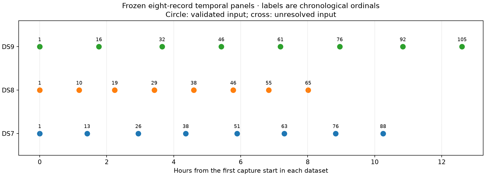

# Validated temporal-coverage inputs for DS7 / DS8 / DS9

**All 24 timestamp-selected records are ready for modeling.** The panels retain
eight records per dataset while extending capture-start coverage from less
than one hour to 8.0–12.6 hours. All requested sessions remain; there were no
substitutions, dropped records or failed scientific stages.

Ten existing inputs were validated and reused. Fourteen new track/bank exports
were generated from already collected, cached analysis through the unchanged
public input ports. No waveform reads or new RF collection were performed.
This is an input-preparation report, not an accuracy result or a new dataset
release. The original DS7/DS8/DS9 manifests remain unchanged.

## Frozen membership and counts

Selection was frozen in the preceding
[coverage proposal](../2026_09_28_covariance_refinement/temporal-coverage-proposal.json):
the nearest capture start to each of eight equally spaced timestamps between
the first and last capture, with ties broken by session ID. No fit outcome,
reference error or cache availability chose the records.

| Dataset | Chronological ordinals | Start span (hours) | Eligible tracks | Training observations | Held observations |
|---|---|---:|---:|---:|---:|
| DS7 | 1, 13, 26, 38, 51, 63, 76, 88 | 10.249 | 470 | 11,853 | 7,983 |
| DS8 | 1, 10, 19, 29, 38, 46, 55, 65 | 8.014 | 483 | 13,807 | 9,340 |
| DS9 | 1, 16, 32, 46, 61, 76, 92, 105 | 12.608 | 478 | 13,507 | 9,255 |
| Total | 24 records | — | **1,431** | **39,167** | **26,578** |

Spans measure first to last capture start, not total active dwell or recording
duration. The historical first-eight spans were 0.825, 0.943 and 0.824 hours
respectively. Full session IDs, source manifests, exclusions and stage outcomes
are in [plan.json](plan.json) and [audit-summary.json](audit-summary.json).

The sample-rate mix also changes, so a later model comparison is an equal-
record-budget temporal-panel comparison, not an isolated causal time-span
ablation:

| Dataset | 2.5 MS/s records | 5 MS/s | 7.5 MS/s | 10 MS/s |
|---|---:|---:|---:|---:|
| DS7 | 2 | 2 | 4 | 0 |
| DS8 | 1 | 3 | 3 | 1 |
| DS9 | 1 | 1 | 3 | 3 |

Track eligibility and the whole-visit training/held partition are unchanged.
Every exclusion remains explicit in each validated record. Equal record count
does not imply equal track count, sample rate or observation count.

## Validation and provenance

- Dataset/capture manifest bindings and frozen timestamp membership checked.
- All reused observation and bank bytes matched the existing published request
  hashes before reuse. Seven DS7 bank/manifest pairs previously held only in
  the local cache were copied into this report and rehashed; see the
  [archive map](input-archive-map.json).
- All new observations use the unchanged public scanner-tracking and numerical
  input ports, minimum track span/support policy and visit partition seed.
- All new banks use the unchanged corrected-DS6 five-anchor, 41-timing-node,
  training-only top8 union and full-catalogue normalization. Existing archived
  provider snapshots supply the satellite propagation; no provider fetches.
- The existing baseline loader checks observation/bank binding, eligible-track
  coverage, bank shapes and timing grid. Sample rate matches each capture.
  Every recorded provider snapshot precedes capture start minus 505 seconds.
- All eight DS9 exports match the GLRT metrics-manifest digest in the minted
  analysis evidence. No newer analysis product was silently substituted.
- The final audit reconciles all 24 requested outcomes and verifies **353**
  execution/input bindings. The original visit-partition regression test passes.

Installed public-reader and numerical source provenance is recorded in
[environment.json](environment.json), with nine module source snapshots in
[runtime-sources](runtime-sources/). The launcher initially encountered a
read-permission error while archiving those installed source bytes, before
any dataset worker started. That original launcher and the repair explanation
are preserved in [bootstrap](bootstrap/). The repair used a privileged read;
no installed source or permission changed and no scientific stage was retried.

## Ready-to-run artifact

[panel-inputs.json](panel-inputs.json) supplies the inherited model configuration
and three validated eight-record groups with exact artifact hashes and paths.
`all_panels_ready` is true. Each record's detailed request and validation is in
[validated](validated/). Three previously published first-record banks are
referenced; this report adds 21 bank archives: seven reused DS7 banks plus
14 newly generated DS8/DS9 banks. Their combined size is 1,282,631,884 bytes;
the largest is 69,892,345 bytes. All selected numerical bank bytes are
available in the repository after publication.

Scientific-stage evidence is under [receipts](receipts/), and per-dataset
completion ledgers are under [workers](workers/). All **52 scientific stages
exited zero**: 14 observation exports, 14 bank exports and 24 validations.
At most two dataset workers ran concurrently, each sequential within its
dataset and bounded to 30 minutes; stage caps were 60/240/30 seconds, 4 GiB, one BLAS thread,
and nice19. Sum of individual stage wall times is **2,020.12 seconds**, not
elapsed campaign time. Longest stage: **144.26 seconds**. Peak RSS:
**886,004 KiB**. No timeouts or deadline omissions occurred.

See [protocol](PROTOCOL.md), [preparation](prepare.py), [stage runner](run_stage.py),
[launcher](launch.py), [auditor/figure generator](audit_plot.py),
[audit log](audit.log), [test log](tests.log), [SVG](temporal-coverage.svg),
[input seal](input-seal.json) and [complete evidence inventory](evidence-sha256.json).
The next experiment applies the same iid, shared-scale and correlated models
to these complete panels with training-only fit selection and separate
geographic and held-score evaluation.
