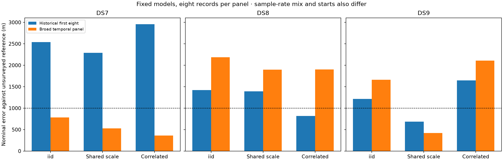

# Fixed models across the DS7, DS8 and DS9 time spans

Broader temporal coverage brings all three fixed models below 1 km on the DS7
panel. Shared track scale reaches 422 m on DS9, but DS8 remains at 1.90–2.19 km.
This does not establish consistent sub-kilometre localization. Errors below are
against the exposed, unsurveyed operator reference, not surveyed accuracy or a
calibrated confidence bound.

## Geographic results

Each entry is historical first-eight error → broader-panel error, in metres.
Every model is retained; models and starts were not selected by geographic error.

| Fixed model | DS7 | DS8 | DS9 |
|---|---:|---:|---:|
| Independent Student-t | 2,541 → **785** | 1,424 → 2,187 | 1,213 → 1,661 |
| Shared track scale | 2,287 → **527** | 1,391 → 1,896 | 683 → **422** |
| Correlated, 10 s decay | 2,955 → **359** | 819 → 1,904 | 1,647 → 2,109 |

Historical results come from [the first-eight comparison](../2026_09_28_covariance_position/README.md).
These are equal-record-count comparisons, not a causal time-span-only ablation:
sample-rate mix, observation counts and optimizer starts also differ. The
inherited geographic origin itself is 809 m from the reference; DS7's independent
fit improves only slightly over that anchor.

## Inputs and fixed protocol

The [published input report](../2026_09_28_temporal_coverage_inputs/README.md)
archives the membership, cached observations, candidate banks, validation,
runtime source snapshots and export receipts. Eight recordings per dataset
were selected nearest equally spaced capture-start timestamps, before outcomes
were inspected. No recordings were substituted. These are panels from the full
datasets, not fits of every recording in DS7/DS8/DS9.

| Panel | Full dataset records | Capture-start span (h) | Eligible tracks | Training observations | Held observations |
|---|---:|---:|---:|---:|---:|
| DS7 | 88 | 10.249 | 470 | 11,853 | 7,983 |
| DS8 | 65 | 8.014 | 483 | 13,807 | 9,340 |
| DS9 | 105 | 12.608 | 478 | 13,507 | 9,255 |

The start spans above are not recording duration or active dwell. The historical
first-eight spans were 0.825, 0.943 and 0.824 hours respectively. All 1,431
eligible tracks were retained. The input report records the one legitimate DS7
eligibility exclusion. Existing cached analyses supplied these inputs; there
was no new RF collection, waveform read or provider fetch.

[PROTOCOL.md](PROTOCOL.md) freezes three models: independent Student-t4 at 100 Hz;
multivariate Student-t4 at 100 Hz with a diagonal scale matrix (shared latent
track scale); and the same multivariate distribution with scale matrix
`100² × (0.8 exp(-|dt|/10 s) + 0.2 I)`. The diagonal multivariate model is not
the independent likelihood. All retain the original weak offset penalty,
visibility rules, full-catalogue normalization and training-only offset fits.

Each dataset fits one position and eight record timings, with no cross-dataset
parameter sharing. Three generic E/N starts, (0,0), (3,-3), (-3,3) km, use zero
timings. Bounds are ±12 km and ±5 s. Selection takes the highest training score
among successful interior optimizations with gradient infinity norm ≤0.01.
Held observations and reference coordinates do not choose starts. The older
comparison used two different starts, as documented in its report.

## Predictive evidence and optimization

Held log-score gains are relative to the independent model fitted to the same
broader panel, in nats. Both alternatives improve every record, but this does
not imply geographic improvement: the correlated DS9 fit is worse geographically.

| Model | DS7 held gain | DS8 held gain | DS9 held gain | Positive records |
|---|---:|---:|---:|---:|
| Shared track scale | +2,784.619 | +4,455.868 | +6,121.547 | 24/24 |
| Correlated, 10 s | +7,017.093 | +11,943.122 | +13,677.201 | 24/24 |

| Panel/model | Qualified starts / 3 | Maximum separation among qualified positions (m) |
|---|---:|---:|
| DS7 independent | 3 | 0.000606 |
| DS7 shared scale | 3 | 0.006322 |
| DS7 correlated | 3 | 0.002626 |
| DS8 independent | 3 | 105.923 |
| DS8 shared scale | 3 | 185.280 |
| DS8 correlated | 2 | 0.002678 |
| DS9 independent | 3 | 0.005740 |
| DS9 shared scale | 3 | 123.613 |
| DS9 correlated | 3 | 0.004284 |

There are distinct local modes in DS8 independent/shared and DS9 shared fits.
Three starts do not certify a global optimum. DS8 correlated `fit1` returned
optimizer status `ABNORMAL` and was excluded, even though its training score
was 2.04e-10 nats above the selected qualified fit. It remains archived; no
retry or qualification relaxation occurred. A process exit of zero is distinct
from optimizer qualification.

All 36 scientific processes completed within their 180 s / 4 GiB limits:
27 fits (26 qualified) and nine held-score/gradient audits. Maximum job duration
was 170.63 s, maximum RSS 644,728 KiB, and summed job wall time 1,099.64 s
(not elapsed campaign time). At most two model jobs ran concurrently, and only
one while input preparation was active. See [resource-summary.json](resource-summary.json).

Seven existing scientific tests passed in [tests.log](tests.log). All nine
selected fits passed full-objective east/north checks at 1 m and 0.5 m: maximum
gradient discrepancy 1.83e-5, below the 0.002 tolerance. Training scores were
replayed within 1e-7, held mixtures used training-only offsets, and track sets,
counts and score sums reconciled. The scorer verified 320 execution hash
bindings and bound 27 dataset/pose reference files. Independent spherical
distance calculations agreed with the evaluation helper.

## Evidence and next experiment

[scores.json](scores.json) contains full precision results, every start,
selection, held scores, gradient checks and reference bindings.
[run.py](run.py), [launch.py](launch.py) and [score_plot.py](score_plot.py) preserve
execution and scoring. Each dataset/model directory contains its request,
selection and per-stage results, launch commands, resource receipts, terminal
logs, exit codes and seals. [evidence-sha256.json](evidence-sha256.json) binds this
report and its dependencies, excluding itself. Runtime versions and installed
source snapshots are in the linked input report.

Shared track scale improves geographic error over the independent model on all
three broader panels, making it worth retaining alongside the correlated model.
The correlated model's predictive advantage does not warrant choosing it as the
localization winner. DS8 is the unresolved geographic failure, and the exposed
unsurveyed reference limits all accuracy claims.

The next bounded comparison is a shared-position fit and leave-one-dataset-out
transfer on these same broader panels, for both fixed covariance models. Source
starts must use only included datasets; held target observations and geographic
error must not choose the model or fit. This tests whether broader donor coverage
changes the previously observed DS8 transfer failure before expanding to all
258 recordings or changing model parameters.
