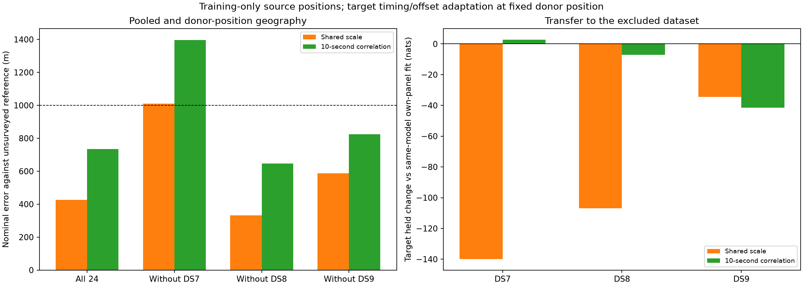

# Shared position and transfer across broad DS7/DS8/DS9 panels

Pooling the timestamp-selected panels gives a nominal geographic error of
**427 m with shared track scale** and **734 m with 10-second correlated
residuals**. Both estimates use all three datasets jointly. They are one shared
site estimate per model, not three independent sub-kilometre results.

The previously poor DS8-excluded transfer improves to 332/647 m. However,
excluding DS7 now gives 1,011/1,395 m. Thus neither fixed model passes every
dataset-exclusion check. The sub-kilometre goal remains unproven across the
evaluations. All errors use the same exposed, unsurveyed operator reference.

## Geographic results

| Source recordings | Held-out dataset for transfer | Shared track scale error (m) | Correlated error (m) |
|---|---|---:|---:|
| DS7 + DS8 + DS9, 24 recordings | None | **426.608** | **733.976** |
| DS8 + DS9, 16 recordings | DS7 | 1,010.930 | 1,395.450 |
| DS7 + DS9, 16 recordings | DS8 | **331.745** | **647.308** |
| DS7 + DS8, 16 recordings | DS9 | **587.194** | **824.827** |

The donor position is fixed throughout excluded-dataset adaptation. Target
training observations can adjust only timing and frequency offsets. No target
observations choose a source fit, and no geographic error chooses a model or
start. The inherited origin is itself 809 m from the reference, with prior
exposure unaudited; this is not a blind deployment validation or surveyed
accuracy result.

For context, the [previous first-eight refinement](../2026_09_28_covariance_refinement/README.md)
gave the following errors. Membership and initialization differ, so this is a
historical comparison, not a controlled time-span-only ablation.

| Source pool | Historical shared scale → broad panel (m) | Historical correlated → broad panel (m) |
|---|---:|---:|
| All three | 895 → 427 | 460 → 734 |
| Without DS7 | 918 → 1,011 | 589 → 1,395 |
| Without DS8 | 1,743 → 332 | 1,984 → 647 |
| Without DS9 | 947 → 587 | 443 → 825 |

Broader coverage changes which exclusion is weakest. A single favourable pooled
number would hide that instability. We do not tune the model to move the
1,011 m result just across the threshold.

## Held prediction and pooling cost

These are held log-score changes in nats against the **same-model separate fit
of the target's own broad panel**. Negative values favour that separate fit.
The comparison keeps the exact target recordings, track set and held counts.

| Excluded target | Shared-scale held change | Positive records / 8 | Correlated held change | Positive records / 8 |
|---|---:|---:|---:|---:|
| DS7 | -139.950 | 2 | +2.750 | 5 |
| DS8 | -106.840 | 2 | -7.042 | 3 |
| DS9 | -34.515 | 2 | -41.399 | 4 |

On all 24 recordings, enforcing one position costs 115.714 held nats for shared
scale and 19.179 for the correlated model, relative to three separate positions.
The corresponding training costs are 191.995 and 125.710 nats. These are
descriptive score differences, not a calibrated significance test. Both pooled
models still beat the independent separate-panel baseline in aggregate held
score (+13,246.320 and +32,618.237 nats respectively).

Every target's fixed-donor training score is below its same-model separate-panel
score. The donor fits do not reveal a higher training optimum missed by the
separate-panel runs. Better held prediction remains distinct from better
geography: correlated DS7 transfer gains 2.750 held nats while its nominal
geographic error rises from the own-panel 359 m to 1,395 m.

## Data and model specification

The [input archive](../2026_09_28_temporal_coverage_inputs/README.md) contains the
frozen eight-record panels spanning 10.249 h for DS7, 8.014 h for DS8 and
12.608 h for DS9. These are capture-start spans, not active dwells. Membership
was selected nearest evenly spaced timestamps before the model results.
Together they contain 1,431 eligible tracks, 39,167 training observations and
26,578 held observations. There is no substitution or new exclusion here.

The [separate-panel comparison](../2026_09_28_temporal_coverage_models/README.md)
supplies the included-dataset starts and exact comparison scores. This experiment
reuses all existing observations and banks, with no RF, waveform reads,
provider fetch, propagation or candidate reselection. It fits 24 or 16 recordings,
not every recording in the full 258-record DS7/DS8/DS9 corpus.

[PROTOCOL.md](PROTOCOL.md) fixes two multivariate Student-t4 models at 100 Hz:
a diagonal scale matrix with a shared latent track scale, and a matrix
`100² × (0.8 exp(-|dt|/10 s) + 0.2 I)`. Both preserve the original weak offset
prior, visibility, full-catalogue mixture normalization and whole-visit split.
The diagonal multivariate model is not the independent Student-t likelihood.

Each source fit has one position and independent record timings. All24 has
three starts, using the qualified same-model DS7, DS8 and DS9 positions. An
excluded-dataset source pool has two starts, using only its included datasets.
Record timings start from the corresponding included-panel fits. Target timing
adaptation uses starts 0, -2 and +2 seconds, with geography held fixed.

L-BFGS-B uses maxiter 140, maxfun 200, ftol 1e-14, gtol 1e-8 and maxls 30.
Bounds are ±12 km and ±5 seconds. A fit qualifies only with optimizer success,
interior parameters and gradient infinity norm ≤0.01. Selection maximizes
training score among qualified fits. There were no retries or relaxed gates.
The execution protocol here controls worker limits; inherited config metadata
describing earlier tranche limits does not describe this campaign.

## Verification and resources

All 18 source starts and all 18 target nuisance fits qualified. Source starts
agree within 0.0051 m for every pool/model combination. This is strong numerical
agreement for the prescribed starts, not a global-optimality proof.

All eight selected source positions pass east/north full-objective checks at
1 m and 0.5 m. Across 32 comparisons, the largest gradient discrepancy is
2.652e-5, below the 0.002 tolerance. Source and target training scores replay
within 1e-7; per-track totals, session membership and held counts reconcile with
the separate-panel evidence. Target geography is checked identical to its donor
position. Geographic distance is independently checked with spherical vectors.

Six existing scientific tests passed in [tests.log](tests.log); all four report
scripts pass Ruff lint and format checks. No component implementation changed.
The scorer verified 359 execution bindings and 27 dataset/pose reference
bindings. It independently reconstructs the included-only source layouts and
qualification/selection decisions.

All 50 scientific processes exited zero: 18 source fits, eight source audits,
18 target fits and six target held evaluations. Summed job wall time was
550.96 s (not elapsed campaign time), maximum job duration 25.74 s and maximum
RSS 1,692,464 KiB. Each had a 180 s / 4 GiB cap, BLAS1 and nice19, with at most
two concurrent workers. See [resource-summary.json](resource-summary.json).

## Evidence and next step

[scores.json](scores.json) preserves full precision results, all starts,
qualification, source/target comparisons, per-record training and held deltas,
gradient checks and reference bindings. [plan.json](plan.json) records exact
inputs and starts. Each model/pool directory retains selections, results,
commands, terminal logs, resource receipts, exit codes and execution seals.
[prepare.py](prepare.py), [run.py](run.py), [launch.py](launch.py) and
[score_plot.py](score_plot.py) reproduce the stages. Runtime provenance remains
in the linked input archive. [evidence-sha256.json](evidence-sha256.json) binds
this report and dependencies, excluding itself.

Retain both fixed models: shared scale has the lower pooled geographic error,
while correlation better preserves held predictive performance under pooling.
Neither earns promotion to a consistently sub-kilometre solution.

The next data check can use the deduplicated union of the historical first-eight
and broad timestamp panels: 15 existing recordings per dataset, 45 in total.
This reuses archived inputs and tests sensitivity to the panel choice without
selecting recordings by outcome. Freeze membership before fitting, retain both
models and all three dataset-exclusion checks, and explicitly report the denser
early-time coverage. If the failure moves again, investigate structured
cross-track/receiver residuals rather than selecting whichever panel happens
to pass the geographic threshold.
