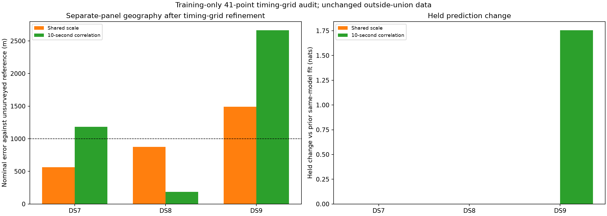

# Timing-grid audit of separate DS7/DS8/DS9 fits

The 41-point training-only timing audit finds **no better timing seed for any
shared-scale fit**. DS9 remains **1,492.941 m** from the exposed, unsurveyed
reference. Correlated DS9 finds a small training improvement, but its geographic
error worsens from **2,588.129 to 2,661.944 m**. Missed modes on this fixed grid
do not explain or resolve the remaining separate-dataset localization failure.

## Controlled ablation

Use exactly the same 15 outside-union recordings per dataset and both unchanged
likelihoods as the [preceding timing-recombination experiment](../2026_09_28_timing_recombination/README.md).
No model parameter, candidate bank, prior, split, recording or geographic start
is added. The only new search step is the record-timing grid, applied uniformly
to all six separate-panel fits. Pools and dataset exclusions are not rerun.

At the preceding selected position, score each recording at its prior timing
and all 41 grid points from -5 to +5 seconds in 0.25-second steps. Choose the
highest training score, with exact ties preferring the prior timing, then
refine position and all timings jointly. All 3,780 record-level evaluations
(six panels × 15 recordings × 42 timing choices) are finite. All choices are
made using `held=False`; no held outcomes or reference errors construct seeds.

| Dataset | Shared scale before (m) | Shared scale after (m) | Correlation before (m) | Correlation after (m) |
|---|---:|---:|---:|---:|
| DS7 | 564.109 | 564.109 | 1,183.633 | 1,183.633 |
| DS8 | 875.002 | 875.002 | 187.218 | 187.218 |
| DS9 | 1,492.941 | 1,492.941 | 2,588.129 | **2,661.944** |

Only correlated DS9 changes a record timing by more than 0.1 ms. Recording
`scan-fw-011cda7401582938` prefers -1.5 seconds to its prior -0.990865 seconds,
gaining 0.445496 training nats at the fixed position. Joint refinement gains
0.667219 training nats and 1.754108 held nats, while worsening nominal position
error by 73.815 m. Training and held likelihood improvements do not imply a
better geographic estimate.

The other five seeds retain every prior timing. Their seed-score differences
are below 1e-7, consistent with summation roundoff. Shared-scale DS7 selects a
qualified refinement with a 1.75e-10 training gain, 0.000015 held-nat change and
0.000012 m error change; this is numerical drift, not a scientific improvement.
Shared-scale DS9's qualified refinement does not beat the prior score, so its
prior fit remains selected.

## Qualification and verification

Three of six new refinements qualify. Shared-scale DS8, correlated DS7 and
correlated DS8 report `ABNORMAL` optimizer termination; their gradient infinity
norms are 0.000461, 0.0000917 and 0.0000977. The required optimizer-success gate
still rejects them. Their previously qualified fits remain explicit fallbacks.
Two new results are selected (shared-scale DS7 and correlated DS9), and four
prior fits are retained. There are no retries or relaxed gates.

[PROTOCOL.md](PROTOCOL.md) freezes the design before fitting: L-BFGS-B maxiter
140/maxfun 200, ftol 1e-14, gtol 1e-8, maxls 30; position bounds ±12 km, timing
bounds ±5 seconds; success, interior parameters and gradient infinity norm
≤0.01 required. Selection maximizes training score over the qualified new fit
and prior qualified fallback. The inherited directory/start label `recombine`
denotes the grid-assembled seed in this experiment.

All 12 scientific processes exit zero: six fits and six selected-point held/
numerical audits. All 24 positional gradient comparisons at 1 m and 0.5 m pass;
maximum discrepancy is 2.030e-5 against tolerance 0.002. The sum of prior record
scores reproduces the prior full score, and selected record scores reproduce
the assembled full seed, within 1e-7. Training replays, record/track/count
reconciliation and independent spherical-distance checks pass.

The scorer verifies 228 execution bindings and 48 dataset/pose reference
bindings. [tests.log](tests.log) records six passing existing scientific tests.
All four report scripts pass Ruff lint and formatting checks. No component
implementation or golden fixture changes. Each worker is capped at 180 seconds/
4 GiB, BLAS1/nice19, with at most two concurrent processes. Maximum job time is
18.24 seconds, maximum RSS 1,178,884 KiB, summed job wall time 141.75 seconds.
[resource-summary.json](resource-summary.json) retains every receipt.

## Evidence and limits

[plan.json](plan.json) retains exact membership and prior selections. Each
fit's `timing-audit.json` retains all 42 choices for every record, score gains,
chosen timings and the assembled seed. [scores.json](scores.json) records
selected and rejected fits, baseline fallbacks, held changes and gradients.
Per-stage command, log, result, exit status and seals remain archived.
[evidence-sha256.json](evidence-sha256.json) binds this report and its dependencies,
excluding itself. Run order is `prepare.py`, `launch.py source`, `launch.py
transfer`, then `score_plot.py`; the transfer phase runs only source audits
because this plan contains no excluded-dataset targets.

The 45 recordings contain 2,665 eligible tracks, 74,950 training and 50,022 held
observations; all remain included. Inputs and eligibility are documented in the
[outside-union input report](../2026_09_28_outside_union_inputs/README.md).
There are no new exports, propagation, waveform reads or RF collection.

This grid tests timings at the prior position. It can miss narrow modes between
grid points or modes coupled to a different geographic basin. It does not
certify global optimality. Neither these observations nor the reference are
research-blind; the operator reference is unsurveyed, and the inherited origin
is itself 809 m away. The current pooled shared-scale result of 202 m remains
separate evidence, not an independent position for each dataset.

## Decision

Do not spend another iteration on the same timing starts. The leading
shared-scale likelihood has passed pooled geographic checks but remains
sensitive to which recordings enter separate fits. The next useful test is
to combine the two disjoint 15-record panels for each dataset, yielding three
30-record fits from 90 already archived recordings. Freeze all membership,
use identical generic starts and unchanged model/gates, and retain every start.
This tests whether broader evidence stabilizes each dataset's position; it is
not a new blind validation or a guaranteed accuracy improvement. Compare held
scores separately on both constituent panels so that an aggregate gain cannot
hide a regression on the previously failing observations.
