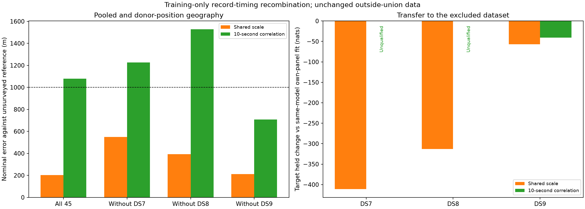
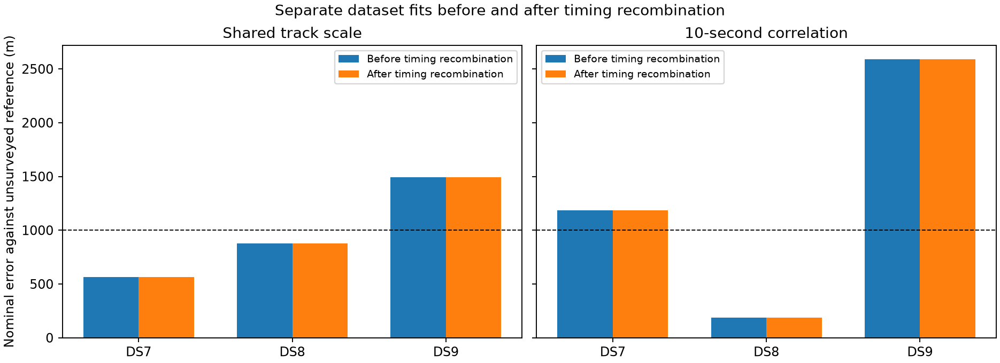

# Training-only timing recombination on DS7, DS8 and DS9

Shared-scale pooled error improves from **229.722 to 201.677 m**, accompanied
by **60.893 training nats and 201.771 held nats gained**. Its dataset exclusions
remain below 551 m. The separate DS9 failure remains **1,492.941 m**, and the
correlated model has no meaningful improvement. This is a useful optimizer
correction, not completion of the consistently sub-kilometre localization goal.

This is a controlled optimizer ablation of the
[outside-union experiment](../2026_09_28_outside_union_models/README.md).
It retains all 45 recordings, both covariance models, candidate banks,
partitions, priors and bounds. It tests whether combining record timing
solutions from previously qualified starts improves a joint fit.

## Geographic ablation

| Fit | Shared scale before (m) | Shared scale after (m) | Correlation before (m) | Correlation after (m) |
|---|---:|---:|---:|---:|
| DS7 separately | 564.109 | 564.109 | 1,183.633 | 1,183.633 |
| DS8 separately | 875.002 | 875.002 | 187.218 | 187.218 |
| DS9 separately | 1,492.941 | 1,492.941 | 2,588.129 | 2,588.129 |
| All 45 | 229.722 | **201.677** | 1,079.592 | 1,079.592 |
| Exclude DS7 | 553.667 | **550.196** | 1,225.390 | 1,225.390 |
| Exclude DS8 | 410.371 | **392.462** | 1,527.223 | 1,527.223 |
| Exclude DS9 | 212.094 | 212.094 | 708.606 | 708.606 |

Only three source units have material gains. The table separates the score
gain obtained by recombining timings at a fixed position from the total gain
after joint refinement. Positive held changes mean improvement over the same
unit's previously published result.

| Shared-scale source unit | Changed record timings >0.1 ms | Seed training gain (nats) | Final training gain (nats) | Held gain (nats) |
|---|---:|---:|---:|---:|
| All 45 | 2 | 60.703 | 60.893 | 201.771 |
| Exclude DS7 | 1 | 57.362 | 57.613 | 213.210 |
| Exclude DS8 | 1 | 52.231 | 52.390 | 195.007 |

The DS9 recording `scan-fw-4ecd3e5776f2dc23` contributes 54.308, 57.362 and
52.231 training nats respectively, with timing changes of -1.308, -1.344 and
-1.298 seconds. The pooled fit also gains 6.395 nats from DS8 recording
`scan-fw-51a283b9582589f1`, with a +0.322-second timing change. These are
alternative nuisance solutions under the same model, not measured receiver
clock corrections or independently identified satellites. No other source
unit gains more than 1e-7 training nats. Tiny numerical gains can still trigger
the exact training-score selection rule and are not treated as scientific gains.

## Held prediction and qualifications

| Excluded target | Shared-scale held change from previous (nats) | Shared-scale held change vs own-panel fit (nats) | Correlated held change vs own-panel fit (nats) |
|---|---:|---:|---:|
| DS7 | -4.190 | -410.731 | Not evaluated: unqualified target fit |
| DS8 | +2.324 | -312.971 | Not evaluated: unqualified target fit |
| DS9 | -0.000014 | -56.826 | -40.743 |

The qualified correlated DS9 target changes by +0.0000014 held nats from its
previous result. Shared-scale pooling still loses 194.193 held nats relative
to the three separate locations, despite recovering 201.771 nats from its prior
pooled fit. The donor-position improvements do not translate into uniform
target prediction gains. The correlated pool loses 36.849 nats against its
separate fits, effectively unchanged.

Eight of 14 new source refinements qualify. Six report `ABNORMAL` optimizer
termination: shared-scale DS8, and correlated DS7, DS9 and all three exclusions.
Their gradient infinity norms range from 0.000134 to 0.000461 and training
changes are at most 1.4e-9 nats. Small gradients do not override the required
optimizer-success gate. Their previous qualified source fits are retained.
One additional qualified refinement (shared-scale DS9) does not beat its prior
training score; that prior fit is also retained. Seven new source results are
selected, only three with material score gains.

Four of six new target fits qualify. The correlated DS7 and DS8 target fits
report `ABNORMAL`, with gradient norms 0.000187 and 0.0000743. Neither receives
a new held evaluation; missing bars in the plot are labelled unqualified.
The previous report's target results remain historical evidence and are not
substituted for these failed runs.

## Method and selection

At the previously selected source position, replay each qualified prior
start's timing for each recording. Choose the best training score independently
for each recording, then refine the assembled timing vector jointly with
position using the unchanged likelihood. These choices use no held scores or
geographic errors. The per-record replay uses the public one-record model with
`held=False`. Verify that scores sum to the full objective within 1e-7.

Apply this procedure uniformly to 14 source units: three separate dataset fits,
the 45-record pool, and each dataset exclusion, for shared track scale and
10-second correlation. Each panel contains 15 recordings. Together they contain
2,665 eligible tracks, 74,950 training and 50,022 held observations. The
[input report](../2026_09_28_outside_union_inputs/README.md) records membership,
eligibility exclusions, sample rates, time coverage and archived banks.

Source selection maximizes training score among the new qualified refinement
and the previously qualified source fit. The prior fit is an explicit fallback,
not a newly executed start. Qualification requires optimizer success, interior
parameters and gradient infinity norm at most 0.01. Rejected refinements remain
archived. There are no retries or relaxed gates.

For each excluded dataset, hold its donor position fixed, recombine timings
from prior qualified target starts using target training observations, then
refine only target timings and offsets. A target cannot move its donor position.
There is no fallback to the previous target fit at a changed donor position.
Unqualified target fits receive no held evaluation.

[PROTOCOL.md](PROTOCOL.md) fixes the design before execution. L-BFGS-B uses
maxiter 140/maxfun 200, ftol 1e-14, gtol 1e-8 and maxls 30, with position bounds
±12 km and timing bounds ±5 seconds. The models retain Student-t4 residuals,
100 Hz scale and the original weak offset prior. The correlated model uses
`100² × (0.8 exp(-|dt|/10 s) + 0.2 I)`; shared track scale uses the diagonal
scale matrix. No likelihood implementation changes.

## Interpretation limits

Geographic errors use the same exposed, unsurveyed operator reference.
The inherited origin is already 809 m from that reference. Pooled and donor
fits each estimate one common position, not independent positions for all
datasets. Held likelihood and geographic error measure different outcomes.
This experiment is neither a surveyed accuracy certification nor a blind
validation. Recombination tests only timing modes represented in prior
qualified fits; it does not establish global optimality.

## Reproduction and evidence

All 38 scientific processes exit zero: 14 source fits, 14 source held/audit
evaluations, six target fits and four target held evaluations. Process exit,
optimizer success and scientific qualification are distinct. All 56 selected
source gradient comparisons pass at 1 m and 0.5 m; the maximum discrepancy is
2.030e-5 against tolerance 0.002. Score replays and separability checks pass
within 1e-7. Target geography equals its donor exactly, track identities and
counts reconcile, and independent spherical-vector calculations verify errors.

The scorer verifies 398 execution bindings and 48 manifest/pose bindings.
Six existing scientific tests pass in [tests.log](tests.log); all four report
scripts pass Ruff lint and formatting checks. Each worker is capped at
180 seconds/4 GiB, BLAS1/nice19, with at most two workers. Maximum job time is
48.54 seconds, maximum RSS is 3,184,224 KiB and summed job wall time is
718.02 seconds. [resource-summary.json](resource-summary.json) retains every
receipt. There are no process failures, timeouts or scientific retries.

Execution order is `prepare.py`, `launch.py source`, `launch.py transfer`,
`launch.py target_held`, then `score_plot.py`, using the runtimes recorded in
each stage's `launch.json`. The launcher creates exclusive stage directories;
it deliberately refuses to overwrite an existing run. The scorer uses the
workspace plotting environment. Scientific runtime provenance is retained in
the input report.

[plan.json](plan.json) binds membership and prior selections.
Each fit retains `timing-audit.json`, including every replayed timing and score,
the selected record timings and the assembled seed before refinement.
[scores.json](scores.json) records qualifications, fallbacks, geographic errors,
held comparisons and numerical checks. Each stage preserves commands, logs,
exit status, resource receipts and hashes. No RF collection, waveform reads,
new propagation or provider fetch occurs.

[evidence-sha256.json](evidence-sha256.json) binds the complete report and
dependencies, excluding itself. The dataset manifests and pose authorities,
previous results used in comparisons and existing scientific helpers are
included. No existing component code or golden fixture is changed.

## Next bounded test

Retain shared track scale and a common site as the leading geographic model.
Before changing residual physics or adding recordings, inspect training-only
one-dimensional record timing profiles over the existing bank's ±5-second
support. Prior-start recombination cannot find modes absent from all three
prior starts. A uniformly applied profile audit could distinguish such missed
timing modes from a likelihood or data-coverage failure in separate DS9.
Freeze that experiment before fitting and repeat the held, qualification and
geographic checks. DS7, DS8 and DS9 remain the authorized data pool; no new
radio collection is needed for this diagnostic.
