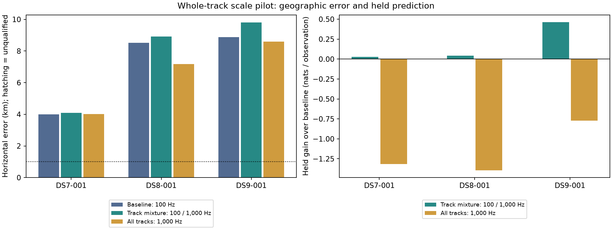

# Whole-track noise-scale pilot: predictive gain, geographic regression

**Do not promote this scale mixture as a positioning improvement.** It improves
held-observation prediction on the first recording of each of DS7, DS8 and DS9,
but worsens geographic error on all three. None of the baseline, mixture or
broad-only estimates is below 1 km. All six new fits completed and qualified.

This is a three-record pilot on an exposed, unsurveyed site, not a dataset-level
accuracy distribution. It follows the [DS8/DS9 transfer panels](../2026_09_28_ds89_baseline_panel/README.md),
where pooling improved location agreement but worsened held prediction. The
opposite tradeoff here reinforces the need to evaluate both criteria.

## Frozen ablation

| Model | DS7-001 error (m) | DS8-001 error (m) | DS9-001 error (m) | Qualified below 1 km |
| --- | ---: | ---: | ---: | ---: |
| Historical baseline: every track at 100 Hz | 4,004.258 | 8,517.587 | 8,883.010 | 0/3 |
| Track mixture: 100 / 1,000 Hz, prior 90% / 10% | 4,087.666 | 8,923.551 | 9,796.112 | 0/3 |
| Broad-only ablation: every track at 1,000 Hz | 4,014.740 | 7,172.311 | 8,593.102 | 0/3 |

| Held predictive log-score change against baseline | DS7-001 | DS8-001 | DS9-001 |
| --- | ---: | ---: | ---: |
| Track mixture (nats) | +23.921 | +49.379 | +476.894 |
| Broad-only (nats) | -1,207.950 | -1,646.497 | -798.138 |
| Held observations | 918 | 1,182 | 1,033 |

The mixture increases geographic error by **83.409, 405.963 and 913.102 m**,
respectively. Raising every track's noise scale improves two geographic values,
but produces large predictive losses on all three. Neither arm earns promotion.
These results do not establish that every possible scale model fails, and no
parameter sweep or roof-error tuning was performed.

## Which tracks change, and how stable are the fits?

| Mixture diagnostic | DS7-001 | DS8-001 | DS9-001 |
| --- | ---: | ---: | ---: |
| Included tracks | 56 | 64 | 64 |
| Tracks with broad-component weight >50% | 3 | 5 | 8 |
| Mean training-fitted broad weight | 5.33% | 7.67% | 12.41% |
| Tracks with positive held gain | 28/56 | 31/64 | 37/64 |
| Held gain from the three largest contributors | +27.247 | +48.177 | +324.838 |
| Held gain from all remaining tracks | -3.326 | +1.202 | +152.056 |
| Maximum separation between start solutions | 0.000002 km | 6.144 km | 13.933 km |

The DS7 held gain is entirely accounted for by a few tracks; DS8's gain is
similarly concentrated. DS9 has additional positive gain beyond its top three.
The broad-component weights describe model residual scatter, not a probability
that a satellite identity is correct or a physical noise calibration.

All 18 new optimizer starts converged, stayed away from bounds and passed the
gradient screen. Nevertheless, the DS8 and DS9 mixture starts reach distinctly
different locations. DS8 selected the +2-second start by training likelihood;
the other solutions were about 269.852 nats worse. DS9 selected the -2-second
start; the other solutions were about 69.196 nats worse. These distances expose
start sensitivity, not confidence intervals or equally probable modes. The
selected solutions were never changed based on geographic or held scores.
The broad-only start solutions agree within 0.226 m in the model's horizontal
coordinate plane across all three records. Local convergence alone cannot
certify correct positioning.

Per-track gains and start comparisons are retained in the
[gain/start audit](gain-and-start-audit.json), with the full posterior weights,
offsets, gradients and every optimizer start in [results](results/).

## Model and evaluation design

The [protocol](PROTOCOL.md) fixed membership and both arms before launch.
The [plan](plan.json) selects the first chronological recording of each dataset
and binds historical request/response bytes. No recording was dropped or
replaced. The original observation JSON, candidate banks, whole-visit masks,
geographic origin, position/timing bounds and three starts remain unchanged.
The broad scale and its 10% prior were fixed as a coarse excess-scatter
hypothesis, not fitted to these geographic errors.

The [new numerical component](../../tools/ds7_track_scale_mixture.py) assigns
one latent scale to each whole track, alongside its candidate identity. Each
candidate/scale combination has its own training-profiled stationary offset.
The original Student-t(4) density, including its scale normalization, is used
throughout. Candidate and scale scores are combined with log-sum-exp; scale
priors sum to one and candidate normalization uses the original catalogue size.
Held observations use the training-fitted offsets and discrete weights.
Every track remains included. This is not observation deletion or an
observation-by-observation broad-noise switch.

The offset treatment retains the baseline's weakly penalized profile
likelihood. It is **not** a fully integrated Bayesian offset evidence or a
validated wrong-association detector. Also, the frozen nominee banks were
shortlisted at 100 Hz: a broad model may favor candidates outside those banks.
The pilot is conditional on the existing nominees and cannot certify broader
candidate coverage. No receiver-tilt geometry or calibrated clock correction
is added.

Both new arms fit east/north position and timing from the original starts
(position zero, timing 0/-2/+2 s). Qualification requires successful convergence,
no parameter within 1e-3 of a bound, and maximum absolute fitted-coordinate
gradient <=0.01. The highest-training-score successful start is selected.
Historical baseline estimates are replayed, not refitted: their training
scores match the sealed responses and their held scores match the existing
independent evaluator within absolute 1e-8. All three also pass the additional
gradient screen.

Fits and their sources were sealed before the scorer loaded pose authorities.
Dataset manifests and pose-file hashes bind the geographic reference. The site
was already exposed during development and its operator reference is unsurveyed;
this is not a blind or new-site accuracy claim. Three pilot records cannot
establish dataset medians or generalized coverage.

## Verification and resources

[Eight tests pass](tests.log): three new component tests cover normalized
Student-t densities, the exact single-scale baseline limit, finite-difference
gradients, held-data isolation, synthetic clean/broad track discrimination and
invalid priors; five existing fast-baseline tests provide regression coverage.
Ruff checks pass. The [score ledger](scores.json) audits 51 launch/fit bindings,
all 18 new optimizer starts, posterior normalization and held-track accounting,
and all nine geographic distances with an independent three-dimensional
great-circle formula. This is an arithmetic audit, not a second optimizer.
The visualization was inspected.

| Record | Both-arm wall time | Maximum RSS |
| --- | ---: | ---: |
| DS7-001 | 34.98 s | 148,400 KiB |
| DS8-001 | 41.79 s | 160,816 KiB |
| DS9-001 | 42.71 s | 149,332 KiB |

All three commands exited zero under separate 240-second/4-GiB limits, one
numerical thread and nice19. DS7/DS8 overlapped; DS9 followed. No retries or cap
extensions occurred. The [post-launch environment inventory](post-run-environment.json)
records the pinned installed Python/NumPy/SciPy environment; it is explicitly
an inventory after launch, not a prior environment seal. Source and artifact
hashes were bound in [launch receipts](receipts/) before execution. No new RF,
IQ processing, propagation or source-store mutation was required.

## Decision and next work

Keep the original baseline as the comparison model. Do not launch a broad
noise-scale sweep or full-dataset campaign on the strength of these held gains.
Selective broadening explains a small subset of tracks more predictively, but
the pilot fails the geographic improvement gate and exposes additional local
solutions.

The next priority remains **satellite-association reliability and measurement
evidence**: establish which candidate/trajectory relationships survive physical
and falsification controls before adding further flexible nuisance parameters.
Review existing controls before designing another experiment. Any subsequent
model must retain paired geographic, held-prediction, coverage and start-
sensitivity reporting across frozen DS7/DS8/DS9 panels. The missing DS8 panel
export remains a separately documented engineering follow-up; this pilot does
not replace or complete that eight-record pooled comparison.

The [evidence index](evidence-sha256.json) binds the complete report, numerical
component, tests, scripts, outputs and referenced frozen inputs. DS8/DS9 inputs
reside in earlier published reports. The DS7 cached candidate manifest and NPZ
are copied byte-for-byte into [inputs/DS7-001](inputs/DS7-001/) with an explicit
[archive map](input-archive-map.json); no new banks were generated. Historical
requests still refer to the original local cache. Restore those bound bytes or
create a new request with relocated paths for replay in another checkout.
Never edit the archived launch or fit seals to relocate a run.
