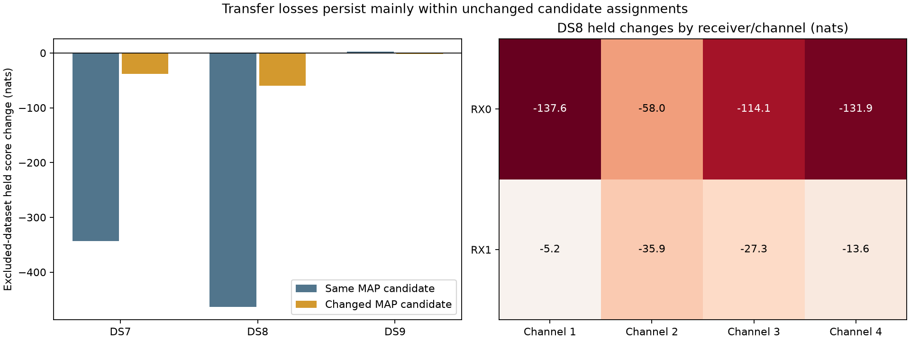

# DS7 / DS8 / DS9 fixed-fit transfer-loss audit

The DS8 transfer loss mostly occurs while the highest-weight candidate stays the
same: **−463.9 of −523.5 nats**. RX0 contributes −441.5 nats, but both receivers
and all four channels lose held likelihood. Candidate reassignment or disabling
one channel is therefore not supported as a sufficient remedy by this audit.

This is a diagnostic of already published fits, not a new geographic model or
a causal ablation. No tracks were removed and no parameters were refitted.

## Scope and comparison

We reuse the first eight records from each dataset, all 1,462 eligible tracks,
and six paired comparisons (2,924 track rows). “All24” compares the shared
24-record fit with each dataset's original eight-record fit. “Transfer” uses
the position fitted to the other two datasets, with target timing, stationary
offsets and candidate weights adapted using target training observations only.
Both comparisons use the exact previously sealed fits and held observations.

The parent [cross-dataset report](../2026_09_28_cross_dataset_position/README.md)
found a nominal **862.3 m** all24 error against the exposed, unsurveyed operator
reference. Leave-one-dataset-out errors were 988.7 m (excluding DS7), 1,968.4 m
(excluding DS8), and 795.6 m (excluding DS9). These are not independent accuracy
validation; only one of three all24 starts completed within its cap. This audit
does not change those geographic results.

Scores retain the original Student-t4 / 100 Hz likelihood, weak stationary
offset prior, full retained-candidate mixture and catalogue normalization.
Candidate numbers are indices within the frozen bank, **not NORAD identities**.
An unchanged training MAP candidate does not imply unchanged mixture weights,
offsets or timing, or establish the emitter's physical identity.

## Held likelihood decomposition

All score changes are new minus original eight-record fit, in nats; positive is
better. “Changed” refers only to the highest-weight training candidate.

| Comparison | Dataset | Tracks | Held observations | Net change | Same-MAP contribution | Changed-MAP contribution | Changed tracks |
|---|---|---:|---:|---:|---:|---:|---:|
| All24 | DS7 | 486 | 8,622 | −135.098 | −127.458 | −7.640 | 8 |
| All24 | DS8 | 485 | 8,959 | −179.577 | −148.814 | −30.763 | 15 |
| All24 | DS9 | 491 | 8,484 | +1.217 | +2.480 | −1.263 | 3 |
| Transfer | DS7 | 486 | 8,622 | −381.478 | −342.928 | −38.549 | 10 |
| Transfer | DS8 | 485 | 8,959 | −523.498 | −463.885 | −59.613 | 28 |
| Transfer | DS9 | 491 | 8,484 | +1.144 | +2.688 | −1.544 | 4 |

Gross loss sums negative track changes in absolute value; gross gain sums
positive changes. Their difference is the net change above.

| Comparison | Dataset | Gross loss | Gross gain | Gross loss in training-loss-ranked top 10% | Gross loss in held-loss-ranked top 10% (hindsight) |
|---|---|---:|---:|---:|---:|
| All24 | DS7 | 650.203 | 515.104 | 52.6% | 58.8% |
| All24 | DS8 | 864.128 | 684.551 | 46.3% | 51.5% |
| All24 | DS9 | 84.681 | 85.898 | 59.4% | 64.5% |
| Transfer | DS7 | 1,099.213 | 717.735 | 51.2% | 56.6% |
| Transfer | DS8 | 1,544.918 | 1,021.419 | 44.8% | 51.5% |
| Transfer | DS9 | 108.683 | 109.827 | 58.9% | 65.0% |

The top decile contains 49 DS7/DS8 tracks or 50 DS9 tracks, rounded up.
DS8's 49 training-ranked tracks contain 14.9% of held observations and 44.8%
of gross held loss. Their net change is −689.325 nats; the remaining tracks
net +165.827 nats. Concentration exceeds observation volume alone, but more
than half of gross loss remains elsewhere. Removing these tracks and refitting
has not been tested. Held-ranked selection is descriptive hindsight only.

The complete [DS8 training-ranked top 49](DS8-training-ranked-top49.csv) retains
track identities, receiver/channel, counts, scores, candidate indices and
projected gradients. No selection was used to alter an evaluation panel.

## DS8 transfer: receiver and channel

| Group | Tracks | Held change (nats) | Changed-MAP tracks |
|---|---:|---:|---:|
| RX0 | 250 | −441.500 | 11 |
| RX1 | 235 | −81.998 | 17 |
| Channel 1 | 122 | −142.715 | 6 |
| Channel 2 | 124 | −93.893 | 11 |
| Channel 3 | 118 | −141.413 | 4 |
| Channel 4 | 121 | −145.477 | 7 |

Receiver rows and channel rows are separate partitions, not additive together.
All eight receiver-by-channel cells lose held score (see figure). Two of eight
records gain, six lose; exact record and cell totals are in [scores.json](scores.json).

## Training position gradients

At the all24 point, dataset training gradients in east/north coordinates are:

| Dataset | East (nats/km) | North (nats/km) |
|---|---:|---:|
| DS7 | +138.589 | −278.668 |
| DS8 | −156.349 | +254.130 |
| DS9 | +17.762 | +24.539 |
| Sum | +0.001654 | +0.001200 |

DS7 and DS8 exert opposing local training pressure. Component gradients
normally balance at a joint optimum, so cancellation alone is not evidence
of model misspecification. Together with held losses, it motivates testing
whether recording heterogeneity or correlated residuals distort information
weighting.

Per-track gradients use central prediction differences of 0.0001 km with
stationary training offsets and weights, and stable visibility checks. Their
projection points from the new fit toward the original eight-record fit,
**not toward geographic truth**. This measures local training likelihood
pressure, not a finite-deletion effect. The top positive-gradient decile accounts
for 52.0%, 48.7%, and 54.6% of positive projected pressure in DS7, DS8 and DS9
transfer respectively. Full vectors and projections remain in the worker results.

## Validation and evidence

- Recomputed training posteriors, MAP indices, full-mixture held scores and
  per-record score sums from exact archived banks and observation exports.
- All six comparisons and every receiver/channel/record partition reconcile
  with the prior ledger within 1e−7 nats; all 2,924 paired row deltas checked.
- Independently summed all24 training gradients match the sealed solver
  gradient to 6.93e−13 nats/km maximum coordinate difference.
- Two component-owned tests pass, covering gross/net accounting, training-only
  ranking, partition counts and rejection of duplicate or empty panels.
- Three sequential workers exited 0, each capped at 90 seconds / 4 GiB with
  one BLAS thread. Wall times were 5.31, 5.21 and 5.12 seconds; peak RSS was
  623,784, 643,900 and 598,380 KiB. No new RF collection or waveform reads.

The [protocol](PROTOCOL.md), [runner](run.py), [launcher](launch.py),
[scorer and figure generator](score_plot.py), [test log](tests.log),
[scoring log](scoring.log), and [SVG figure](transfer-loss.svg) are included.
Worker directories [DS7](DS7/), [DS8](DS8/) and [DS9](DS9/) contain full rows,
launch commands, resource logs, exit codes and execution seals. The final
[SHA-256 inventory](evidence-sha256.json) binds report artifacts, source, tests
and the previously published inputs. Existing source dependencies were checked
against remote main before publication.

## Next modeling priority

Use DS7, DS8 and DS9 for a bounded training-residual temporal-correlation audit,
followed, if supported, by a covariance-aware likelihood with recording-level
heterogeneity. Freeze the formulation and training-only parameter selection
before another held comparison; retain all records and report geographic and
held performance separately on each dataset and leave-one-dataset-out transfer.

This audit does not establish temporal correlation. Earlier free per-record
slopes, pooled receiver slopes and independent two-scale noise mixtures did
not justify geographic promotion. Correlation-aware weighting is a distinct
hypothesis, not a demonstrated fix. More aggressive identity reassignment,
extra deterministic bias freedom and deletion based on exposed held outcomes
remain lower priority. No model is promoted by the present results.
