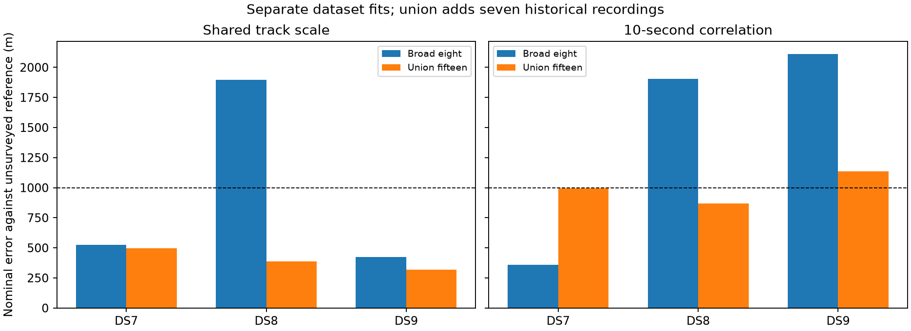
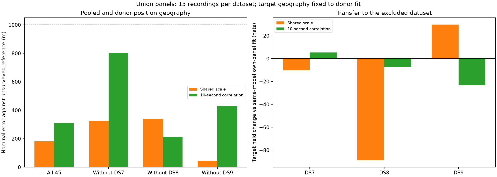

# Panel sensitivity with 45 existing DS7/DS8/DS9 recordings

The fixed shared-track-scale model is below 1 km for all three separate union
panels, the pooled fit, and every dataset-exclusion fit. Its selected errors
are **497 m / 386 m / 319 m** for DS7/DS8/DS9, **180 m pooled**, and **45–339 m**
across dataset exclusions. Every one of its 18 source starts is below 603 m.

This is a positive result on a prespecified 45-record panel. It does not erase
the earlier smaller-panel failures or establish accuracy on the remaining
recordings. The reference remains exposed and unsurveyed. Validation outside
the union is the next gate before a broader sub-kilometre claim.

The experiment uses the deduplicated union of each dataset's historical
first-eight panel and its timestamp-selected broad-eight panel. It adds seven
archived recordings per dataset. Membership was fixed before fitting; neither
recordings nor starts were selected by geographic error. Both models are
reported, including the correlated model's DS9 failure.

## Geographic results

| Fit | Shared track scale error (m) | Correlated error (m) |
|---|---:|---:|
| DS7 separately, 15 records | **496.517** | **995.757** |
| DS8 separately, 15 records | **386.367** | **868.449** |
| DS9 separately, 15 records | **318.854** | 1,134.755 |
| All three datasets, 45 records | **180.351** | **310.432** |
| Exclude DS7, use DS8 + DS9 | **326.681** | **803.119** |
| Exclude DS8, use DS7 + DS9 | **339.391** | **213.989** |
| Exclude DS9, use DS7 + DS8 | **45.166** | **429.632** |

Each pooled fit estimates one common site; it is not three independent location
estimates. Excluded-dataset training adjusts timing and offsets but cannot move
the donor position. The correlated DS7 separate result is only 4.243 m below
the nominal threshold, and its DS9 separate result fails it.

Compared with the [broad-eight panels](../2026_09_28_temporal_coverage_models/README.md),
shared-scale separate errors change from 527/1,896/422 m to 497/386/319 m.
Correlated errors change from 359/1,904/2,109 m to 996/868/1,135 m. Adding data
does not improve every model/dataset combination.

The [previous broad-panel pooled comparison](../2026_09_28_temporal_coverage_transfer/README.md)
gave 427/734 m pooled and worst exclusion errors of 1,011/1,395 m. Those become
180/310 m pooled and 339/803 m worst exclusion on the union. Data quantity,
sample-rate mix and initialization all change; these results do not isolate
which of those causes the improvement.

## Matched-data held prediction

Held log-score changes below are in nats against the **same-model separate
15-record target fit**. Positive values favour fixed-donor transfer. All
recordings, eligible tracks and held observation counts are matched.

| Excluded target | Shared-scale held change | Positive records / 15 | Correlated held change | Positive records / 15 |
|---|---:|---:|---:|---:|
| DS7 | -10.312 | 7 | +5.422 | 8 |
| DS8 | -88.909 | 7 | -7.385 | 6 |
| DS9 | +29.766 | 7 | -23.188 | 8 |

Pooling all 45 recordings gains 2.554 held nats with shared scale and loses
8.599 with correlation, relative to three separate positions. The corresponding
training costs are 56.971 and 97.421 nats. These are descriptive comparisons,
not calibrated significance tests. Geographic success does not imply held-score
improvement on every dataset. The independent Student-t baseline was not refit
on this union, so no matched union comparison against it is claimed.

## Optimization alternatives

All 36 source starts qualified, but several reach distinct local solutions.
Selection always uses training score. The following rows expose the alternatives
with more than 1 m position separation; every start is retained in scores.json.

| Model and fit | Maximum start separation (m) | Lower local solution's training gap (nats) | Selected error (m) | Alternative error (m) |
|---|---:|---:|---:|---:|
| Shared scale, DS8 separately | 536.006 | -11.135 | 386.367 | 602.760 |
| Shared scale, all45 | 50.696 | -4.503 | 180.351 | 130.352 |
| Shared scale, exclude DS7 | 69.208 | -6.841 | 326.681 | 294.825 |
| Correlated, DS9 separately | 60.349 | -0.171 | 1,134.755 | 1,075.103 |

The selected pooled shared-scale fit has a larger geographic error than its
lower-training-score alternative. We retain the training-selected result.
All 18 shared-scale source starts, including these alternatives, are below
603 m. Multiple starts do not prove global optimality or calibrated uncertainty.

## Data and comparison design

There are exactly 15 recordings per dataset and 45 overall. Each pair of old
panels shares only its first recording. Duplicate artifacts have matching
hashes; the broad-panel archive supplies that shared recording. Inputs are
ordered by the minted dataset's capture timestamps. All eligible tracks are
retained. The union is denser near the start of each dataset; it is not a
uniform-in-time sample or a time-span-only ablation.

| Dataset | Chronological recording ordinals |
|---|---|
| DS7 | 1–8, 13, 26, 38, 51, 63, 76, 88 |
| DS8 | 1–8, 10, 19, 29, 38, 46, 55, 65 |
| DS9 | 1–8, 16, 32, 46, 61, 76, 92, 105 |

| Dataset | Eligible tracks | Training observations | Held observations | Capture-start span (h) |
|---|---:|---:|---:|---:|
| DS7 | 900 | 23,603 | 15,687 | 10.249 |
| DS8 | 904 | 25,913 | 17,117 | 8.014 |
| DS9 | 905 | 24,500 | 16,706 | 12.608 |

Totals are 2,709 tracks, 74,016 training and 49,510 held observations. These
spans describe first-to-last capture starts, not active dwell. Sample-rate
counts at 2.5/5/7.5/10 MS/s are 4/3/6/2 for DS7, 3/5/4/3 for DS8 and 4/1/3/7
for DS9. Eligible track sets match between both models.

The inputs come from the [historical panels](../2026_09_28_cross_dataset_position/README.md)
and [broad input archive](../2026_09_28_temporal_coverage_inputs/README.md).
No new RF collection, IQ reads, propagation, candidate selection, bank export
or provider fetch is involved. This remains a panel experiment, not a fit of
all 258 recordings in DS7/DS8/DS9.

Both fixed models use multivariate Student-t4 residuals with 100 Hz scale:
shared track scale with a diagonal scale matrix, and the correlated model with
scale matrix `100² × (0.8 exp(-|dt|/10 s) + 0.2 I)`. A diagonal multivariate
Student-t shares a latent track scale and is not the independent likelihood.
The weak offset prior, visibility rules, full-catalogue normalization and
whole-visit training/held partition are unchanged.

Each model fits three separate 15-record panels, the combined 45-record pool,
and three 30-record pools excluding one dataset. Separate-panel fits provide
matched-data held-score controls. Source pool starts use only the included
datasets' prior qualified broad-panel positions. Each record timing starts
from its own same-model panel fit, with broad timings taking precedence on the
overlap. Separate-panel fits use broad, historical and origin position starts,
all with the same timing vector. New fit outcomes do not determine starts.

Excluded-dataset adaptation holds donor geography fixed and fits only target
timings and frequency offsets, using timing starts 0, -2 and +2 seconds.
Training score selects among successful, interior fits with raw gradient
infinity norm ≤0.01. Bounds are ±12 km and ±5 seconds; L-BFGS-B uses maxiter140,
maxfun200, ftol1e-14, gtol1e-8 and maxls30. No retry or relaxed qualification
is allowed. [PROTOCOL.md](PROTOCOL.md) is the frozen execution specification.

Geographic scoring occurs after fit and held stages are sealed. The reference
is the same exposed, unsurveyed operator coordinate. The inherited origin is
already 809 m from it, and prior exposure is unaudited. Nominal distances do
not establish surveyed accuracy, calibrated confidence or blind deployment
performance.

## Verification and resources

All 74 scientific processes exited zero: 36 source fits, 14 source audits,
18 target fits and six target held evaluations. All 54 optimizer fits qualified.
Every selected source point passed east/north full-objective checks at 1 m and
0.5 m. Across 56 comparisons, the largest discrepancy was 4.371e-5, below the
0.002 tolerance. Training scores replay within 1e-7; track sets, recording IDs,
per-track held counts and score sums reconcile. Target geography is checked
identical to the donor's. Spherical-vector calculations independently verify
all reported geographic distances.

Six existing scientific tests passed in [tests.log](tests.log). All five report
scripts pass Ruff lint and format checks. No component implementation changed.
The scorer verified 559 execution bindings and 48 dataset/pose reference
bindings, plus reconstructed starts and qualification/selection decisions.

Each worker had a 180 s / 4 GiB limit, BLAS1 and nice19, with at most two workers.
Maximum job duration was 50.07 s and maximum RSS 3,134,532 KiB. Summed job wall
time was 1,461.42 s, not elapsed campaign time. There were no retries, timeouts
or relaxed gates. [resource-summary.json](resource-summary.json) contains every
receipt. This protocol supersedes inherited config text describing older,
smaller execution tranches.

## Evidence and next validation

[plan.json](plan.json) records exact membership, artifact bindings, source
groups and starts. [scores.json](scores.json) retains every source run,
qualification and selection, source/target comparisons, per-record training
and held deltas, gradients and reference bindings. Model/pool directories
retain results, commands, logs, resource receipts, exit codes and seals.
[prepare.py](prepare.py), [run.py](run.py), [launch.py](launch.py) and
[score_plot.py](score_plot.py) preserve preparation, execution and scoring.
The linked input archive records the scientific runtime and installed source
snapshots. [evidence-sha256.json](evidence-sha256.json) binds the report and
dependencies, excluding itself.

Shared track scale is now the strongest geographic candidate on this union.
The next check keeps both fixed models and uses equal-sized panels outside
the union, rather than changing parameters to improve these already-observed
errors. [outside-union-proposal.json](outside-union-proposal.json) freezes 15
different recordings per dataset by capture timestamps alone, with no overlap
with this union. [propose_validation.py](propose_validation.py) selects nearest
to 15 equally spaced timestamps among remaining recordings, using integer
arithmetic and session-ID ties. No substitutions are allowed.

| Dataset | Frozen outside-union ordinals |
|---|---|
| DS7 | 9, 15, 20, 25, 31, 37, 42, 48, 54, 59, 65, 70, 75, 81, 87 |
| DS8 | 9, 13, 17, 21, 26, 30, 33, 37, 41, 44, 47, 52, 56, 60, 64 |
| DS9 | 9, 15, 23, 30, 37, 43, 50, 57, 64, 71, 78, 85, 91, 99, 104 |

This membership was frozen after the union results and before new outside-union
fits. It is a proposed, unexecuted next experiment, not evidence of passing
validation. The recordings are outside this training panel; prior research
exposure is not ruled out. Existing corpus inputs may need bounded export and
validation, but no new RF collection is required. Repeat separate, pooled and
all dataset-exclusion checks before extending the sub-kilometre claim.
