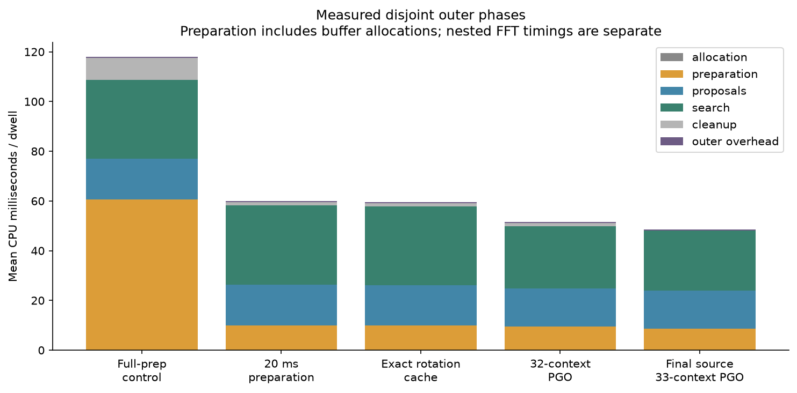
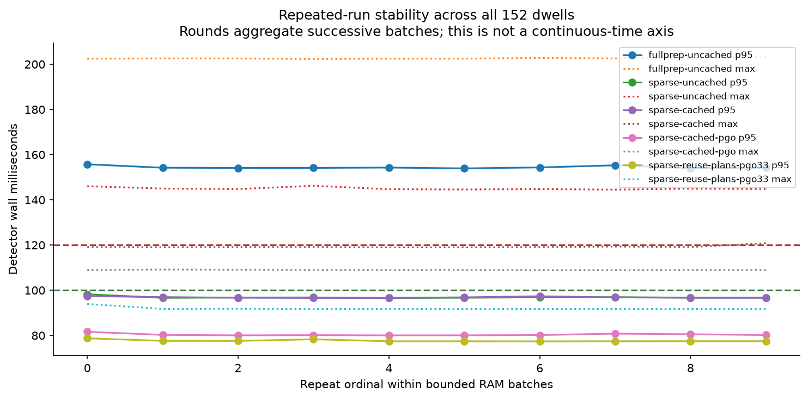
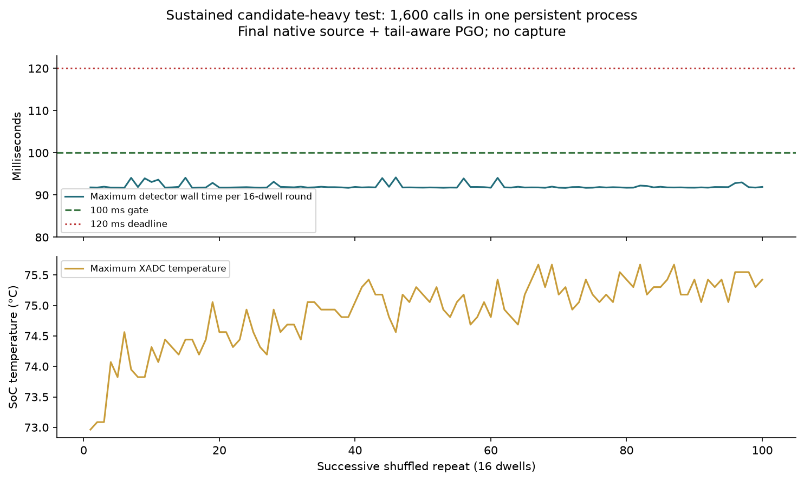

# Native ARM GLRT: sparse-dwell headroom

The final maintained native source passes the **100 ms detector gate** on
the matched 1,520-call panel: **96.05 ms maximum without PGO**, or **93.93 ms
with tail-aware PGO**, with all native candidates preserved. See the
[complete timing/scientific comparison](RESULTS.md), including CPU, wall,
setup, higher rates and the exact recovery denominators.

The separate **1,600-call candidate-heavy stress run** also passes:
**94.17 ms maximum**, leaving **25.83 ms / 21.5%** of the dwell period.
Fresh-process CLI runs take **210–360 ms**: the qualified headroom requires
a persistent RAM context, not a new process per dwell.

This report qualifies the maintained opt-in native RAM API introduced in
`32f71e25b35390a73a5d3a79a222d923b07b40ff`. The target is **2.5 MS/s,
one first-20-ms probe per receiver in each 120-ms dual-RX dwell: two windows
total**. Candidate settings, window placement, thresholds, and numerical
approximations inherited from that native release are unchanged.

**This is not a deployment or simultaneous-capture qualification.** The native
engine is distinct from the deployed fractional adaptive detector and live
capture worker. Saved CI16 files were loaded into RAM and processed on PLUTO+
`192.168.1.15`, pinned to Cortex-A9 CPU0. No RF was collected.

## Gate and evidence

The [protocol](PROTOCOL.md) froze a preferred maximum of **100 ms for both
detector CPU and wall time**, reserving at least 20 ms (16.7% of each dwell).
A p95 below 100 ms with maximum below 120 ms is a weaker result, explicitly
distinguished from that gate. A finite sample maximum is not a hard-real-time
guarantee and does not prove that concurrent DMA/capture is lossless.

The primary panel comprises all 152 existing 2.5-MS/s dwells in the frozen
704-dwell DS7 evaluation manifest, ten shuffled repetitions each: **1,520 calls
per measured variant**. These are a subset of DS7, not the full dataset.
Twenty-four additional saved dwells cover 5/7.5/10 MS/s, with two repetitions.
The [panel](panel.json) and [execution inventory](execution-panel.json) bind
every input, template, sequence and repetition. Whole-dwell batches bound RAM
use; they do not run different dwells concurrently.

The full-preparation control retains the published native computation and
adds the same timing instrumentation as the optimized variants. All 56
overlapping saved outputs from the published release match its non-timing
rows, candidates and counters exactly: [audit](published-baseline-audit.json).

## Timing boundaries

- **Detector:** immediately before to immediately after the maintained public
  RAM API call, including temporary allocation, conversion/preparation,
  proposals, every search and cleanup. CPU and monotonic wall intervals match.
- **Persistent-client cycle:** detector plus telemetry, JSON formatting and
  stdout flush. File preload and context setup are excluded and reported
  separately. This is not radio end-to-end latency.
- **Setup and saved-file process:** separate evidence; starting a new process
  and rebuilding its context per dwell cannot borrow the persistent timing.
- **Diagnostics:** linker-wrapped allocation and FFT timing adds overhead and
  is inclusive/nested. It is not summed into the outer phase totals or used
  as headline performance.

First calls remain in the detector distribution. The null-profile API also
performs the phase clock reads, so `--no-profile` is not an uninstrumented
binary. SSH transport timing is never used as ARM detector or process timing.

## What changed

1. **Prepare only consumed samples.** The 120/120 geometry only consumes the
   first 20 ms; preparing all 120 ms was wasted conversion, prefix-energy
   construction and allocation. Full input length is still validated. Other
   dwell/stride geometries retain their original preparation.
2. **Reuse an irregular endpoint's rotations.** A clipped conditioned grid
   can append an off-grid endpoint. Its double-complex rotations are identical
   across frames, so compute them once per scoring call. On allocation failure,
   the original complete computation remains available. Arithmetic order,
   bins, frames and scores are preserved.
3. **Share loads across four boundary dot products.** Retain each frequency's
   FP32 lane accumulation and FP64 reduction order. The tile is exact relative
   to the native scorer. Its compiler/allocation interactions were measured;
   the first tiled build alone was not a successful tail optimization.
4. **Reuse buffers and fine FFT plans.** Sparse input buffers allocate on
   first use and refill with unchanged arithmetic. They are released before
   larger geometries to preserve memory compatibility. The context owns the
   fine FFT plan, while per-search spectra and counters remain fresh.
5. **Fresh profile-guided compilation.** The original random 32-context
   training missed the clipped-grid outlier and regressed that path. The
   separately labeled final training adds that case: 33 trained, 119 held out.
   Every profile and generate/use receipt is retained; no historical research
   profile is reused. The ordinary non-PGO build also passes the matched gate.

The inherited native algorithm itself is an approximation to the frozen
standard GLRT reference. Exact equality to that native release does not imply
equality to dense standard analysis, nor recovery of windows never searched.

## Reproduction and limitations

The numerical implementation resides under
[`src/leo/analysis/native_glrt`](../../src/leo/analysis/native_glrt/README.md).
The maintained build and RAM benchmark client reside under
[`src/leo/qualification`](../../src/leo/qualification/arm_glrt_release.py).
Report scripts only stage saved data and analyze results.

See [reproduction commands](EXECUTION.md), [host validation](VALIDATION.md), [comparison data](comparison.json),
source archives and build receipts. Exact command lines, toolchain hashes,
linked FFTW artifacts, source hashes and binary hashes are recorded in the
receipts. The device's shared FP64 FFTW is separately hashed in
[device-before.txt](device-before.txt).

All four supported rates and 120/240/360-ms dwell geometries are checked by
component tests. Sparse 20-ms-stride and dense modes are compatibility cases,
not the primary optimization target. The prior physical 10-MS/s × 360-ms
memory limitation is not waived. Higher-rate support is not a claim that
those rates meet the 120-ms deadline.

Temperature readings use the Zynq XADC sensor, with its recorded raw offset
and scale; they are not AD9361 radio temperature. No CPU-frequency interface
was available. Batch peak RSS includes saved inputs and retained workspaces.
Capture contention, production queueing/backpressure, simultaneous memory
traffic, input availability, and online tracking association are not qualified
by a saved-file RAM benchmark.
