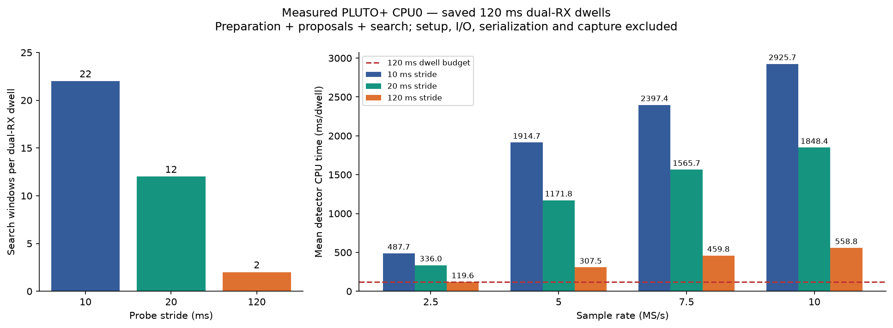
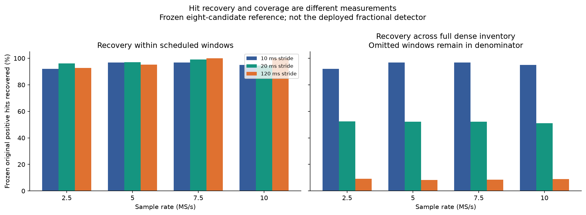
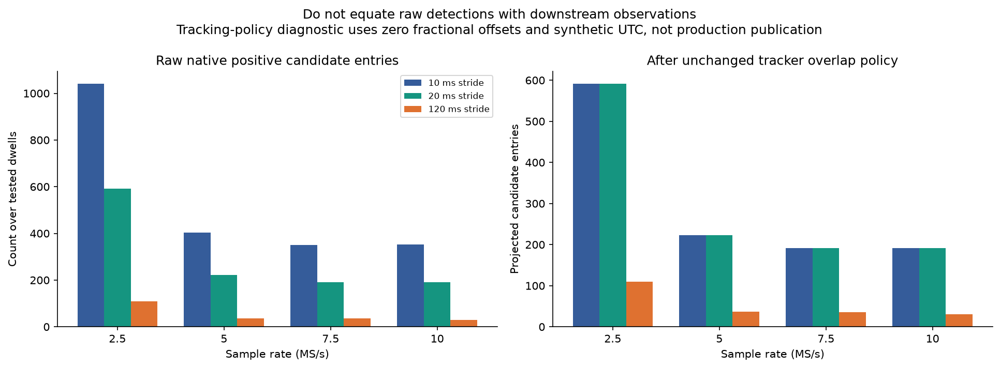

# Selectable ARM GLRT strides: implementation and physical-ARM qualification

This change adds a maintained, **opt-in native RAM analyzer** with selectable
10, 20 and 120 ms probe strides. It does **not** deploy a new radio worker or
replace the automatic adaptive fractional detector. The historical Wave8
445 ms binary remains research-only; its timing is not reused here. The new
component has its own source closure, configuration, output contract and build.

The default of the new ARM component remains **10 ms**. The existing deployed
adaptive main-analysis default remains **120 ms**, and its persisted contracts
are unchanged. A stride is the distance between the starts of **20 ms windows**;
a dwell in this report is **120 ms**, not 120 seconds.

## Results

**20 ms is the useful coverage-preserving choice for the existing overlap
filter:** it saves **31.1% CPU (1.45×)** at 2.5 MS/s and produces exactly the
same projected candidate values as 10 ms on all 56 tested dwells. Across rates,
the speedup is 1.45–1.63×. This does **not** preserve all raw dense hits: the
overlap filter already discards the intervening 10 ms windows.

At 2.5 MS/s, over 32 identical dual-RX dwells:

| Stride | Windows/dwell | Mean ARM CPU | Max individual run | Native raw hits | Original hits recovered / scheduled original hits | Recovered / all 973 dense original hits | Projected candidate entries |
|---|---:|---:|---:|---:|---:|---:|---:|
| 10 ms | 22 | 487.74 ms | 919.85 ms | 1,042 | 896/973 (92.1%) | 896/973 (92.1%) | 592 |
| 20 ms | 12 | 336.00 ms | 600.04 ms | 592 | 511/531 (96.2%) | 511/973 (52.5%) | 592, scientifically identical |
| 120 ms | 2 | 119.56 ms | 195.50 ms | 110 | 90/97 (92.8%) | 90/973 (9.2%) | 110, strict subset |

The 120 ms stride mean is just below budget, but only **38/64** individual
executions finish within 120 ms of CPU time. **No mode demonstrates a reliable
120 ms budget**, even before capture and scheduling costs. There is no qualified
40% headroom claim.

All rates, with two measurements per dwell. P95 is the nearest-rank percentile
of per-dwell two-run means; maximum and budget counts use individual runs:

| MS/s | Dwells | Stride | Mean ms | P95 dwell-mean ms | Max ms | Runs ≤120 ms | Original hits recovered / scheduled | Projected candidate entries |
|---|---:|---:|---:|---:|---:|---:|---:|---:|
| 2.5 | 32 | 10 | 487.74 | 796.21 | 919.85 | 0/64 | 896/973 | 592 |
| 2.5 | 32 | 20 | 336.00 | 536.82 | 600.04 | 0/64 | 511/531 | 592 |
| 2.5 | 32 | 120 | 119.56 | 149.07 | 195.50 | 38/64 | 90/97 | 110 |
| 5 | 8 | 10 | 1,914.74 | 2,194.92 | 2,196.03 | 0/16 | 235/243 | 223 |
| 5 | 8 | 20 | 1,171.84 | 1,263.47 | 1,263.79 | 0/16 | 127/131 | 223 |
| 5 | 8 | 120 | 307.53 | 347.87 | 348.39 | 0/16 | 20/21 | 37 |
| 7.5 | 8 | 10 | 2,397.40 | 3,022.72 | 3,027.12 | 0/16 | 182/188 | 192 |
| 7.5 | 8 | 20 | 1,565.72 | 1,958.91 | 1,966.16 | 0/16 | 98/99 | 192 |
| 7.5 | 8 | 120 | 459.81 | 523.63 | 524.12 | 0/16 | 16/16 | 35 |
| 10 | 8 | 10 | 2,925.66 | 3,313.30 | 3,319.76 | 0/16 | 190/200 | 192 |
| 10 | 8 | 20 | 1,848.39 | 2,156.40 | 2,156.78 | 0/16 | 102/108 | 192 |
| 10 | 8 | 120 | 558.77 | 682.66 | 683.68 | 0/16 | 18/18 | 30 |

Across all 56 dwells, 10/20/120 ms execute **1,232/672/112 windows** and emit
**2,149/1,199/212 raw positive candidates**. They recover **1,503/838/144** of
the same **1,604 dense original hits**, respectively. Their scheduled-window
reference denominators are **1,604/869/152**. After the overlap filter, the
projected candidate counts are **1,199/1,199/212**. Every candidate at a shared
window is identical; the complete 10 and 20 ms projected inventories are
scientifically identical, and the 120 ms inventory is a subset with identical
shared values. This tests the stride report's overlap hypothesis for this ARM
engine; it does not establish parity between different detector engines.

## Implementation and promotion boundary

- [Native RAM API and usage](../../src/leo/analysis/native_glrt/README.md):
  `leo_native_glrt_analyze` accepts caller-owned dual-RX CI16 RAM. The saved-file
  executable is an adapter to that API, not a report implementation.
- [Configuration and result contracts](../../src/leo/contracts/arm_glrt.py):
  separate closed ARM schemas preserve rate, dwell, stride, input/source span,
  RX/channel/edge, binary/template hashes and algorithm identity.
- [Validation port](../../src/leo/scanner/arm_glrt.py) and
  [saved-input command](../../src/leo/cli/arm_glrt.py): explicit routing,
  strict schedules/counts/finite values, timeouts and nonzero exits fail closed,
  before/after hash checks, atomic creation without overwriting a result.
- [Release builder](../../src/leo/qualification/arm_glrt_release.py): maintained
  source only, static analyzer archive and standalone CLI, source/toolchain/FFTW
  hashes and commands. Private kernel symbols are namespaced to coexist with
  the old native-presence component; wheel source closure is tested.

This is source/API promotion into an explicitly selected analysis path, **not
live-capture deployment approval or fractional-detector parity**. No RF was
collected and the running capture configuration was not changed. The C API is
process-serialized because its private FFT caches are mutable; it does not set
affinity. The benchmark executable pins CPU0. Concurrent capture and sustained
RAM producer/consumer behavior remain unqualified.

The contracts and host implementation cover all four rates (2.5/5/7.5/10 MS/s),
120/240/360 ms dwells and all three strides. Physical PLUTO+ memory qualification
excludes **10 MS/s × 360 ms**; see the failure evidence below. Every complete
window is included in the specified geometry:

| Dwell | 10 ms stride, dual-RX windows | 20 ms | 120 ms |
|---|---:|---:|---:|
| 120 ms | 22 | 12 | 2 |
| 240 ms | 46 | 24 | 4 |
| 360 ms | 70 | 36 | 6 |

Sparse modes omit unscheduled proposal/search work; they do not compute a dense
result and filter it afterward. Whole-dwell preparation still occurs in every
mode. Shared 20 ms anchors retain the same proposal construction; the dense
odd windows use neighboring anchors and their existing fallback.

## Measurement and scientific comparison

[PROTOCOL.md](PROTOCOL.md) and [panel.json](panel.json) were frozen before the
new ARM outputs. Seed **20260929** selected whole dwells at random: **32 at
2.5 MS/s and eight each at 5/7.5/10 MS/s**, from the existing DS7 corpus. This
is a 56-dwell qualification subset, not all DS7 and not a fresh holdout from
the earlier research choices. No new parameter fitting or PGO training was
performed. Each identical dwell/template pair runs twice per mode in seeded
order, totaling **336 physical PLUTO+ executions**.

Timing means **process CPU time on PLUTO+ CPU0**, including allocation,
whole-dwell preparation, proposals, selected searches and per-call cleanup.
It excludes process/context startup, input file I/O, JSON serialization,
transport, capture, and wall-clock scheduling delays. This is detector-only
saved-input timing, not end-to-end simultaneous capture. The new build uses
no PGO; do not compare its time directly with the old 445 ms PGO result.

One raw hit means one candidate with `pilot_score - control_score >= 0.025`.
Multiple candidates can occupy the same window. Original-hit recovery uses
maximum-cardinality one-to-one matching **within the same RX and window start**,
with at most two samples of epoch error and 8 kHz CFO error. We show both the
original hits in scheduled windows and the entire dense original inventory;
omitted windows remain misses in the latter denominator.

The reference is the frozen original **eight-candidate GLRT**, predating the
currently deployed fractional refinement. Therefore these percentages do not
establish equivalence to current fractional production outputs. Comparison with
the standard pipeline must retain this qualification rather than relabel this
reference as today's deployed detector.

For the stride hypothesis, the report invokes the **unchanged public
`project_scanner_candidates`** overlap filter. Integer ARM epochs enter a
diagnostic adapter with zero fractional offsets and synthetic UTC authority;
these objects are not published as fractional analysis products. Comparison
retains all returned scientific values and excludes only candidate ID, source
group ID and probe ordinal. Raw candidates, selected probe groups (including
empty groups), and projected candidate entries are different counts.
No trajectory reconstruction or held-out Doppler-prediction accuracy is claimed.

## Reproduce and inspect

- [comparison.json](comparison.json): per-dwell and per-rate measurements,
  exact recovery denominators, repeat checks, shared-value and full-inventory
  equivalence checks.
- [Visual comparison](comparison.html), with PNG and SVG exports below.
- [build-receipt.json](build-receipt.json): commands, flags and exact source,
  toolchain, FFTW and output hashes.
- [current-source-build-receipt.json](current-source-build-receipt.json):
  rebuild after the component README was expanded. Only that documentation
  source hash changed; the linked CLI is byte-identical to the measured binary.
- [evidence.tar.gz](evidence.tar.gz) and [evidence-manifest.json](evidence-manifest.json):
  all 336 native/validated results, execution manifest, device metadata and
  the 56 original reference rows. No IQ or credentials are included.

Extract evidence into an empty local directory, then run (from the repository):

```bash
mkdir -p reports/2026_09_29_arm_strides/local/replay
tar -xzf reports/2026_09_29_arm_strides/evidence.tar.gz \
  -C reports/2026_09_29_arm_strides/local/replay
PYTHONPATH=src python reports/2026_09_29_arm_strides/analyze.py \
  --cohort reports/2026_09_29_arm_strides/local/replay/arm \
  --baseline reports/2026_09_29_arm_strides/local/replay/original-selected.jsonl
python reports/2026_09_29_arm_strides/render.py
```

The replay regenerates the same scientific/timing aggregates; the baseline
file digest changes from the original full reference file to the archived
selected rows. Their original full-file hash is retained in the evidence
manifest. Hardware reruns require the private saved IQ/templates identified by
`panel.json`; build with the component README and invoke `experiment.py run`
with `--inputs`, `--oracle`, `--binary`, `--receipt`, and a fresh `--output`.
The runner verifies source/template/raw input hashes, uploads to the SD card,
verifies upload hashes, calls the maintained executable, and validates output
through the maintained Python port. It never opens the radio.

Measured CLI SHA-256:
`a40e3ec1ebedd4a3b67c1b8d5444c88a7d4cbc86275c78fc8d1411375d3aa4b4`.
Measured receipt SHA-256:
`734e355dc2ad04155e64f83f75a9afd732582c29c9c12368cee6c630748809f3`.
The current-source rebuild reproduced the CLI bytes, but GCC7 changed LTO
archive members: static archive byte-for-byte reproducibility is **not** claimed.
Both receipts preserve their actual output hashes. The device's loaded FFTW
library hash is recorded separately in `hardware-unit.json`; it differs from
the cross-link sysroot library's hash. Replaying exact ARM behavior requires
the recorded target runtime as well as the build inputs.

## Validation scope

Component-owned tests cover all **36 rate × dwell × stride geometries**, actual
synthetic detector calls on the host, shared-window numerical parity, reusable contexts,
unchanged results on invalid input, public/private symbol coexistence, strict
configuration/output provenance, nullable native fields, CLI failure paths,
lazy public CLI compatibility, and wheel source completeness. The report adds
adversarial matching and actual projector-overlap tests. Longer dwell scientific
quality is tested synthetically only; the real corpus panel uses 120 ms dwells.

The initial unbounded all-geometry physical-ARM unit was **OOM-killed**, not
passed: see [hardware-unit.json](hardware-unit.json) and the
[kernel memory log](hardware-unit-memory.log). At the OOM snapshot, the kernel
reported about 6 MiB free and 200 MiB in shared memory; the killed process had
226,352 KiB (about 221 MiB) anonymous RSS. The RAM API prepares the whole dwell. Valid
geometry therefore does not imply that every longer/high-rate dwell fits this
PLUTO+ memory configuration. Do not deploy longer dwells without a measured
memory budget; memory-bounded preparation is a separate follow-up. A bounded
per-geometry rerun is recorded in [hardware-geometry.json](hardware-geometry.json),
with explicit allocation-failure results rather than silently skipped cases.
Under a 220,000 KiB virtual-memory cap, **33/36 synthetic mode combinations
pass** (all rates/dwells except 10 MS/s × 360 ms). The 10 MS/s × 360 ms
API test reports `LEO_NATIVE_GLRT_NOMEM`; separate native-CLI checks of all
three strides return exit 5, `analysis: out of memory`, and **empty stdout**:
[hardware-memory-failure.json](hardware-memory-failure.json). Thus this largest
geometry is implemented and host-tested, but **not memory-qualified on this
device**. The initial unbounded process kill also means API allocation checks
alone are not protection against Linux memory overcommit.
All 336 real **120 ms** executions succeeded, independently of this later
synthetic memory stress test.

## Figures






